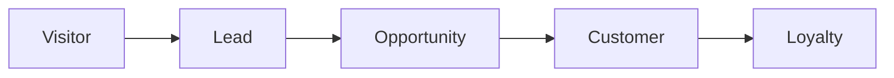
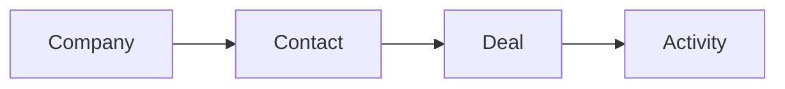

# CRM Platforms: A Practical Beginner's Course

> **NOTE:** This is **Part 1** of the complete course. It follows the same instructional style as the uploaded Internal Apps course and begins the full curriculum. Subsequent parts will continue in the same format until the course is complete.

# Course Overview

**Who this is for:** Beginners who want to learn how businesses manage customers, leads, sales, marketing, and customer support using modern CRM platforms.

**Platforms covered**
- HubSpot
- Salesforce
- Zoho CRM

Every module contains:
- Concept
- Structure at a Glance
- Where you'd actually use this
- Hands-on Lab
- Checkpoint
- Quiz (with answers)

---

# Module 0: What CRM Systems Actually Do

## Concept

A **Customer Relationship Management (CRM)** system is software that helps a business manage every interaction with potential and existing customers.

Rather than storing customer information in notebooks, emails, or spreadsheets, everything is stored in one centralized system.

Most CRM platforms share the same flow:

- Visitor
- Lead
- Qualified Lead
- Customer
- Returning Customer

## Structure at a Glance

Every CRM stores:

- People
- Companies
- Conversations
- Deals
- Activities
- Reports

Although HubSpot, Salesforce, and Zoho use different names, the concepts remain nearly identical.

## Where you'd actually use this

Imagine a consulting company receiving 200 inquiries every month.

Without a CRM:

- emails are lost
- nobody remembers follow-ups
- duplicate contacts appear
- managers cannot track sales

With a CRM:

- every inquiry becomes a Lead
- sales representatives are assigned automatically
- meetings are scheduled
- deals are tracked
- dashboards update automatically

## Lab

Create the following customer journey on paper:

Visitor

↓

Lead

↓

Qualified Lead

↓

Customer

Then identify:

- What information should be stored?
- Who owns the lead?
- What happens after purchase?

## Checkpoint

You should now understand why CRM systems exist and the basic customer lifecycle.

## Quiz

1. What does CRM stand for?
2. Why do businesses use CRM software?
3. What is a Lead?
4. What is a Deal?
5. What is the purpose of a sales pipeline?

### Answers

1. Customer Relationship Management.
2. To organize customer interactions and sales.
3. A potential customer.
4. A sales opportunity.
5. To track progress from lead to customer.

---

# Module 1: HubSpot CRM

## Concept

HubSpot organizes information using **CRM Objects**.

The four primary objects are:

- Contacts
- Companies
- Deals
- Tickets

Every activity is linked to these objects.

## Structure at a Glance

## Where you'd actually use this

A software company receives demo requests from its website.

Every submitted form automatically creates:

Lead

↓

Contact

↓

Deal

↓

Customer

Sales representatives always know what to do next.

## Lab (Project 1)

Build your first CRM.

### Step 1

Create a free HubSpot account.

### Step 2

Create five Contacts.

Fields:

- First Name
- Last Name
- Email
- Phone

### Step 3

Create one Company.

Associate every contact with that company.

### Step 4

Create three Deals.

Stages:

- Appointment Scheduled
- Qualified
- Proposal Sent
- Closed Won

### Step 5

Assign yourself as the owner.

### Step 6

Create Tasks.

- Call customer
- Send proposal
- Schedule meeting

### Step 7

Create a Dashboard showing:

- Number of Deals
- Open Deals
- Closed Deals
- Tasks Due Today

## Checkpoint

You now have a functioning HubSpot CRM with contacts, companies, deals, tasks, and a dashboard.

## Quiz

1. What is a Contact?
2. What is a Company?
3. What is a Deal?
4. Why assign an owner?
5. Why use dashboards?

### Answers

1. An individual person.
2. An organization.
3. A sales opportunity.
4. Accountability.
5. To monitor business performance.

---

The complete course will continue with:

- Module 2 — Salesforce CRM
- Module 3 — Zoho CRM
- Capstone Project
- Course Completion Checklist

in the same detailed format.
