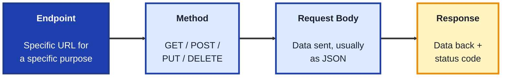
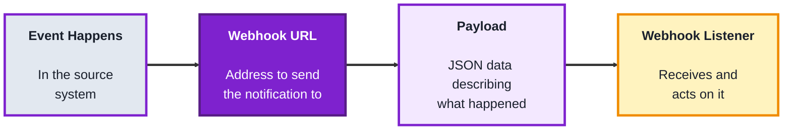
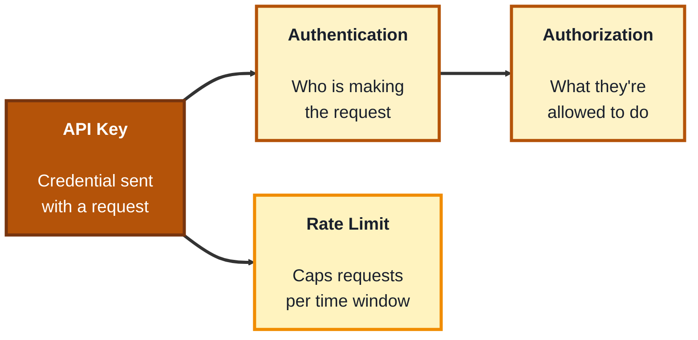

## Module: APIs

**Tools needed for this module:** A web browser, a free account with [Postman](https://www.postman.com) (for testing API calls without writing code), and optionally a free account with [Zapier](https://zapier.com) or [Make](https://www.make.com) for the webhook topic. No coding environment or installs are strictly required, Postman runs in the browser or as a lightweight desktop app.

### Topic 1: Connecting APIs

#### Concept

An **API** (Application Programming Interface) is how two separate pieces of software talk to each other, a defined set of rules for asking one system to do something or hand over data. Connecting to an API means sending it a properly formatted **request** and reading the **response** it sends back, most modern business APIs use a style called **REST**, where requests are simple web addresses plus a method describing the action.

- An **endpoint** is a specific URL an API exposes for a specific purpose (like `/customers` to get a list of customers)
- A **method** describes what kind of action a request performs, **GET** retrieves data, **POST** creates something new, **PUT** or **PATCH** updates something, **DELETE** removes it
- A **request body** is the data you send along with a request (usually formatted as **JSON**), used for POST, PUT, and PATCH calls that need to send information
- A **response** is what the API sends back, typically JSON data plus a **status code** (like 200 for success or 404 for not found) telling you what happened

#### Structure at a Glance

- Most low-code and no-code platforms (from Topics in earlier modules) connect to other apps by calling their APIs behind the scenes, understanding this layer helps explain why some integrations are easy and others aren't supported at all
- A status code in the 200s means success, 400s usually means something was wrong with your request, and 500s means something broke on the API's own server, that range alone often tells you where to start debugging

#### Where you'd actually use this

Whenever two systems need to share data automatically, pulling customer records into a spreadsheet, pushing form submissions into a CRM, or connecting a website to a payment processor, any time "connect this tool to that tool" comes up, it's an API doing the work underneath.

#### Lab

1. **Create a free Postman account** at [postman.com](https://www.postman.com).
2. **Send a GET request** to a free public test API, for example `https://jsonplaceholder.typicode.com/users`, and view the JSON response.
3. **Identify the status code** returned (it should be 200) and look at the structure of the JSON data returned.
4. **Send a GET request to a single endpoint**, for example `https://jsonplaceholder.typicode.com/users/1`, and compare the smaller response to the full list from step 2.
5. **Send a POST request** to `https://jsonplaceholder.typicode.com/posts` with a simple JSON body (like `{"title": "test", "body": "hello", "userId": 1}`) and observe the response, including its status code.

#### Checkpoint
You have successfully sent a GET request and a POST request using Postman, and you can read a JSON response and identify its status code.

#### Quiz
1. What does REST style typically use to define an API request?
2. What is the difference between GET and POST?
3. What is a "request body," and when is it used?
4. What does a status code in the 400s generally indicate?
5. Why does understanding APIs help explain no-code integrations?

*Answers: 1) A URL (the endpoint) plus a method describing the action. 2) GET retrieves data without changing anything, POST creates something new. 3) The data sent along with a request, usually as JSON, used for POST, PUT, and PATCH calls that need to send information. 4) That something was wrong with the request itself, as opposed to a problem on the server. 5) Because no-code platforms connect apps to each other by calling their APIs behind the scenes, so understanding the API layer explains why some integrations exist and others don't.*

---

### Topic 2: Webhooks

#### Concept

A **webhook** flips the usual API pattern around: instead of your system asking an API "has anything changed?" on a schedule, the other system automatically sends you a message the instant something happens. This is often described as "don't call us, we'll call you," and it's what makes real-time automations (like an instant Slack alert when a form is submitted) possible without constant checking.

- A **webhook URL** is an address you provide to another system, telling it where to send its automatic notifications
- A **payload** is the data included in a webhook notification, almost always JSON, describing exactly what happened (like which record changed and how)
- **Polling** is the older alternative to webhooks, repeatedly asking an API "anything new?" on a timer, it's less efficient and less instant than a webhook, but is used when webhooks aren't supported
- A **webhook listener** is the receiving side, a URL you set up (often through a no-code tool like Zapier or Make) that's ready to accept and act on an incoming payload

#### Structure at a Glance

- Webhooks are what power the instant, real-time feel of most no-code automations, without them, a "new form submission" trigger would have to check for new entries every few minutes instead of reacting immediately
- Because a webhook URL can be called by anyone who has it, most systems add a **signature** or **secret token** in the payload so the receiving side can verify the notification really came from the expected source

#### Where you'd actually use this

Any automation that needs to react the instant something happens, an instant Slack alert on a new sale, kicking off an approval workflow the second a form is submitted, or updating a CRM record in real time when a customer changes their payment details.

#### Lab

1. **Create a free account** on [Zapier](https://zapier.com) or [Make](https://www.make.com) if you don't already have one.
2. **Create a new automation using "Webhook" as the trigger**, the tool will generate a unique webhook URL for you.
3. **Send a test payload to that URL** using Postman (a POST request with a small JSON body like `{"name": "Test User", "event": "signup"}`), to simulate an external system calling your webhook.
4. **Confirm the automation tool received the payload**, most tools show a "test succeeded" screen with the JSON data you sent, laid out field by field.
5. **Add a simple action** after the webhook trigger, such as sending yourself an email that includes the "name" field from the payload, then resend the test payload to confirm it works end to end.

#### Checkpoint
You have created a webhook URL, sent a test payload to it using Postman, and confirmed an automation correctly received and used data from that payload.

#### Quiz
1. What is the key difference between a webhook and polling?
2. What is a "payload"?
3. What is a "webhook URL" used for?
4. Why might a webhook receiver check for a signature or secret token?
5. Give one real-world example where a webhook is more useful than polling.

*Answers: 1) A webhook is sent automatically the instant something happens, polling repeatedly asks on a timer whether anything is new, webhooks are more instant and efficient. 2) The data included in a webhook notification, almost always JSON, describing exactly what happened. 3) It's the address you give another system so it knows where to send its automatic notifications. 4) Because a webhook URL could be called by anyone who has it, a signature or secret token lets the receiver verify the notification really came from the expected source. 5) An instant Slack alert on a new sale, kicking off an approval workflow the moment a form is submitted, or any other scenario requiring a real-time reaction (any reasonable example is valid).*

---

### Topic 3: API Keys

#### Concept

An **API key** is a credential, a long string of characters that identifies who (or what application) is making a request, so the API can decide whether to allow it and what it's allowed to do. Almost every API requires some form of authentication, and API keys are the simplest and most common method, especially for low-code and no-code tools connecting to outside services.

- **Authentication** answers "who is making this request," an API key is one common way to prove that
- **Authorization** answers "what is this requester allowed to do," a key might only grant read access, or only apply to certain data, separate from authentication itself
- A **rate limit** caps how many requests a key can make in a given time window, protecting the API's server from being overwhelmed, exceeding it usually returns a specific status code (commonly 429)
- **Key rotation** is periodically replacing an old key with a new one, a security practice that limits the damage if a key is ever exposed or leaked

#### Structure at a Glance

- API keys should never be hardcoded into a shared file, script, or public repository, exposed keys can be found and misused by anyone who finds them, most no-code tools store keys securely on your behalf so you never see them in plain workflow steps
- Different APIs enforce very different rate limits, some allow thousands of requests per minute, others just a handful, checking an API's documented limits before building a high-volume workflow avoids surprises later

#### Where you'd actually use this

Any time a no-code tool asks you to "connect an account" or "enter an API key" to link to an outside service, that key is what proves to the outside service that the requests coming from your workflow are authorized to access your data.

#### Lab

1. **Create a free account** on a public API service that issues test keys, for example [OpenWeatherMap](https://openweathermap.org/api), which offers a free tier for learning.
2. **Generate an API key** from that service's dashboard, and copy it somewhere safe temporarily (never paste it into a public document or chat).
3. **Use Postman to send a GET request** to the weather API's endpoint, including your API key as a query parameter or header, exactly as that API's documentation specifies.
4. **Deliberately send the same request with the key removed or altered**, and observe the error response and its status code (this simulates what an invalid key looks like).
5. **Rotate the key** by generating a new one from the dashboard (if supported on the free tier) and confirm the old key stops working while the new one succeeds.

#### Checkpoint
You have generated an API key, made a successful authenticated request with it, and seen what an API's error response looks like when the key is missing or invalid.

#### Quiz
1. What problem does an API key solve?
2. What is the difference between authentication and authorization?
3. What is a rate limit, and what status code often signals you've exceeded one?
4. Why should an API key never be hardcoded into a public file or script?
5. What is "key rotation," and why is it a good security practice?

*Answers: 1) It identifies who or what application is making a request, so the API can decide whether to allow it. 2) Authentication answers who is making the request, authorization answers what that requester is allowed to do, they're related but separate checks. 3) A cap on how many requests a key can make in a given time window, exceeding it commonly returns a 429 status code. 4) Because exposed keys can be found and misused by anyone who sees them, a public file or script is visible to far more people than intended. 5) Periodically replacing an old key with a new one, it limits the damage if a key is ever exposed or leaked, since the old key becomes useless once rotated.*

---

## Module Completion Checklist
- [ ] Sent a GET and a POST request using Postman and correctly read the JSON response and status code
- [ ] Created a webhook URL, sent it a test payload, and confirmed an automation received and used the data
- [ ] Generated an API key, made a successful authenticated request, and tested what an invalid key's error looks like
- [ ] Can explain the difference between authentication and authorization
- [ ] Can explain why webhooks are generally preferred over polling for real-time automations
