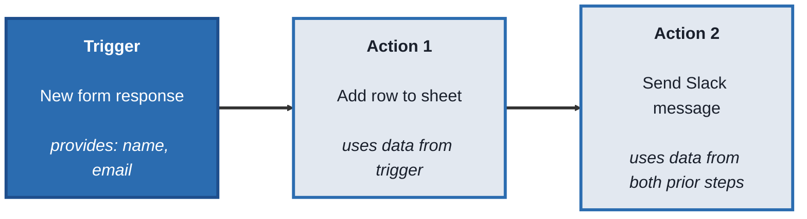
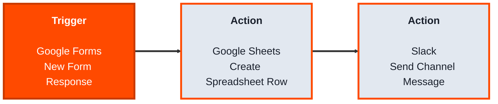
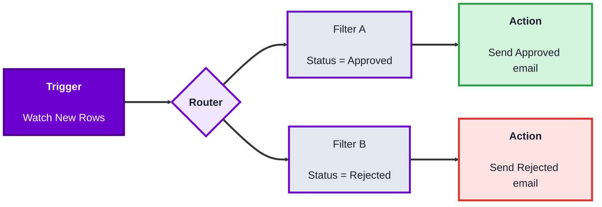
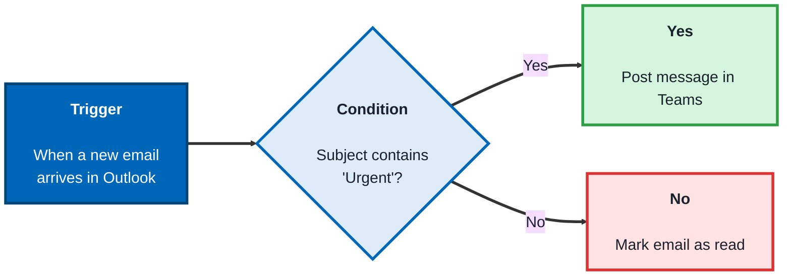
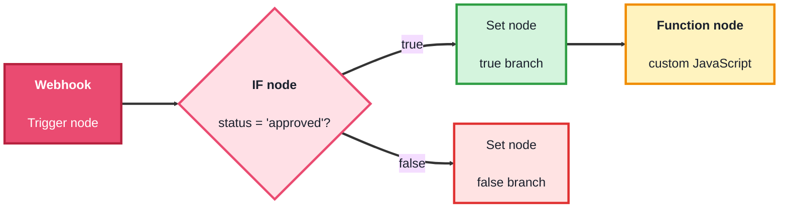

# Automation for Builders: A Practical Beginner's Course

## Course Overview

**Who this is for:** Beginners who want to connect apps and automate repetitive work, sending a Slack message when a form is submitted, saving email attachments to a folder, syncing a spreadsheet to a CRM, without writing a traditional backend.

**How the course works:** Five modules. Every topic follows the same pattern:
- **Concept** - what it is, in plain language
- **Structure at a Glance** - the core building blocks you'll actually work with
- **Where you'd actually use this** - a real business scenario
- **Lab** - hands-on, buildable examples
- **Checkpoint**
- **Quiz** - five questions with answers

**Tools needed:** Free accounts on [Zapier](https://zapier.com), [Make](https://www.make.com), [Power Automate](https://powerautomate.microsoft.com) (a Microsoft account), and [n8n](https://n8n.io) (either their cloud trial or a local install). You won't need all four at once, each module only needs its own tool.

---

## Module 0: What Automation Platforms Actually Do

### Concept

An **automation platform** lets you connect different apps together so that an event in one app automatically causes an action in another, without writing custom backend code to watch for that event or call that app's API yourself. Every platform in this course is built from the same underlying idea, even though the interface and vocabulary differ:

- A **trigger** is the event that starts the automation (a new form response, a new email, a new row in a spreadsheet)
- One or more **actions** are the steps that run afterward (send a message, create a record, send an email)
- A **workflow** (called a Zap, a scenario, a flow, or a workflow depending on the tool) is the trigger plus its actions, chained together
- **Data mapping** is passing information from an earlier step (like the sender's name from a new email) into a later step (like a personalized message)

### Structure at a Glance


This same shape, trigger then one or more actions, with data flowing forward, appears in every tool this course covers.

### Where you'd actually use this

Any repetitive, manual task that follows a clear "when X happens, do Y" pattern, notifying a team when a customer submits a support request, logging new sign-ups into a spreadsheet, backing up form submissions to cloud storage.

### Lab

Pick a repetitive task you (or a team you know) do by hand regularly, checking an inbox for a certain kind of email, copying data between two tools, sending the same reminder message. Write it out as a single "when [trigger], then [action]" sentence. That sentence is the exact shape every automation you build in this course will take.

### Checkpoint
You can describe the trigger, action, and workflow structure, and you have one real "when X, then Y" automation idea written down.

### Quiz
1. What is a trigger?
2. What is an action?
3. What is a workflow, in the general sense used across these tools?
4. What does "data mapping" mean?
5. Do these platforms require writing custom backend code to connect two apps?

*Answers: 1) The event that starts an automation, such as a new form response or a new email. 2) A step that runs after the trigger, such as sending a message or creating a record. 3) The trigger plus its connected actions, chained together into one automated process. 4) Passing specific pieces of data from an earlier step into a later step, so the later step can use them. 5) No, that's the core purpose of these platforms, connecting apps through a visual interface instead of custom code.*

---

## Module 1: Zapier - Simple, Linear Automations

### Concept

**Zapier** is built around simplicity: one trigger, followed by a straight line of actions, called a **Zap**. It supports thousands of pre-built app connections, and is generally the easiest entry point for a first automation.

### Structure at a Glance


- Each step picks an **app** and an **event** within that app (the trigger event, or the action event)
- Fields in a later step can be filled with a **dynamic value** from an earlier step, inserted by clicking it from a list rather than typing it manually
- A **filter** step can stop the Zap from continuing unless a condition is met (for example, only continue if a field equals a specific value)

### Where you'd actually use this

Fast, simple automations where the app you need is popular and well supported, notifying a channel about a new form submission, adding new customers to an email list, saving email attachments to cloud storage.

### Lab

1. **Create a Zap:** In Zapier, click "Create Zap." Choose a trigger app you have access to (Google Sheets works well for testing: trigger = "New Spreadsheet Row").

2. **Connect your account and pick the specific sheet and worksheet** the trigger should watch. Zapier will pull in a sample row of existing data to use for testing.

3. **Add an action step.** Choose an app like Slack or Gmail, and an event ("Send Channel Message" or "Send Email"). Connect your account for that app too.

4. **Map data from the trigger into the action.** In the message field, instead of typing plain text, click into the field and insert the trigger's column values (for example, a `Name` column), so the message reads something like: `New entry from {{Name}}, email: {{Email}}`.

5. **Test the step,** using the sample row Zapier pulled earlier, and confirm the message actually arrives with the real data filled in.

6. **Turn the Zap on.** Add a new row to the sheet, and confirm the automation runs on its own within a minute or two, with no manual step required.

### Checkpoint
You have a working, turned-on Zap that reacts to a real new row in a spreadsheet and sends a message containing that row's actual data.

### Quiz
1. What is a Zap?
2. What does a "dynamic value" let you do in an action step, compared to typing plain text?
3. What is a filter step used for?
4. Why does Zapier ask for a sample row of data before you finish building a Zap?
5. What has to happen for an automation to actually start running on its own, after it's built?

*Answers: 1) Zapier's term for a workflow, a trigger connected to one or more actions. 2) Insert real data from an earlier step directly into a later step's field, rather than hardcoding static text. 3) To stop the Zap from continuing past that point unless a specific condition is met. 4) So each step can be tested with realistic data while building, confirming the automation behaves correctly before turning it on for real events. 5) The Zap needs to be turned on (published), a Zap left off will never run automatically, even if it's fully built.*

---

## Module 2: Make - Visual, Branching Automations

### Concept

**Make** (formerly Integromat) uses a **visual canvas** where modules are connected with lines you can see and rearrange, and supports branching, running different paths depending on a condition, more directly than Zapier's mostly linear structure. This makes it well suited to automations with more than one possible outcome.

### Structure at a Glance


- A **module** is Make's term for a single step, a trigger module or an action module
- A **scenario** is Make's term for a full workflow, the connected chain of modules
- A **router** splits the scenario into multiple branches, each with its own filter deciding which data continues down that path
- Data from any earlier module can be mapped into any later module, shown as clickable tags representing each available field

### Where you'd actually use this

Automations with real decision points, approving or rejecting a request differently depending on its value, routing a support ticket to a different team based on its category, where a single straight line of actions isn't enough.

### Lab

1. **Create a scenario:** In Make, click "Create a new scenario." Add a trigger module, Google Sheets' "Watch New Rows" works well for testing, and connect your account.

2. **Add a Router module** directly after the trigger. This creates two (or more) branches coming out of the same point.

3. **Add a filter to each branch.** On Branch A, set a filter like "Status equals Approved." On Branch B, set a filter like "Status equals Rejected." Each branch will only continue if its filter's condition is true for that specific run.

4. **Add an action module to each branch,** for example an email module, with a different message on each branch, mapping in real data (like a name or item) from the trigger module.

5. **Run the scenario once manually** using the "Run once" button, with a test row that matches Branch A's condition, and confirm only Branch A's action fires. Change the test data to match Branch B's condition and run again, confirming the other path fires instead.

6. **Turn on scheduling** (Make lets you choose how often the trigger checks for new data), and the scenario runs on its own from then on.

### Checkpoint
You have a working Make scenario with a router splitting into two branches, and you've confirmed, by testing both conditions, that each branch only fires for the data it's meant to handle.

### Quiz
1. What is a "module" in Make?
2. What is a "scenario"?
3. What does a router let you do that a purely linear workflow can't?
4. Why test a scenario with data matching each branch's condition separately?
5. What does turning on scheduling actually control?

*Answers: 1) A single step in a scenario, either a trigger or an action. 2) The full connected workflow, the chain of modules from trigger through to every action. 3) Split the workflow into multiple branches, so different data can trigger different actions based on a condition, rather than every run following the exact same single path. 4) To confirm each branch's filter is working correctly, that it fires only for the data it's meant to handle, and correctly ignores data meant for the other branch. 5) How often the trigger checks for new data and potentially starts a new run of the scenario.*

---

## Module 3: Power Automate - Automation Inside Microsoft 365

### Concept

**Power Automate** is Microsoft's automation platform, deeply integrated with Microsoft 365 apps (Outlook, SharePoint, Teams, Excel) and Dynamics. It's commonly used inside organizations already using Microsoft's ecosystem, and includes both cloud based flows and **desktop flows** that can automate actions on a Windows desktop itself, not just cloud apps.

### Structure at a Glance


- A **flow** is Power Automate's term for a workflow
- **Connectors** are the supported apps and services a flow can trigger from or act on, similar to "apps" in Zapier or "modules" in Make
- A **condition** step branches based on true or false, similar to Make's router, but expressed as an if/else style block directly in the flow
- **Dynamic content** is Power Automate's term for inserting a value from an earlier step into a later step's field

### Where you'd actually use this

Automations tied closely to Microsoft 365, notifying a Teams channel when a SharePoint document is added, approving a request through Outlook and logging the result to Excel, or automating a repetitive desktop task like extracting data from a legacy application.

### Lab

1. **Create a flow:** In Power Automate, click "Create," then "Automated cloud flow." Choose a trigger, "When a new email arrives" (Outlook) works well for testing, and connect your account.

2. **Add a condition step.** Set it to check something about the incoming email, for example, whether the subject contains a specific word like "Urgent."

3. **Add an action inside the "Yes" branch,** such as "Post a message in a chat or channel" (Teams), and use dynamic content to insert the email's actual subject and sender into the message.

4. **Add a different action inside the "No" branch,** such as marking the email as read, so both outcomes are handled explicitly, not just the urgent case.

5. **Save the flow, then test it** using the built-in test feature, either by triggering it manually with sample data or by sending yourself a real test email matching the condition.

6. **Check the run history.** Power Automate keeps a log of every run, including which branch fired and what data flowed through each step, useful for confirming the flow behaved correctly, or diagnosing it if it didn't.

### Checkpoint
You have a working flow with a condition branching into two different actions, and you've checked its run history to confirm which branch actually fired.

### Quiz
1. What is a "connector" in Power Automate?
2. What is a "desktop flow," and how is it different from a cloud flow?
3. What does a condition step do?
4. What is "dynamic content"?
5. What does the run history let you do after a flow has executed?

*Answers: 1) A supported app or service a flow can trigger from or take action on, Power Automate's equivalent of Zapier's "apps" or Make's "modules." 2) A flow that automates actions directly on a Windows desktop, such as clicking through a legacy application; a cloud flow instead triggers from and acts on cloud based apps and services. 3) It branches the flow into different paths (commonly "Yes" and "No") depending on whether a condition is true or false. 4) Power Automate's term for inserting a real value from an earlier step directly into a later step's field, rather than typing static text. 5) Review exactly what happened during a specific run, including which branch fired and what data passed through each step, useful for confirming correct behavior or troubleshooting.*

---

## Module 4: n8n - Open Source and Self-Hostable

### Concept

**n8n** is an open source automation platform. It uses the same trigger and action structure as the others, arranged on a visual canvas similar to Make, but can be **self-hosted**, run on your own server rather than a vendor's cloud, giving more control over data and cost, and it also allows dropping into actual JavaScript code within a workflow when a built-in step isn't enough.

### Structure at a Glance


- A **node** is n8n's term for a single step, trigger or action, matching "module" in Make and "action" in Zapier
- A **workflow** is the connected chain of nodes
- An **IF node** branches based on a condition, similar to Make's router or Power Automate's condition step
- A **Function node** (or Code node) lets you write actual JavaScript when a built-in node can't do exactly what's needed, a capability the fully no-code tools in this course don't offer directly

### Where you'd actually use this

Automations where cost matters at scale (self-hosting avoids per-task pricing), where data needs to stay on infrastructure you control, or where a workflow needs a small piece of custom logic that goes beyond what a purely visual step can express.

### Lab

1. **Set up n8n.** Either sign up for n8n cloud's free trial, or run it locally:
```bash
npx n8n
```
Open the URL shown in the terminal (typically `http://localhost:5678`).

2. **Create a new workflow, and add a Webhook trigger node.** n8n generates a unique test URL for this webhook.

3. **Send a test request to that URL** using curl, simulating an external system calling into your workflow:
```bash
curl -X POST http://localhost:5678/webhook-test/your-webhook-id -H "Content-Type: application/json" -d '{"status":"approved","name":"Alex"}'
```
In the n8n editor, you'll see the webhook node capture this real data.

4. **Add an IF node** after the webhook, checking whether `status` equals `"approved"`.

5. **Add a Set node on the true branch,** building a message using the incoming `name` field, and a different Set node on the false branch with a different message.

6. **Add a Function (Code) node** on one branch to see custom logic in action:
```javascript
return items.map(item => {
  item.json.greeting = `Hello, ${item.json.name}! Your status is ${item.json.status}.`;
  return item;
});
```

7. **Execute the workflow** using the built-in "Execute Workflow" test button, sending the same curl request again, and confirm the correct branch runs and the Function node's custom message appears in the output.

### Checkpoint
You have a working n8n workflow triggered by a real webhook request, branching with an IF node, and including one Function node with custom JavaScript logic.

### Quiz
1. What is a "node" in n8n?
2. What does "self-hosted" mean, and what does it give you compared to a purely cloud based platform?
3. What does an IF node do?
4. What does a Function (Code) node let you do that the fully no-code tools in this course can't?
5. What kind of trigger did the lab use to receive real data from outside n8n?

*Answers: 1) A single step in a workflow, either a trigger or an action, n8n's equivalent of Make's "module" or Power Automate's "connector-based action." 2) Running the platform on your own server rather than a vendor's cloud, giving more control over data location and cost, particularly at scale. 3) It branches the workflow into different paths depending on whether a condition is true or false. 4) Write actual JavaScript code directly inside a workflow step, for logic too specific or complex for a built-in visual node to express. 5) A Webhook trigger, which generates a URL that an external system (or a manual curl request) can call to start the workflow with real data.*

---

## Capstone: The Same Automation, Four Ways

Build the same small automation, "when a form or sheet gets a new entry with a status, notify the right channel differently depending on that status", in each platform covered in this course:

1. In Zapier (Module 1), as a straight line with a filter step controlling whether it continues
2. In Make (Module 2), using a router to split into two branches based on status
3. In Power Automate (Module 3), using a condition step with a "Yes" and "No" branch
4. In n8n (Module 4), using an IF node, and add one Function node with custom logic on top
5. Compare all four side by side. Notice the same underlying shape, trigger, branch, action, appears in every one. Only the vocabulary (Zap vs. scenario vs. flow vs. workflow) and how much custom code is possible differ.

### Course completion checklist
- [ ] Explained the trigger, action, and workflow structure shared across automation platforms
- [ ] Built and turned on a working Zap with data mapped from its trigger
- [ ] Built a Make scenario with a router splitting into two tested branches
- [ ] Built a Power Automate flow with a condition branching into two actions, and checked its run history
- [ ] Built an n8n workflow triggered by a real webhook, with an IF node and a custom Function node
- [ ] Built the same branching automation in all four platforms, and can point out what stayed the same versus what changed

Every piece of this course exists to answer one question, repeatedly and reliably: **given a repetitive "when X happens, do Y" task, can I automate it reliably, no matter which platform a business happens to already use?**
