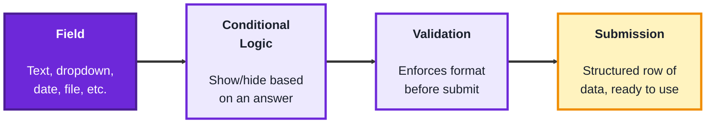
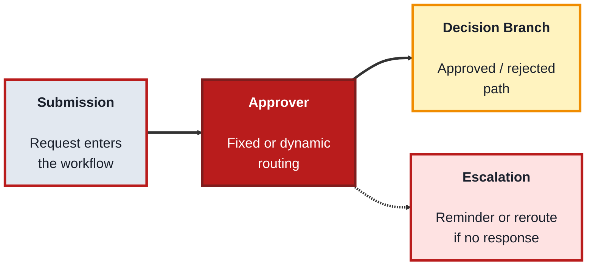
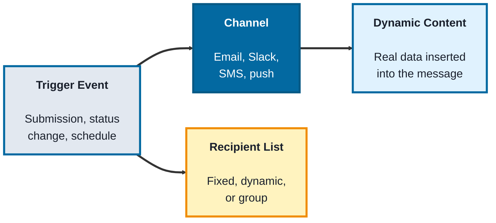
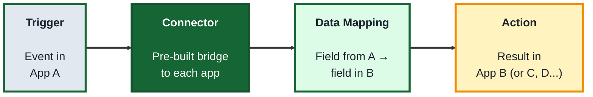

## Module: Business Workflows (Low-Code / No-Code TechArchs)

**Purpose:** Build business solutions without extensive programming.

**Tools needed for this module:** A web browser and an email address to sign up for free tiers — a form tool like [Google Forms](https://forms.google.com) or [Jotform](https://www.jotform.com), and a general automation platform like [Zapier](https://zapier.com) or [Make](https://www.make.com) (both have usable free tiers). No coding environment or installs are required, everything happens in the browser. You won't need every tool set up at once, each topic only needs its own account.

### Topic 1: Forms

#### Concept

**Forms** are the entry point of most business workflows, the place where a human's input (a request, an application, an order) becomes structured data a system can act on. A no-code form builder lets you design that entry point visually, choosing field types and rules without writing validation code yourself.

- A **field** is a single input on a form, common types are short text, dropdown, checkbox, date, and file upload
- **Conditional logic** shows or hides fields based on an earlier answer, so a form only asks relevant questions (for example, only showing "reason for return" if "request type" is set to Return)
- **Validation** enforces a field's format before submission (a valid email, a number within a range, a required field that can't be left blank), without the form builder needing to write any code
- A **submission** is one completed instance of the form, typically stored as a row in a connected spreadsheet or database, ready to feed the rest of a workflow

#### Structure at a Glance

- A well-built form is what makes everything downstream (approvals, notifications, integrations) reliable, messy or missing data at the form stage causes problems everywhere else in a workflow
- Most no-code form tools store submissions in a connected spreadsheet automatically, which is often the simplest possible "database" for a small workflow, no separate setup required

#### Where you'd actually use this

Any process that starts with someone requesting or reporting something, expense requests, time-off requests, IT help tickets, customer intake, or event registration, especially where you want structured, consistent data instead of freeform emails.

#### Lab

1. **Create a free account** with a form tool such as [Google Forms](https://forms.google.com) or [Jotform](https://www.jotform.com).
2. **Build a simple "Time Off Request" form** with fields for name, start date, end date, and reason (dropdown: Vacation, Sick, Other).
3. **Add conditional logic** so an extra "please specify" text field only appears when "Other" is selected as the reason.
4. **Add validation** requiring the start date field and setting the end date to only accept dates after the start date, if your tool supports it.
5. **Submit a test entry** and confirm it lands as a new row in the form's connected spreadsheet, with all fields captured correctly.

#### Checkpoint
You have a working form with conditional logic and validation, and a test submission has landed correctly in a connected spreadsheet.

#### Quiz
1. What is "conditional logic" in a form, and give an example use case?
2. What does "validation" do, and name one example of a validation rule?
3. What is a "submission," and where does it typically end up?
4. Why does the quality of a form's data matter for the rest of a workflow?
5. What's a common, no-setup destination for storing form submissions?

*Answers: 1) Logic that shows or hides fields based on an earlier answer, for example only showing a "reason for return" field if the request type is set to Return. 2) It enforces a field's format before submission, like requiring a valid email, a number within a range, or a required field that can't be blank. 3) One completed instance of the form; it typically ends up as a row in a connected spreadsheet or database. 4) Because approvals, notifications, and integrations downstream all depend on that data being complete and consistent, messy data at the form stage causes problems everywhere else. 5) A connected spreadsheet, which most no-code form tools support automatically.*

---

### Topic 2: Approvals

#### Concept

**Approvals** turn a submission into a decision point, routing it to the right person (or people) and pausing the workflow until they respond. No-code approval steps let you define who approves, in what order, and what happens next, all visually, without writing routing logic in code.

- An **approver** is the person (or role) a request is routed to, they can be fixed (always the same manager) or dynamic (based on a field, like department or amount)
- **Sequential approval** requires approvers to respond one after another in order, **parallel approval** sends the request to multiple approvers at once, either one is a fit depending on how strict the process needs to be
- A **decision branch** is what happens next based on the approver's response, approved records typically move forward, rejected ones typically stop or loop back for changes
- An **escalation** automatically reroutes or reminds when an approver doesn't respond within a set time, preventing a request from getting permanently stuck

#### Structure at a Glance

- Dynamic approver routing (like "route to the requester's manager, whoever that is") is what makes an approval step scale across a whole organization, without building a separate flow for every team
- Skipping escalation rules is a common beginner mistake, without one, a single unresponsive approver can silently stall every request behind them

#### Where you'd actually use this

Any decision that needs sign-off before proceeding, expense approvals, time-off requests, purchase orders, content publishing, or contract review, especially where the approver depends on who submitted the request or how large the request is.

#### Lab

1. **Continue from the Time Off Request form** built in Topic 1 (or use any existing form with a spreadsheet destination).
2. **In an automation tool** like Zapier or Make, create a new automation triggered by "new row added" on that spreadsheet.
3. **Add an approval-style step**: send an email to a fixed approver (yourself, for testing) containing the request details and two links or buttons, "Approve" and "Reject" (many tools offer a built-in approval action for exactly this).
4. **Wire up the decision branch**: if approved, add an action that updates the spreadsheet row's status to "Approved," if rejected, update it to "Rejected."
5. **Test both paths** by submitting two test requests and clicking Approve on one and Reject on the other, then confirm the spreadsheet reflects each outcome correctly.

#### Checkpoint
You have a working approval step that routes a submission to an approver and updates a record differently depending on Approved versus Rejected, and you can explain what an escalation rule is for.

#### Quiz
1. What is the difference between a fixed approver and a dynamic approver?
2. What is the difference between sequential and parallel approval?
3. What is a "decision branch"?
4. What does an escalation rule do, and why is it important?
5. Name one real-world process, other than time off, that commonly needs an approval step.

*Answers: 1) A fixed approver is always the same person, a dynamic approver is determined by a field on the request, like department or amount. 2) Sequential approval requires approvers to respond one after another in order, parallel approval sends the request to multiple approvers at once. 3) What happens next based on the approver's response, an approved path typically moves the record forward, a rejected path typically stops it or loops back for changes. 4) It automatically reroutes or reminds when an approver doesn't respond in time, it's important because without it a single unresponsive approver can silently stall every request behind them. 5) Expense approvals, purchase orders, content publishing, or contract review are all valid answers.*

---

### Topic 3: Notifications

#### Concept

**Notifications** keep people informed as a workflow moves, without them needing to check a system manually. A no-code notification step lets you send a message (email, Slack, SMS, or an in-app alert) triggered automatically by an event elsewhere in the workflow.

- A **trigger event** is whatever causes the notification to fire, a new submission, a status change, an approval, or a scheduled time
- A **channel** is where the notification is delivered, email, Slack, SMS, or a push notification are the most common in no-code tools
- **Dynamic content** (also called merge fields or variables) inserts real data from the triggering record into the message, so a notification reads "Your request for March 3–5 was approved" instead of a generic message
- A **recipient list** defines who gets the notification, it can be a single fixed person, a dynamic person (like "the requester"), or a group

#### Structure at a Glance

- Dynamic content is what separates a genuinely useful notification from a generic, easily-ignored one, specific details make people act on a message instead of skimming past it
- Sending too many notifications for minor events is a common design mistake, it trains people to ignore the channel entirely, undermining the ones that actually matter

#### Where you'd actually use this

Anywhere a person needs to know something changed without checking manually, a requester learning their request was approved, a manager learning a new request is waiting, or a team channel getting pinged when a customer submits an urgent ticket.

#### Lab

1. **Continue from the approval automation** built in Topic 2.
2. **Add a notification step** that fires after the decision branch, on the "Approved" path, send an email to the original requester using dynamic content to include their name and the approved dates.
3. **Add a second notification** on the "Rejected" path, with a different message and, if your tool supports it, a different channel (for example, a Slack message to a manager instead of an email).
4. **Personalize the message** using at least two dynamic fields (like name and date range) pulled from the original submission.
5. **Re-run both test cases** from Topic 2 and confirm each one triggers the correct notification, with the correct dynamic content filled in.

#### Checkpoint
You have working notifications on both the approved and rejected paths of your workflow, each using dynamic content pulled from the original submission.

#### Quiz
1. What is a "trigger event" for a notification?
2. Name three common notification channels.
3. What is "dynamic content," and why does it matter?
4. What defines a "recipient list," and give an example of a dynamic recipient?
5. What's a common mistake when designing notifications, and what problem does it cause?

*Answers: 1) Whatever causes the notification to fire, such as a new submission, a status change, an approval, or a scheduled time. 2) Email, Slack, and SMS (push notification is also acceptable). 3) Real data from the triggering record inserted into the message, like a name or date range; it matters because specific messages get acted on, while generic ones tend to get ignored. 4) Who receives the notification, it can be fixed, dynamic, or a group, an example of a dynamic recipient is "the requester," whoever that happens to be for a given submission. 5) Sending too many notifications for minor events, which trains people to ignore the channel entirely, undermining the notifications that actually matter.*

---

### Topic 4: Integrations

#### Concept

**Integrations** connect a workflow to other systems, so data doesn't have to be copied by hand between tools. A no-code integration platform (like Zapier or Make) lets you connect one app's trigger to another app's action visually, without writing to each app's API directly.

- A **connector** (sometimes called an app or integration) is a pre-built bridge to a specific service (Google Sheets, Slack, Salesforce, HubSpot), handling the technical authentication and API calls behind the scenes
- A **trigger** is the event in one app that starts the integration (a new form submission, a new CRM contact), and an **action** is what happens next in another app (create a row, send a message, update a record)
- A **data mapping** connects a field from the trigger app to a field in the action app (mapping the form's "email" field to the CRM's "email" field), so the right data lands in the right place
- A **multi-step zap** (or scenario) chains several actions together after a single trigger, for example: new form submission triggers an approval email, then a CRM update, then a Slack notification, all from one event

#### Structure at a Glance

- Integrations are what turn separate tools (a form, an approval step, a CRM, a chat app) into one connected workflow, without them, each tool is an isolated island requiring manual copy-paste between them
- Most no-code platforms charge based on the number of "tasks" (individual actions run) per month, which matters when designing a multi-step workflow that might trigger dozens of times a day

#### Where you'd actually use this

Connecting a form to a CRM, connecting a CRM to a spreadsheet or accounting tool, or connecting any approval or notification step in this module to an actual outside system your business already uses, rather than leaving each tool disconnected.

#### Lab

1. **Continue from the full form-to-notification workflow** built across Topics 1–3.
2. **Add one more step to the "Approved" path**: connect to a CRM tool (or a second spreadsheet, standing in for one) and create a new record using the connector for that app.
3. **Map the data**, connecting the form's name, date, and reason fields to the corresponding fields in the CRM or second spreadsheet.
4. **Turn this into a multi-step chain**: confirm that a single trigger (the original form submission) now results in an approval email, a status update, a notification, and a new CRM record, all from one event.
5. **Submit one final test request** end-to-end and trace it through every step, form, approval, notification, and integration, confirming each one fires correctly in sequence.

#### Checkpoint
You have a full multi-step automation where a single form submission results in an approval step, a notification, and a downstream integration creating a record in another system, and you can explain what a connector and a data mapping are.

#### Quiz
1. What is a "connector" in a no-code integration platform?
2. What is the difference between a trigger and an action?
3. What is "data mapping," and why is it necessary?
4. What is a multi-step zap (or scenario)?
5. What's a common pricing model for no-code integration platforms, and why does it matter for workflow design?

*Answers: 1) A pre-built bridge to a specific service (like Google Sheets, Slack, or a CRM) that handles authentication and API calls behind the scenes. 2) A trigger is the event in one app that starts the integration, an action is what happens next in another app as a result. 3) Connecting a field from the trigger app to a field in the action app, so the right data lands in the right place, it's necessary because apps don't automatically know which of their fields correspond to which of another app's fields. 4) A chain of several actions triggered by a single event, for example a form submission triggering an approval email, then a CRM update, then a Slack notification. 5) Most platforms charge based on the number of tasks (individual actions run) per month, which matters because a workflow with many chained steps or high volume can add up quickly.*

---

## Module Completion Checklist
- [ ] Built a form with conditional logic and validation, and confirmed a submission lands correctly in a connected spreadsheet
- [ ] Built an approval step that routes a submission and updates a record differently for Approved versus Rejected
- [ ] Added notifications with dynamic content on both the approved and rejected paths
- [ ] Connected the workflow to a downstream system (CRM or spreadsheet) using a no-code integration platform, with correct data mapping
- [ ] Can trace a single form submission end-to-end through form, approval, notification, and integration steps, explaining what happens at each stage
