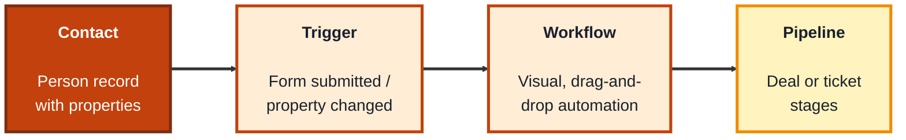
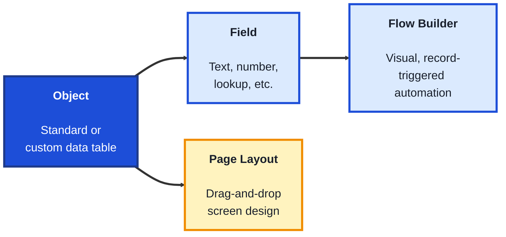
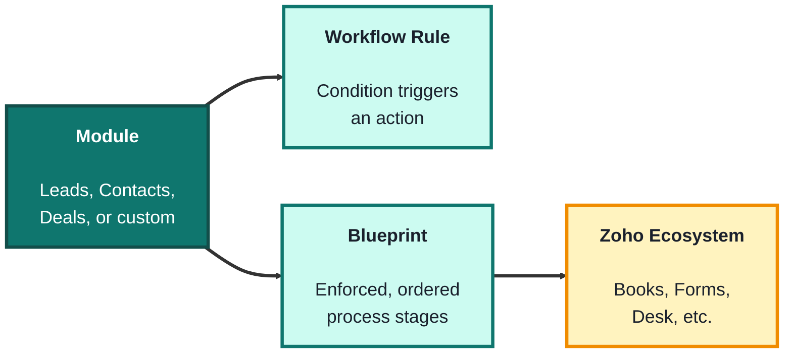

## Module: CRM Platforms (Low-Code / No-Code TechArchs)

**Purpose:** Build business solutions without extensive programming.

**Tools needed for this module:** A web browser and an email address to sign up for free tiers or trials — [HubSpot CRM](https://www.hubspot.com/products/crm) (free tier), a [Salesforce Trailhead Playground](https://trailhead.salesforce.com) (free sandbox org) or free trial, and [Zoho CRM](https://www.zoho.com/crm/) (free tier). No coding environment or installs are required, everything happens in the browser. You won't need all three set up at once, each topic only needs its own account.

### Topic 1: HubSpot

#### Concept

**HubSpot** started as marketing software and grew into a full CRM platform, which is why it's known for being approachable and tightly connecting marketing, sales, and service data in one place. Its low-code strength is the **visual workflow builder**, a drag-and-drop automation tool that lets non-developers set up multi-step processes (like lead follow-ups) without writing code.

- A **contact** is HubSpot's core record, a person, with **companies**, **deals**, and **tickets** as related record types you connect to it
- A **property** is a field on a record (like email, lifecycle stage, or a custom field you define yourself)
- A **workflow** is an automation built from a trigger (like "form submitted") and a chain of actions (send email, update a property, notify a rep), all assembled visually
- A **pipeline** organizes deals or tickets into stages (like "New," "Qualified," "Closed Won") so progress is visible at a glance

#### Structure at a Glance

- HubSpot's free tier is genuinely usable for small teams, but workflow automation, custom reporting, and advanced permissions are gated behind paid tiers, a common low-code tradeoff between accessibility and depth
- Because marketing, sales, and service data live in the same contact record, a workflow triggered by a marketing action (like a form fill) can immediately affect a sales pipeline, without any integration work

#### Where you'd actually use this

Small to mid-sized teams that want marketing and sales in one system without hiring developers, especially ones that rely heavily on inbound leads (website forms, email signups) and want those leads automatically routed and nurtured.

#### Lab

1. **Create a free HubSpot account** at [hubspot.com](https://www.hubspot.com/products/crm) using a work or personal email.
2. **Create a contact manually**, filling in a name, email, and lifecycle stage, to see how a record's properties are structured.
3. **Create a simple deal** and add it to the default sales pipeline, then drag it from one stage to the next to see how pipeline stages track progress.
4. **Build a basic workflow** (Automation > Workflows > Contact-based): set the trigger to "lifecycle stage is set to Lead," then add a single action, sending an internal notification email to yourself.
5. **Enroll your test contact** in the workflow manually and confirm the notification action fires as expected.

#### Checkpoint
You have a HubSpot contact, a deal in a pipeline, and a working workflow that triggers off a property change, and you can explain what a trigger and an action are in that workflow.

#### Quiz
1. What is a "property" in HubSpot, and give one example?
2. What are the four related record types mentioned that a contact connects to?
3. What two parts make up a HubSpot workflow?
4. What is a pipeline used for?
5. Name one capability that's gated behind HubSpot's paid tiers.

*Answers: 1) A field on a record, such as email address, lifecycle stage, or a custom field you define yourself. 2) Companies, deals, tickets, and (implicitly) the contact itself as the core record they connect to. 3) A trigger (the event that starts it, like a form submission) and a chain of actions (like sending an email or updating a property). 4) Organizing deals or tickets into stages so progress is visible at a glance. 5) Workflow automation, custom reporting, or advanced permissions (any one of these is a valid answer).*

---

### Topic 2: Salesforce

#### Concept

**Salesforce** is the most established enterprise CRM platform, and its low-code layer is broader and more powerful than HubSpot's or Zoho's, which is also why it has a steeper learning curve. Its core low-code tools are **Flow Builder** (visual automation, replacing the older "Workflow Rules" and "Process Builder"), **Objects** (custom data structures you define without code), and **Page Layouts** (drag-and-drop screen design for how records appear to users).

- An **object** is Salesforce's term for a data table, **standard objects** (Contact, Account, Opportunity) come built in, **custom objects** are ones you create yourself
- A **field** is a column on an object, custom fields can be text, numbers, dates, dropdowns, or lookups to other objects
- **Flow Builder** lets you build automation visually: screen flows (guided forms for users), record-triggered flows (run automatically when a record changes), and scheduled flows
- An **Opportunity** is Salesforce's standard object for a potential sale, tracked through customizable **stages**, similar in purpose to a HubSpot deal

#### Structure at a Glance

- Because you can create entirely new objects (not just add fields to existing ones), Salesforce's low-code ceiling is much higher than HubSpot's or Zoho's, entire custom applications can be built without traditional code
- That same flexibility means Salesforce orgs can become complex quickly, larger teams often have a dedicated "Salesforce admin" role just to manage objects, flows, and permissions

#### Where you'd actually use this

Larger organizations with complex sales processes, multiple departments needing custom data structures, or companies that expect to eventually need deep customization or integration with other enterprise systems.

#### Lab

1. **Sign up for a free Trailhead Playground** through [trailhead.salesforce.com](https://trailhead.salesforce.com), a disposable sandbox org meant for learning.
2. **Explore the standard Opportunity object**, opening a sample record (or creating one) and reviewing its default fields and stage picklist.
3. **Create a custom field** on the Opportunity object (Setup > Object Manager > Opportunity > Fields), for example a checkbox called "Requires Manager Approval."
4. **Build a simple record-triggered flow** (Setup > Flow Builder): trigger it when an Opportunity is updated, and set the checkbox field to true, add one action, sending an email alert.
5. **Test the flow** by editing a sample Opportunity to meet the trigger condition and confirming the flow runs.

#### Checkpoint
You have a custom field on a standard Salesforce object and a working record-triggered flow that reacts to a change on that field, and you can explain the difference between a standard and a custom object.

#### Quiz
1. What is the difference between a standard object and a custom object?
2. What is Flow Builder used for?
3. Name the three types of flows mentioned and what each is for.
4. What is a Page Layout used for?
5. Why do larger Salesforce orgs often have a dedicated admin role?

*Answers: 1) Standard objects (like Contact, Account, Opportunity) come built into Salesforce, custom objects are new data tables you create yourself. 2) Building automation visually, without code, including guided forms, record-triggered actions, and scheduled processes. 3) Screen flows (guided forms for users), record-triggered flows (run automatically when a record changes), and scheduled flows (run on a set schedule). 4) Drag-and-drop design of how a record's fields and related information appear to users on screen. 5) Because the platform's flexibility (custom objects, fields, flows, permissions) makes orgs complex quickly, requiring dedicated management as they grow.*

---

### Topic 3: Zoho CRM

#### Concept

**Zoho CRM** sits between HubSpot and Salesforce in complexity, it's part of a much larger suite of Zoho business apps (books, projects, forms, and more), and its low-code strength is how deeply and affordably it connects to those other apps. Its core automation tool is **Workflow Rules** paired with **Blueprint**, a visual tool for enforcing a specific multi-step process (like a required approval sequence) rather than just triggering side actions.

- A **module** is Zoho's term for a record type (Leads, Contacts, Deals, or a custom module you create)
- A **workflow rule** triggers actions (like field updates, emails, or tasks) based on a condition, similar in concept to HubSpot's workflows
- A **Blueprint** visually maps out a required process with stages a record must pass through in order, useful when a process (like an approval chain) must happen in a strict sequence, not just "if this, then that"
- **Zoho's app ecosystem** (Books for accounting, Forms for data capture, Desk for support) is designed to connect to CRM with minimal setup, since they're built by the same company

#### Structure at a Glance

- Blueprint's key difference from a simple workflow rule is enforcement, a record literally cannot skip a required stage, which matters for compliance-sensitive processes like loan approvals or refund sign-offs
- Zoho is generally the most budget-friendly of the three at comparable feature levels, a major reason smaller businesses and budget-conscious teams choose it over Salesforce

#### Where you'd actually use this

Small and mid-sized businesses that want CRM tightly bundled with other affordable business tools (accounting, support, forms) from a single vendor, or any team with a process that must be strictly enforced step-by-step, like a formal approval chain.

#### Lab

1. **Sign up for a free Zoho CRM account** at [zoho.com/crm](https://www.zoho.com/crm/).
2. **Create a Lead record manually**, filling in name, company, and status, to see how a module's fields are structured.
3. **Create a workflow rule** (Setup > Automation > Workflow Rules): trigger it when a Lead's status changes to "Qualified," with an action that sends a notification email.
4. **Build a simple Blueprint** on the Leads module with three enforced stages (for example, "New," "Contacted," "Qualified"), requiring a mandatory field to be filled before moving to the next stage.
5. **Walk a test Lead through the Blueprint**, attempting to skip a stage first to see it get blocked, then completing the required field and confirming it proceeds.

#### Checkpoint
You have a Zoho workflow rule that fires on a status change and a working Blueprint that enforces an ordered process, and you can explain the difference between the two.

#### Quiz
1. What is a "module" in Zoho CRM?
2. What is the key difference between a Workflow Rule and a Blueprint?
3. What kind of process is Blueprint especially suited for, and why?
4. Name two other apps in the Zoho ecosystem mentioned that connect to CRM.
5. What's a common reason smaller businesses choose Zoho over Salesforce?

*Answers: 1) Zoho's term for a record type, such as Leads, Contacts, Deals, or a custom module you create yourself. 2) A Workflow Rule triggers actions based on a condition (like HubSpot's workflows), while a Blueprint enforces a required, ordered sequence of stages that a record cannot skip. 3) Compliance-sensitive or strictly sequential processes, like approval chains or refund sign-offs, because Blueprint physically blocks skipping a required stage. 4) Books (accounting), Forms (data capture), and Desk (support) are all valid answers. 5) Zoho is generally the most budget-friendly option of the three at comparable feature levels.*

---

## Module Completion Checklist
- [ ] Created a HubSpot contact, a deal in a pipeline, and a working property-triggered workflow
- [ ] Created a custom field on a Salesforce standard object and a working record-triggered Flow
- [ ] Created a Zoho workflow rule and a Blueprint that enforces an ordered process
- [ ] Can explain the core low-code building blocks each platform uses (HubSpot's workflows, Salesforce's objects and Flow Builder, Zoho's modules and Blueprint)
- [ ] Can name one clear reason a team might choose each of the three CRM platforms over the other two
