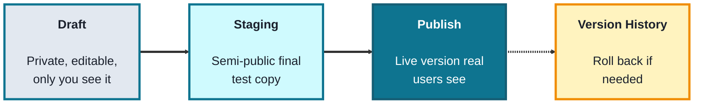
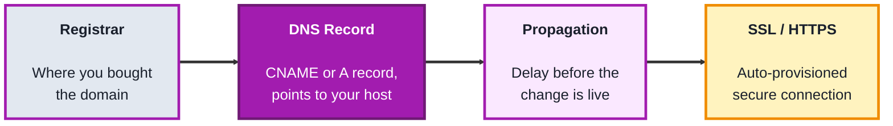
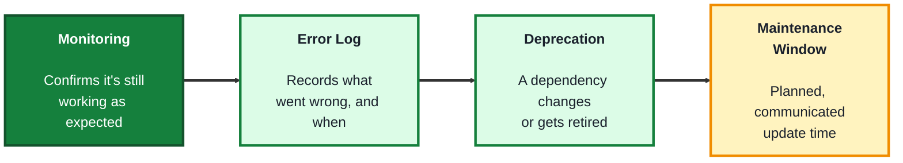

## Module: Deployment

**Tools needed for this module:** A web browser, a free account with a no-code hosting or app-builder platform (such as [Netlify](https://www.netlify.com), [Glide](https://www.glideapps.com), or whatever platform your earlier modules' project was built on), and optionally a domain registrar account (like [Namecheap](https://www.namecheap.com) or [Google Domains](https://domains.google)) if you want to try a custom domain. No coding environment or installs are required.

### Topic 1: Publishing

#### Concept

**Publishing** is the step that takes something you've built privately and makes it live and accessible to real users, whether that's a form, a workflow, a website, or a full app. Before publishing, most no-code tools let you build and test in a private **draft** or **preview** mode, so nothing is exposed until you're ready.

- A **draft** (or preview) is a private, editable version of what you're building, only visible to you and collaborators, changes here don't affect real users
- **Publishing** (or "going live") takes the current draft and makes it the version real users see and interact with
- A **staging environment** is a separate, semi-public copy used for final testing before publishing to production, common in larger low-code platforms like Salesforce
- **Version history** keeps a record of previous published versions, so you can roll back if a new publish introduces a problem

#### Structure at a Glance

- Not every no-code tool has a separate staging step, smaller tools often go straight from draft to published, larger platforms (like Salesforce) add staging because changes there can affect an entire organization at once
- Version history is what makes publishing low-risk, if something breaks after a publish, rolling back to the previous version is usually a single click rather than manually undoing changes

#### Where you'd actually use this

Any time you finish building or updating a form, workflow, or app and are ready for real users, employees, or customers to actually use it, and want to do so without exposing half-finished work in the meantime.

#### Lab

1. **Open a project you built in an earlier module** (a form, workflow, or app) that has a draft or edit mode.
2. **Make a small, visible change** in draft mode, such as editing a label or adding a field, without publishing yet.
3. **Preview the draft** using the tool's preview feature, and confirm the change is visible to you but not yet to anyone using the live version.
4. **Publish the change** and then open the live, public link in a fresh incognito/private browser window to confirm it now shows the update.
5. **Locate the version history** (if your tool has one) and confirm you can see the previous version and could roll back to it if needed.

#### Checkpoint
You have made a change in draft mode, previewed it privately, published it live, and confirmed you can view (and would be able to roll back through) version history.

#### Quiz
1. What is the difference between a draft and a published version?
2. What is a staging environment, and when is it commonly used?
3. What is version history used for?
4. Why might a large platform like Salesforce include a staging step that a smaller tool doesn't?
5. Why does version history make publishing lower-risk?

*Answers: 1) A draft is private and editable, visible only to you, a published version is live and visible to real users. 2) A separate, semi-public copy used for final testing before publishing to production, commonly used on larger low-code platforms where changes can affect an entire organization. 3) Keeping a record of previous published versions so you can roll back if a new publish introduces a problem. 4) Because changes on a large platform can affect an entire organization at once, an extra testing step reduces the risk of a mistake reaching everyone immediately. 5) Because rolling back to a previous version is usually a single click, rather than manually undoing every change by hand.*

---

### Topic 2: Domains

#### Concept

A **domain** is the human-readable address (like `yourbusiness.com`) that points to where your published site or app actually lives, rather than making users type a long, tool-generated address. Connecting a custom domain is usually a no-code process involving a domain registrar and a few settings changes, not writing any code.

- A **domain registrar** is the service you buy a domain name from (like Namecheap or Google Domains), separate from the hosting platform where your site or app actually runs
- **DNS records** are entries that tell the internet where a domain should point, the most common ones for connecting a custom domain are a **CNAME** (pointing a subdomain to another address) and an **A record** (pointing a domain directly to a numeric IP address)
- **Propagation** is the delay between changing a DNS record and that change taking effect everywhere on the internet, it can take anywhere from minutes to (rarely) up to 48 hours
- **SSL/HTTPS** is the encryption that makes a connection secure (shown as a padlock in the browser), most no-code hosting platforms provision this automatically for free once a custom domain is connected

#### Structure at a Glance

- The registrar and the host are almost always two different companies, connecting a custom domain means telling the registrar (through a DNS record) to point traffic at the host, rather than moving the domain itself
- Propagation delay is a common source of beginner confusion, a DNS change that "isn't working" immediately after saving it often just needs more time to spread across the internet

#### Where you'd actually use this

Any published site, form, or app you want to present under your own business's name (`yourbusiness.com`) instead of a generic tool-provided address (like `yourbusiness.glideapp.io`), which matters for branding and for how trustworthy a link looks to customers.

#### Lab

1. **Register a low-cost or free trial domain** through a registrar such as Namecheap, or use a free subdomain option if you'd rather not purchase one.
2. **Open your published project's hosting settings** (from Topic 1) and find the "custom domain" option, most no-code platforms provide the exact DNS record you need to add.
3. **Add the required DNS record** in your registrar's DNS settings, copying the CNAME or A record value exactly as instructed by your hosting platform.
4. **Wait for propagation** and periodically check whether your custom domain now loads your published project (a DNS checker tool online can confirm propagation status if it's taking a while).
5. **Confirm SSL/HTTPS is active** once the domain resolves, by checking for the padlock icon in your browser's address bar.

#### Checkpoint
You have connected a custom domain to a published project by adding the correct DNS record, waited for propagation, and confirmed the domain loads securely over HTTPS.

#### Quiz
1. What is the difference between a domain registrar and a hosting platform?
2. What do CNAME and A records do?
3. What is "propagation," and why might a DNS change not appear to work right away?
4. What does SSL/HTTPS provide, and how do you visually confirm it's active?
5. Why would a business want a custom domain instead of the host's default address?

*Answers: 1) A registrar is where you bought the domain name, a hosting platform is where the site or app actually runs, they are almost always separate companies. 2) A CNAME points a subdomain to another address, an A record points a domain directly to a numeric IP address, both are ways of telling the internet where a domain should send traffic. 3) The delay between changing a DNS record and that change taking effect everywhere on the internet, it might not work right away simply because it hasn't finished spreading yet, not because it was set up incorrectly. 4) It encrypts the connection, making it secure, you can confirm it visually by checking for the padlock icon in the browser's address bar. 5) For branding and trust, a custom domain looks more professional and trustworthy to customers than a generic tool-provided address.*

---

### Topic 3: Maintenance

#### Concept

**Maintenance** is everything that keeps a published solution reliable after launch, monitoring it, fixing issues, and updating it as needs change, since publishing something is the beginning of its lifecycle, not the end. Even no-code solutions need ongoing attention, connected accounts can expire, automations can silently fail, and business needs change over time.

- **Monitoring** is checking that a published solution is actually working as expected, some platforms offer built-in uptime or error alerts, others require manually checking in periodically
- An **error log** records what went wrong and when, when an automation or integration step fails, most no-code platforms keep a log entry describing the specific failure, essential for troubleshooting without needing to guess
- **Deprecation** happens when a connected service changes or retires a feature your solution depends on (like an API being updated), left unaddressed, this can quietly break a workflow with no clear warning
- A **maintenance window** is a planned, communicated time for making updates or fixes, minimizing surprise disruption for the people relying on the solution day to day

#### Structure at a Glance

- Most no-code platform outages people encounter aren't the platform itself failing, they're an upstream connected service changing something (like an app it integrates with updating its API), which is why checking error logs first, rather than assuming the whole platform is broken, saves time
- Even a simple published form or workflow benefits from a recurring calendar reminder to check it, since a "set it and forget it" mindset is exactly how a small business ends up with a silently broken workflow for weeks before anyone notices

#### Where you'd actually use this

Any published solution that will keep running for months or years, checking that connected accounts haven't expired, that automations are still firing correctly, and that a growing business's needs haven't outgrown a workflow built when the business was smaller.

#### Lab

1. **Return to any automation you built in an earlier module** (the Business Workflows or APIs module both work well for this).
2. **Locate the tool's error log or run history**, most no-code automation platforms keep a history of every time an automation ran, whether it succeeded or failed.
3. **Deliberately break something** (for example, temporarily disconnect a connected account, or change a field name the automation depends on) and re-trigger the automation to generate a failure.
4. **Read the resulting error log entry** and identify exactly what it reports failed and why, then fix the issue (reconnect the account, restore the field name).
5. **Set up a monitoring habit**: create a recurring calendar reminder (weekly or monthly, your choice) to check this automation's run history going forward.

#### Checkpoint
You have located and read an error log entry from a deliberate failure, fixed the underlying issue, and confirmed the automation succeeds again on a re-run, plus set up a recurring habit to monitor it going forward.

#### Quiz
1. What is "monitoring" in the context of maintenance, and why is it needed even for no-code solutions?
2. What does an error log record, and why is it useful?
3. What is "deprecation," and how can it break a working solution without warning?
4. What is a maintenance window, and what problem does it solve?
5. Why might publishing be described as "the beginning of the lifecycle, not the end"?

*Answers: 1) Checking that a published solution is still working as expected, it's needed even for no-code solutions because connected accounts can expire and automations can silently fail without anyone noticing. 2) What went wrong and when, it's useful because it lets you troubleshoot the specific failure without needing to guess what happened. 3) When a connected service changes or retires a feature your solution depends on, it can break a workflow with no clear warning because the failure originates outside the tool you built. 4) A planned, communicated time for making updates or fixes, it solves the problem of surprising the people relying on the solution day to day with unexpected disruption. 5) Because a published solution needs ongoing monitoring, error handling, and updates to keep working reliably, the work doesn't stop once something goes live.*

---

## Module Completion Checklist
- [ ] Made a change in draft mode, previewed it, published it live, and located version history
- [ ] Connected a custom domain by adding the correct DNS record and confirmed it loads securely over HTTPS
- [ ] Deliberately triggered and read an error log entry, then fixed the underlying issue
- [ ] Set up a recurring habit to monitor a published automation or solution going forward
- [ ] Can explain why deprecation of a connected service can break a solution without warning
