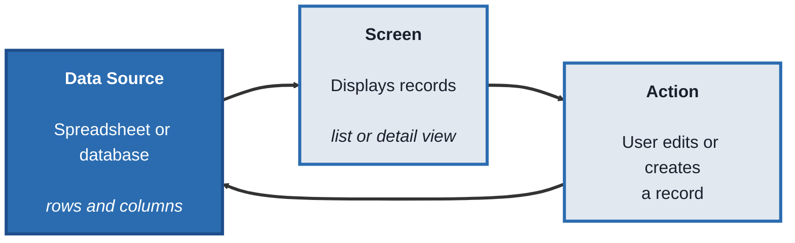
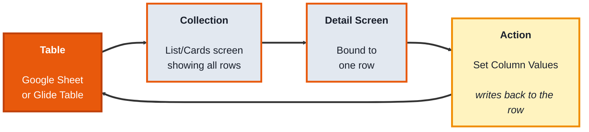
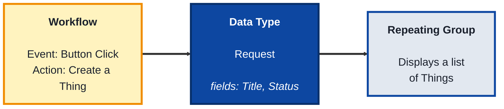
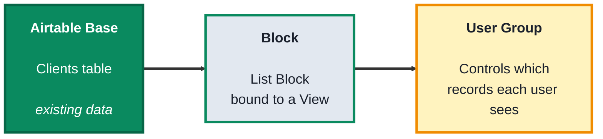

# Internal Apps: A Practical Beginner's Course

## Course Overview

**Who this is for:** Beginners who want to build functional, data-driven apps — task trackers, client portals, inventory tools, request forms with a review queue — connected to real data, with logins and permissions, without writing a traditional backend.

**How the course works:** Four modules. Every topic follows the same pattern:
- **Concept** - what it is, in plain language
- **Structure at a Glance** - the core building blocks you'll actually work with
- **Where you'd actually use this** - a real business scenario
- **Lab** - hands-on, buildable examples
- **Checkpoint**
- **Quiz** - five questions with answers

**Tools needed:** Free accounts on [Glide](https://glideapps.com), [Bubble](https://bubble.io), and [Softr](https://softr.io). A free [Google Sheets](https://sheets.google.com) or [Airtable](https://airtable.com) account is also needed for two of the modules. You won't need all three platforms at once — each module only needs its own tool.

---

## Module 0: What Internal App Builders Actually Do

### Concept

An **internal app builder** turns a set of data into a working application with screens, actions, and permissions — different from a website builder, which mainly displays content publicly. Every platform in this course is built from the same underlying idea, even though the interface and vocabulary differ:

- A **data source** is where the app's information actually lives — a spreadsheet, a database, or the platform's own built-in storage
- A **screen** (or view) displays data from the source, either as a list of many records or the detail of one
- An **action** lets a user change the data — creating a new record, editing a field, marking something complete — and that change writes back to the data source
- **Permissions** (sometimes called user roles or record ownership) control which users can see or edit which records, since an internal app usually shouldn't show every user everything

### Structure at a Glance

This same shape — data source, screen, action writing back to the source — appears in every tool this course covers.

### Where you'd actually use this

Any situation where a team needs a real tool, not just a document: a task tracker where each person sees only their own work, a client portal showing each client only their own records, an inventory tracker a warehouse team updates from their phones, an internal request queue with an admin review screen.

### Lab

Pick a simple dataset shaped like a spreadsheet — for example, a task list with columns `Task`, `Assignee`, `Status`. Sketch what an app built on this data would need: a list screen showing all tasks, a detail screen for one task, and an action to change its `Status`. This sketch is exactly what you'll build in every module that follows.

### Checkpoint
You can describe the data source, screen, and action concepts, and you have a written sketch of a simple app's list screen, detail screen, and one action.

### Quiz
1. What is a data source, in the context of an internal app builder?
2. What's the difference between a list screen and a detail screen?
3. What does an action actually do?
4. What do permissions (or record ownership) control?
5. How is an internal app builder different from a website builder, in what it's mainly used for?

*Answers: 1) Where the app's information actually lives — a spreadsheet, database, or the platform's own built-in storage. 2) A list screen shows many records at once; a detail screen shows the full information for one specific record. 3) Lets a user change data — creating, editing, or completing a record — with that change writing back to the data source. 4) Which users can see or edit which specific records, since an internal app usually shouldn't show every user everything. 5) A website builder mainly displays content publicly; an internal app builder builds functional tools with data, actions, and permissions for a team or specific users.*

---

## Module 1: Glide - Spreadsheet Straight Into an App

### Concept

**Glide** turns a spreadsheet directly into a working, mobile-friendly app — connect a Google Sheet (or use Glide's own built-in Tables), and Glide automatically maps its columns into visual screens. It's built around speed: "sheet in, app out," with minimal setup between having data and having a usable app.

### Structure at a Glance

- A **Table** is Glide's term for a connected data source — a Google Sheet tab or a native Glide Table, made of rows and columns
- A **Collection** (List, Cards, or Calendar) is a screen showing multiple rows from a Table at once
- A **Detail screen** shows all the fields for one specific row, opened by tapping it in a Collection
- An **Action** like "Set Column Values" lets a button write a new value into a specific column for that row — this is how a user's tap actually changes the underlying data
- **Row Owners** is Glide's built-in permission feature — restricting which rows a specific logged-in user can see, based on a column matching their email

### Where you'd actually use this

Fast internal tools built directly from data your team already keeps in a spreadsheet: a task tracker, a simple CRM, a field team's daily checklist app, anywhere a spreadsheet already exists and just needs a proper mobile interface on top of it.

### Lab

1. **Create a Google Sheet** with columns: `Task`, `Assignee` (an email address), `Status` (values like "Open" or "Done").

2. **Create a new Glide app** and connect it to this sheet as your Table.

3. **Add a Collection screen** displaying all rows from the Table, showing `Task` and `Status` in the list view.

4. **Tap into the Detail screen** for a row (Glide generates this automatically) and confirm all its fields display.

5. **Add an Action button** on the Detail screen labeled "Mark Complete," using the **Set Column Value** action to set `Status` to "Done" when tapped.

6. **Set up Row Owners** using the `Assignee` column, so each signed-in user only sees rows where they're listed as the assignee.

7. **Publish the app**, sign in as a test user matching one of your `Assignee` emails, and confirm you only see that user's tasks — then tap "Mark Complete" and confirm the Google Sheet itself updates with the new status.

### Checkpoint
You have a published Glide app connected to a real Google Sheet, showing only a signed-in user's own rows via Row Owners, with a working action that updates the sheet.

### Quiz
1. What is a Table in Glide?
2. What's the difference between a Collection and a Detail screen?
3. What does the "Set Column Values" action actually do?
4. What does Row Owners control?
5. After tapping "Mark Complete" in the app, where did the actual change get saved?

*Answers: 1) Glide's term for a connected data source — a Google Sheet tab or native Glide Table made of rows and columns. 2) A Collection shows multiple rows at once as a list; a Detail screen shows all the fields for one specific row. 3) Writes a new value into a specific column for a specific row, which is how a button tap actually changes the underlying data. 4) Which rows a specific signed-in user is allowed to see, based on a column (like an email address) matching their login. 5) The original Google Sheet itself — Glide writes changes directly back to the connected spreadsheet.*

---

## Module 2: Bubble - A Full Application Logic Engine

### Concept

**Bubble** is a more powerful, general-purpose no-code platform for building complete web applications with custom logic, its own built-in database, and a visual **workflow** editor connecting events to actions — suited for internal tools more complex than a direct spreadsheet mapping, where you need real conditional logic and a data structure designed specifically for your app.

### Structure at a Glance

- A **Data Type** is a custom structure you define (like "Request" or "Task") with its own **fields** — Bubble's database is built specifically for your app, not borrowed from a spreadsheet
- A **Thing** is one actual record of a Data Type — one specific Request, with real values in its fields
- A **Repeating Group** is an element that displays a list of Things on a page, similar to a Collection in Glide, but more flexible in what each item can visually contain
- A **Workflow** connects an **Event** (a button click, a page load, a form submission) to one or more **Actions** (create a Thing, modify a Thing, send an email)
- A **Conditional** changes an element's appearance or visibility based on a rule (e.g., highlight a row red if its Status is "Urgent")
- A **Privacy Rule** restricts which users can view or edit specific Things, enforced by Bubble itself rather than by what's simply hidden on a page

### Where you'd actually use this

Internal tools that need real custom logic beyond a straightforward data display: an approval workflow with multiple statuses and conditional routing, a request-tracking system with role-based views, any tool where "if this, then that" logic needs to run when a user does something.

### Lab

1. **Create a new Bubble app** and open the Data tab. Create a new **Data Type** called `Request` with fields: `Title` (text), `Status` (text), `Requester` (text).

2. **Build a page with a Repeating Group** set to display a list of `Request` — this will show every Request Thing once you have some.

3. **Add a form and a button** to the page (a text input for `Title`, another for `Requester`) with a **Workflow**: Event = "Button A is clicked," Action = "Create a new Request" using the input values.

4. **Preview the app, submit the form,** and confirm a new Thing appears automatically in the Repeating Group without refreshing the page.

5. **Add a Conditional** to the Repeating Group's row: "When this Request's Status is Urgent, background color is red."

6. **Manually set one Thing's Status to "Urgent"** in the Data tab, and confirm that row highlights red in the app.

7. **Add a Privacy Rule** limiting visibility of `Request` Things to only logged-in users, and confirm a logged-out preview no longer shows the Repeating Group's contents.

### Checkpoint
You have a working Bubble app with a custom Data Type, a Repeating Group displaying real Things, a Workflow that creates new Things from a form, a working Conditional, and a Privacy Rule restricting visibility to logged-in users.

### Quiz
1. What is a Data Type in Bubble, and how is it different from just using a spreadsheet?
2. What is a Thing?
3. What does a Workflow connect together?
4. What does a Conditional do?
5. What does a Privacy Rule actually enforce, compared to just hiding something visually on a page?

*Answers: 1) A custom data structure you define specifically for your app, with its own fields — unlike a spreadsheet, it's built inside Bubble's own database rather than borrowed from an external sheet. 2) One actual record of a Data Type, with real values filled into its fields. 3) An Event (like a button click or form submission) to one or more Actions (like creating or modifying a Thing). 4) Changes an element's appearance or visibility based on a rule, such as highlighting a row when a field matches a specific value. 5) It's enforced by Bubble itself at the data level, so a user genuinely cannot access the restricted data even by inspecting the page — unlike simply hiding an element visually, which wouldn't actually protect the underlying data.*

---

## Module 3: Softr - No-Code Portals on Top of Airtable

### Concept

**Softr** builds client-facing and internal web apps directly on top of an existing **Airtable** base (or other supported data sources), using pre-built **Blocks** — lists, tables, forms, charts — that bind to your data with minimal configuration. It's built for **portals**: client portals, member directories, internal dashboards, where the data structure already exists in Airtable and you mainly need a clean, permissioned interface on top of it.

### Structure at a Glance

- A **Block** is Softr's pre-built page component — a List, Table, Chart, or Form — that binds directly to data from your connected source
- An **Airtable View** is a specific, filtered/sorted way of looking at a table in Airtable; a Softr Block typically binds to one View, not the raw table, so filtering can be controlled from Airtable itself
- A **User Group** defines a set of logged-in users and what they're allowed to access; combined with **record ownership** (matching a record's field, like an email, to the logged-in user), this is how a portal shows each client only their own data
- An **Action button** can be linked to trigger an Airtable automation, letting a click in Softr kick off a process defined back in Airtable

### Where you'd actually use this

Client portals where each client should log in and see only their own project status or invoices, member directories, internal dashboards built on data your team already manages in Airtable, situations where the underlying data structure is already solid and the main need is a clean, permissioned front end.

### Lab

1. **Create an Airtable base** with a `Clients` table containing fields: `Name`, `Email`, `Project Status`.

2. **Create a View in Airtable** (e.g., "Active Clients") filtered to only show clients with a non-empty `Project Status`.

3. **Create a new Softr app** and connect it to your Airtable base.

4. **Add a List Block to a page,** bound to your `Clients` table's "Active Clients" View, displaying `Name` and `Project Status`.

5. **Set up a User Group** for logged-in clients, and configure record ownership so a logged-in user only sees the Client record where their login email matches the `Email` field.

6. **Publish the portal**, sign in as a test user matching one client's email, and confirm you only see that one client's record, not the full list.

7. **Add a separate, admin-only page** with a Table Block showing all `Clients` records unfiltered by ownership, and restrict that page to a separate "Admin" User Group.

### Checkpoint
You have a published Softr portal connected to a real Airtable base, showing a logged-in client only their own record via record ownership, plus a separate admin-only page showing everything.

### Quiz
1. What is a Block in Softr?
2. Why does a Block typically bind to an Airtable View instead of the raw table?
3. What does a User Group control?
4. What does "record ownership" mean, in the context of a client portal?
5. How did the lab keep the admin page separate from what regular client users can see?

*Answers: 1) A pre-built page component — like a List, Table, Chart, or Form — that binds directly to data from a connected source such as Airtable. 2) Because a View is a specific, filtered/sorted way of looking at the data, letting you control what's shown from within Airtable itself rather than rebuilding that filtering logic in Softr. 3) A defined set of logged-in users and what pages or data they're allowed to access. 4) Matching a record's field, like an email address, to the logged-in user, so that user only sees their own record instead of every record in the table. 5) By restricting the admin page to a separate "Admin" User Group, distinct from the client-facing User Group used for record-owned data.*

---

## Capstone: The Same Internal App, Three Ways

Build the same small internal app — "a task tracker where each signed-in user only sees their own tasks, can mark a task complete, and a separate admin view shows every task from every user" — in each platform covered in this course:

1. In Glide (Module 1), using a Google Sheet as the Table, Row Owners for per-user filtering, and a "Mark Complete" action
2. In Bubble (Module 2), using a custom `Task` Data Type, a Privacy Rule for per-user restriction, and a Workflow to mark a Task complete
3. In Softr (Module 3), using an Airtable base, record ownership via a User Group for per-user filtering, and a separate admin-only page
4. Compare all three side by side. Notice the same underlying shape — data source, per-user filtering, an action that writes back, and a separate admin view — appears in every one. Only the underlying data model (a spreadsheet's rows, Bubble's own database, or Airtable's records) and how much custom logic each platform allows differ.

### Course completion checklist
- [ ] Explained the data source, screen, action, and permissions concepts shared across internal app builders
- [ ] Built and published a Glide app with Row Owners and a working "Set Column Values" action writing back to a Google Sheet
- [ ] Built a Bubble app with a custom Data Type, a Workflow creating real Things, a Conditional, and a Privacy Rule
- [ ] Built and published a Softr portal with record ownership via a User Group and a separate admin-only page
- [ ] Built the same per-user task tracker in all three platforms, and can point out what stayed the same versus what changed
- [ ] Can explain, in one sentence per platform, who each tool is best suited for

Every piece of this course exists to answer one question, repeatedly and reliably: **given a team that needs a real internal tool with proper permissions, can I build it on the data source that already exists — a spreadsheet, a custom database, or Airtable — no matter which platform fits the job?**
