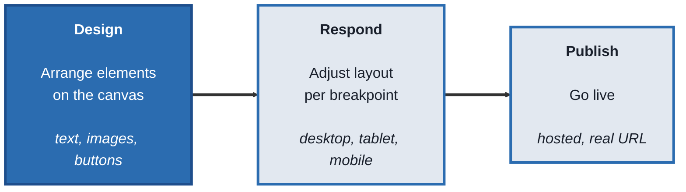
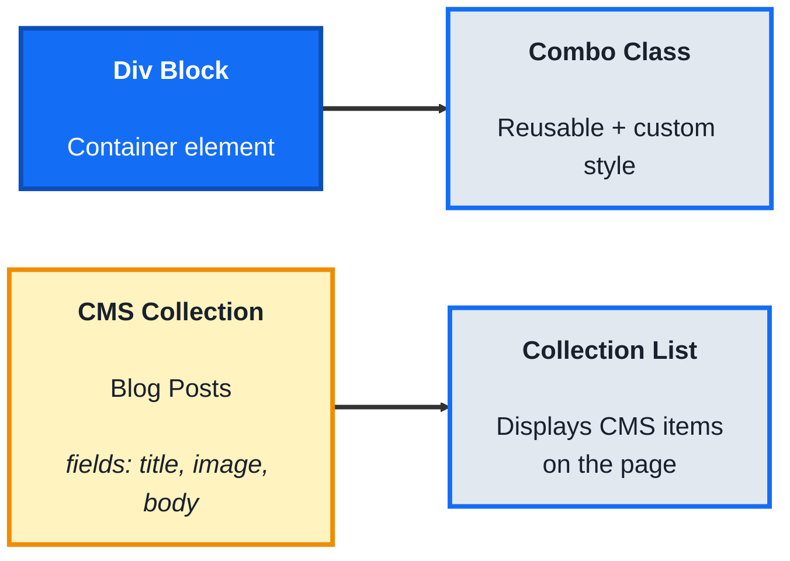
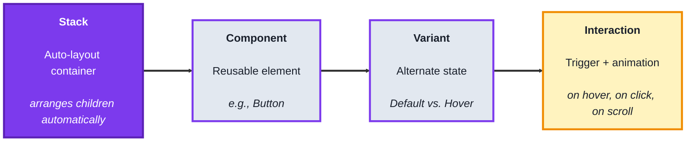
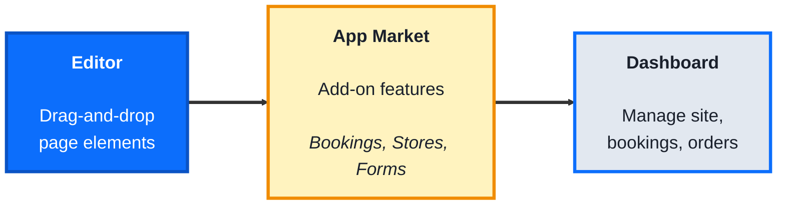

# Website Builders: A Practical Beginner's Course

## Course Overview

**Who this is for:** Beginners who want to build real, live websites — landing pages, portfolios, small business sites — visually, without writing HTML, CSS, or JavaScript by hand.

**How the course works:** Four modules. Every topic follows the same pattern:
- **Concept** - what it is, in plain language
- **Structure at a Glance** - the core building blocks you'll actually work with
- **Where you'd actually use this** - a real business scenario
- **Lab** - hands-on, buildable examples
- **Checkpoint**
- **Quiz** - five questions with answers

**Tools needed:** Free accounts on [Webflow](https://webflow.com), [Framer](https://framer.com), and [Wix](https://wix.com). You won't need all three at once — each module only needs its own tool.

---

## Module 0: What Website Builders Actually Do

### Concept

A **website builder** lets you visually construct a real, live website by arranging elements on a canvas, instead of writing markup and styling code by hand. Every platform in this course is built from the same underlying idea, even though the interface and vocabulary differ:

- A **canvas** is the visual workspace where you place and arrange elements (text, images, buttons, sections)
- An **element** is any individual piece on the page — a heading, an image, a button, a container that holds other elements
- A **breakpoint** is a screen-size setting (desktop, tablet, mobile) that lets you adjust how the page looks on different devices, since a layout that works on a laptop often needs to change on a phone
- **Publishing** takes your visual design and turns it into an actual, live website with a real URL, hosted by the platform

### Structure at a Glance

This same shape — design, make it responsive, publish — appears in every tool this course covers.

### Where you'd actually use this

Any situation where a business or individual needs a real website quickly: a small business homepage, a portfolio, a landing page for a product launch, an event page — without hiring a developer or writing code.

### Lab

Sketch a simple 3-page site on paper: **Home**, **About**, **Contact**. For each page, list the elements it needs (e.g., Home: headline, hero image, three feature blocks, call-to-action button). This element list is exactly what you'll be placing on a canvas in every module that follows.

### Checkpoint
You can describe the canvas, element, breakpoint, and publishing concepts, and you have a written 3-page site plan with elements listed per page.

### Quiz
1. What is a canvas, in the context of a website builder?
2. What is an element?
3. What is a breakpoint, and why does it matter?
4. What does "publishing" actually do?
5. Do these platforms require writing HTML/CSS by hand to build a real website?

*Answers: 1) The visual workspace where you place and arrange elements to build a page. 2) Any individual piece on a page, such as a heading, image, button, or container. 3) A screen-size setting (desktop, tablet, mobile) that lets you adjust layout per device, since designs often need to change across screen sizes. 4) It takes your visual design and turns it into a real, live website hosted at an actual URL. 5) No, that's the core purpose of these platforms — building real websites through a visual interface instead of hand-written code.*

---

## Module 1: Webflow - Visual Control with Real CSS Underneath

### Concept

**Webflow** is a visual builder that generates real, clean HTML and CSS behind the scenes, giving you near-code-level control over layout and styling through a visual interface built around the same concepts professional developers use (boxes, flexbox, grid) — plus a built-in **CMS** for content that changes or repeats, like blog posts or team member profiles.

### Structure at a Glance

- A **Div Block** is Webflow's basic container element — nearly everything on a page starts as a Div Block holding other elements
- A **class** applies a reusable style (like a CSS class); a **combo class** layers an additional, more specific style on top of a base class without duplicating it
- A **CMS Collection** is a structured content type (like "Blog Posts" or "Team Members") with defined **fields** (title, image, body text)
- A **Collection List** is an element you place on a page that automatically displays items from a Collection, so adding a new blog post doesn't require redesigning the page

### Where you'd actually use this

Sites where design fidelity matters and needs to match a specific brand exactly, agency and marketing sites, and any content-heavy site (blogs, portfolios with many projects) where new items should automatically appear in the existing design without manual page edits.

### Lab

1. **Create a new Webflow project** and open the Designer. Add a **Div Block** to the canvas from the Add panel.

2. **Apply layout to the Div Block.** In the Style panel, set its display to **Flex**, and add a Heading and an Image inside it. Notice the flex settings (direction, alignment) control how the children arrange themselves.

3. **Create a combo class.** Give the Div Block a base class (e.g., `card`), then add a second, more specific class on top (e.g., `card featured`) and change only the background color on the combo class — confirm the base styling stays intact everywhere else `card` is used.

4. **Create a CMS Collection.** In the CMS panel, create a new Collection called "Blog Posts" with fields: Title (text), Cover Image (image), Summary (text).

5. **Add two sample items** to the Collection with real placeholder content.

6. **Add a Collection List to your page,** bind it to the "Blog Posts" Collection, and drag a Heading and Image inside the list's template, binding them to the Title and Cover Image fields.

7. **Publish the site** to your free `.webflow.io` subdomain, and confirm both blog post items appear automatically on the live page.

### Checkpoint
You have a published Webflow page with a styled Div Block using a combo class, and a working CMS Collection List displaying real content items.

### Quiz
1. What is a Div Block in Webflow?
2. What does a combo class let you do that a single class doesn't?
3. What is a CMS Collection?
4. What is a Collection List, and why is it useful compared to manually placing each item?
5. What happens when you add a new item to a Collection after a Collection List is already built and published?

*Answers: 1) Webflow's basic container element, used to hold and arrange other elements on the page. 2) Layer an additional, more specific style on top of a reusable base class, without duplicating or overriding the base style everywhere it's used. 3) A structured content type with defined fields (like title, image, body) used for content that repeats, such as blog posts or team members. 4) An element that automatically displays items from a CMS Collection on the page — useful because new items appear automatically without redesigning the page manually. 5) The new item automatically appears in the Collection List on the live site, without any manual page editing required.*

---

## Module 2: Framer - Design-First with Motion and AI

### Concept

**Framer** grew out of a design and prototyping tool, and carries that heritage into how it builds real, live websites: layout is built with **Stacks** (an auto-arranging container, similar to auto-layout in design tools), and it emphasizes polished animations, interactive components, and AI-assisted site generation as first-class features rather than add-ons.

### Structure at a Glance

- A **Stack** automatically arranges the elements placed inside it (in a row, column, or grid) and re-flows them as content changes, instead of you manually positioning each one
- A **Component** is a reusable element (like a button or navigation bar) — editing the original Component updates every place it's used
- A **Variant** defines an alternate visual state of a Component, such as how a button looks on hover versus its default appearance
- An **Interaction** connects a **trigger** (hover, click, scroll into view) to a resulting animation or Variant change

### Where you'd actually use this

High-design marketing and landing pages where motion and polish matter, portfolios that benefit from interactive touches, and situations where you want to go from a rough idea to a live, animated site quickly using AI-assisted generation as a starting point.

### Lab

1. **Create a new Framer project.** Add a **Stack** to the canvas and set its direction to vertical.

2. **Add a Heading and a Text element inside the Stack,** and notice how they automatically space themselves according to the Stack's settings, without manual positioning.

3. **Create a Button Component.** Style its default appearance, then add a **Hover Variant** with a different background color.

4. **Add an Interaction** connecting the "on hover" trigger to a smooth transition into the Hover Variant, and preview it to confirm the button animates on mouseover.

5. **Try Framer AI:** use the AI site/section generator with a short prompt (e.g., "a pricing section for a SaaS product") and review the generated Stack-based layout it produces.

6. **Adjust the AI-generated section** by editing text directly and swapping one element's Stack arrangement (e.g., row to column) to see how children reflow automatically.

7. **Publish the site** to your free Framer subdomain, and test the hover animation on the live published page, not just in the editor.

### Checkpoint
You have a published Framer page using at least one Stack for layout, a Button Component with a working hover animation, and one AI-generated section you customized.

### Quiz
1. What does a Stack do that manual element positioning doesn't?
2. What is a Component, and what happens when you edit the original?
3. What is a Variant?
4. What does an Interaction connect together?
5. What did editing the AI-generated section demonstrate about how Framer AI output works?

*Answers: 1) Automatically arranges and re-flows the elements placed inside it (in a row, column, or grid), instead of requiring manual positioning of each one. 2) A reusable element, like a button or nav bar; editing the original Component updates every place it's used across the site. 3) An alternate visual state of a Component, such as how it looks on hover compared to its default appearance. 4) A trigger (like hover, click, or scroll) to a resulting animation or Variant change. 5) That AI-generated sections are built from the same real, editable Stacks and elements as anything built manually — not a locked image or a separate special format — so they can be adjusted like any other part of the page.*

---

## Module 3: Wix - All-in-One Business Website Builder

### Concept

**Wix** is built for ease of use and speed, especially for non-designers and small business owners: a drag-and-drop editor for placing elements, an **App Market** of pre-built integrations (booking calendars, online stores, forms) that add real business functionality without custom development, and an AI-assisted setup flow that generates a starting site from a few questions.

### Structure at a Glance

- The **Editor** is Wix's visual page builder, where elements can be placed and resized directly on the canvas
- An **App** from the **App Market** adds a specific piece of business functionality — like Wix Bookings (appointment scheduling) or Wix Stores (e-commerce) — that plugs directly into your site's pages
- The **Dashboard** is where you manage everything the App Market apps power: viewing bookings, processing orders, checking form submissions, separate from the visual page editor

### Where you'd actually use this

A small business owner who needs a working website fast, along with real functionality — appointment booking, an online store, a contact form that emails submissions — without hiring a developer or configuring separate third-party tools.

### Lab

1. **Create a new Wix site** (either starting blank or using the AI-assisted setup with a few prompts about your business type).

2. **Open the Editor and add a Section** with a heading, a paragraph of text, and a button, placing and resizing each element directly on the canvas.

3. **Open the App Market and add the Wix Bookings app** (or Wix Forms, if Bookings doesn't fit your example business).

4. **Configure one basic setting** in the app — for Bookings, create a single service with a name and duration; for Forms, add one custom field.

5. **Add the app's element to a page** — drag the Booking Calendar (or the Form) onto your page from the Add panel, now that the app is installed.

6. **Publish the site,** then submit a real test booking or form entry on the live published page.

7. **Check the Dashboard** and confirm your test booking or form submission actually appears there.

### Checkpoint
You have a published Wix site with at least one App Market app installed and placed on a page, and you've confirmed a real test submission appears in the Dashboard.

### Quiz
1. What is the Editor in Wix?
2. What does an App from the App Market actually add to a site?
3. Name one example of a Wix App Market app and what it does.
4. What is the Dashboard used for, separate from the page Editor?
5. After publishing, how did you confirm the app was actually working, not just visually placed on the page?

*Answers: 1) Wix's visual, drag-and-drop page builder, where elements are placed and resized directly on the canvas. 2) Real business functionality — such as appointment scheduling or e-commerce — that plugs directly into the site's pages, beyond what's possible with basic page elements alone. 3) Wix Bookings (appointment scheduling) or Wix Stores (e-commerce) or Wix Forms (custom forms), among others. 4) Managing what the installed apps power — viewing bookings, processing orders, or checking form submissions — separate from visually editing pages. 5) By submitting a real test booking or form entry on the live site and confirming it actually appeared in the Dashboard afterward.*

---

## Capstone: The Same Landing Page, Three Ways

Build the same small landing page — "a hero section with a headline and button, a three-item feature section, and a contact form" — in each platform covered in this course:

1. In Webflow (Module 1), using Div Blocks with flexbox for the feature section, and a CMS Collection if you want the features to be dynamically managed
2. In Framer (Module 2), using Stacks for the hero and feature layout, with at least one hover Interaction on the button
3. In Wix (Module 3), using the drag-and-drop Editor for layout, and the Wix Forms app for the contact form
4. Compare all three side by side. Notice the same underlying shape — hero, features, contact form — appears in every one. Only the underlying model (real CSS box model vs. auto-layout Stacks vs. free-form drag-and-drop plus installed apps) and how much fine control versus built-in convenience each gives you differ.

### Course completion checklist
- [ ] Explained the canvas, element, breakpoint, and publishing concepts shared across website builders
- [ ] Built and published a Webflow page with a combo class and a working CMS Collection List
- [ ] Built and published a Framer page with a Stack layout and a working hover Interaction on a Component
- [ ] Built and published a Wix site with an App Market app installed and a confirmed real submission
- [ ] Built the same landing page in all three platforms, and can point out what stayed the same versus what changed
- [ ] Can explain, in one sentence per platform, who each tool is best suited for

Every piece of this course exists to answer one question, repeatedly and reliably: **given a business that needs a real website, can I build it visually and get it genuinely live, no matter which platform fits that business's specific needs — design control, motion and speed, or built-in business tools?**
