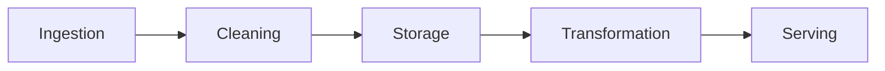
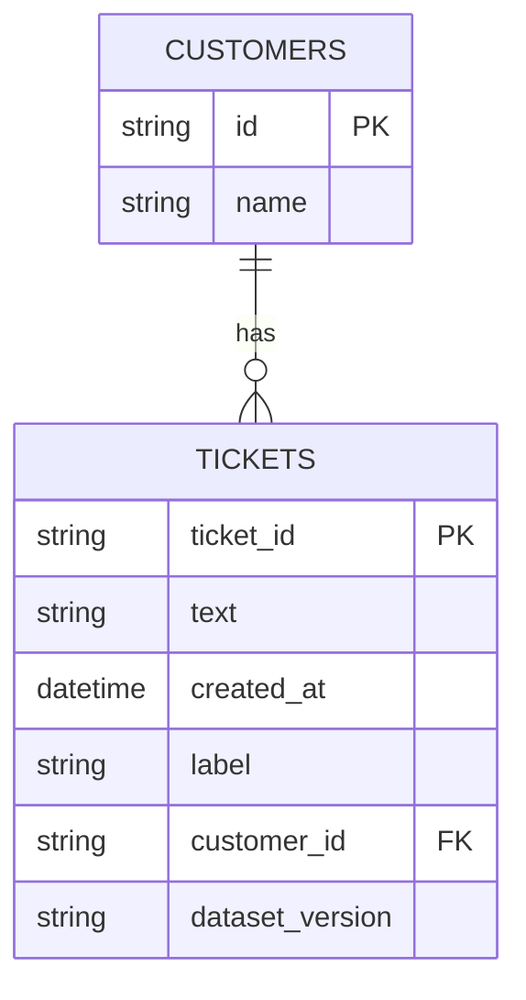

# AI Data Engineer: Hands-On Project Tutorials

This document turns every project in the **AI Data Engineer Foundations Course** into a step-by-step, hands-on tutorial. You learn each idea at the moment you need it, while building the thing.

Follow the projects in order. Each one hands off a skill or artifact to the next, ending in the Final Capstone.

---

## Project 1 (Module 1): Map a Data Pipeline for an AI Use Case

**Goal:** Before writing any code, learn to see data movement as a pipeline of stages, so every later project has a place to plug into.

**Step 1: Set up a project folder.**
```bash
mkdir data_pipeline_map_project
cd data_pipeline_map_project
```

**Step 2: Define the AI use case.**
```bash
nano use_case.md
```
Write one sentence: what AI application will consume this data, and what does it need to work? Example: "A customer support chatbot needs cleaned, labeled support tickets to fine-tune on."

**Step 3: Identify the data source.**
A **data source** is where raw data originates, a database, an API, uploaded files, or a stream of events.

**Step 4: List the five pipeline stages.**
- **Ingestion**: pulling raw data from the source.
- **Cleaning**: fixing or removing bad data.
- **Storage**: where cleaned data lives.
- **Transformation**: turning raw data into a form a model can use (labels, embeddings).
- **Serving**: how the AI application actually accesses the final data.

**Step 5: Sketch data volume and frequency.**
Estimate: how much data, and how often does new data arrive (once, daily, continuously)?

**Step 6: Note data quality risks.**
List: what could be wrong with this data? (duplicates, missing fields, inconsistent formats, mislabeled examples)

**Step 7: The pipeline.**
Data flows through five stages, left to right:



### Final Project Structure
```text
data_pipeline_map_project/
│
├── use_case.md
├── pipeline_diagram.png
```

### What You Learned
✅ Defining an AI use case's data requirements
✅ Identifying data sources
✅ The five stages of a data pipeline
✅ Estimating data volume and frequency
✅ Anticipating data quality risks
✅ Turning a use case into a pipeline diagram

### Portfolio Project
**AI Data Pipeline Architecture Map**: Translated an AI application's data requirements into a five-stage pipeline diagram covering ingestion, cleaning, storage, transformation, and serving.
**Skills:** Data Architecture, Systems Thinking, Technical Documentation, AI Data Engineering.

**Deliverable:** A one-page data pipeline map for your example AI use case, covering source, stages, volume, and quality risks.

---

## Project 2 (Module 2): Build a Data Cleaning Script

**Goal:** Get hands-on with real, messy data, the unavoidable first technical task in almost every AI data role.

**Step 1: Set up a project folder.**
```bash
mkdir data_cleaning_project
cd data_cleaning_project
pip install --break-system-packages pandas
```

**Step 2: Get a messy dataset.**
Download a real-world CSV with known issues (missing values, inconsistent casing, duplicate rows), or intentionally mess up a clean one for practice.

**Step 3: Load and inspect the data.**
```bash
nano clean_data.py
```
```python
import pandas as pd
df = pd.read_csv("raw_data.csv")
print(df.shape)
print(df.isnull().sum())
print(df.duplicated().sum())
```
`.isnull().sum()` counts missing values per column; `.duplicated().sum()` counts exact duplicate rows.

**Step 4: Handle missing values.**
```python
df = df.dropna(subset=["critical_column"])
df["optional_column"] = df["optional_column"].fillna("unknown")
```
**dropping** removes rows with missing data in columns you can't work without; **filling** replaces gaps in columns where a placeholder is acceptable.

**Step 5: Remove duplicates.**
```python
df = df.drop_duplicates()
```
Duplicate rows silently bias any model or statistic trained on this data toward whatever's overrepresented.

**Step 6: Standardize formats.**
```python
df["email"] = df["email"].str.lower().str.strip()
df["date_column"] = pd.to_datetime(df["date_column"], errors="coerce")
```
**standardizing** means forcing values into one consistent format (lowercase text, a single date format) so "Yes", "yes", and "YES" aren't treated as three different values.

**Step 7: Validate the cleaned result.**
```python
assert df.isnull().sum()["critical_column"] == 0
assert df.duplicated().sum() == 0
print("Cleaning validated.")
```
An **assertion** halts the script if a condition isn't met, a cheap, automatic sanity check.

**Step 8: Save the cleaned dataset.**
```python
df.to_csv("cleaned_data.csv", index=False)
```

### Final Project Structure
```text
data_cleaning_project/
│
├── raw_data.csv
├── clean_data.py
├── cleaned_data.csv
```

### What You Learned
✅ Diagnosing missing values and duplicates
✅ Deciding when to drop vs. fill missing data
✅ Removing duplicate rows
✅ Standardizing inconsistent formats
✅ Validating cleaning results with assertions
✅ Saving a cleaned dataset for downstream use

### Portfolio Project
**Data Cleaning Pipeline Script**: Built a reusable Python script that diagnoses, cleans, standardizes, and validates a messy real-world dataset, producing a verified clean output file.
**Skills:** Python, Pandas, Data Cleaning, Data Quality, AI Data Engineering.

**Deliverable:** A data cleaning script and a validated, cleaned CSV file.

---

## Project 3 (Module 3): Design a Schema for a Training Dataset Store

**Goal:** Decide how cleaned data should be structured and stored, the step between "I have clean data" and "a model can reliably use this data."

**Step 1: Set up a project folder.**
```bash
mkdir schema_design_project
cd schema_design_project
```

**Step 2: Identify your entities.**
An **entity** is a distinct "thing" your data describes, e.g., for a support-ticket dataset: `tickets`, `customers`, `labels`.

**Step 3: Define fields for each entity.**
```bash
nano schema.md
```
For each entity, list its fields and types: `ticket_id (string), text (string), created_at (datetime), label (string)`.

**Step 4: Define relationships between entities.**
A **foreign key** is a field in one table that references the identifier of another (e.g., `tickets.customer_id` points to `customers.id`).

**Step 5: Add versioning fields.**
Add `dataset_version` and `created_at` fields to your core table.
**dataset versioning** means every row (or dataset snapshot) can be traced to exactly when and how it was produced.

**Step 6: Write the schema as SQL.**
```sql
CREATE TABLE tickets (
    ticket_id TEXT PRIMARY KEY,
    text TEXT NOT NULL,
    created_at TIMESTAMP,
    label TEXT,
    dataset_version TEXT
);
```
`PRIMARY KEY` uniquely identifies each row; `NOT NULL` enforces that a field can't be left empty.

**Step 7: The schema.**
Your tables and their foreign-key relationship look like this:



### Final Project Structure
```text
schema_design_project/
│
├── schema.md
├── schema.sql
├── schema_diagram.png
```

### What You Learned
✅ Identifying entities in a dataset
✅ Defining fields and types
✅ Modeling relationships with foreign keys
✅ Adding dataset versioning for traceability
✅ Writing schema as executable SQL
✅ Diagramming a data model

### Portfolio Project
**Training Dataset Schema Design**: Designed a versioned, relational schema for a training dataset store, including entity relationships and executable SQL table definitions.
**Skills:** Database Design, SQL, Data Modeling, AI Data Engineering.

**Deliverable:** A schema document, SQL table definitions, and a diagram for your training dataset store.

---

## Project 4 (Module 4): Build a Batch ETL Pipeline

**Goal:** Automate the move from raw data to stored data, connecting Project 2's cleaning and Project 3's schema into a repeatable process.

**Step 1: Set up a project folder.**
```bash
mkdir etl_pipeline_project
cd etl_pipeline_project
pip install --break-system-packages pandas sqlalchemy
```

**Step 2: Understand ETL.**
**ETL** stands for **Extract** (pull raw data from a source), **Transform** (clean and reshape it), **Load** (write it into storage). **ELT** does the same steps in a different order, transforming after loading.

**Step 3: Write the Extract step.**
```bash
nano etl.py
```
```python
import pandas as pd

def extract(path):
    return pd.read_csv(path)
```

**Step 4: Write the Transform step.**
```python
def transform(df):
    df = df.dropna(subset=["text"])
    df = df.drop_duplicates()
    df["text"] = df["text"].str.strip()
    return df
```

**Step 5: Write the Load step.**
```python
from sqlalchemy import create_engine

def load(df, table_name, engine):
    df.to_sql(table_name, engine, if_exists="append", index=False)
```
`if_exists="append"` adds new rows without erasing existing ones, critical for a pipeline that runs repeatedly on new data.

**Step 6: Wire the three stages together.**
```python
def run_pipeline(path, table_name, engine):
    df = extract(path)
    df = transform(df)
    load(df, table_name, engine)
    print(f"Loaded {len(df)} rows into {table_name}")

engine = create_engine("sqlite:///data_store.db")
run_pipeline("raw_data.csv", "tickets", engine)
```

**Step 7: Test with a second batch of data.**
Run the pipeline again with a new file representing "tomorrow's data."

**Step 8: Add basic logging.**
```python
import logging
logging.basicConfig(level=logging.INFO)
logging.info(f"Pipeline run completed: {len(df)} rows loaded.")
```

### Final Project Structure
```text
etl_pipeline_project/
│
├── etl.py
├── raw_data.csv
├── data_store.db
├── pipeline.log
```

### What You Learned
✅ The Extract, Transform, Load pattern
✅ Isolating pipeline stages into reusable functions
✅ Writing to a database with SQLAlchemy
✅ Appending vs. replacing data safely
✅ Testing pipeline repeatability across multiple runs
✅ Adding basic pipeline logging

### Portfolio Project
**Batch ETL Pipeline**: Built a reusable Extract-Transform-Load pipeline that ingests raw CSV data, applies cleaning logic, and loads it into a structured database, tested across multiple repeated runs.
**Skills:** Python, SQL, ETL/ELT, SQLAlchemy, Data Pipelines, AI Data Engineering.

**Deliverable:** A working ETL pipeline script that repeatably processes new data into a structured store.

---

## Project 5 (Module 5): Prepare a Labeled Dataset for Training

**Goal:** Take cleaned, stored data (Project 4's output) and turn it into something a model can actually be trained on.

**Step 1: Set up a project folder.**
```bash
mkdir labeled_dataset_project
cd labeled_dataset_project
```

**Step 2: Load your Project 4 pipeline's output.**
```python
import pandas as pd
df = pd.read_csv("cleaned_data.csv")  # or read from your Project 4 database
```

**Step 3: Define labeling criteria.**
```bash
nano labeling_guide.md
```
Write clear rules for what each label means, with 2–3 examples per label.

**Step 4: Apply labels.**
For a small dataset, label manually using your guide; for a larger one, use an existing labeled column or a simple rule-based heuristic as a starting point.
```python
df["label"] = df["category"].map({"billing": "billing_issue", "bug": "technical_issue"})
```

**Step 5: Check label distribution.**
```python
df["label"].value_counts()
```
**class imbalance** here means some labels have far fewer examples than others.

**Step 6: Split into train, validation, and test sets.**
```python
from sklearn.model_selection import train_test_split
train, temp = train_test_split(df, test_size=0.3, random_state=42, stratify=df["label"])
val, test = train_test_split(temp, test_size=0.5, random_state=42, stratify=temp["label"])
```
`stratify` ensures each split has roughly the same label distribution as the full dataset. A **validation set** is used during model development; a **test set** is held back until final evaluation only.

**Step 7: Check for data leakage.**
**data leakage** happens when information from the test set (or future data) accidentally influences training, e.g., duplicate rows across splits, or a feature that encodes the label indirectly.
```python
overlap = set(train["ticket_id"]) & set(test["ticket_id"])
assert len(overlap) == 0, "Leakage detected between train and test sets!"
```

**Step 8: Save the final labeled splits.**
```python
train.to_csv("train.csv", index=False)
val.to_csv("val.csv", index=False)
test.to_csv("test.csv", index=False)
```

### Final Project Structure
```text
labeled_dataset_project/
│
├── labeling_guide.md
├── prepare_labels.py
├── train.csv
├── val.csv
├── test.csv
```

### What You Learned
✅ Writing clear labeling criteria
✅ Applying labels consistently
✅ Detecting class imbalance in labeled data
✅ Splitting data into train/validation/test with stratification
✅ Detecting and preventing data leakage
✅ Producing model-ready labeled datasets

### Portfolio Project
**Labeled Training Dataset Preparation**: Defined labeling criteria, applied labels to a cleaned dataset, checked for class imbalance and data leakage, and produced stratified train/validation/test splits.
**Skills:** Data Labeling, Scikit-learn, Data Quality, ML Data Preparation, AI Data Engineering.

**Deliverable:** A labeling guide plus stratified, leakage-checked train/validation/test CSV files.

---

## Project 6 (Module 6): Build a Vector Store from a Document Set

**Goal:** Extend your data engineering skills to unstructured text and the retrieval systems behind modern AI applications like RAG chatbots.

**Step 1: Set up a project folder.**
```bash
mkdir vector_store_project
cd vector_store_project
pip install --break-system-packages sentence-transformers chromadb
```

**Step 2: Gather a document set.**
Collect 10–20 text documents (articles, FAQs, or paragraphs) into a folder.

**Step 3: Chunk the documents.**
```bash
nano build_vector_store.py
```
```python
def chunk_text(text, chunk_size=200, overlap=50):
    words = text.split()
    chunks = []
    for i in range(0, len(words), chunk_size - overlap):
        chunks.append(" ".join(words[i:i + chunk_size]))
    return chunks
```
**chunking** splits long documents into smaller pieces; **overlap** repeats a few words between chunks so context isn't lost at the boundary.

**Step 4: Generate embeddings for each chunk.**
```python
from sentence_transformers import SentenceTransformer
model = SentenceTransformer("all-MiniLM-L6-v2")
embeddings = model.encode(chunks)
```
An **embedding** is a list of numbers representing a chunk's meaning, texts with similar meaning end up with mathematically similar embeddings.

**Step 5: Store embeddings in a vector database.**
```python
import chromadb
client = chromadb.Client()
collection = client.create_collection("documents")

collection.add(
    documents=chunks,
    embeddings=embeddings.tolist(),
    ids=[f"chunk_{i}" for i in range(len(chunks))]
)
```
A **vector database** stores embeddings and is optimized to quickly find the closest matches to a new query embedding.

**Step 6: Query the vector store.**
```python
query = "How do I reset my password?"
query_embedding = model.encode([query])
results = collection.query(query_embeddings=query_embedding.tolist(), n_results=3)
print(results["documents"])
```

**Step 7: Evaluate retrieval quality.**
Try 5 different queries and manually judge whether the top results are actually relevant.

**Step 8: Document your chunking and embedding choices.**
```bash
nano vector_store_notes.md
```
Record chunk size, overlap, embedding model used, and your retrieval evaluation results.

### Final Project Structure
```text
vector_store_project/
│
├── documents/
├── build_vector_store.py
├── vector_store_notes.md
```

### What You Learned
✅ Chunking long text into retrievable pieces
✅ Generating embeddings for semantic meaning
✅ Storing and querying a vector database
✅ Retrieving results by meaning, not just keywords
✅ Evaluating retrieval quality manually
✅ Documenting chunking and embedding decisions

### Portfolio Project
**Document Vector Store for Semantic Search**: Built a chunking and embedding pipeline over a real document set, stored it in a vector database, and evaluated retrieval quality across multiple queries.
**Skills:** Embeddings, Vector Databases, RAG Foundations, Python, AI Data Engineering.

**Deliverable:** A working vector store built from a real document set, with a retrieval evaluation.

---

## Project 7 (Module 7): Build a Data Validation and Monitoring Check

**Goal:** Add quality control on top of your pipeline, so bad data gets caught automatically instead of silently poisoning downstream models.

**Step 1: Set up a project folder.**
```bash
mkdir data_validation_project
cd data_validation_project
```

**Step 2: Define validation rules from what you already know.**
```bash
nano validation_rules.md
```
Using your Project 3 schema and Project 2's cleaning checks, list rules: required fields, expected types, acceptable value ranges.

**Step 3: Implement schema validation.**
```bash
nano validate.py
```
```python
import pandas as pd

def validate_schema(df, required_columns):
    missing = set(required_columns) - set(df.columns)
    assert not missing, f"Missing columns: {missing}"
```

**Step 4: Implement value range checks.**
```python
def validate_ranges(df):
    assert df["created_at"].notnull().all(), "Nulls found in created_at"
    assert (df["label"].isin(["billing_issue", "technical_issue"])).all(), "Unexpected label values"
```

**Step 5: Understand data drift.**
**data drift** is when the statistical properties of incoming data change over time (e.g., average text length doubles, or a new label category starts appearing) even though the schema still technically validates.

**Step 6: Implement a simple drift check.**
```python
def check_drift(df, baseline_mean, baseline_std, column, threshold=3):
    current_mean = df[column].mean()
    z_score = abs(current_mean - baseline_mean) / baseline_std
    if z_score > threshold:
        print(f"WARNING: Possible drift detected in {column}")
```
This compares today's average against a saved baseline, a large deviation (measured in standard deviations) flags a possible shift.

**Step 7: Wire validation into your Project 4 pipeline.**
```python
def run_pipeline_with_validation(path, table_name, engine):
    df = extract(path)
    validate_schema(df, ["ticket_id", "text", "created_at", "label"])
    df = transform(df)
    validate_ranges(df)
    load(df, table_name, engine)
```

**Step 8: Test it against intentionally broken data.**
Create a deliberately bad CSV (missing column, invalid label) and confirm your pipeline stops with a clear error instead of silently loading bad data.

### Final Project Structure
```text
data_validation_project/
│
├── validation_rules.md
├── validate.py
├── broken_test_data.csv
```

### What You Learned
✅ Turning implicit assumptions into explicit validation rules
✅ Schema validation (required columns, types)
✅ Value range and category validation
✅ Understanding data drift vs. schema violations
✅ Implementing a simple statistical drift check
✅ Wiring validation into a real pipeline and testing it against bad data

### Portfolio Project
**Data Pipeline Validation & Monitoring**: Built and tested schema validation, value range checks, and a statistical drift detector, integrated directly into a working ETL pipeline.
**Skills:** Data Quality Engineering, Data Validation, Statistical Monitoring, Python, AI Data Engineering.

**Deliverable:** A validation module wired into your pipeline, tested against intentionally broken data.

---

## Final Capstone: Build an End-to-End Data Pipeline for an AI Application

**Goal:** Combine every project above into one working system, this is an integration exercise, not a new build.

**Step 1: Set up your capstone project folder.**
```bash
mkdir capstone_project
cd capstone_project
```
Copy in the final versions of your code from Projects 2–7.

**Step 2: Start from your Project 1 pipeline map.**
Confirm each stage (ingestion, cleaning, storage, transformation, serving) has a concrete implementation from the projects you've already built.

**Step 3: Wire ingestion and cleaning together (Projects 2 & 4).**
Confirm your ETL pipeline's Extract and Transform steps run cleanly on a fresh batch of data.

**Step 4: Load into your schema-designed store (Projects 3 & 4).**
Confirm the Load step writes into the structure you designed in Project 3.

**Step 5: Add validation (Project 7).**
Wire your validation and drift checks into the pipeline so bad data is caught automatically.

**Step 6: Produce labeled training data (Project 5).**
Run your labeling and splitting logic against the stored, validated data to produce final train/val/test files.

**Step 7: Index a document set for retrieval (Project 6).**
If your use case includes unstructured text, build the vector store as the pipeline's final "serving" stage.

**Step 8: Test the full pipeline end-to-end.**
Run it against a completely fresh batch of raw data and confirm it produces validated, labeled, and (if applicable) indexed output without manual intervention.

**Step 9: Write the final pipeline document.**
```bash
nano capstone_summary.md
```
Combine your Project 1 map, schema, validation rules, and final pipeline results into one write-up: what you built, how it handles new data, and how you'd know if it broke.

### Final Project Structure
```text
capstone_project/
│
├── use_case.md
├── pipeline_diagram.png
├── schema.sql
├── etl.py
├── validate.py
├── prepare_labels.py
├── build_vector_store.py
├── train.csv / val.csv / test.csv
├── capstone_summary.md
```

### What You Learned
✅ Connecting ingestion, cleaning, storage, and transformation into one pipeline
✅ Running validation and drift checks as part of a live pipeline
✅ Producing labeled, split, model-ready data from raw input
✅ Indexing unstructured data for retrieval
✅ Testing a full pipeline end-to-end on fresh data
✅ Documenting a complete data pipeline for a real audience

### Portfolio Project
**End-to-End AI Data Pipeline (Capstone)**: Designed and built a complete data pipeline for an AI application: automated ingestion and cleaning, a versioned schema-backed store, validation and drift monitoring, labeled training data preparation, and a document vector store for retrieval.
**Skills:** ETL, SQL, Data Validation, Data Labeling, Vector Databases, Python, AI Data Engineering.

**Deliverable:** A complete, tested, end-to-end data pipeline plus a written summary connecting it back to every project that built it.
