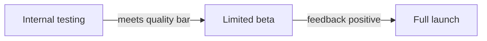

# AI Product Engineer: Hands-On Project Tutorials

This document turns every project in the **AI Product Engineer Foundations Course** into a step-by-step, hands-on tutorial. You learn each idea at the moment you need it, while building the thing.

Follow the projects in order. Each one hands off a skill or artifact to the next, ending in the Final Capstone.

---

## Project 1 (Module 1): Write an AI Product Brief

**Goal:** Frame a real problem in product terms before touching any code, the habit that separates a useful AI feature from a novelty.

**Step 1: Set up a project folder.**
```bash
mkdir ai_product_brief_project
cd ai_product_brief_project
```

**Step 2: Identify a real problem worth solving.**
An **AI-suited problem** is one with a pattern to learn from data, ambiguity that rules-based code can't handle, and enough volume to be worth automating (e.g., "summarize long support tickets," not "add two numbers").

**Step 3: Define the user.**
```bash
nano brief.md
```
Write one sentence: who experiences this problem, and how often?

**Step 4: State the problem in one sentence.**
A good problem statement follows the pattern "[user] struggles to [task] because [reason], which causes [consequence]."

**Step 5: Propose the AI-powered solution.**
Write 2-3 sentences describing what the feature would do, in plain language (no implementation details yet).

**Step 6: Define what success looks like.**
A **success metric** is a measurable signal that the feature is working (e.g., "support ticket resolution time drops by 20%"), different from a **vanity metric** (e.g., "users saw the feature").

**Step 7: Note constraints and risks.**
List: cost limits, data availability, privacy concerns, and what happens if the AI gets it wrong.

**Step 8: Assemble the final brief.**
Combine Steps 3–7 into one page: Problem → User → Solution → Success Metric → Constraints/Risks.

### Final Project Structure
```text
ai_product_brief_project/
│
├── brief.md
```

### What You Learned
✅ Identifying AI-suited problems
✅ Defining a specific target user
✅ Writing a clear problem statement
✅ Separating success metrics from vanity metrics
✅ Naming constraints and risks upfront
✅ Assembling a one-page product brief

### Portfolio Project
**AI Feature Product Brief**: Identified a real user problem, defined a target user and success metric, and wrote a one-page product brief proposing an AI-powered solution.
**Skills:** Product Thinking, Problem Framing, Technical Writing, AI Product Strategy.

**Deliverable:** A one-page AI product brief covering problem, user, proposed solution, success metric, and risks.

---

## Project 2 (Module 2): Build an AI-Powered Feature Prototype

**Goal:** Turn your Project 1 brief into a working piece of software for the first time.

**Step 1: Set up a project folder.**
```bash
mkdir ai_feature_prototype_project
cd ai_feature_prototype_project
```
Copy `brief.md` from Project 1 into this folder for reference.

**Step 2: Get access to an LLM API.**
An **API key** is a secret credential that authenticates your requests to a service, treat it like a password.

**Step 3: Make your first API call.**
```bash
nano prototype.py
```
```python
import requests

response = requests.post(
    "https://api.anthropic.com/v1/messages",
    headers={"x-api-key": "YOUR_KEY", "content-type": "application/json"},
    json={
        "model": "claude-sonnet-4-6",
        "max_tokens": 200,
        "messages": [{"role": "user", "content": "Summarize this in one sentence: ..."}]
    }
)
print(response.json())
```
**JSON** is the text format most APIs use to send and receive structured data, it's how your Python code and the AI service "speak" to each other.

**Step 4: Wire the API call to your Project 1 problem.**
Replace the placeholder prompt with real input related to your brief's problem (e.g., an actual support ticket if your feature summarizes tickets).

**Step 5: Add basic input handling.**
```python
def run_feature(user_input):
    # build the prompt using user_input, call the API, return the result
    ...
```
Wrapping your API call in a function makes it reusable instead of a one-off script.

**Step 6: Test with 3–5 realistic examples.**
Run your function against several different real-world inputs, not just one.

**Step 7: Note what worked and what didn't.**
```bash
nano prototype_notes.md
```
Write down cases where the output was wrong, confusing, or unhelpful.

### Final Project Structure
```text
ai_feature_prototype_project/
│
├── brief.md
├── prototype.py
├── prototype_notes.md
```

### What You Learned
✅ Authenticating with an API key
✅ Making a real LLM API call
✅ Working with JSON requests and responses
✅ Wrapping API calls in reusable functions
✅ Testing across multiple realistic inputs
✅ Documenting early failure patterns

### Portfolio Project
**AI Feature Prototype**: Built a working prototype calling a production LLM API, tested against realistic inputs from a real user problem, and documented initial failure patterns.
**Skills:** API Integration, Python, LLM APIs, Prototyping, AI Product Development.

**Deliverable:** A working AI-powered feature prototype, tested against 3–5 realistic inputs.

---

## Project 3 (Module 3): Prototype a Chatbot Feature Using an LLM API

**Goal:** Extend your prototype into a conversational feature, the most common AI product pattern.

**Step 1: Set up a project folder.**
```bash
mkdir chatbot_prototype_project
cd chatbot_prototype_project
```

**Step 2: Understand conversation history.**
LLM APIs are **stateless**: each call has no memory of previous ones. To simulate a "conversation," you resend the full **message history** with every request.

**Step 3: Build a message history list.**
```bash
nano chatbot.py
```
```python
history = [{"role": "system", "content": "You are a helpful assistant for [your use case]."}]

def chat(user_message):
    history.append({"role": "user", "content": user_message})
    # call the API with the full `history` list
    # append the assistant's reply back into `history`
    return reply
```
A **system prompt** sets the AI's role and behavior before the conversation starts.

**Step 4: Write a first version of your system prompt.**
Base it on your Project 1 brief: what should this assistant do, and what should it avoid?

**Step 5: Test a multi-turn conversation.**
Run 3–4 exchanges in a row, checking that the assistant's later replies make sense given earlier turns.

**Step 6: Add basic guardrails.**
A **guardrail** is a rule that keeps the AI within intended bounds (e.g., "refuse to answer off-topic questions").

**Step 7: Test edge cases.**
Try: an off-topic question, an ambiguous question, and an empty message.

### Final Project Structure
```text
chatbot_prototype_project/
│
├── chatbot.py
├── system_prompt.md
├── test_conversations.md
```

### What You Learned
✅ Why LLM APIs are stateless
✅ Building and maintaining message history
✅ Writing an effective system prompt
✅ Testing multi-turn conversations
✅ Adding basic guardrails
✅ Testing edge cases (off-topic, ambiguous, empty input)

### Portfolio Project
**AI Chatbot Feature Prototype**: Built a multi-turn conversational prototype using an LLM API, with a tailored system prompt, guardrails, and tested edge-case handling.
**Skills:** Conversational AI, Prompt Engineering, Python, LLM APIs, AI Product Development.

**Deliverable:** A working chatbot prototype tested across multi-turn conversations and edge cases.

---

## Project 4 (Module 4): Create a Feature Discovery Doc

**Goal:** Step back from building and validate the feature against real user needs before going further.

**Step 1: Set up a project folder.**
```bash
mkdir discovery_doc_project
cd discovery_doc_project
```

**Step 2: Write 5 user interview questions.**
Good discovery questions ask about *past behavior* ("tell me about the last time you..."), not hypotheticals ("would you use a feature that...").

**Step 3: Conduct (or simulate) 3–5 short interviews.**
```bash
nano interview_notes.md
```
If you don't have real users available, simulate this by asking peers who fit your Project 1 target user, or by researching how people currently solve this problem.

**Step 4: Show your Project 3 prototype and get reactions.**
Ask: does this solve the problem? What's missing? What's confusing?

**Step 5: Identify patterns across interviews.**
A **discovery insight** is a pattern repeated across multiple people, not a single person's opinion.

**Step 6: Revisit your Project 1 problem statement.**
Update it if discovery revealed the real problem is different from what you assumed.

**Step 7: Write the discovery summary.**
```bash
nano discovery_doc.md
```
Structure: Who you talked to → What you asked → Key insights → What changes for the feature.

### Final Project Structure
```text
discovery_doc_project/
│
├── interview_notes.md
├── discovery_doc.md
```

### What You Learned
✅ Writing behavior-based interview questions
✅ Conducting lightweight user discovery
✅ Getting reactions to a working prototype
✅ Identifying patterns across multiple data points
✅ Revising a problem statement based on evidence
✅ Writing a discovery summary doc

### Portfolio Project
**AI Feature Discovery Research**: Conducted user interviews and prototype testing sessions, synthesized findings into key insights, and used them to validate or redirect an AI feature's direction.
**Skills:** User Research, Product Discovery, Qualitative Analysis, Technical Writing.

**Deliverable:** A discovery doc summarizing interview insights and any resulting changes to the feature direction.

---

## Project 5 (Module 5): Design and Prototype an AI Feature Flow

**Goal:** Design the full user-facing interaction, not just the AI logic, but what the person actually sees and does.

**Step 1: Set up a project folder.**
```bash
mkdir feature_flow_project
cd feature_flow_project
```

**Step 2: Map the happy path.**
The **happy path** is the ideal sequence of steps when everything goes right, user opens the feature, provides input, gets a good result.

**Step 3: Design the input step.**
Sketch (on paper or in a simple tool) how the user provides input to your Project 3 chatbot or Project 2 feature.

**Step 4: Design the loading/waiting state.**
**latency masking** is showing the user something (a message, an animation) while the AI processes, instead of a frozen screen.

**Step 5: Design the error state.**
Sketch what the user sees when the API fails, times out, or returns something unusable.

**Step 6: Design the "AI might be wrong" state.**
**uncertainty UX** communicates confidence level or invites correction (e.g., "Was this helpful? [Yes/No]") instead of presenting AI output as unquestionable fact.

**Step 7: Build a clickable or written walkthrough of the full flow.**
Combine Steps 2–6 into one sequence, either as simple mockup screens or a written step-by-step description.

### Final Project Structure
```text
feature_flow_project/
│
├── flow_diagram.png (or flow_diagram.md)
├── screens/ (if using mockups)
```

### What You Learned
✅ Mapping a feature's happy path
✅ Designing input collection for AI features
✅ Masking latency during AI processing
✅ Designing error states for AI failures
✅ Designing for AI uncertainty (not presenting output as infallible)
✅ Assembling a full end-to-end interaction flow

### Portfolio Project
**AI Feature UX Flow**: Designed a complete user interaction flow for an AI-powered feature, including input design, latency handling, error states, and uncertainty communication.
**Skills:** UX Design, AI Product Design, Prototyping, User-Centered Design.

**Deliverable:** A designed and prototyped end-to-end flow for the AI feature, covering the happy path, loading, error, and uncertainty states.

---

## Project 6 (Module 6): Define an Evaluation Plan for the AI Feature

**Goal:** Decide, in advance, how you'll know if the feature is actually good, before it ships, not after complaints arrive.

**Step 1: Set up a project folder.**
```bash
mkdir evaluation_plan_project
cd evaluation_plan_project
```

**Step 2: Build a test set from your Project 2 notes.**
```bash
nano test_cases.md
```
Turn your documented failures and successes into a list of 10–15 concrete input/expected-output pairs.

**Step 3: Define a quality rubric.**
A **rubric** is a scoring guide (e.g., 1–5) for judging subjective AI output on specific dimensions like accuracy, tone, and helpfulness.

**Step 4: Score your Project 2/3 prototype against the test set.**
Run each test case through your prototype and score it using your rubric.

**Step 5: Distinguish quality metrics from business metrics.**
**quality metrics** measure whether the AI's output is good (accuracy, relevance); **business metrics** measure whether the feature achieves your Project 1 goal (ticket resolution time, user retention).

**Step 6: Design a feedback loop.**
A **feedback loop** is a mechanism (like a thumbs up/down button from Project 5) that captures real user signal after launch.

**Step 7: Write the evaluation plan.**
```bash
nano evaluation_plan.md
```
Structure: Test set → Rubric → Baseline scores → Quality vs. business metrics → Feedback loop plan.

### Final Project Structure
```text
evaluation_plan_project/
│
├── test_cases.md
├── rubric.md
├── baseline_scores.md
├── evaluation_plan.md
```

### What You Learned
✅ Building a test set from real observed failures
✅ Writing a scoring rubric for subjective AI output
✅ Establishing a baseline quality score
✅ Distinguishing quality metrics from business metrics
✅ Designing a post-launch feedback loop
✅ Assembling a full evaluation plan

### Portfolio Project
**AI Feature Evaluation Plan**: Built a test set and scoring rubric from observed prototype failures, established a baseline quality score, and designed a post-launch feedback loop.
**Skills:** AI Evaluation, Quality Assurance, Metrics Design, Analytical Thinking, AI Product Development.

**Deliverable:** A written evaluation plan with a test set, rubric, baseline scores, and feedback loop design.

---

## Project 7 (Module 7): Build a Launch Plan for the AI Feature

**Goal:** Package everything you've built into a plan for actually shipping the feature.

**Step 1: Set up a project folder.**
```bash
mkdir launch_plan_project
cd launch_plan_project
```

**Step 2: Define the launch scope.**
A **limited launch** (or beta) releases a feature to a small subset of users first, instead of everyone at once.

**Step 3: Set launch criteria.**
Using your Project 6 baseline scores, define the minimum quality bar the feature must hit before it launches even to a limited audience.

**Step 4: Plan the rollout stages.**
Roll the feature out in three stages, each gated by criteria before moving on:



**Step 5: Identify who needs to be involved.**
List roles: engineering (to build it), your Project 6 evaluation reviewer, and anyone who needs to sign off before wider release.

**Step 6: Plan post-launch monitoring.**
Reference your Project 6 feedback loop: what will you watch in the first week, and what would trigger a rollback?

**Step 7: Write the launch plan.**
```bash
nano launch_plan.md
```
Structure: Launch scope → Criteria to launch → Rollout stages → Stakeholders → Post-launch monitoring plan.

### Final Project Structure
```text
launch_plan_project/
│
├── launch_plan.md
```

### What You Learned
✅ Scoping a limited (beta) launch
✅ Setting measurable launch criteria
✅ Planning staged rollout
✅ Identifying required stakeholders
✅ Planning post-launch monitoring and rollback triggers
✅ Assembling a complete launch plan

### Portfolio Project
**AI Feature Launch Plan**: Defined launch criteria based on evaluation benchmarks, planned a staged rollout with stakeholder sign-offs, and designed post-launch monitoring with rollback triggers.
**Skills:** Product Launch Planning, Risk Management, Cross-Functional Coordination, AI Product Development.

**Deliverable:** A launch plan covering scope, criteria, rollout stages, stakeholders, and post-launch monitoring.

---

## Final Capstone: Take an AI Feature from Idea to Working Prototype

**Goal:** Combine every project above into one complete, presentable body of work, this is an integration exercise, not a new build.

**Step 1: Set up your capstone project folder.**
```bash
mkdir capstone_project
cd capstone_project
```
Copy in the final versions of your deliverables from Projects 1–7.

**Step 2: Revisit and finalize your Project 1 brief.**
Update it with anything learned in Project 4's discovery.

**Step 3: Finalize your working prototype (Projects 2 & 3).**
Clean up the code, fix any obvious bugs found during testing.

**Step 4: Attach your discovery insights (Project 4).**
Include a short summary of what you learned from real users and how it shaped the feature.

**Step 5: Attach your designed flow (Project 5).**
Include the happy path, error states, and uncertainty handling design.

**Step 6: Attach your evaluation plan and baseline scores (Project 6).**

**Step 7: Attach your launch plan (Project 7).**

**Step 8: Write the capstone summary.**
```bash
nano capstone_summary.md
```
One page: the problem, the solution, what you learned, how you'd know it's working, and how you'd launch it.

### Final Project Structure
```text
capstone_project/
│
├── brief.md
├── prototype.py
├── chatbot.py
├── discovery_doc.md
├── flow_diagram.png
├── evaluation_plan.md
├── launch_plan.md
├── capstone_summary.md
```

### What You Learned
✅ Carrying one feature idea through the full product lifecycle
✅ Integrating research, design, code, and evaluation into one story
✅ Writing a summary that communicates the whole project at a glance
✅ Presenting AI product work the way a real team would review it

### Portfolio Project
**AI Feature: Idea to Prototype (Capstone)**: Took an AI-powered feature from initial problem framing through user discovery, working prototype, UX design, evaluation planning, and launch readiness.
**Skills:** AI Product Management, Prompt Engineering, UX Design, Evaluation Design, Technical Writing, Cross-Functional Planning.

**Deliverable:** A complete, presentable capstone folder combining every artifact from Projects 1–7, with a one-page summary tying it all together.
