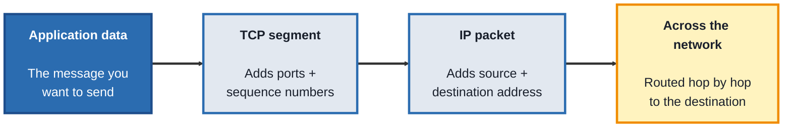
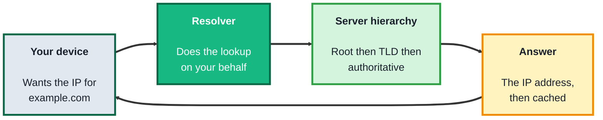
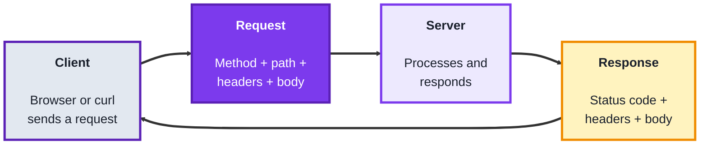
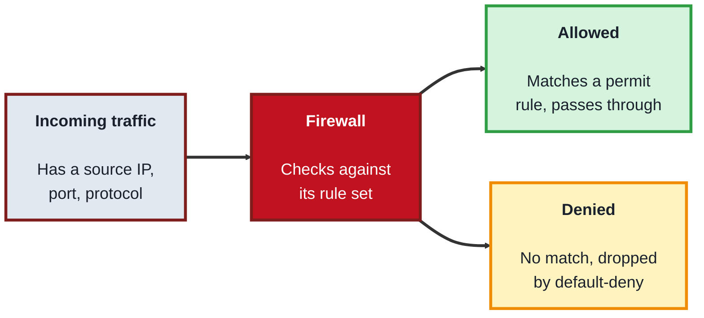

## Module 1: Networking Fundamentals

**Tools needed for this module:** a terminal (macOS Terminal, Linux shell, or Windows PowerShell), the built-in command-line utilities `ping`, `traceroute` (or `tracert` on Windows), `nslookup` and/or `dig`, and `curl`, plus a normal web browser. For the firewall topic you'll use `ufw` on Linux, or the built-in firewall settings on macOS/Windows. Wireshark is optional if you want to watch real packets, but nothing in this module requires it.

### Topic 1.1: TCP/IP

#### Concept

**TCP/IP** is the foundational set of protocols that lets any two devices on a network talk to each other, and it's organised in layers so that each layer only worries about one job. **IP** (Internet Protocol) handles addressing and routing, giving every device an address and getting a unit of data from source to destination across many hops. **TCP** (Transmission Control Protocol) sits on top of IP and adds reliability, it establishes a connection, numbers the data, confirms what arrived, and re-sends anything lost. For a security role this matters because most attacks and defences operate on these two layers, so you need to know exactly what each one guarantees and what it doesn't.

- An **IP address** identifies a device on a network (for example `192.168.1.10` in IPv4, or a longer IPv6 address)
- A **packet** is the unit of data IP moves around, wrapped with source and destination addresses
- **TCP** is connection-oriented and reliable, it opens a connection with a three-way handshake (SYN, SYN-ACK, ACK), acknowledges received data, and retransmits what's missing
- **UDP** is the connectionless alternative, faster but with no delivery guarantees, used for things like DNS lookups and video streaming
- A **port** is a number that identifies a specific service on a host (for example 80 for HTTP, 443 for HTTPS, 22 for SSH), so one machine can run many services at once

#### Structure at a Glance


- Each layer wraps the one above it, this is called encapsulation, and the receiving device unwraps it in reverse, TCP guarantees delivery is complete and in order while IP only guarantees an attempt to route
- The TCP three-way handshake is where many attacks live, a SYN flood abuses it by starting thousands of handshakes and never finishing them, exhausting the target's resources

#### Where you'd actually use this

Reading firewall logs, understanding a port scan, diagnosing why a service is unreachable, or recognising a SYN flood or spoofed-address attack, all of it starts with knowing how TCP and IP behave. Almost every other topic in security builds on this foundation.

#### Lab

1. **Test basic reachability** to a host using ICMP (a different protocol in the same family):
```bash
ping -c 4 example.com
```
2. **Trace the path** your packets take, hop by hop, to that host:
```bash
traceroute example.com
```
(On Windows, use `tracert example.com`.)

3. **Open a real TCP connection** to a web server on port 443 and confirm it succeeds:
```bash
curl -v https://example.com
```
Look at the first lines of output, you'll see the connection being established before any data is exchanged.

4. **List the listening ports** and active connections on your own machine:
```bash
ss -tuln
```
(On macOS use `netstat -an | grep LISTEN`; on Windows use `netstat -an`.)

5. **Identify one service and its port** from that output, and explain to yourself which protocol (TCP or UDP) it's using and why.

#### Checkpoint
You can send a packet to a remote host, trace the route it takes, open a real TCP connection, and list the ports your own machine is listening on, and you can explain the difference between what TCP guarantees and what IP guarantees.

#### Quiz
1. What job does IP do, and what job does TCP do on top of it?
2. What are the three steps of the TCP three-way handshake?
3. What is a port, and why does a single machine need them?
4. How does UDP differ from TCP, and name one thing UDP is used for?
5. How does a SYN flood abuse the TCP handshake?

*Answers: 1) IP handles addressing and routing, getting a packet from a source address to a destination address across the network; TCP sits on top and adds reliability, opening a connection, acknowledging received data, and retransmitting anything lost. 2) SYN, SYN-ACK, ACK. 3) A port is a number identifying a specific service on a host; a machine needs them so it can run many services (web, SSH, mail) at once and direct incoming traffic to the right one. 4) UDP is connectionless and gives no delivery guarantees, making it faster but unreliable; it's used for things like DNS lookups and video streaming. 5) It starts many TCP handshakes by sending SYN packets but never completes them with the final ACK, leaving half-open connections that exhaust the target's resources.*

---

### Topic 1.2: DNS

#### Concept

**DNS** (Domain Name System) is the network's address book, it translates human-readable names like `example.com` into the IP addresses that TCP/IP actually needs to route traffic. Rather than one giant list, DNS is a hierarchy of servers that each know a piece of the answer, and a **resolver** walks that hierarchy on your behalf. For a security role DNS matters twice over, it's a common thing attackers try to tamper with (redirecting a name to a server you control), and its query logs are one of the richest sources of evidence about what a device was trying to reach.

- A **resolver** is the service (usually run by your ISP or a provider like `1.1.1.1`) that does the lookup work and returns a final answer
- The hierarchy runs **root servers**, then **TLD servers** (for `.com`, `.org`, and so on), then the **authoritative server** that actually holds the record for a specific domain
- **Records** are the data DNS returns, an **A** record maps a name to an IPv4 address, **AAAA** to IPv6, **CNAME** to another name, **MX** to a mail server, **TXT** to arbitrary text (often used for verification)
- **Caching** and **TTL** (time to live) mean a resolver stores an answer for a set number of seconds before asking again, which is fast but is also why a poisoned or stale record can linger

#### Structure at a Glance


- Because the resolver trusts the answer it gets back, **DNS cache poisoning** and **spoofing** attacks try to inject a false record so that a legitimate name points to a malicious IP, this is why **DNSSEC** was introduced to cryptographically sign records
- The same query path that resolves a name is also a logging goldmine, monitoring DNS requests can reveal malware phoning home to a command-and-control domain long before anything else does

#### Where you'd actually use this

Investigating where a suspicious domain actually points, spotting a device querying a known-malicious domain, understanding a phishing site's setup, or diagnosing why a service is unreachable when the network itself is fine. DNS is often the first thing you check and the first thing an attacker tries to abuse.

#### Lab

1. **Look up the A record** for a domain, the basic name-to-IP translation:
```bash
nslookup example.com
```
2. **Query a specific record type** using `dig`, which gives more detail:
```bash
dig example.com A
dig example.com MX
dig example.com TXT
```
3. **Watch the full resolution walk the hierarchy** from the root down:
```bash
dig +trace example.com
```
Read the output top to bottom, you'll see it go root, then TLD, then authoritative.

4. **Query a specific public resolver directly** and compare the answer:
```bash
dig @1.1.1.1 example.com
```
5. **Find the TTL** on a record (the number before the record type in `dig` output) and explain what it means for how long that answer will be cached.

#### Checkpoint
You can resolve a name to an IP, query several different record types, watch a full recursive lookup walk the server hierarchy, and read a TTL, and you can explain why DNS is both a common attack target and a valuable source of evidence.

#### Quiz
1. What does DNS translate, and why is that translation needed for TCP/IP to work?
2. Name the three tiers of the DNS server hierarchy in the order a lookup reaches them.
3. What is the difference between an A record and an MX record?
4. What does TTL control, and why does it matter for security?
5. What is DNS cache poisoning, and what was DNSSEC introduced to defend against?

*Answers: 1) It translates human-readable domain names into IP addresses; TCP/IP routes by IP address, so a name has to be resolved to an address before any connection can be made. 2) Root servers, then TLD servers (for .com, .org, and so on), then the authoritative server for the specific domain. 3) An A record maps a name to an IPv4 address; an MX record points to the mail server responsible for a domain. 4) TTL sets how many seconds a resolver caches an answer before asking again; it matters because a poisoned or stale record can persist in caches for as long as the TTL allows. 5) Cache poisoning injects a false record into a resolver so a legitimate name points to a malicious IP; DNSSEC was introduced to cryptographically sign records so forged answers can be detected.*

---

### Topic 1.3: HTTP

#### Concept

**HTTP** (HyperText Transfer Protocol) is the application-layer protocol the web runs on, and it works as a simple request-and-response exchange, your client sends a request, the server sends a response, and the connection is otherwise **stateless** (the server doesn't inherently remember you between requests). Every request carries a **method** saying what you want to do, and every response carries a **status code** saying what happened, along with **headers** full of metadata. For a security role, HTTP is where a huge share of real-world attacks and defences play out, so reading a raw request and response by eye is a core skill.

- A **request** has a method, a path, headers, and sometimes a body; a **response** has a status code, headers, and usually a body
- A **method** states the intent, `GET` retrieves, `POST` submits data, `PUT` updates, `DELETE` removes
- A **status code** reports the outcome, `2xx` success, `3xx` redirect, `4xx` client error (like `404` not found or `403` forbidden), `5xx` server error
- **Headers** carry metadata such as content type, cookies, authentication tokens, and security headers, and because they're plain text in HTTP, anyone in the path can read them
- **HTTPS** is HTTP wrapped in **TLS** encryption, which protects the request and response from being read or altered in transit, which is why plain HTTP is now treated as unsafe

#### Structure at a Glance


- Because plain HTTP is unencrypted text, anyone positioned in the network path can read or modify it, a **man-in-the-middle** attack, which is exactly what TLS (HTTPS) is designed to prevent
- Security-relevant behaviour lives in the headers, things like `Set-Cookie`, `Authorization`, and defensive headers such as `Content-Security-Policy` and `Strict-Transport-Security`, so reading headers is a routine part of assessing a web app

#### Where you'd actually use this

Inspecting what a web app actually sends and receives, spotting a missing security header, understanding how a session cookie or auth token travels, testing an API, or recognising why a site served over plain HTTP is a risk. Nearly all web security work involves reading and reasoning about HTTP traffic.

#### Lab

1. **Send a request and see the full exchange**, headers and all, with `curl`'s verbose mode:
```bash
curl -v https://example.com
```
Read the lines starting with `>` (your request) and `<` (the server's response).

2. **Fetch only the response headers** to inspect metadata without the page body:
```bash
curl -I https://example.com
```
3. **Trigger different status codes** and observe them:
```bash
curl -I https://example.com/thispagedoesnotexist
```
Note the `4xx` code you get back.

4. **Send a POST request** with data and watch how it differs from a GET:
```bash
curl -X POST -d "name=test" https://httpbin.org/post
```
5. **Compare plain HTTP against HTTPS** by requesting both (where available) and noting that only one protects the data in transit. Then, in your browser's developer tools, open the Network tab, reload a page, and click one request to inspect its real method, status, and headers.

#### Checkpoint
You can send GET and POST requests by hand, read a full request and response including headers, trigger and identify different status codes, and explain what HTTPS adds over plain HTTP and why that matters.

#### Quiz
1. What is the basic request-and-response cycle in HTTP, and what does "stateless" mean here?
2. Name three HTTP methods and what each one is for.
3. What do the `2xx`, `4xx`, and `5xx` ranges of status codes mean?
4. Why is plain HTTP considered unsafe, and what does HTTPS add?
5. Name one security-relevant HTTP header and what it does.

*Answers: 1) The client sends a request and the server sends back a response; stateless means the server doesn't inherently remember the client between separate requests. 2) For example: GET retrieves a resource, POST submits data, DELETE removes a resource (PUT, which updates, is also acceptable). 3) 2xx means success, 4xx means a client-side error such as 404 not found or 403 forbidden, and 5xx means a server-side error. 4) Plain HTTP sends everything as readable text, so anyone in the network path can read or alter it in a man-in-the-middle attack; HTTPS wraps HTTP in TLS encryption to protect the data in transit. 5) For example: Set-Cookie carries a session cookie, Authorization carries an auth token, Content-Security-Policy restricts what content can load to limit injection attacks, or Strict-Transport-Security forces future connections to use HTTPS.*

---

### Topic 1.4: Firewalls

#### Concept

A **firewall** is the gatekeeper that decides which network traffic is allowed through and which is blocked, based on a set of **rules**. It examines traffic by criteria like source and destination IP, port, and protocol, and either permits or drops it. The most important principle is **default-deny**, block everything that isn't explicitly allowed, so that a service is only reachable when you've made a deliberate decision to expose it. This is the topic where the previous three come together, because a firewall rule is written in exactly the terms you've just learned: addresses, ports, and protocols.

- A **rule** allows or denies traffic based on criteria such as source/destination IP, port, and protocol (TCP or UDP)
- **Stateful inspection** means the firewall tracks the state of active connections, so it can allow return traffic for a connection you started without needing a separate rule for it
- **Default-deny** is the safe baseline, everything is blocked unless a rule explicitly permits it, which limits your attack surface to only what you've intentionally opened
- **Ingress** filtering controls traffic coming in, **egress** filtering controls traffic going out, egress rules matter because they can stop compromised machines from phoning home

#### Structure at a Glance


- Firewalls come in tiers, a **packet-filtering** firewall checks each packet's headers in isolation, a **stateful** firewall tracks whole connections, and an **application-layer** firewall or **WAF** (web application firewall) inspects the actual HTTP content to block things like injection attacks
- The order of rules matters, most firewalls evaluate rules top to bottom and stop at the first match, so a broad allow rule placed above a specific deny rule can accidentally undo the deny

#### Where you'd actually use this

Locking down a server so only the ports it needs are reachable, segmenting a network so a breach in one area can't spread, blocking known-bad addresses, and controlling outbound traffic so a compromised host can't exfiltrate data. Firewall configuration is one of the most direct, everyday defensive controls in a security role.

#### Lab

> Do this on a machine you have direct (non-remote) access to, or be careful not to lock yourself out. If you're on a remote server over SSH, always allow the SSH port **before** enabling the firewall.

1. **Check the current firewall status** (Linux, using `ufw`):
```bash
sudo ufw status verbose
```
2. **Set a default-deny baseline** for incoming traffic while allowing your own outbound traffic:
```bash
sudo ufw default deny incoming
sudo ufw default allow outgoing
```
3. **Explicitly allow one service** you actually need, for example SSH on port 22:
```bash
sudo ufw allow 22/tcp
```
4. **Enable the firewall and re-check the rules:**
```bash
sudo ufw enable
sudo ufw status numbered
```
5. **Add and then delete a rule** to see how rule management works, for example allow then remove HTTP on port 80:
```bash
sudo ufw allow 80/tcp
sudo ufw status numbered
sudo ufw delete allow 80/tcp
```
(On macOS or Windows, open the built-in firewall settings and confirm you can see the same ideas: a default policy plus specific allow rules per app or port.)

#### Checkpoint
You have configured a firewall with a default-deny baseline, explicitly allowed only the services you need, and added and removed a rule, and you can explain default-deny, stateful inspection, and the difference between ingress and egress filtering.

#### Quiz
1. What criteria does a firewall rule typically use to allow or deny traffic?
2. What does "default-deny" mean, and why is it the safer baseline?
3. What does stateful inspection let a firewall do that packet-filtering alone does not?
4. What is the difference between ingress and egress filtering, and why does egress matter for security?
5. Why does the order of firewall rules matter?

*Answers: 1) Criteria such as source and destination IP address, port, and protocol (TCP or UDP). 2) Default-deny blocks all traffic that isn't explicitly permitted by a rule; it's safer because it limits the attack surface to only what you've deliberately chosen to open, rather than trying to block threats one by one. 3) Stateful inspection tracks the state of active connections, so it can automatically allow the return traffic for a connection you initiated without needing a separate rule; packet-filtering examines each packet in isolation without that context. 4) Ingress filtering controls inbound traffic while egress filtering controls outbound traffic; egress matters because it can stop a compromised machine from sending data out or phoning home to an attacker's server. 5) Most firewalls evaluate rules top to bottom and act on the first match, so a broad allow rule placed above a specific deny rule can unintentionally override it.*

---

## Module 1 Completion Checklist
- [ ] Sent a packet, traced its route, opened a real TCP connection, and listed the ports your machine is listening on
- [ ] Resolved a name with DNS, queried multiple record types, and watched a full lookup walk the server hierarchy
- [ ] Sent GET and POST requests by hand, read raw requests and responses including headers, and identified different status codes
- [ ] Configured a firewall with a default-deny baseline and explicit allow rules, and added and removed a rule
- [ ] Can explain how TCP/IP, DNS, and HTTP each work, and how a firewall rule is written in the same terms (addresses, ports, protocols)
- [ ] Can name, for each topic, at least one way an attacker abuses it and one way a defender protects against that
