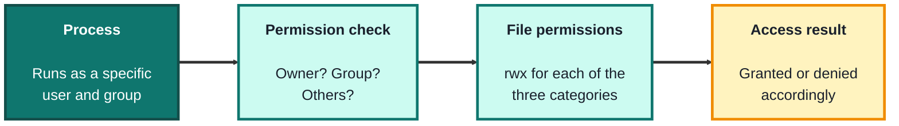
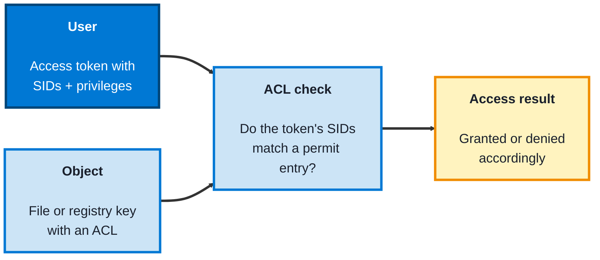

## Module 2: Operating Systems

**Tools needed for this module:** for the Linux topic, access to a Linux command line, this can be a real Linux machine, a virtual machine, WSL (Windows Subsystem for Linux), or a free cloud shell. For the Windows topic, a Windows machine with **PowerShell** and the built-in Command Prompt, plus the Event Viewer app that ships with Windows. Everything here uses tools already present on each system, nothing needs to be installed.

### Topic 2.1: Linux

#### Concept

**Linux** runs the majority of the world's servers and nearly all security tooling, so for a security role it is the environment you'll spend the most time defending and investigating. Its security model rests on a simple, strict idea: every process runs as a **user**, and what that user can touch is decided by **file permissions**. Learn how users, permissions, and privilege work, and you can both harden a system and read the traces an attacker leaves behind. The guiding principle throughout is **least privilege**, give any user or process only the access it genuinely needs, and nothing more.

- **Users and groups** define identity, every file and process has an owning user and group, and **root** is the all-powerful superuser
- **File permissions** are the core control, each file has read (`r`), write (`w`), and execute (`x`) permissions set separately for its owner, its group, and everyone else, managed with `chmod` and `chown`
- **sudo** grants controlled, temporary privilege escalation, so a normal user can run one command as root without logging in as root, which is safer than being root all the time
- **Processes** are running programs, each owned by a user, inspected with `ps` and `top` and stopped with `kill`
- **Logs** in `/var/log` (especially `auth.log` or the `journal`) record logins, `sudo` use, and system events, making them a primary source of evidence during an investigation

#### Structure at a Glance


- Permission misconfigurations are one of the largest attack surfaces on Linux, world-writable files, over-permissive directories, and stray **SUID** binaries (files that run with their owner's privileges, often root) are classic ways an attacker escalates from a normal user to root
- Running services as root by default is a common mistake, if a service running as root is compromised, the attacker inherits root, so least privilege means running each service as its own limited user

#### Where you'd actually use this

Hardening a server by tightening permissions and removing unneeded SUID binaries, investigating a break-in by reading `/var/log/auth.log`, spotting a process running as the wrong user, or confirming that a service isn't running as root when it doesn't need to be. Almost every server-side security task happens on the Linux command line.

#### Lab

1. **Find out who you are** and which groups you belong to:
```bash
whoami
id
```
2. **Read the permissions** on files in a directory, and learn to interpret the `rwx` triads:
```bash
ls -l
```
3. **Create a file, then change its permissions** and watch the change:
```bash
touch testfile
chmod 600 testfile
ls -l testfile
```
(`600` means owner can read and write, group and others get nothing.)

4. **Hunt for risky files**, SUID binaries and world-writable files, the way an attacker or auditor would:
```bash
find / -perm -4000 -type f 2>/dev/null
find / -perm -0002 -type f 2>/dev/null
```
5. **Run one command with elevated privilege** and then review the log entry it creates:
```bash
sudo id
sudo tail /var/log/auth.log
```
(On systems without `auth.log`, use `sudo journalctl -e` instead.)

#### Checkpoint
You can identify your user and groups, read and change file permissions, search a system for SUID and world-writable files, and use `sudo` to run a single command with elevated privilege, and you can explain why least privilege and not running services as root matter.

#### Quiz
1. In `ls -l` output, the permission string is split into three groups of `rwx`. Which three categories do they apply to?
2. What is the difference between logging in as root and using `sudo`, and why is `sudo` safer?
3. What does a SUID binary do, and why is it a security concern?
4. What does the principle of least privilege mean in the context of running a service?
5. Which log file (or facility) would you check to see recent logins and `sudo` use, and why does it matter?

*Answers: 1) The file's owner, the file's group, and all other users (owner, group, others). 2) Logging in as root means every action runs with full privilege the whole time; sudo grants elevated privilege for a single command by a normal user, so most of the time you operate with limited rights, reducing the damage from a mistake or a compromise. 3) A SUID binary runs with the privileges of its owner (often root) rather than the user who launched it; if such a binary is misconfigured or exploitable, an ordinary user can use it to escalate to root. 4) Giving a service only the permissions and account access it actually needs, for example running it as a dedicated limited user rather than root, so a compromise of that service doesn't hand the attacker full control. 5) /var/log/auth.log (or the journal via journalctl); it records logins and sudo activity, which is key evidence when investigating unauthorised access.*

---

### Topic 2.2: Windows Security

#### Concept

**Windows** is the dominant operating system on enterprise desktops and laptops, which makes it the single biggest endpoint attack target, so knowing how its security model works is essential for defending real organisations. Windows controls access through **security identifiers** and **access control lists** rather than the simpler owner/group/other model of Linux, and it layers on **User Account Control** to gate privilege, **Windows Defender** for built-in protection, and a rich **event log** for investigation. As on Linux, the safest posture is least privilege: standard users for everyday work, administrator rights only when a task truly needs them.

- Every account and group has a **SID** (security identifier), a unique value Windows uses internally instead of the name, and a user's **access token** carries their SIDs and privileges
- **Access Control Lists (ACLs)** are attached to objects like files and registry keys, listing exactly which accounts get which rights, inspected and edited with `icacls`
- **User Account Control (UAC)** prompts for confirmation before an action uses administrator privileges, keeping users in a standard context until elevation is genuinely needed
- The **Registry** is Windows' hierarchical configuration database, and its "Run" keys are a favourite place for malware to install **persistence** so it relaunches at every login
- **Windows Defender** is the built-in antivirus and endpoint protection, and the **Security event log** (viewed in Event Viewer) records logons and other security events, for example event ID `4624` for a successful logon and `4625` for a failed one

#### Structure at a Glance


- Because so many users historically run as local administrator, a single click on malicious software can compromise the whole machine, this is exactly why UAC and standard-user accounts exist, and why reducing admin rights is one of the highest-impact defensive changes
- The Registry's autostart locations (the Run keys) are a standard persistence mechanism, so knowing where they are lets you both spot malware clinging on and clean it out

#### Where you'd actually use this

Investigating a possibly compromised laptop by reading its Security event log, checking file or registry permissions with `icacls`, confirming Defender is active and up to date, hunting for malware persistence in the registry Run keys, and reducing users from administrator to standard accounts to shrink the attack surface. This is the core of endpoint security work in most organisations.

#### Lab

> Run these in PowerShell or Command Prompt on a Windows machine. Some commands (like reading the Security log) may need an administrator PowerShell window.

1. **Inspect your own account**, its SID, groups, and privileges:
```powershell
whoami /all
```
2. **List local users and the administrators group** to see who has elevated rights:
```powershell
Get-LocalUser
Get-LocalGroup Administrators | Get-LocalGroupMember
```
3. **Read the permissions (ACL) on a file** to see which accounts have which rights:
```powershell
icacls C:\Windows\System32\drivers\etc\hosts
```
4. **Check Windows Defender's status** to confirm real-time protection is on and definitions are current:
```powershell
Get-MpComputerStatus
```
5. **Look at recent logon events and a common persistence location:**
```powershell
Get-WinEvent -LogName Security -MaxEvents 20
reg query "HKCU\Software\Microsoft\Windows\CurrentVersion\Run"
```
(You can also open **Event Viewer**, go to Windows Logs then Security, and filter for event IDs `4624` and `4625`.)

#### Checkpoint
You can read your own token and privileges, list which accounts have administrator rights, inspect a file's ACL, confirm Defender is running, and view logon events and a registry autostart key, and you can explain why least privilege, UAC, and monitoring the Security log matter on Windows.

#### Quiz
1. What is a SID, and what does an access token carry?
2. How does Windows decide whether a user can access a file or registry key?
3. What is UAC, and what problem does it help with?
4. Why are the registry "Run" keys relevant to a security investigation?
5. Which event IDs indicate a successful and a failed logon in the Security log, and why would you look at them?

*Answers: 1) A SID (security identifier) is a unique value Windows uses to represent an account or group internally instead of its name; an access token carries the user's SIDs and their privileges. 2) It checks the object's ACL (access control list) to see whether any SID in the user's access token matches an entry that permits the requested access. 3) User Account Control prompts for confirmation before an action uses administrator privileges, keeping users in a standard, limited context until elevation is genuinely needed, which limits the damage a careless click or malware can do. 4) The Run keys are autostart locations that make a program launch at login, so malware commonly writes there for persistence; checking them helps you spot and remove that persistence. 5) Event ID 4624 is a successful logon and 4625 is a failed one; reviewing them helps detect unauthorised access attempts, such as a burst of 4625 failures indicating a brute-force attempt.*

---

## Module 2 Completion Checklist
- [ ] Identified your user and groups on Linux, read and changed file permissions, and searched for SUID and world-writable files
- [ ] Used `sudo` to run a command with elevated privilege and reviewed the resulting log entry
- [ ] Inspected your Windows access token, listed administrator-group members, and read a file's ACL with `icacls`
- [ ] Confirmed Windows Defender's status and viewed logon events plus a registry Run key
- [ ] Can explain the Linux permission model (owner/group/other, rwx) and the Windows model (SIDs, tokens, ACLs), and how they differ
- [ ] Can explain what least privilege means on each system, and name one way an attacker abuses OS-level access and one way a defender limits it
