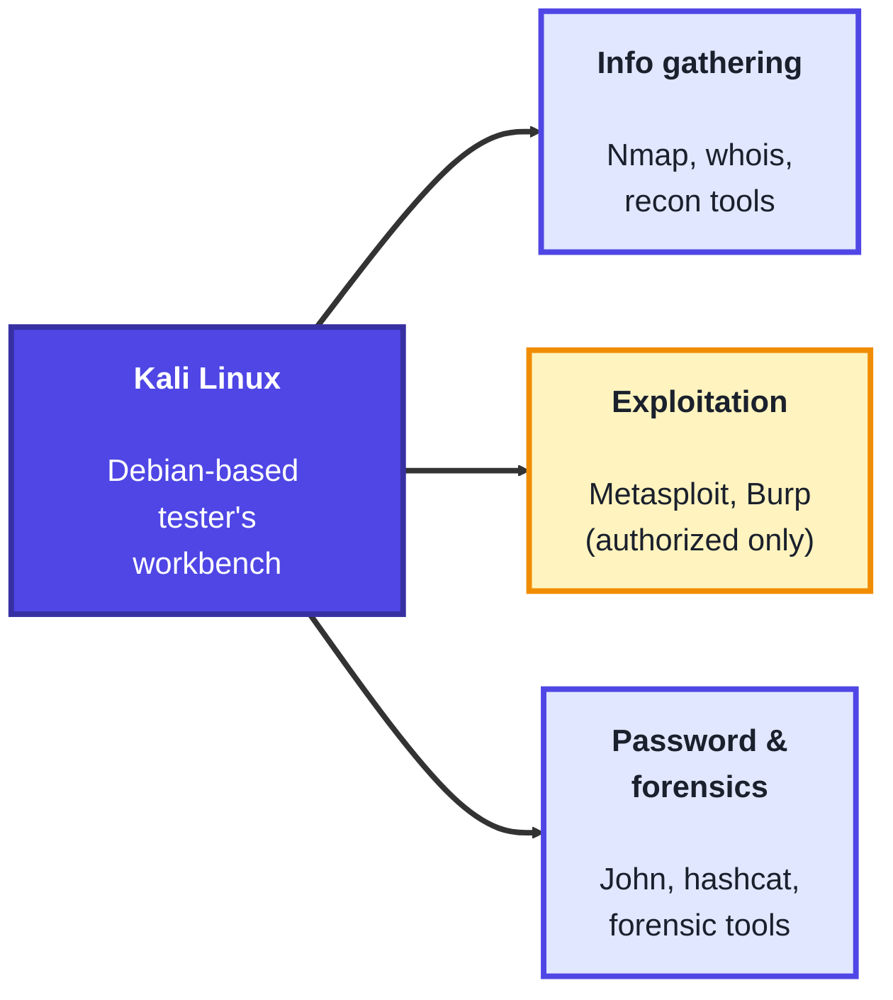
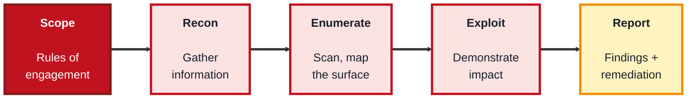
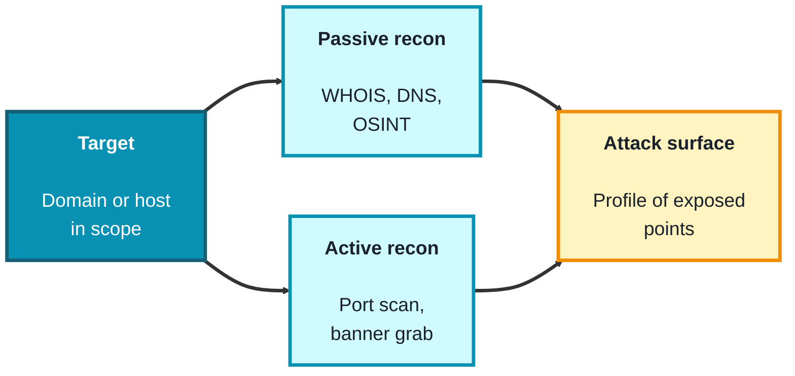

## Module 3: Ethical Hacking

**Tools needed for this module:** a **Kali Linux** virtual machine (run in VirtualBox, VMware, or similar so it stays isolated), and a legal practice environment. For active exercises, use only targets you own or ones explicitly set up for learning, for example a local intentionally-vulnerable app like **OWASP Juice Shop** or **Metasploitable** in a VM on your own machine, or Nmap's sanctioned host `scanme.nmap.org`.

> **Read this before anything else.** Ethical hacking means *authorized* testing. Running these tools against a system you don't own, without explicit written permission, is illegal in most countries and can carry serious criminal penalties. The only thing separating a penetration tester from an attacker is authorization. Every lab in this module is scoped to systems you own or targets that publicly permit testing. Never point these tools anywhere else.

### Topic 3.1: Kali Linux

#### Concept

**Kali Linux** is a Debian-based operating system built and maintained by OffSec specifically for penetration testing, security auditing, and digital forensics. Rather than installing tools one by one, Kali ships with hundreds of them pre-installed and organised by purpose, giving an authorized tester a ready-made workbench. It's a working environment, not a magic button, the skill is in knowing which tool fits which phase of a test and how to interpret what it tells you.

- Kali is a **distribution**, a full Debian-based OS preloaded with security tooling, usually run as a **virtual machine** or live USB to keep it isolated from your main system
- Its tools are grouped by **category**: information gathering, vulnerability analysis, exploitation, password attacks, wireless attacks, and forensics
- Well-known tools it bundles include **Nmap** (scanning), **Wireshark** (packet analysis), **Burp Suite** (web testing), **Metasploit** (exploitation framework), and **John the Ripper** (password cracking)
- Modern Kali runs as a **non-root default user** (you use `sudo` when needed), a deliberate move away from the old always-root setup, reflecting least-privilege habits
- The tools are **dual-use**, the same scanner an auditor uses is what an attacker uses, so authorization and scope are what make the work legitimate

#### Structure at a Glance


- Running Kali in a VM (rather than as your main OS) keeps testing activity contained, lets you snapshot a clean state, and reduces the chance of a tool affecting systems you didn't intend
- Kali is a means, not an end, the same results are achievable on any Linux with the tools installed, what Kali provides is convenience and a curated, maintained toolset

#### Where you'd actually use this

Any authorized security assessment: a scheduled penetration test, a vulnerability assessment of infrastructure you're responsible for, a capture-the-flag learning exercise, or forensic analysis of a machine you're permitted to examine. Kali is the everyday environment a working tester operates from.

#### Lab

1. **Install Kali as a virtual machine** using the official image, and take a clean snapshot before you start.
2. **Update the system** so the toolset is current:
```bash
sudo apt update && sudo apt full-upgrade -y
```
3. **Explore the tool categories** from the applications menu, and note which tools map to information gathering versus exploitation.
4. **Run one information-gathering command against a sanctioned target** (Nmap explicitly permits scanning this host for learning):
```bash
nmap scanme.nmap.org
```
5. **Read the output**, identify which ports are reported open, and write one sentence explaining what that tells you about the host, without taking any further action against it.

#### Checkpoint
You have an isolated, updated Kali VM with a clean snapshot, you can navigate its tool categories, and you've run a single information-gathering scan against a target that permits it, and you can explain why authorization and isolation matter.

#### Quiz
1. What is Kali Linux, and who maintains it?
2. Name three categories the tools in Kali are grouped into.
3. Why does modern Kali default to a non-root user instead of running as root?
4. Why is it recommended to run Kali as a virtual machine?
5. What single factor separates an ethical tester's use of these tools from an attacker's?

*Answers: 1) A Debian-based operating system preloaded with security and penetration-testing tools, maintained by OffSec. 2) For example: information gathering, vulnerability analysis, exploitation, password attacks, wireless attacks, and forensics (any three). 3) To follow least privilege, you operate as a limited user and elevate with sudo only when needed, which reduces the risk of accidental damage. 4) A VM keeps testing activity isolated from your main system, lets you snapshot and restore a clean state, and limits the chance of affecting unintended systems. 5) Authorization, explicit permission to test the target; without it, the same actions are illegal.*

---

### Topic 3.2: Pen Testing

#### Concept

**Penetration testing** is an authorized, simulated attack on a system carried out to find and safely demonstrate exploitable weaknesses before a real attacker does. What makes it a discipline rather than random poking is that it follows a defined **methodology** with agreed **scope**, and its true deliverable is not the break-in but the **report** that tells the organisation what's wrong and how to fix it. A pentest proves risk is real, a **vulnerability** is a weakness, an **exploit** is the demonstration that the weakness can actually be used.

- **Rules of engagement** and **scope** are the written authorization that defines exactly which systems may be tested, when, and how, agreed before any testing begins
- The work moves through **phases**: reconnaissance, scanning and enumeration, exploitation, post-exploitation, and reporting
- Tests are described as **black box** (tester knows nothing up front), **grey box** (partial knowledge, like a normal user's access), or **white box** (full knowledge and source access)
- A **vulnerability** is a flaw, an **exploit** is the act of using it, ethical testers demonstrate impact carefully and stop short of causing damage
- The **report** is the point of the whole exercise, findings, risk ratings, evidence, and clear remediation steps

#### Structure at a Glance


- The scope document is not paperwork to rush past, it is your legal authorization and your protection, anything outside it is off-limits no matter how tempting the target
- A finding is only useful if it's reproducible and actionable, "I got in" is worth little, "this specific misconfiguration allowed this specific access, here's how to close it" is the real value

#### Where you'd actually use this

Assessing a company's web application or network before launch, meeting a compliance requirement that mandates regular testing, validating that a previous fix actually worked, or red-team exercises that test detection and response. Pentesting is how organisations find their weaknesses on their own terms.

#### Lab

> Do this only against a target you own, such as a local OWASP Juice Shop or Metasploitable VM on your own machine.

1. **Write a one-page scope document** for your lab target: which host, which IP, what's in scope, what's explicitly out of scope, and the time window. This is your practice rules of engagement.
2. **Run the recon and enumeration phases** against your own VM, mapping open ports and running services:
```bash
nmap -sV <your-lab-VM-ip>
```
3. **Enumerate one service** further to identify its version and any obvious misconfiguration, staying within your scope document.
4. **Identify one documented vulnerability** in the target (intentionally-vulnerable apps ship with known issues) and note how it maps to a real risk, without weaponising anything beyond confirming it exists.
5. **Write a mini-report** with three sections for that one finding: what it is, why it matters (impact), and how to fix it (remediation).

#### Checkpoint
You have written a scope document, run recon and enumeration against a target you own, identified a single vulnerability, and produced a short finding with impact and remediation, and you can explain the difference between a vulnerability and an exploit.

#### Quiz
1. What is the true deliverable of a penetration test, and why?
2. Name the phases of a penetration test in order.
3. What is the difference between black-box, grey-box, and white-box testing?
4. What is the difference between a vulnerability and an exploit?
5. Why is the scope / rules-of-engagement document so important?

*Answers: 1) The report, because the point is to tell the organisation what's wrong and how to fix it; the break-in only matters as evidence of real risk. 2) Reconnaissance, scanning and enumeration, exploitation, post-exploitation, and reporting. 3) Black-box means the tester starts with no knowledge of the target, grey-box with partial knowledge (like a normal user), and white-box with full knowledge including source and architecture. 4) A vulnerability is a weakness or flaw in a system; an exploit is the act of actually using that weakness to achieve an effect. 5) It is the written authorization defining exactly what may be tested and how; it makes the work legal, protects the tester, and keeps testing away from systems that are off-limits.*

---

### Topic 3.3: Reconnaissance

#### Concept

**Reconnaissance** is the information-gathering first phase of any assessment, where you build a picture of the target's **attack surface** before touching anything sensitive. It splits into **passive** recon, learning about a target without directly interacting with it, and **active** recon, directly probing it. The better your recon, the more focused and less noisy every later step becomes. Recon is also a defensive skill: seeing what an attacker can easily learn about your organisation tells you what to lock down or hide.

- **Passive reconnaissance** gathers information without touching the target directly, using public sources like WHOIS records, DNS data, search engines, and other **OSINT** (open-source intelligence)
- **Active reconnaissance** interacts with the target directly, for example port scanning or grabbing service banners, which is more informative but also more detectable
- The **attack surface** is the total set of exposed points, hosts, open ports, services, subdomains, that an attacker could attempt to use
- **OSINT** draws on freely available public information: registration records, certificate transparency logs, code repositories, employee posts, and more
- **Footprinting** is the overall act of assembling this information into a profile of the target

#### Structure at a Glance


- Passive recon leaves little or no trace on the target, while active recon (like scanning) can be logged and detected, so testers weigh how much noise they're willing to make
- Everything you gather in recon feeds directly into how the assessment builds its picture of what's exposed, weak recon leads to blind, noisy testing later

#### Where you'd actually use this

The opening phase of every penetration test, mapping an organisation's internet-facing footprint, an attack-surface review to find forgotten or exposed assets, or a defensive OSINT audit to see what your own organisation is leaking publicly. Recon is where every assessment starts.

#### Lab

> Passive steps here use a domain you own or are authorized to research. Active scanning is directed only at `scanme.nmap.org` (which permits it) or your own host.

1. **Do passive recon** on a domain you own, gathering registration and DNS data (this reuses the DNS skills from Module 1):
```bash
whois yourdomain.com
dig yourdomain.com ANY
```
2. **Enumerate DNS records** to find hosts and mail servers tied to the domain:
```bash
dig yourdomain.com A
dig yourdomain.com MX
```
3. **Do active recon** with a service-version scan against a sanctioned target:
```bash
nmap -sV scanme.nmap.org
```
4. **Grab service banners** from the open ports to identify software and versions, part of understanding the surface.
5. **Assemble a short attack-surface profile**: list the hosts, open ports, and services you found, and mark which came from passive versus active recon.

#### Checkpoint
You have gathered passive information on a domain you own, performed an active service scan against a permitted target, and assembled a short attack-surface profile, and you can explain the difference between passive and active recon and why the distinction matters.

#### Quiz
1. What is the goal of the reconnaissance phase?
2. What is the difference between passive and active reconnaissance?
3. What is an "attack surface"?
4. What does OSINT stand for, and give two examples of OSINT sources.
5. Why might a tester prefer passive recon over active recon in some situations?

*Answers: 1) To gather information and build a picture of the target's attack surface before any deeper testing, so later phases are focused and efficient. 2) Passive recon gathers information without directly interacting with the target (public records, DNS, OSINT), while active recon directly probes the target (port scanning, banner grabbing). 3) The total set of exposed points, hosts, open ports, services, subdomains, that an attacker could attempt to use. 4) Open-source intelligence; examples include WHOIS registration records, DNS data, certificate transparency logs, public code repositories, and social media (any two). 5) Passive recon leaves little or no trace on the target, so it avoids tipping off defenders or generating logs, whereas active scanning can be detected.*

---

## Module 3 Completion Checklist
- [ ] Set up an isolated, updated Kali VM with a clean snapshot and explored its tool categories
- [ ] Ran an information-gathering scan against a sanctioned target and interpreted the result
- [ ] Wrote a scope / rules-of-engagement document for a target you own
- [ ] Ran recon and enumeration against your own vulnerable VM and produced a short finding with impact and remediation
- [ ] Performed both passive and active reconnaissance and assembled an attack-surface profile
- [ ] Can explain why authorization is the line between ethical testing and crime, and can describe the phases of a penetration test
