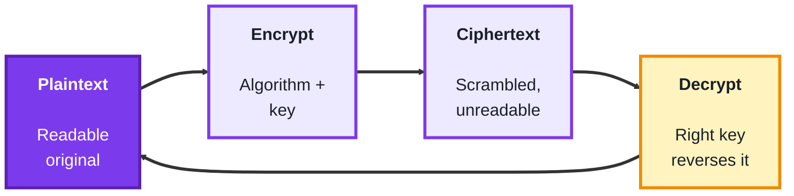
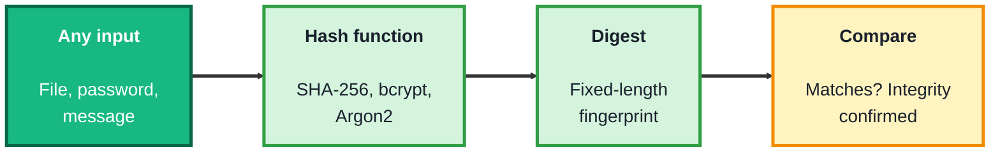
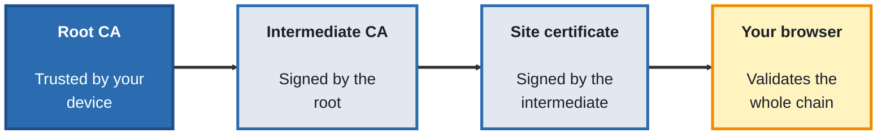

## Module 4: Cryptography

**Tools needed for this module:** a terminal and **OpenSSL**, which is already installed on most macOS and Linux systems (and available for Windows). You'll also use built-in hashing utilities like `sha256sum` and `md5sum` (on macOS these are `shasum -a 256` and `md5`). No programming is required, though a language of your choice is handy if you want to experiment further.

### Topic 4.1: Encryption

#### Concept

**Encryption** transforms readable **plaintext** into scrambled **ciphertext** using an algorithm and a **key**, so that only someone holding the right key can reverse it. It's the tool that keeps data confidential in transit and at rest. There are two families. **Symmetric** encryption uses the same key to lock and unlock, it's fast, but both sides must somehow share that key secretly. **Asymmetric** encryption uses a matched **public/private key pair**, what one key encrypts, only the other can decrypt, which elegantly solves the key-sharing problem. In the real world the two are combined.

- **Plaintext** is the readable original, **ciphertext** is the scrambled result
- A **key** is the secret value that controls the transformation, security depends on the key staying secret, not the algorithm staying secret
- **Symmetric encryption** (for example **AES**) uses one shared key, it's fast and ideal for bulk data, but distributing the key safely is the hard part
- **Asymmetric encryption** (for example **RSA**) uses a public key (shareable) and a private key (kept secret), solving key distribution at the cost of speed
- **Hybrid** systems (like **TLS**) use asymmetric encryption to exchange a symmetric key, then switch to fast symmetric encryption for the actual data

#### Structure at a Glance


- Symmetric is fast but has a key-distribution problem, asymmetric solves distribution but is slow, hybrid encryption uses each for what it's best at, which is exactly why HTTPS is both secure and fast
- A cryptosystem's strength should rest on the secrecy of the **key**, not the secrecy of the algorithm, this is Kerckhoffs's principle, and it's why real-world algorithms like AES and RSA are public and heavily reviewed

#### Where you'd actually use this

Protecting data in transit (HTTPS, VPNs), encrypting data at rest (disk and database encryption), securing backups, and any situation where confidential information must be unreadable to anyone without the key. Understanding symmetric versus asymmetric is the basis for reasoning about TLS, VPNs, and secure messaging.

#### Lab

1. **Symmetrically encrypt a file** with AES using OpenSSL:
```bash
echo "secret message" > secret.txt
openssl enc -aes-256-cbc -pbkdf2 -salt -in secret.txt -out secret.enc
```
2. **Decrypt it** to confirm you get the original back (you'll be asked for the same password):
```bash
openssl enc -d -aes-256-cbc -pbkdf2 -in secret.enc -out decrypted.txt
cat decrypted.txt
```
3. **Generate an asymmetric key pair** (RSA):
```bash
openssl genrsa -out private.pem 2048
openssl rsa -in private.pem -pubout -out public.pem
```
4. **Encrypt a message with the public key**, then decrypt it with the private key, showing the pair in action:
```bash
openssl pkeyutl -encrypt -pubin -inkey public.pem -in secret.txt -out rsa.enc
openssl pkeyutl -decrypt -inkey private.pem -in rsa.enc -out rsa.dec
cat rsa.dec
```
5. **Explain to yourself** which of the two approaches you'd use for a 5 GB backup file and why (hint: think about speed).

#### Checkpoint
You have encrypted and decrypted a file with symmetric AES, generated an RSA key pair, and used the public and private keys to encrypt and decrypt a message, and you can explain the tradeoffs between symmetric and asymmetric encryption and why hybrid systems exist.

#### Quiz
1. What is the difference between plaintext and ciphertext?
2. What is the core difference between symmetric and asymmetric encryption?
3. What problem does asymmetric encryption solve that symmetric encryption struggles with?
4. Why do real-world systems like TLS combine both types (hybrid encryption)?
5. What does Kerckhoffs's principle say a cryptosystem's security should depend on?

*Answers: 1) Plaintext is the readable original data; ciphertext is the scrambled, unreadable output of encrypting it. 2) Symmetric encryption uses the same key to encrypt and decrypt, while asymmetric encryption uses a matched public/private key pair where one key encrypts and only the other decrypts. 3) Key distribution, sharing a secret key safely; asymmetric encryption lets you share a public key openly while keeping the private key secret. 4) Asymmetric encryption is slow but solves key distribution, and symmetric is fast but needs a shared key; hybrid uses asymmetric to exchange a symmetric key, then symmetric for the bulk data, getting both security and speed. 5) The secrecy of the key, not the secrecy of the algorithm; the algorithm can be public and still be secure.*

---

### Topic 4.2: Hashing

#### Concept

**Hashing** runs any input through a **one-way** function to produce a fixed-length **digest**, a kind of fingerprint. Crucially, you cannot reverse a hash back into the original input, which is exactly why it's different from encryption. The same input always produces the same hash, but changing even one character produces a completely different one (the **avalanche effect**). Hashing is used to verify **integrity** (has this file been tampered with?) and to store passwords safely (you store the hash, never the password itself). For passwords specifically, a plain hash isn't enough, you add a **salt** and use a deliberately slow algorithm.

- Hashing is **one-way** and **irreversible**, you can't compute the input from the digest
- The **digest** is fixed-length regardless of input size, and **deterministic**, the same input always hashes to the same value
- The **avalanche effect** means a tiny change in input produces a completely different digest
- **Collision resistance** means it's computationally hard to find two different inputs with the same hash, this is why MD5 and SHA-1 are now considered broken for security use
- For passwords you add a **salt** (a unique random value per password) and use slow, purpose-built hashes like **bcrypt** or **Argon2**, which defeat precomputed "rainbow table" attacks and make brute-forcing expensive

#### Structure at a Glance


- Encryption is two-way (you decrypt it), hashing is one-way (you can't), confusing the two is a common and dangerous mistake, you encrypt data you need to read back, you hash data you only need to verify
- Choose the hash for the job: SHA-256 for file integrity, and a slow salted hash like bcrypt or Argon2 for passwords, never a fast general-purpose hash for password storage

#### Where you'd actually use this

Verifying that a downloaded file wasn't altered (checksum matching), storing user passwords safely, detecting whether a file has changed (file-integrity monitoring, which ties into security monitoring), and underpinning digital signatures. Hashing is everywhere data integrity or password safety matters.

#### Lab

1. **Hash a short string** and look at the fixed-length digest:
```bash
echo -n "hello" | sha256sum
```
(On macOS: `echo -n "hello" | shasum -a 256`.)

2. **Change one character and re-hash**, to see the avalanche effect first-hand:
```bash
echo -n "Hello" | sha256sum
```
Compare the two digests, they should look completely unrelated.

3. **Hash a file** and record its digest:
```bash
sha256sum somefile.txt
```
4. **Modify the file slightly, re-hash it**, and confirm the digest changed, this is how integrity checks catch tampering.
5. **Reason about passwords**: explain to yourself why you'd store `bcrypt(salt + password)` rather than `sha256(password)`, referring to salting and slow hashing.

#### Checkpoint
You can hash strings and files, you've seen the avalanche effect by changing a single character, and you can explain why hashing is one-way, how it differs from encryption, and why passwords need salting and slow algorithms.

#### Quiz
1. What makes hashing different from encryption?
2. What is the avalanche effect?
3. What does "collision resistance" mean, and why are MD5 and SHA-1 considered unsafe for security use?
4. Why is a plain SHA-256 hash not good enough for storing passwords?
5. What is a salt, and what attack does it defend against?

*Answers: 1) Hashing is one-way and irreversible, you cannot recover the input from the digest, whereas encryption is two-way and can be reversed with the key. 2) A tiny change in the input produces a completely different output digest. 3) Collision resistance means it's computationally hard to find two different inputs that produce the same hash; MD5 and SHA-1 are unsafe because practical collisions have been found. 4) SHA-256 is fast and unsalted by default, so identical passwords hash identically and attackers can use precomputed rainbow tables and brute-force at high speed; passwords need a salt and a slow algorithm like bcrypt or Argon2. 5) A salt is a unique random value added to each password before hashing; it defends against rainbow-table (precomputed hash) attacks by ensuring identical passwords hash differently.*

---

### Topic 4.3: Certificates

#### Concept

A digital **certificate** solves a trust problem: when your browser receives a public key claiming to belong to `example.com`, how does it know that's true and not an imposter's key? A certificate binds a public key to an identity, and that binding is vouched for by a trusted **Certificate Authority (CA)**. Your device already trusts a set of root CAs, and through a **chain of trust** that trust extends to the site's certificate. This machinery, collectively called **PKI** (public key infrastructure), is what makes HTTPS trustworthy and not just encrypted.

- A **certificate** binds a public key to an identity (such as a domain name), in the standard **X.509** format
- A **Certificate Authority (CA)** is a trusted third party that verifies identity and signs certificates
- The **chain of trust** runs from a **root CA** (trusted by your device) to an **intermediate CA** to the site's **leaf certificate**, each link signing the next
- **PKI** is the whole system of CAs, keys, policies, and procedures that makes this trust work at scale
- Certificates have an **expiry** date and can be **revoked** early (via mechanisms like CRLs and OCSP) if a key is compromised

#### Structure at a Glance


- If any link in the chain is untrusted, expired, or revoked, the browser shows a certificate warning, this is the mechanism behind those "your connection is not private" pages
- Certificates only prove identity and enable trusted key exchange, the actual data encryption is done by TLS using the keys the certificate helped establish, this is why certificates and encryption are related but distinct

#### Where you'd actually use this

Setting up HTTPS on a website, diagnosing certificate errors and expiry, understanding why a site is flagged as insecure, configuring internal CAs for a private network, and reasoning about how TLS establishes trust. Certificates are the trust layer under nearly all secure web communication.

#### Lab

1. **Fetch and inspect a real site's certificate chain** with OpenSSL:
```bash
openssl s_client -connect example.com:443 -showcerts
```
(Press Ctrl+C or type `Q` to exit once you've seen the output.)

2. **View the leaf certificate's details** in a readable form:
```bash
echo | openssl s_client -connect example.com:443 2>/dev/null | openssl x509 -text -noout
```
3. **Find the issuer and validity dates** in that output, note who signed the certificate and when it expires.
4. **Inspect the same certificate in your browser** by clicking the padlock, and confirm you can see the same chain (root, intermediate, leaf).
5. **Explain what would happen** if the certificate's expiry date had already passed, and why the browser would react that way.

#### Checkpoint
You can retrieve and read a site's certificate chain, identify its issuer and expiry, and view the chain in a browser, and you can explain what a Certificate Authority does, what the chain of trust is, and how certificates relate to (but differ from) encryption.

#### Quiz
1. What does a digital certificate bind together, and why is that needed?
2. What is the role of a Certificate Authority?
3. Describe the chain of trust from root to site.
4. What is PKI?
5. Name two reasons a browser might reject a certificate.

*Answers: 1) It binds a public key to an identity (such as a domain name); this is needed so a client can trust that a public key really belongs to the party it claims to, rather than an imposter. 2) A trusted third party that verifies an identity and signs its certificate, so others can trust the binding. 3) A root CA (trusted by the device) signs an intermediate CA, which signs the site's leaf certificate; the browser validates each link back to the trusted root. 4) Public key infrastructure, the overall system of CAs, keys, policies, and procedures that manages certificates and trust at scale. 5) For example: the certificate has expired, it's been revoked, the chain doesn't lead to a trusted root, or the name doesn't match the site (any two).*

---

## Module 4 Completion Checklist
- [ ] Encrypted and decrypted a file with symmetric AES using OpenSSL
- [ ] Generated an RSA key pair and used the public/private keys to encrypt and decrypt a message
- [ ] Hashed strings and files, and observed the avalanche effect from a one-character change
- [ ] Can explain why passwords need salting and slow hashes, not a plain fast hash
- [ ] Retrieved and read a real certificate chain, identifying its issuer and expiry
- [ ] Can explain the difference between encryption (two-way) and hashing (one-way), and how certificates establish trust
