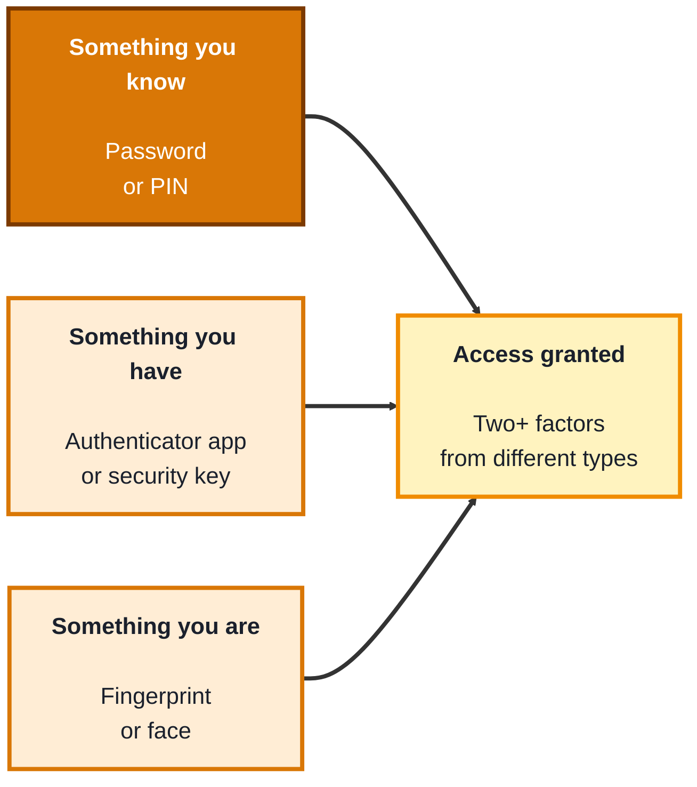
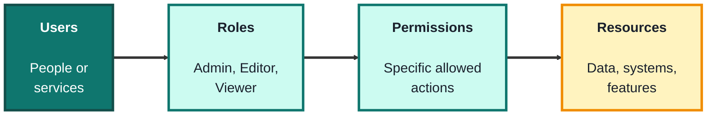
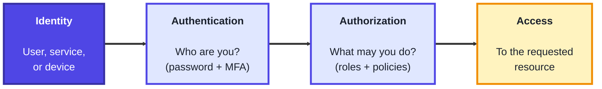

## Module 5: Identity and Access Management

**Tools needed for this module:** an **authenticator app** on your phone (such as any TOTP app) for the MFA topic, a test account you own to enable MFA on, and optionally a free-tier cloud account (AWS, Azure, or GCP) to practice real IAM. A terminal is useful but not required. Never practice on accounts or systems that aren't yours.

### Topic 5.1: MFA

#### Concept

**Multi-Factor Authentication (MFA)** requires you to prove your identity with two or more **factors** drawn from different categories, so that stealing any single one isn't enough to get in. The three categories are something you **know** (a password or PIN), something you **have** (a phone or hardware token), and something you **are** (a fingerprint or face). A stolen password is useless to an attacker who can't also produce your second factor. This single control blocks the large majority of account-takeover attacks, which is why it's one of the highest-value defences an organisation can deploy.

- The three **factor categories** are knowledge (something you know), possession (something you have), and inherence (something you are)
- **TOTP** (time-based one-time password) apps generate a rotating 6-digit code, a "have" factor that's far stronger than SMS
- **Hardware security keys** using **FIDO2/WebAuthn** are the strongest common option because they're **phishing-resistant**, they cryptographically verify the real site
- **SMS one-time codes** are better than nothing but the weakest form, vulnerable to SIM-swapping and interception
- MFA's value is that it **defeats stolen-password attacks**, the credential alone no longer grants access

#### Structure at a Glance

- The factors must come from **different categories**, two passwords is not MFA, because a single theft (a phishing page) could capture both, the whole point is that a different kind of factor is hard to steal in the same way
- Not all MFA is equal, SMS can be intercepted or SIM-swapped, TOTP is much stronger, and hardware security keys are phishing-resistant, so the choice of second factor materially changes how much protection you get

#### Where you'd actually use this

Protecting every account that matters: email, cloud consoles, admin panels, banking, and code repositories. In an organisation, enforcing MFA (especially phishing-resistant MFA for administrators) is one of the first and most impactful security policies to put in place.

#### Lab

> Do this on a test account you own, so you can safely enable and, if needed, disable MFA.

1. **Choose an account you control** that supports MFA, and open its security settings.
2. **Enable TOTP-based MFA**, which will display a QR code representing a shared secret.
3. **Scan the QR code with an authenticator app**, which then begins generating rotating 6-digit codes.
4. **Enter the current code to confirm setup**, and save any backup/recovery codes somewhere safe.
5. **Compare the options**: write down, for your account, whether it also supports a hardware security key, and explain why that would be stronger than the TOTP you just set up.

#### Checkpoint
You have enabled TOTP-based MFA on an account you own, verified it with a code from an authenticator app, and saved recovery codes, and you can explain the three factor categories and why phishing-resistant MFA is stronger than SMS.

#### Quiz
1. What are the three categories of authentication factors?
2. Why is using two passwords not considered true multi-factor authentication?
3. Why is SMS-based MFA considered the weakest common option?
4. What makes hardware security keys (FIDO2/WebAuthn) phishing-resistant?
5. What class of attack does MFA primarily defend against?

*Answers: 1) Something you know (knowledge), something you have (possession), and something you are (inherence). 2) Because both factors come from the same category (knowledge), so a single attack such as a phishing page could capture both at once; true MFA requires factors from different categories. 3) SMS codes can be intercepted or stolen through SIM-swapping and other attacks on the phone network, unlike app-based or hardware factors. 4) They cryptographically verify the identity of the real site during login, so a fake phishing site can't relay or reuse the authentication. 5) Account takeover using stolen or guessed passwords, the password alone is no longer enough to log in.*

---

### Topic 5.2: RBAC

#### Concept

**Role-Based Access Control (RBAC)** assigns permissions to named **roles**, and gives users access by placing them into roles, rather than granting permissions to each user one by one. A user isn't given "read the database" directly, they're assigned the "Analyst" role, and that role carries the permission. This scales cleanly, enforces **least privilege**, and makes audits simple: to see what someone can do, you look at their roles, and to change access for a whole class of people, you change one role instead of many accounts.

- A **role** is a named bundle of permissions tied to a job function (for example "Editor" or "Administrator")
- Users get access through **user-to-role assignment**, they inherit whatever their roles permit
- A **permission** is a specific allowed action on a specific resource (for example "delete a post")
- **Least privilege** means each role grants only what its function genuinely needs, and no more
- **Separation of duties** splits sensitive actions across different roles so no single person can abuse a whole process (for example, one role requests a payment, another approves it)

#### Structure at a Glance

- The power of RBAC is the layer of indirection, because permissions attach to roles rather than to individuals, onboarding, offboarding, and audits become "which role?" questions instead of tedious per-user permission edits
- RBAC naturally supports least privilege and separation of duties, but only if roles are designed tightly, an over-broad "does everything" role quietly defeats the whole point

#### Where you'd actually use this

Structuring access in any application or cloud environment, defining who can read versus edit versus administer, meeting compliance requirements around access control, and making joiner/mover/leaver processes manageable. RBAC is the default model for organising permissions at scale.

#### Lab

1. **Pick a scenario**, for example a simple blog platform with these needs: some people write posts, some approve and publish them, some only read.
2. **Design three roles** (for example Author, Editor, Viewer) and, in a small table, list the exact permissions each role gets.
3. **Apply least privilege**: for each permission, ask whether that role truly needs it, and remove anything that fails the test.
4. **Add a separation-of-duties rule**: ensure no single role can both write and publish its own post, and note why that matters.
5. **Assign sample users to roles** and, for two of them, write out exactly what they can and cannot do, purely from their role assignments. (If you have a cloud free tier, implement one of these roles in its IAM as a bonus.)

#### Checkpoint
You have designed a role-permission model for a scenario, applied least privilege, added a separation-of-duties constraint, and mapped users to roles, and you can explain how RBAC simplifies audits and offboarding compared with per-user permissions.

#### Quiz
1. In RBAC, how do users get their permissions?
2. Why does attaching permissions to roles (instead of directly to users) make audits and offboarding easier?
3. What is the principle of least privilege in the context of a role?
4. What is separation of duties, and give an example.
5. How can a poorly designed role undermine the benefits of RBAC?

*Answers: 1) Indirectly, users are assigned to roles, and they inherit whatever permissions those roles carry. 2) Because access is defined per role, so you check or change one role rather than editing permissions on many individual accounts; to offboard someone you just remove their roles. 3) A role should grant only the permissions its job function genuinely needs, and nothing more. 4) Splitting a sensitive process across different roles so no single person controls all of it, for example one role requests a payment and a different role approves it. 5) An over-broad role that grants far more than needed (or a catch-all "admin everything" role) violates least privilege and gives users excessive access, defeating the control RBAC is meant to provide.*

---

### Topic 5.3: IAM

#### Concept

**Identity and Access Management (IAM)** is the overall discipline of managing digital **identities** and controlling what each one can access, across its entire lifecycle. It brings together everything in this module: proving who someone is (**authentication**, where MFA lives), deciding what they may do (**authorization**, where RBAC lives), and managing accounts from creation to deletion. In the cloud, IAM services are the control plane for the entire environment, every action is an identity asking to do something, and IAM decides yes or no.

- An **identity** is the digital representation of a user, a service, or a device
- **Authentication** proves who you are, **authorization** decides what you're allowed to do, these are distinct steps and confusing them causes real security bugs
- **SSO (single sign-on)** lets one authenticated identity access many services without logging in separately to each
- The **identity lifecycle** covers provisioning (joiner), changing access (mover), and removing access (leaver), stale accounts that outlive their owner's need are a common breach vector
- **Cloud IAM** services (AWS IAM, Microsoft Entra ID, Google Cloud IAM) are the control plane that ties identities to permissions across everything you run

#### Structure at a Glance

- Authentication and authorization are separate gates, first you prove who you are, then the system decides what that identity may do, MFA strengthens the first gate and RBAC governs the second
- The identity lifecycle is where a lot of real risk hides, accounts that are created but never properly removed (a departed employee, an unused service account) are frequent footholds for attackers, so deprovisioning matters as much as provisioning

#### Where you'd actually use this

Managing user and service access in a cloud environment, implementing single sign-on across an organisation's apps, running joiner/mover/leaver processes, auditing who has access to what, and enforcing least privilege at the identity level. IAM is the backbone of access control in every modern organisation.

#### Lab

> Use a cloud free-tier account you own, or work through this conceptually if you don't have one.

1. **Create a new identity** (an IAM user or equivalent) with no permissions attached, representing a "joiner."
2. **Attach a scoped permission set** (a policy or role) that grants only what a specific job needs, applying least privilege from Topic 5.2.
3. **Turn on MFA** for that identity, tying together authentication (5.1) and this topic.
4. **Test the boundaries**: confirm the identity can do what its role allows and is denied something outside it, this is authorization in action.
5. **Deprovision it**: remove the identity's access as if they'd left, and note why prompt deprovisioning is a security control, not just housekeeping.

#### Checkpoint
You have created an identity, granted it least-privilege authorization, enabled MFA, tested that authorization limits it correctly, and deprovisioned it, and you can explain the difference between authentication and authorization and why the identity lifecycle matters.

#### Quiz
1. What is the difference between authentication and authorization?
2. What is an "identity" in IAM, and what kinds of things can have one?
3. What does SSO provide, and what's one benefit of it?
4. What are the three stages of the identity lifecycle, and why does the "leaver" stage matter for security?
5. In a cloud environment, why is IAM described as the "control plane"?

*Answers: 1) Authentication proves who you are (verifying identity, for example with a password plus MFA); authorization decides what you're allowed to do once authenticated (for example via roles and policies). 2) An identity is the digital representation of an entity that can request access, it can belong to a user, a service, or a device. 3) Single sign-on lets one authenticated identity access many services without logging in separately to each; benefits include convenience and centralised control over access. 4) Provisioning (joiner), modifying access (mover), and deprovisioning (leaver); the leaver stage matters because accounts left active after someone no longer needs them are a common way attackers gain a foothold. 5) Because in the cloud every action is an identity requesting to do something, and IAM decides whether to allow it, so it governs access to essentially everything you run.*

---

## Module 5 Completion Checklist
- [ ] Enabled TOTP-based MFA on an account you own and verified it with an authenticator app
- [ ] Can explain the three factor categories and why phishing-resistant MFA beats SMS
- [ ] Designed a role-permission model with least privilege and a separation-of-duties rule
- [ ] Created an identity, granted it scoped authorization, enabled MFA, and deprovisioned it
- [ ] Can explain the difference between authentication and authorization
- [ ] Can explain why the identity lifecycle (joiner/mover/leaver) is a security control, not just admin
