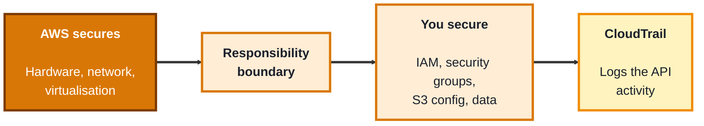
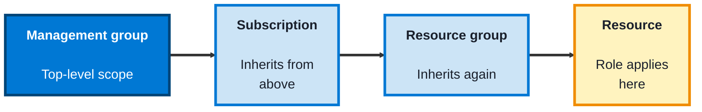
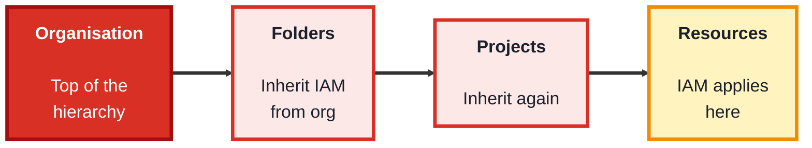

## Module 6: Cloud Security

**Tools needed for this module:** ideally a **free-tier account** for the provider you're studying (AWS, Azure, or GCP) and its web console, plus optionally the provider's command-line tool. Everything here is designed to be observe-and-inspect rather than build-and-spend, so stay within the free tier and only ever work in accounts you own. The one idea that runs through all three topics is the **shared responsibility model**: the provider secures the cloud itself, and you secure what you put in it.

### Topic 6.1: AWS

#### Concept

**Amazon Web Services (AWS)** is the largest cloud provider, and its security rests on the **shared responsibility model**: AWS secures the underlying infrastructure (data centres, hardware, the virtualisation layer), while you are responsible for securing your data, your access controls, and your configuration. Most real-world AWS breaches come not from AWS failing, but from customers misconfiguring their side, an overly open storage bucket, an over-privileged access key, a firewall rule left wide open. The core building blocks you configure are IAM, security groups, storage settings, and audit logging.

- The **shared responsibility model** divides security: AWS secures *of* the cloud, you secure *in* the cloud
- **IAM** controls identities and fine-grained permissions, following least privilege and using **roles** for services rather than long-lived keys
- **Security groups** are stateful virtual firewalls attached to instances, controlling inbound and outbound traffic by port and source (this reuses your Module 1 knowledge)
- **S3 bucket** configuration is a classic risk area, a bucket accidentally set to public has caused many well-known data leaks, so "block public access" settings matter
- **CloudTrail** records API activity across the account, providing the audit trail you need to investigate what happened

#### Structure at a Glance

- The single most important AWS security mindset is knowing which side of the responsibility boundary a given control sits on, patching the hypervisor is AWS's job, but locking down your bucket and your IAM is entirely yours
- Prefer IAM **roles** over long-lived access keys for anything running in AWS, roles hand out short-lived credentials automatically, so there's no static key to leak

#### Where you'd actually use this

Securing infrastructure hosted on AWS: reviewing IAM permissions for over-privilege, confirming storage buckets aren't public, tightening security-group rules, and making sure CloudTrail is on so you have an audit trail. This is everyday work for anyone defending an AWS environment.

#### Lab

> Observe-only steps in a free-tier account you own, nothing here should incur cost.

1. **Open the IAM console** and review the users and roles, note which have broad permissions and ask whether they need them.
2. **Inspect an S3 bucket's public-access settings**, confirm "Block all public access" is on for a bucket that shouldn't be public.
3. **Look at a security group's inbound rules**, identify any rule allowing traffic from `0.0.0.0/0` (anywhere) and reason about whether that's appropriate.
4. **Confirm CloudTrail is enabled**, and open the event history to see recent API activity recorded in the account.
5. **Write one finding**: pick the weakest configuration you saw and describe the risk and the fix, in the mini-report style from Module 3.

#### Checkpoint
You can navigate AWS IAM, S3 public-access settings, security-group rules, and CloudTrail, and you can explain the shared responsibility model and identify which security tasks are yours versus AWS's.

#### Quiz
1. What does the shared responsibility model say AWS is responsible for, versus the customer?
2. Why are misconfigured S3 buckets such a common source of breaches?
3. What is a security group, and what does it control?
4. Why are IAM roles generally preferred over long-lived access keys?
5. What does CloudTrail provide, and why does it matter for security?

*Answers: 1) AWS is responsible for security *of* the cloud, the physical infrastructure, hardware, network, and virtualisation layer; the customer is responsible for security *in* the cloud, their data, access controls (IAM), and configuration. 2) Because access settings are the customer's responsibility, and a bucket accidentally set to public exposes its contents to anyone; this configuration mistake has caused many well-known data leaks. 3) A stateful virtual firewall attached to instances that controls inbound and outbound traffic by port, protocol, and source. 4) Roles provide short-lived, automatically-rotated credentials, so there's no static key sitting around to be leaked or stolen. 5) CloudTrail records API activity across the account, giving an audit trail that is essential for investigating what happened during and after an incident.*

---

### Topic 6.2: Azure

#### Concept

**Microsoft Azure** puts **identity** at the centre of its security model through **Microsoft Entra ID** (formerly Azure Active Directory), the identity backbone shared with Microsoft 365. Access to Azure resources is governed by **Azure RBAC**, where you assign roles at different **scopes** in a hierarchy, and traffic is filtered by **Network Security Groups**. Azure also provides **Microsoft Defender for Cloud** to continuously assess your posture and give you a **secure score**, and **Key Vault** to store secrets safely. The same shared responsibility model applies.

- **Microsoft Entra ID** is the identity and access backbone for Azure and Microsoft 365, this is where users, groups, and sign-in (including MFA and conditional access) live
- **Azure RBAC** assigns roles at scopes across the hierarchy, management group, subscription, resource group, and individual resource, with assignments inheriting downward
- **Network Security Groups (NSGs)** filter inbound and outbound traffic to Azure resources by rules, much like security groups elsewhere
- **Microsoft Defender for Cloud** provides posture management: it surfaces recommendations and a **secure score** that measures how well-configured your environment is
- **Key Vault** is managed storage for secrets, keys, and certificates, so applications don't hard-code credentials

#### Structure at a Glance

- Azure RBAC assignments **inherit down** the hierarchy, so a role granted at the subscription level applies to every resource group and resource beneath it, which is powerful but means broad assignments have broad reach, assign at the narrowest scope that works
- Because identity is the perimeter in Azure, securing Entra ID (strong MFA, conditional access, limited privileged roles) is the highest-leverage thing you can do, more than any single network control

#### Where you'd actually use this

Securing workloads in Azure or a Microsoft 365 organisation: managing identities and sign-in policies in Entra ID, assigning least-privilege RBAC roles at the right scope, filtering traffic with NSGs, raising your secure score with Defender for Cloud, and keeping secrets in Key Vault. This is the core of Azure defensive work.

#### Lab

> Observe-only in a free/trial account you own.

1. **Open Microsoft Entra ID** and review the users and groups, and check whether MFA is enforced.
2. **Examine a role assignment** on a resource group, note the role, the scope, and who holds it, and consider whether the scope is as narrow as it could be.
3. **Look at a Network Security Group's rules**, and identify any rule that allows broad inbound access.
4. **Open Microsoft Defender for Cloud** and read your secure score plus its top recommendations.
5. **Write one finding** based on a recommendation or an over-broad role assignment, describing the risk and the fix.

#### Checkpoint
You can navigate Entra ID, an Azure RBAC role assignment and its scope, an NSG's rules, and Defender for Cloud's secure score, and you can explain how RBAC inheritance works and why identity is central to Azure security.

#### Quiz
1. What is Microsoft Entra ID, and what role does it play in Azure security?
2. What are the scope levels at which Azure RBAC roles can be assigned?
3. What does it mean that Azure RBAC assignments "inherit," and why should you assign at a narrow scope?
4. What does Microsoft Defender for Cloud's secure score tell you?
5. What is Key Vault used for, and what problem does it solve?

*Answers: 1) Microsoft Entra ID (formerly Azure AD) is the identity and access backbone for Azure and Microsoft 365, managing users, groups, and sign-in including MFA; it's central because identity is effectively the security perimeter in Azure. 2) Management group, subscription, resource group, and individual resource. 3) A role assigned at a higher scope applies to everything beneath it in the hierarchy; you assign at the narrowest scope that works so access doesn't extend further than intended. 4) A measure of how well-configured your environment is against security best practices, along with recommendations to improve it. 5) Managed storage for secrets, keys, and certificates; it solves the problem of applications hard-coding credentials by keeping them in a secure, access-controlled store.*

---

### Topic 6.3: GCP

#### Concept

**Google Cloud Platform (GCP)** organises everything into a **resource hierarchy**, Organisation at the top, then Folders, then Projects, then the resources themselves, and **IAM policies** applied at any level **inherit** downward. Access is granted by binding an identity to a **role** on a resource, following least privilege. GCP leans heavily on **service accounts** as identities for workloads (as opposed to human users), filters traffic with **VPC firewall rules**, and gives you **Security Command Center** for centralised visibility into misconfigurations and threats. The shared responsibility model applies here too.

- The **resource hierarchy** runs Organisation → Folders → Projects → Resources, and IAM policies inherit from each level down to the ones below
- **IAM roles** come in three kinds: **primitive** (broad, legacy: owner/editor/viewer), **predefined** (curated for specific services), and **custom** (you define exactly the permissions), predefined and custom support least privilege far better than primitive
- **Service accounts** are identities for applications and workloads rather than people, and securing them (and their keys) is a major GCP concern
- **VPC firewall rules** control traffic within your Google Cloud network by protocol, port, and source/target
- **Security Command Center** is the central place to see misconfigurations, vulnerabilities, and threats across your projects

#### Structure at a Glance

- IAM inheritance means a broad grant high in the hierarchy (say, at the Organisation) reaches everything below it, so, as with Azure, you grant at the lowest level that does the job
- Service accounts are a distinctive GCP risk, because they're powerful non-human identities, a leaked service-account key can be as damaging as a leaked admin password, so their keys deserve the same care as any credential

#### Where you'd actually use this

Securing workloads on Google Cloud: reviewing IAM bindings for over-privilege, replacing broad primitive roles with predefined or custom ones, locking down service accounts and their keys, tightening VPC firewall rules, and monitoring findings in Security Command Center. This is the core of GCP defensive work.

#### Lab

> Observe-only in a free-tier account you own.

1. **Open IAM for a project** and review the principals and the roles bound to them, noting any use of the broad primitive roles (owner/editor/viewer).
2. **Inspect a service account**, see what it's used for and whether it has more permissions than it needs.
3. **Look at the VPC firewall rules**, and identify any rule allowing broad inbound access (`0.0.0.0/0`).
4. **Open Security Command Center** (where available on your tier) and review any findings it reports.
5. **Write one finding**: choose the weakest configuration, likely an over-broad primitive role or an over-permissioned service account, and describe the risk and the fix.

#### Checkpoint
You can navigate GCP's resource hierarchy and IAM bindings, inspect a service account, review VPC firewall rules, and read Security Command Center findings, and you can explain IAM inheritance and why service accounts need special care.

#### Quiz
1. What are the levels of the GCP resource hierarchy, from top to bottom?
2. What are the three kinds of IAM roles in GCP, and which support least privilege best?
3. What is a service account, and how does it differ from a normal user identity?
4. What does it mean that GCP IAM policies "inherit," and what's the practical advice that follows?
5. Why is a leaked service-account key so dangerous?

*Answers: 1) Organisation, Folders, Projects, and Resources. 2) Primitive (broad legacy roles: owner/editor/viewer), predefined (curated per service), and custom (you define exact permissions); predefined and custom roles support least privilege far better than primitive. 3) A service account is an identity for an application or workload rather than a human user; it lets software authenticate and act with its own permissions. 4) A policy applied at a higher level of the hierarchy applies to everything beneath it; the practical advice is to grant access at the lowest level that meets the need so it doesn't spread further than intended. 5) Service accounts are powerful non-human identities, so a leaked key can give an attacker whatever access that account holds, potentially as damaging as a leaked administrator password.*

---

## Module 6 Completion Checklist
- [ ] Can explain the shared responsibility model and sort security tasks into provider versus customer
- [ ] Reviewed AWS IAM, S3 public-access settings, security groups, and CloudTrail, and wrote a finding
- [ ] Reviewed Azure Entra ID, an RBAC assignment and its scope, an NSG, and the Defender secure score
- [ ] Reviewed GCP IAM bindings, a service account, VPC firewall rules, and Security Command Center
- [ ] Can explain RBAC/IAM inheritance in Azure and GCP and why you assign at the narrowest scope
- [ ] Can name, for each provider, one common misconfiguration and how to fix it
