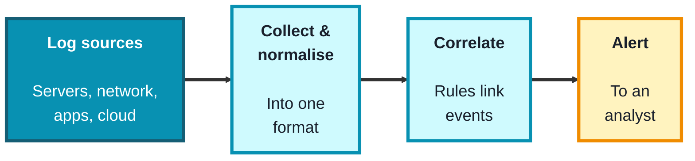
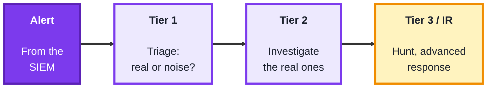
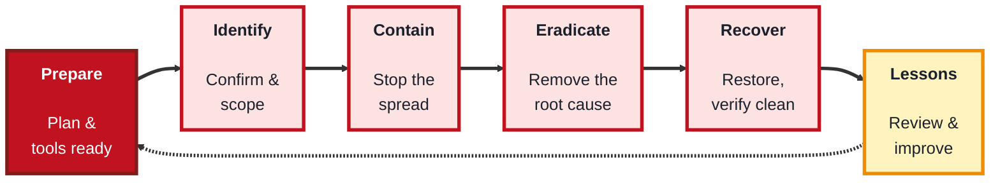

## Module 7: Security Monitoring

**Tools needed for this module:** a terminal with basic text tools (`grep`, `awk`, `sort`, `uniq`), which are already on any Linux or macOS system (and available on Windows via WSL or PowerShell equivalents), and a sample log file to work with, you can use your own system's authentication log from Module 2, or any log you own. Optionally, a free security-monitoring platform (such as a free tier of a SIEM) if you want to see the real thing. The three topics here build on one another: a SIEM produces the alerts, a SOC triages them, and incident response handles the ones that turn out to be real.

### Topic 7.1: SIEM

#### Concept

A **SIEM** (Security Information and Event Management) system is the central nervous system of security monitoring. On its own, a single log line means little, but a SIEM **aggregates** logs from across the whole environment, servers, network gear, applications, cloud, **normalises** their different formats into a common structure, and then **correlates** events to spot patterns no single log would reveal. When a pattern matches a rule, it raises an **alert** for a human to investigate. This is how "one failed login" (ignorable) becomes "500 failed logins from one IP followed by a success" (an alert worth acting on).

- **Log aggregation** pulls logs from many different sources into one searchable place
- **Normalisation** parses those varied formats into a common structure, so a login event looks the same whether it came from Linux, Windows, or a firewall
- **Correlation rules** are the logic that links multiple events into a meaningful signal (for example, many failures then a success from the same source)
- **Alerts** are raised when a rule matches, and are prioritised by severity so analysts focus on what matters
- **Dashboards** visualise activity for monitoring trends and investigating incidents

#### Structure at a Glance


- The real power of a SIEM is **correlation across sources**, an event that's innocent in isolation becomes suspicious when combined with others, which is exactly what a lone log file can't show you
- A SIEM is only as good as its **rules and tuning**, too few rules and you miss attacks, too many noisy ones and analysts drown in false positives and start ignoring alerts (alert fatigue), so tuning is continuous work

#### Where you'd actually use this

Centralised monitoring in any organisation with more than a handful of systems: detecting brute-force attempts, spotting unusual logins, meeting compliance logging requirements, and giving analysts one place to search during an investigation. The SIEM is where detection happens.

#### Lab

> This mini-SIEM exercise uses command-line tools on a log you own (for example a copy of `/var/log/auth.log`).

1. **Aggregate and search** a log for failed authentication events, the raw material of a brute-force alert:
```bash
grep "Failed password" auth.log
```
2. **Count failures by source IP** to find who's failing the most, this is a simple correlation by hand:
```bash
grep "Failed password" auth.log | awk '{print $(NF-3)}' | sort | uniq -c | sort -rn
```
3. **Define a correlation rule in words**: for example, "more than 10 failed logins from one IP within a short window is an alert."
4. **Check whether any IP crosses your threshold**, and if so, treat it as a raised alert.
5. **Note the follow-up signal**: search for a successful login (`Accepted password`) from any IP that also had many failures, that combination is what makes a real correlation rule valuable.

#### Checkpoint
You have aggregated and searched a log, counted failures by source, defined a correlation rule, and identified whether any source crosses it, and you can explain what aggregation, normalisation, and correlation each contribute, and why tuning matters.

#### Quiz
1. What do the letters SIEM stand for, and what is a SIEM's core job?
2. What is normalisation, and why is it needed?
3. What is a correlation rule, and give an example.
4. Why is correlation across multiple sources more powerful than looking at one log?
5. What is alert fatigue, and how does poor tuning cause it?

*Answers: 1) Security Information and Event Management; its core job is to aggregate logs from across the environment, correlate events, and raise alerts on suspicious patterns. 2) Normalisation parses logs from different sources into a common structure; it's needed so events from different systems (Linux, Windows, firewalls) can be compared and correlated consistently. 3) Logic that links multiple events into a meaningful signal, for example "many failed logins followed by a success from the same source IP." 4) Because an event that looks harmless in one log can be revealed as part of an attack when combined with events from other sources, a pattern no single log shows. 5) Alert fatigue is when analysts are overwhelmed by too many alerts (especially false positives) and start ignoring them; poor tuning that generates excessive noisy alerts causes it, risking real threats being missed.*

---

### Topic 7.2: SOC

#### Concept

A **SOC** (Security Operations Center) is the team and function responsible for monitoring, detecting, investigating, and responding to security events, often around the clock. If the SIEM is the alarm system, the SOC is the people who answer the alarms. It's usually structured in **tiers** so that routine alerts are triaged quickly while complex ones escalate to deeper expertise. The SOC lives or dies by good **triage** (separating real threats from noise) and clear **escalation**, and it measures itself on how fast it detects and responds.

- SOC analysts are organised in **tiers**: **Tier 1** monitors and triages incoming alerts, **Tier 2** investigates the ones that look real, and **Tier 3** handles advanced analysis and proactive **threat hunting**
- **Alert triage** is the core Tier 1 skill: deciding quickly whether an alert is a true threat, a false positive, or needs escalation, and how urgent it is
- **Escalation** passes an incident up a tier (or to incident response) when it exceeds the current tier's scope
- **Playbooks** are predefined, repeatable response procedures for common alert types, so analysts act consistently and fast
- The SOC tracks **metrics** like **MTTD** (mean time to detect) and **MTTR** (mean time to respond), lower is better

#### Structure at a Glance


- The tiered structure exists so expensive expertise isn't spent on routine noise, Tier 1 filters the flood so Tier 2 and Tier 3 can focus on genuine, complex threats
- Playbooks turn individual skill into consistent, fast, repeatable response, without them, the same alert might be handled brilliantly by one analyst and mishandled by another, so they're central to a reliable SOC

#### Where you'd actually use this

Any organisation large enough to need continuous monitoring, whether an in-house SOC or an outsourced (managed) one. SOC work is where alerts become decisions: triage the flood, investigate what's real, escalate what's serious, and do it fast and consistently.

#### Lab

> This is a triage exercise, building directly on the alert you produced in Topic 7.1.

1. **Take your set of findings** from the mini-SIEM lab (failed logins by IP, and any success following failures).
2. **Triage each one**: label it true positive, false positive, or needs-more-info, and assign a severity (low/medium/high) with a one-line reason.
3. **Decide escalation**: for the highest-severity item, state whether Tier 1 should handle it or escalate to Tier 2, and why.
4. **Write a short playbook** for "many failed logins followed by a success from one IP": list three concrete steps an analyst should take, in order.
5. **Reflect on metrics**: describe how you'd measure MTTD and MTTR for this alert type, and why speed matters.

#### Checkpoint
You have triaged a set of alerts with severity and reasoning, made an escalation decision, and written a short playbook, and you can explain the SOC tier structure, the role of triage and escalation, and what MTTD and MTTR measure.

#### Quiz
1. What is a SOC, and how does it relate to a SIEM?
2. What do the three SOC tiers typically do?
3. What is alert triage, and why is it the core Tier 1 skill?
4. What is a playbook, and why does a SOC rely on them?
5. What do MTTD and MTTR measure, and why does a SOC care about them?

*Answers: 1) A Security Operations Center is the team and function that monitors, detects, investigates, and responds to security events; it acts on the alerts a SIEM produces (the SIEM is the alarm, the SOC answers it). 2) Tier 1 monitors and triages incoming alerts, Tier 2 investigates the ones that look real, and Tier 3 does advanced analysis and proactive threat hunting. 3) Deciding quickly whether an alert is a true threat, a false positive, or needs escalation, and how urgent it is; it's core because it filters the flood of alerts so deeper resources focus on real threats. 4) A predefined, repeatable response procedure for a common alert type; SOCs rely on them for consistent, fast, reliable handling regardless of which analyst responds. 5) MTTD is mean time to detect and MTTR is mean time to respond; the SOC cares because faster detection and response limit the damage an attacker can do.*

---

### Topic 7.3: Incident Response

#### Concept

**Incident Response (IR)** is the structured process for handling a confirmed security incident so as to limit damage, remove the threat, recover safely, and learn from it. When triage confirms an alert is a real incident, IR takes over with a defined lifecycle rather than improvisation, because under pressure, a clear process is what prevents mistakes like destroying evidence or reinfecting a "cleaned" system. The widely used SANS model has six phases, often remembered as **PICERL**.

- **Preparation** is the work done in advance: the IR plan, tools, contacts, and training, so the team isn't inventing a response mid-crisis
- **Identification** confirms an incident is real and determines its scope (often where the SOC's triage hands off)
- **Containment** limits the spread, short-term (quickly isolating affected systems) and long-term (temporary fixes that let business continue safely)
- **Eradication** removes the root cause, malware, a compromised account, the exploited vulnerability
- **Recovery** safely restores systems to normal and confirms they're clean before returning them to service, and **Lessons Learned** reviews the incident afterward to improve defences and the plan itself

#### Structure at a Glance


- The phases are ordered for a reason, containing before you eradicate stops the bleeding first, and verifying clean before recovery stops you from restoring a system that's still compromised, skipping ahead is how incidents get worse
- **Lessons Learned loops back to Preparation**, every incident is a chance to improve the plan, the detection rules, and the defences, a SOC and IR team that doesn't feed lessons back keeps fighting the same fires

#### Where you'd actually use this

The moment a real incident is confirmed: a ransomware outbreak, a compromised account, a data breach, or a successful intrusion. IR is the difference between a contained, well-documented event and a chaotic, damaging one, and the lessons-learned phase is how an organisation's defences actually improve over time.

#### Lab

> This is a tabletop exercise, no real systems are touched. Use the confirmed incident from Topics 7.1 and 7.2 (a brute-force attack from one IP that ended in a successful login).

1. **Write the scenario in one line**: what was detected, and why it's a confirmed incident.
2. **Walk the six phases**, writing one concrete action for each: how you'd have prepared, how you identified and scoped it, how you'd contain it, how you'd eradicate the cause, how you'd recover, and one lesson learned.
3. **For containment**, decide a short-term action (for example isolating or blocking) and note how you'd preserve evidence while doing it.
4. **For eradication**, state the root cause you'd remove and how you'd confirm it's gone.
5. **For lessons learned**, write one change, a new detection rule, a policy, an MFA requirement, that would prevent or catch this faster next time, and show how it loops back to Preparation.

#### Checkpoint
You have walked a confirmed incident through all six IR phases with a concrete action for each, made a containment decision that preserves evidence, and produced a lesson that feeds back into preparation, and you can explain why the phase order matters.

#### Quiz
1. What are the six phases of the SANS incident-response lifecycle (PICERL)?
2. Why does containment come before eradication?
3. What is the difference between short-term and long-term containment?
4. Why must you verify a system is clean before the recovery phase returns it to service?
5. Why is the Lessons Learned phase important, and where does it lead?

*Answers: 1) Preparation, Identification, Containment, Eradication, Recovery, and Lessons Learned. 2) Because containment stops the threat from spreading and doing more damage first; eradicating the root cause takes longer, so you limit the bleeding before removing the cause. 3) Short-term containment is quick action to isolate affected systems and stop immediate spread; long-term containment applies temporary fixes that let the business keep operating safely while a full fix is prepared. 4) Because restoring a system that is still compromised would simply reintroduce the threat, undoing the response and potentially reinfecting the environment. 5) It reviews the incident to improve defences, detection, and the response plan itself; it loops back to the Preparation phase so the organisation is better prepared for the next incident.*

---

## Module 7 Completion Checklist
- [ ] Aggregated and searched a log, counted failures by source, and defined a correlation rule (mini-SIEM)
- [ ] Triaged a set of alerts with severity and reasoning, and made an escalation decision
- [ ] Wrote a short playbook for a common alert type
- [ ] Walked a confirmed incident through all six IR phases with a concrete action for each
- [ ] Can explain how SIEM, SOC, and incident response fit together (detect, triage, respond)
- [ ] Can explain why IR phase order matters and how Lessons Learned feeds back into Preparation
