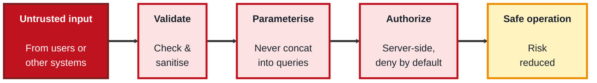
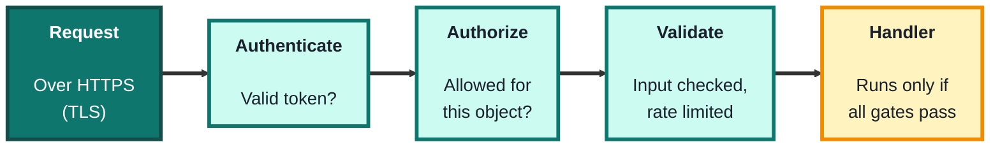

## Module 8: Secure Coding

**Tools needed for this module:** a code editor and a language runtime you're comfortable with (Node.js or Python are convenient for the examples), a terminal, and `curl` from Module 1 for testing endpoints. Optionally, a deliberately-vulnerable practice app like **OWASP Juice Shop** run locally, and a dependency scanner such as `npm audit`. As always, only test applications you own or that are built for training.

### Topic 8.1: OWASP Top 10

#### Concept

The **OWASP Top 10** is the industry-standard awareness list of the most critical security risks facing web applications, published by the **Open Worldwide Application Security Project** and updated periodically. It isn't a complete checklist of everything, it's the short list of what most commonly and seriously goes wrong, and it gives developers and testers a shared vocabulary and a starting point for building and reviewing secure software. The list is worth knowing by category, and worth understanding defensively: for each risk, the goal is to know how to prevent it, not how to exploit it.

- **Broken Access Control** (the current number one) is when users can act outside their intended permissions, the defence is server-side authorization checks on every request and deny-by-default
- **Injection** (such as SQL injection) happens when untrusted input is interpreted as a command or query, the defence is parameterised queries and strict input validation, never building queries by string concatenation
- **Cryptographic Failures** cover weak or missing protection of sensitive data, the defence ties back to Module 4: strong algorithms, proper key handling, encryption in transit and at rest
- **Security Misconfiguration** covers insecure defaults, unnecessary features left on, and verbose error messages that leak internals, the defence is hardening and minimising the configuration
- **Vulnerable and Outdated Components** is using libraries with known published flaws, the defence is dependency scanning and keeping components patched

#### Structure at a Glance


- A recurring theme across the Top 10 is **never trust input and always check authorization server-side**, the client can be manipulated, so every security decision has to be enforced on the server where the attacker can't reach it
- The Top 10 is an **awareness baseline, not a finish line**, clearing it is the minimum, not proof an app is secure, real security also needs secure design, testing, and defence in depth

#### Where you'd actually use this

Building web applications, reviewing code and pull requests for security issues, guiding a security assessment, and training developers. The Top 10 is the common reference point for "what should we make sure we didn't get wrong?" in nearly every web project.

#### Lab

> A code-review-and-fix exercise. No attacking required, the point is to recognise and repair the flaws.

1. **Study this vulnerable pattern** (building a query by concatenation, an injection risk):
```javascript
// Vulnerable: user input concatenated straight into the query
const q = "SELECT * FROM users WHERE name = '" + userInput + "'";
```
2. **Rewrite it safely** using a parameterised query, so input can never be treated as SQL:
```javascript
// Safe: input is passed as a parameter, not part of the query text
const q = "SELECT * FROM users WHERE name = ?";
db.query(q, [userInput]);
```
3. **Study this broken-access-control pattern** (trusting the client to say who it is):
```javascript
// Vulnerable: trusts a client-supplied role
if (request.body.role === "admin") { deleteUser(); }
```
4. **Rewrite it safely** with a server-side authorization check that doesn't trust client input:
```javascript
// Safe: authorization decided server-side from the authenticated session
if (session.user.isAdmin) { deleteUser(); }
```
5. **Scan for vulnerable components** in a project you own, to see the "outdated components" risk concretely:
```bash
npm audit
```

#### Checkpoint
You can recognise and fix an injection flaw (parameterisation) and a broken-access-control flaw (server-side authorization), and you've run a dependency scan, and you can explain the recurring principle that input is never trusted and authorization is always enforced server-side.

#### Quiz
1. What is the OWASP Top 10, and who publishes it?
2. What causes injection, and what is the main defence against it?
3. What is broken access control, and how do you defend against it?
4. Why is "trust the client" a dangerous pattern, and where must security decisions be enforced?
5. Why is the OWASP Top 10 described as a baseline rather than a complete guarantee of security?

*Answers: 1) An industry-standard awareness list of the most critical web application security risks, published by the Open Worldwide Application Security Project (OWASP). 2) Injection happens when untrusted input is interpreted as part of a command or query; the main defence is parameterised queries plus strict input validation, never concatenating input into queries. 3) Broken access control is when users can act outside their intended permissions; you defend against it with server-side authorization checks on every request and a deny-by-default posture. 4) Because the client can be manipulated by an attacker, so anything the client sends can be forged; security decisions must be enforced on the server, where the attacker can't tamper with them. 5) Because it covers only the most common and critical risks, not everything; clearing it is the minimum bar, and real security also requires secure design, testing, and defence in depth.*

---

### Topic 8.2: Secure APIs

#### Concept

**APIs** are the interfaces that let applications and services talk to each other, and because they expose functionality and data directly, they're one of the biggest attack surfaces in modern software (OWASP maintains a separate API Security Top 10 for exactly this reason). A secure API treats every request as untrusted and puts it through a series of gates: prove who you are (**authentication**), prove you're allowed to do this specific thing (**authorization**), validate the input, limit the rate, and always travel over encrypted transport. The single most common API flaw is failing to check that the caller is authorized for the *specific object* they're requesting.

- **Authentication** verifies the caller, using established mechanisms like **OAuth 2.0** tokens or API keys, never a home-grown scheme, and never trusting the client to assert its own identity
- **Authorization on every request** must check both function-level and **object-level** permissions, broken object-level authorization (asking for record 124 when you're only entitled to 123) is the top API risk
- **Input validation** checks and sanitises all incoming data server-side, since APIs receive input from clients you don't control
- **Rate limiting** caps how many requests a caller can make, blunting brute-force, credential-stuffing, and abuse
- **Transport security** means always using HTTPS/TLS (Modules 1 and 4), so tokens and data are never sent in the clear

#### Structure at a Glance


- The gates are ordered and every request passes through all of them, a request that authenticates successfully still has to prove it's authorized for the specific object it asked for, which is exactly the check that's most often missed
- Secure APIs also fail safely: return generic errors that don't leak internal details, and log requests for monitoring (Module 7), so an attack on the API is both hard to succeed at and easy to detect

#### Where you'd actually use this

Designing and reviewing any API that backs a web or mobile app, a public developer API, or service-to-service communication in a system. As applications increasingly become collections of APIs, securing them well is one of the most important secure-coding skills.

#### Lab

> Harden a sample endpoint conceptually, then test one gate with `curl`. Use an app you own.

1. **Start from an insecure endpoint** that returns any record by ID with no checks, and list what's missing (auth, object-level authz, validation, rate limit, TLS).
2. **Add authentication**: require a valid token and reject requests without one.
```javascript
if (!isValidToken(request.headers.authorization)) return respond(401);
```
3. **Add object-level authorization**: confirm the authenticated user is allowed to access *this specific* record, defeating the top API risk.
```javascript
if (record.ownerId !== session.user.id) return respond(403);
```
4. **Add input validation and a rate limit**, and ensure the endpoint is only served over HTTPS.
5. **Test a gate with curl**: call the endpoint without a token and confirm you get a `401`, then reason about what each other gate protects against.
```bash
curl -i https://your-app.example/api/records/123
```

#### Checkpoint
You can identify the security gates a request should pass (transport, authentication, object-level authorization, validation, rate limiting), add them to an endpoint, and test that an unauthenticated request is rejected, and you can explain why broken object-level authorization is the top API risk.

#### Quiz
1. Why are APIs considered such a large attack surface?
2. What is the difference between authentication and authorization for an API request?
3. What is broken object-level authorization, and why is it so common?
4. What does rate limiting protect against?
5. Name two things beyond authentication that a secure API request should pass through.

*Answers: 1) Because APIs expose application functionality and data directly to callers, so flaws in them give attackers direct access; they receive input from clients the provider doesn't control. 2) Authentication verifies who the caller is (a valid token), while authorization decides whether that authenticated caller is allowed to perform this specific action on this specific object. 3) It's when an API authenticates a user but fails to check they're entitled to the specific object requested (for example returning record 124 to a user only entitled to 123); it's common because developers often check identity but forget the per-object permission check. 4) Brute-force attempts, credential stuffing, and general abuse, by capping how many requests a caller can make. 5) For example: object-level and function-level authorization, input validation, rate limiting, and transport security (HTTPS/TLS), any two.*

---

## Module 8 Completion Checklist
- [ ] Recognised and fixed an injection flaw using a parameterised query
- [ ] Recognised and fixed a broken-access-control flaw using a server-side authorization check
- [ ] Ran a dependency scan to surface vulnerable/outdated components
- [ ] Hardened an API endpoint with transport, authentication, object-level authorization, validation, and rate limiting
- [ ] Tested that an unauthenticated API request is rejected
- [ ] Can explain the recurring principle: never trust input, and always enforce authorization server-side and per object
