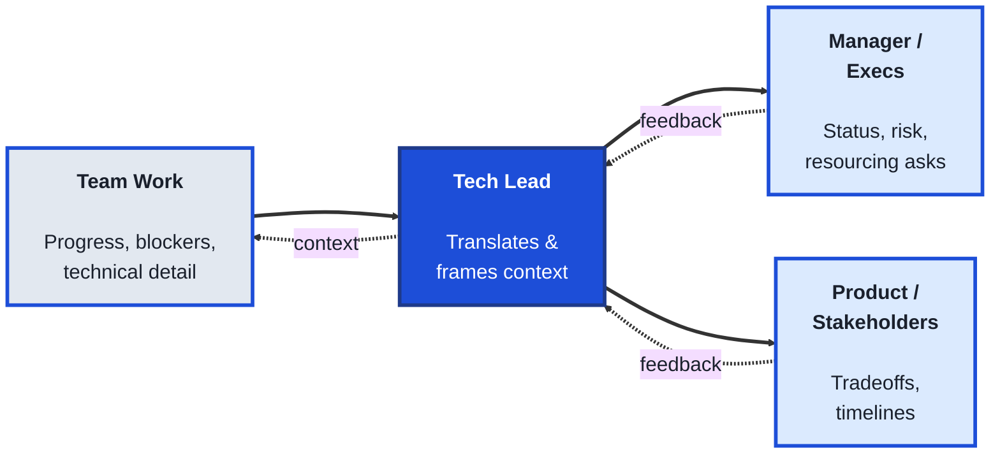
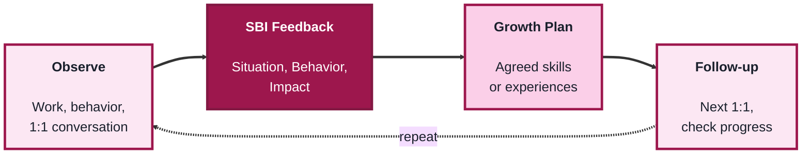
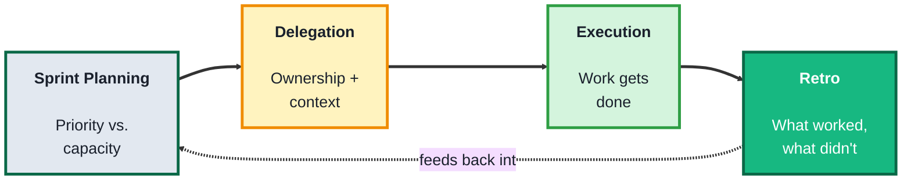

## Module 1: TechLeads (Business & Leadership)

**Purpose of this module:** Lead technology teams without necessarily writing code. This module is about the human and organizational side of engineering leadership, communication, coaching, and team management, rather than technical execution.

**Tools needed for this module:** No software installation required. A notes app or doc tool for templates (1:1 notes, feedback drafts, delegation matrix) is helpful but any notebook works. If your team already uses a project tool (Jira, Linear, Asana, etc.), you can use it for the Team Management lab, but it isn't required to start.

### Topic 1.1: Communication

#### Concept

Leading a technology team means constantly translating, turning technical detail into something a non-technical stakeholder can act on, and turning business priorities into something an engineer can build against. Unlike an individual contributor, whose primary audience is other engineers, a tech lead's communication has to work for multiple audiences at once: the team, their manager, product, and sometimes customers or executives, each of whom needs a different level of detail and a different framing of the same underlying facts.

- **Stakeholder translation** is converting technical detail (architecture tradeoffs, bug root causes, timeline risk) into language and framing a non-technical audience can act on
- **Status reporting** is a regular, concise summary of progress, blockers, and risk, written so someone who wasn't in the room still understands where things stand
- **Active listening** is fully attending to what someone says before responding, confirming understanding rather than assuming it, especially important when a report or stakeholder raises a concern
- **Upward communication** is surfacing risk, bad news, or resource needs to your own manager early and clearly, rather than letting them discover it later

#### Structure at a Glance

- Good status reporting answers three questions every time, regardless of format: what happened, what's at risk, and what's needed, so the reader never has to ask a follow-up just to understand the basics
- The same information often needs two versions: a detailed one for the team, and a compressed one for stakeholders who only need the headline and the ask

#### Where you'd actually use this

Writing a weekly status update that a busy VP can read in thirty seconds and still understand the real risk, explaining to product why a "simple" feature request actually needs three weeks, or flagging to your manager early that a deadline is at risk instead of surprising them the week it slips.

#### Lab

1. **Pick a real (or recent) technical situation** on your team, a delay, an incident, an architecture decision, anything with some complexity behind it.
2. **Write two versions of a status update about it:**
   - A **team version**: detailed, technical, assumes shared context.
   - A **stakeholder version**: 3-5 sentences, no jargon, leads with impact and what's needed from the reader.
3. **Check your stakeholder version against the three-question test**: does it answer what happened, what's at risk, and what's needed, without the reader having to ask?
4. **Practice active listening in a real conversation this week**: in your next 1:1 or stakeholder call, consciously pause before responding and reflect back what you heard in one sentence before giving your own view.
5. **Identify one piece of bad news or risk** you've been sitting on, and draft the message you'd send upward to surface it now rather than later.

#### Checkpoint
You have two written versions of the same update aimed at two different audiences, you've practiced reflecting back what you heard in a real conversation, and you've drafted (and ideally sent) one piece of upward communication you'd been putting off.

#### Quiz
1. Why does a tech lead's communication need to work for multiple audiences differently, compared to an individual contributor's?
2. What is "stakeholder translation"?
3. What three questions should a good status update answer?
4. What is "upward communication," and why does surfacing bad news early matter?
5. What does "active listening" require beyond simply hearing what someone said?

*Answers: 1) A tech lead reports to and coordinates with the team, their manager, product, and sometimes execs or customers, each needing a different level of detail and framing of the same facts, unlike an IC whose main audience is other engineers. 2) Converting technical detail like architecture tradeoffs or timeline risk into language and framing a non-technical audience can act on. 3) What happened, what's at risk, and what's needed. 4) Proactively telling your own manager about risk, bad news, or resource needs early, rather than letting them find out later; it matters because it preserves trust and gives more time to react. 5) Confirming understanding, such as reflecting back what was said, rather than just hearing the words and immediately responding with your own view.*

---

### Topic 1.2: Coaching

#### Concept

Coaching is different from managing a task list: it's about growing the people on your team over time, not just getting today's work done. A tech lead who only assigns and checks work is managing output; a tech lead who also gives specific, actionable feedback and helps someone build a growth plan is developing people, which is what keeps a team strong beyond any single project.

- **1:1s** are regular, recurring individual meetings focused on the report's growth, blockers, and concerns, not just a status check on their tickets
- **The SBI framework (Situation-Behavior-Impact)** is a feedback structure: describe the specific situation, the observed behavior, and its impact, which keeps feedback concrete instead of vague or personal
- **Growth plans** are a documented, agreed set of skills or experiences a report is working toward, revisited periodically rather than set once and forgotten
- **Coaching vs. mentoring** is a useful distinction: coaching draws answers out of the person through questions, while mentoring shares your own experience or answer directly; a good tech lead uses both, but leans on coaching to build the other person's own judgment

#### Structure at a Glance

- Coaching is a repeating cycle, not a one-time event: the follow-up step is what separates a growth plan that actually happens from one that's written once and forgotten
- Feedback lands better close to the moment it happens; SBI works whether it's given the same day or saved for a scheduled 1:1, but waiting too long makes the "situation" harder for both people to recall accurately

#### Where you'd actually use this

Giving a report specific, non-personal feedback after a rough code review discussion instead of a vague "communicate better" comment, running a 1:1 that surfaces a report's actual career goals instead of only their current ticket status, or asking a coaching question that helps someone solve their own problem instead of just handing them the answer.

#### Lab

1. **Pick a real situation** where someone's behavior (yours, a report's, a peer's) had a noticeable impact, positive or negative.
2. **Write it up using SBI:** one or two sentences each for the Situation, the Behavior, and the Impact. Keep it factual and specific, avoid labels like "unprofessional" or "great attitude."
3. **Run (or role-play) a 1:1** using that SBI feedback: deliver it, then ask an open coaching question ("What do you think led to that?" or "What would you try differently next time?") instead of immediately prescribing a fix.
4. **Draft a one-page growth plan** for a real or hypothetical report: 2-3 specific skills or experiences, how you'll know progress is happening, and when you'll next check in.
5. **Schedule the follow-up** on a real calendar, even if it's a placeholder, so the growth plan doesn't quietly expire.

#### Checkpoint
You have one SBI feedback write-up, one growth plan with a concrete follow-up date, and you've practiced asking an open coaching question instead of giving a direct answer.

#### Quiz
1. What is the main difference between managing a task list and coaching someone?
2. What does the SBI framework stand for, and why does it keep feedback concrete?
3. What is a growth plan, and why does it need to be revisited rather than set once?
4. What's the difference between coaching and mentoring?
5. Why does feedback tend to land better closer to the moment it happens?

*Answers: 1) Managing a task list focuses on getting today's work done; coaching focuses on growing the person over time, which is what keeps a team strong beyond any single project. 2) Situation-Behavior-Impact; describing the specific situation, the observed behavior, and its impact keeps the feedback factual instead of vague or personal. 3) A documented, agreed set of skills or experiences a report is working toward; it needs revisiting because without a follow-up it's easy for the plan to be written once and forgotten. 4) Coaching draws answers out of the person through questions, while mentoring shares your own experience or answer directly. 5) The details of the situation and behavior are easier for both people to recall accurately, making the feedback more concrete and credible.*

---

### Topic 1.3: Team Management

#### Concept

Managing a team day-to-day is about making sure work is planned, distributed, and reviewed in a way that keeps both the output and the people healthy. Unlike coaching, which is about individual growth, team management operates at the group level, how work gets planned, who owns what, and how the team learns from what just happened, so the same mistakes don't repeat and the same people don't get consistently overloaded.

- **Delegation** is assigning ownership of a piece of work to someone else, along with enough context and authority that they can actually own it, not just execute steps you dictate
- **Sprint / iteration planning** is the recurring process of deciding what the team will work on next, sized and sequenced against priority and capacity
- **Retrospectives ("retros")** are a recurring, structured team conversation about what worked, what didn't, and what to change, focused on the process rather than blaming individuals
- **Team health** covers signals like workload balance, morale, and turnover risk, things a tech lead has to watch for proactively since they rarely show up as a ticket in the backlog

#### Structure at a Glance

- A retro is only useful if it changes the next planning cycle; a team that identifies the same issue retro after retro without any resulting change in how work is planned isn't actually retro-ing, it's just venting
- Delegation and micromanagement are easy to confuse from the outside; the real test is whether the person has enough context and authority to make their own decisions on the work, not just a list of steps to follow

#### Where you'd actually use this

Deciding what a team commits to next sprint given real capacity instead of wishful thinking, handing off a project to a senior engineer with enough context that they can make their own calls instead of checking in on every decision, or running a retro after a rough release that produces one or two concrete process changes instead of a list of complaints nobody acts on.

#### Lab

1. **Build a simple delegation matrix** for your current or a hypothetical team: list 3-5 pieces of ongoing work, who owns each one, and one sentence on what context or authority they need to actually own it (not just execute it).
2. **Run a lightweight sprint/iteration planning exercise:** list your team's top 5-8 candidate tasks, rough-size each one, and sequence them against your team's real capacity for the period, cutting anything that doesn't fit rather than overcommitting.
3. **Run (or role-play) a retro** on a recent piece of work: gather 3 "what worked," 3 "what didn't," and narrow it down to exactly one concrete change you'll actually make next cycle.
4. **Check your retro output against the planning exercise**: does the one concrete change actually show up in how you planned the next round of work?
5. **Do a quick team-health gut check:** for each person on your team (or a hypothetical one), note one signal of workload or morale you'd want to watch, even if nothing is currently wrong.

#### Checkpoint
You have a delegation matrix with real ownership and context notes, a sprint plan sized against real capacity, and one retro that produced exactly one concrete change which shows up in that plan.

#### Quiz
1. What is delegation, and how is it different from just assigning steps to follow?
2. What is sprint or iteration planning?
3. What makes a retrospective effective, according to this module?
4. Why is "team health" something a tech lead has to watch for proactively rather than wait to be told about?
5. What's the real test for whether delegation has actually happened versus micromanagement?

*Answers: 1) Assigning ownership of a piece of work to someone else; it's different from just assigning steps because it comes with enough context and authority for the person to actually own the work and make their own decisions on it. 2) The recurring process of deciding what the team will work on next, sized and sequenced against priority and real capacity. 3) It produces at least one concrete process change that actually shows up in the next planning cycle, rather than surfacing the same complaints repeatedly with no resulting change. 4) Signals like workload balance, morale, and turnover risk rarely show up as a ticket in the backlog, so a tech lead has to actively watch for them rather than waiting for them to be reported. 5) Whether the person has enough context and authority to make their own decisions on the work, not just a list of steps to follow.*

---

## Module 1 Completion Checklist
- [ ] Written a team-facing and a stakeholder-facing version of the same status update, and checked it against the three-question test
- [ ] Practiced active listening in a real conversation and drafted one piece of upward communication
- [ ] Written a piece of feedback using the SBI framework and delivered it with an open coaching question
- [ ] Drafted a one-page growth plan with a scheduled follow-up
- [ ] Built a delegation matrix with real ownership and context for each item
- [ ] Run a sprint/iteration plan sized against real capacity
- [ ] Run a retro that produced exactly one concrete change, and confirmed it shows up in the next plan
