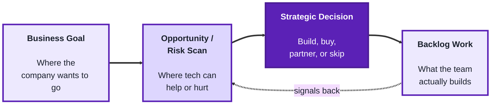
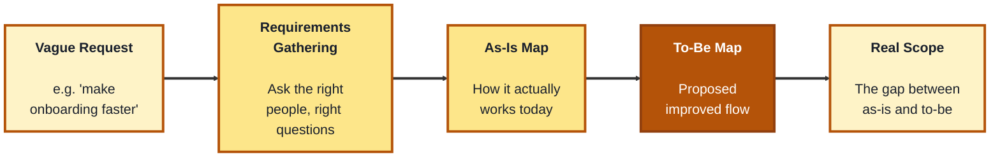
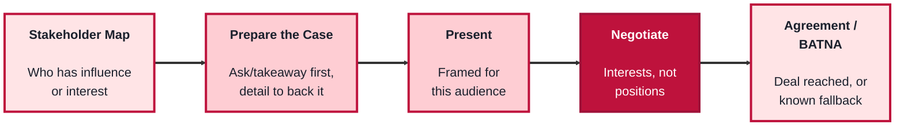

## Module 2: Strategy, Business Analysis & Stakeholder Management

**Purpose of this module:** Round out the business side of technology leadership, thinking beyond the current sprint (Strategy), translating business needs into buildable work (Business Analysis), and getting buy-in from the people who aren't in the room day to day (Stakeholder Management).

**Tools needed for this module:** No software installation required. A whiteboard or diagramming tool (physical whiteboard, or something like Miro/FigJam/Lucidchart) is useful for process mapping and is referenced in the Business Analysis lab, but pen and paper work just as well to start.

### Topic 2.1: Strategy

#### Concept

Strategy is the layer above the backlog: deciding not just *how* to build something, but *whether* and *why* it should be built at all, and how it fits into where the business is trying to go. A tech lead operating strategically isn't just executing the roadmap handed to them, they're helping shape it, spotting where technology can create an advantage (or where it's quietly becoming a liability) before it turns into an urgent problem.

- **Digital transformation** is the deliberate use of technology to change how a business operates or delivers value, not just digitizing an existing paper process, but rethinking the process itself around what technology now makes possible
- **Innovation** is deliberately creating space, time, or process for new ideas to surface and get tested, rather than assuming they'll appear on their own between deadlines
- **Strategic alignment** means a given piece of technical work can be traced back to a real business goal; work that can't be connected to one is a candidate for cutting, however technically interesting it is
- **Build vs. buy vs. partner** is a recurring strategic decision: whether a capability should be built in-house, bought as an existing product, or accessed through a partnership, each with different cost, control, and speed tradeoffs

#### Structure at a Glance

- Innovation without a route back into real backlog work stays a side project forever; the loop only closes when a tested idea actually becomes prioritized work
- A "build" decision that can't be tied to a specific business goal is usually a sign the strategic step got skipped, not that the technical work was wrong

#### Where you'd actually use this

Making the case that a clunky manual process should be rebuilt around what a new tool now makes possible instead of just digitizing the existing paper form, deciding whether to build an internal tool in-house versus buying an existing SaaS product, or carving out real time for the team to prototype an idea instead of letting it die between sprint deadlines.

#### Lab

1. **Pick one real (or recent) piece of technical work** your team has done or is doing, and trace it back to the specific business goal it serves. If you can't name one, note that.
2. **Run a build-vs-buy-vs-partner exercise** on one real capability your team is considering: list the rough cost, control, and speed tradeoff for each option in one sentence apiece, and pick one, with your reasoning.
3. **Identify one manual or "as-is" process** in your organization that's a candidate for digital transformation, not just digitizing it, but describe how it could be reshaped around what's now possible.
4. **Carve out a small, real block of time** (even an hour) for the team to prototype or explore one idea that isn't currently on the roadmap.
5. **Close the loop:** write one sentence on how that prototype, if it works, would actually get back into planned work rather than staying a side project.

#### Checkpoint
You have one piece of work traced to a business goal (or flagged as unconnected), one build-vs-buy-vs-partner decision with reasoning, one process identified for transformation (not just digitization), and a real, scheduled block of prototyping time with a stated path back into the backlog.

#### Quiz
1. How does strategy differ from simply executing a given roadmap?
2. What is digital transformation, and how is it different from just digitizing an existing process?
3. What does "strategic alignment" mean for a piece of technical work?
4. What are the three options in a build-vs-buy-vs-partner decision, and what varies across them?
5. Why does innovation need a real route back into backlog work to matter?

*Answers: 1) Strategy involves helping shape the roadmap and deciding whether and why something should be built at all, not just executing what's already been handed down. 2) Using technology to deliberately change how a business operates or delivers value, rethinking the process itself, rather than simply digitizing the existing paper process as-is. 3) That the work can be clearly traced back to a real business goal; work that can't be connected to one is a candidate for cutting. 4) Building in-house, buying an existing product, or partnering; cost, control, and speed tradeoffs vary across the three. 5) Without a route back into prioritized work, a tested idea stays a side project indefinitely instead of ever becoming something the team actually ships.*

---

### Topic 2.2: Business Analysis

#### Concept

Business analysis is the translation layer between what the business needs and what a team can actually build. It's easy for a request to arrive vague ("make onboarding faster") or for a current process to only exist in people's heads; business analysis makes both concrete enough to act on, first by pinning down what's actually required, then by mapping how the work really happens today (not how it's assumed to happen).

- **Requirements gathering** is the structured process of finding out what a solution actually needs to do, by asking the right people the right questions, rather than assuming or guessing
- **Functional vs. non-functional requirements** is a useful split: functional requirements describe what the system should do, non-functional requirements describe how well it should do it (speed, reliability, security), and both need to be captured, not just the former
- **Process mapping** is documenting a workflow step by step, usually visually, to show how work actually moves through a system or team today, which frequently differs from how everyone assumed it worked
- **As-is vs. to-be** is the standard process-mapping pair: the as-is map captures the current, real process (warts and all), the to-be map captures the proposed improved version, and the gap between them is the actual scope of the work

#### Structure at a Glance

- A requirement that's never checked against a real person doing the real job tends to reflect what leadership assumes happens, not what actually happens, which is exactly why the as-is map often surprises people
- Non-functional requirements are the ones most often skipped, and the ones most likely to cause a painful surprise later (a feature that works but falls over under real load, for instance)

#### Where you'd actually use this

Turning a vague ask like "make onboarding faster" into a concrete list of what the system must do and how well it must do it, mapping how support tickets actually move through your team today before proposing a new tool to fix it, or catching that the "obvious" bottleneck everyone assumed was the problem isn't actually where the delay lives once the as-is map is drawn out.

#### Lab

1. **Take one vague request** (real or invented, e.g. "make onboarding faster," "reduce support ticket backlog") and run a short requirements-gathering pass: write 3-5 questions you'd ask real stakeholders to turn it into something concrete.
2. **From those answers (real or assumed), write out functional and non-functional requirements separately**: at least 3 functional ("the system must...") and at least 2 non-functional ("it must do so within/at a rate of...").
3. **Pick one real process** you're familiar with (onboarding a new hire, deploying a change, handling a support ticket) and draw its **as-is map**: the actual steps, in order, including the annoying or informal ones people don't usually mention.
4. **Draw a to-be map** for the same process: the proposed improved version.
5. **Compare the two maps and name the gap** in one or two sentences, that gap is the real scope of the work, not the original vague request.

#### Checkpoint
You have a requirements-gathering question list, a split list of functional and non-functional requirements, an as-is map and a to-be map for a real process, and a one-to-two-sentence statement of the actual scope implied by the gap between them.

#### Quiz
1. What problem does business analysis solve between "what the business needs" and "what a team builds"?
2. What is the difference between functional and non-functional requirements?
3. What is process mapping, and why does the as-is map often surprise people?
4. What do "as-is" and "to-be" refer to, and what does the gap between them represent?
5. Why are non-functional requirements the ones most often skipped, and what's the risk of skipping them?

*Answers: 1) It translates a vague or assumed need into something concrete enough to actually act on, by gathering real requirements and mapping how work really happens rather than how it's assumed to happen. 2) Functional requirements describe what the system should do; non-functional requirements describe how well it should do it, like speed, reliability, or security. 3) Documenting a workflow step by step, usually visually, to show how work actually moves through a system or team; it often surprises people because the real process frequently differs from how everyone assumed it worked. 4) The as-is map captures the current, real process; the to-be map captures the proposed improved version; the gap between them is the actual scope of the work. 5) They're less visible than functional requirements and easier to assume rather than specify; skipping them risks a feature that technically works but fails under real conditions, like real load or real security demands.*

---

### Topic 2.3: Stakeholder Management

#### Concept

Requirements and process maps only matter if the people who can approve, fund, or block the work actually agree to move forward, which means a tech lead also has to be effective at presenting ideas persuasively and negotiating when priorities or resources conflict. Stakeholder management is less about being naturally charismatic and more about a repeatable set of habits: knowing your audience, structuring a case clearly, and understanding what each side actually needs before a negotiation starts.

- **Presentations** in this context means structuring a case for a specific audience, leading with the takeaway or ask, not the methodology, and backing it with just enough detail to be credible without losing the room
- **Stakeholder mapping** is identifying who has influence or interest in a decision, and roughly how much of each, so you know who needs deep involvement versus a brief heads-up
- **Negotiation** is finding an agreement between parties with different (and sometimes conflicting) interests, most useful when framed around each side's underlying interest, not just their stated opening position
- **BATNA (Best Alternative To a Negotiated Agreement)** is your fallback if no agreement is reached; knowing it clearly before a negotiation starts is what keeps you from accepting a worse deal than walking away would give you

#### Structure at a Glance

- A presentation built around the presenter's process ("first we looked at X, then we considered Y...") loses a busy stakeholder audience; leading with the ask and backing into detail only as needed keeps their attention
- Negotiating without a known BATNA means you can't actually tell whether the deal on the table is good, since you have nothing real to compare it against

#### Where you'd actually use this

Pitching a technical investment to executives who care about the business outcome, not the architecture, figuring out which stakeholders need to be consulted deeply on a decision versus just informed after the fact, or negotiating for more headcount or timeline by understanding what the other side actually needs rather than just repeating your own ask louder.

#### Lab

1. **Pick a real decision or ask** you need buy-in for (more headcount, more time, approval for a technical investment) and **build a quick stakeholder map**: list the key people, and rate each as high/low influence and high/low interest.
2. **Prepare a short case for the highest-influence stakeholder**, 3-5 sentences, leading with the ask or takeaway first, with just enough supporting detail after it to be credible.
3. **Deliver (or role-play) that case** and note whether you actually led with the ask, it's a surprisingly common slip to bury it in the third sentence.
4. **Before a real or hypothetical negotiation on the same ask, write down your BATNA**: what happens, concretely, if no agreement is reached at all.
5. **Write down what you believe the other side's underlying interest is** (not their stated position), and one way to frame the ask that speaks to that interest directly.

#### Checkpoint
You have a stakeholder map with influence/interest ratings, a short ask-first case for your highest-influence stakeholder, a clearly stated BATNA, and one sentence connecting your ask to the other side's actual underlying interest.

#### Quiz
1. Why does stakeholder management matter even if the requirements and process work are already solid?
2. What is stakeholder mapping used for?
3. What should a presentation lead with, and what's the common mistake this avoids?
4. What does it mean to negotiate around "interests, not positions"?
5. What is a BATNA, and why does knowing it matter before a negotiation starts?

*Answers: 1) Because the people who can approve, fund, or block the work still need to agree to move forward; solid analysis alone doesn't guarantee buy-in. 2) Identifying who has influence or interest in a decision, and how much of each, so you know who needs deep involvement versus just a heads-up. 3) It should lead with the takeaway or ask, not the methodology; this avoids losing a busy audience that tunes out before the process-heavy setup reaches the point. 4) Focusing on each side's underlying interest rather than their stated opening position, since the stated position isn't always what they actually need. 5) Your best alternative if no agreement is reached; knowing it clearly keeps you from accepting a worse deal than simply walking away would give you.*

---

## Module 2 Completion Checklist
- [ ] Traced one piece of work to a business goal and made one build-vs-buy-vs-partner decision with reasoning
- [ ] Identified one process for digital transformation and scheduled real prototyping time with a stated path back into the backlog
- [ ] Written a requirements-gathering question list and split functional vs. non-functional requirements for one request
- [ ] Drawn an as-is and a to-be map for one real process and named the gap between them
- [ ] Built a stakeholder map with influence/interest ratings for a real ask
- [ ] Prepared and delivered an ask-first case for your highest-influence stakeholder
- [ ] Written a clear BATNA and connected your ask to the other side's underlying interest
