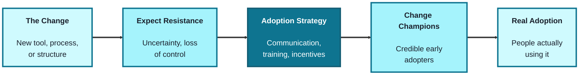
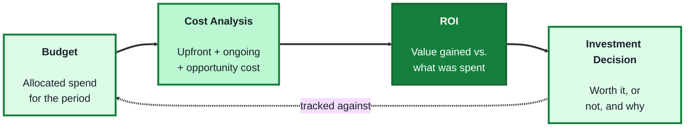
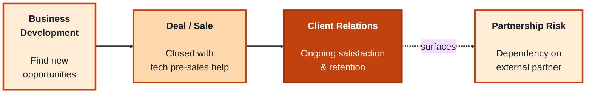
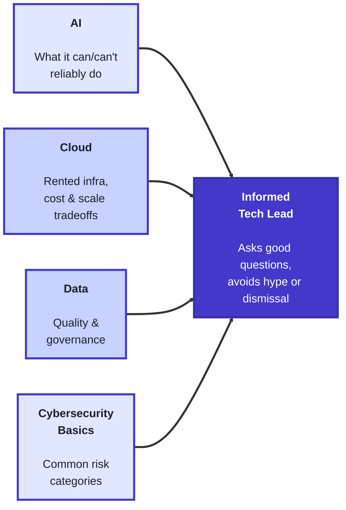

## Module 3: Change Management, Financial Literacy, Sales & Partnerships, and Technology Awareness

**Purpose of this module:** Cover the remaining breadth a tech lead needs outside pure engineering: leading people through change, speaking the language of money, understanding how the business grows externally, and staying fluent enough in emerging technology to make informed calls without being a specialist in all of it.

**Tools needed for this module:** No software installation required. A spreadsheet tool (Excel, Google Sheets) is useful for the Financial Literacy lab, and any note-taking tool works for the rest.

### Topic 3.1: Change Management

#### Concept

Any meaningful technical change, a new tool, a new process, a reorg, a platform migration, fails or succeeds based on how people adopt it, not just on whether it was built correctly. Change management is the discipline of planning for that human side deliberately, rather than assuming a good solution will simply be adopted because it's good.

- **Organizational change** is a shift that affects how people work, not just what tool they use, new processes, new reporting lines, or new expectations, which is why it needs more deliberate handling than a typical technical rollout
- **Resistance to change** is a normal, expected reaction, not a sign of a bad team, usually driven by uncertainty, perceived loss of control, or past changes that were poorly handled
- **Adoption strategies** are the deliberate tactics used to get people actually using a change, communication, training, incentives, and visible leadership support, rather than just announcing the change once and moving on
- **Change champions** are early, credible adopters embedded in the team who model the new behavior and answer peer questions, often more persuasive than the same message coming from leadership alone

#### Structure at a Glance

- A change announced once and never reinforced tends to quietly fade back to the old way of working; adoption needs to be checked on, not just launched
- Treating resistance as something to plan for in advance, rather than a surprise to react to after the fact, is what separates a change that sticks from one that gets rolled back six months later

#### Where you'd actually use this

Rolling out a new development workflow and planning for the team members who'll quietly keep using the old one, migrating a platform and identifying a credible senior engineer to champion it instead of relying only on a leadership announcement, or recognizing that pushback on a new process is normal friction to work through rather than a sign the change was a mistake.

#### Lab

1. **Pick a real or upcoming organizational change** on your team (a new tool, process, or structural shift).
2. **List the likely sources of resistance** to it, 3-4 specific reasons people might push back, tied to uncertainty, control, or past experience, not just "people don't like change."
3. **Draft an adoption strategy** for that change: one sentence each for communication, training, and incentive (what makes adopting it worth the friction).
4. **Identify one potential change champion** on the team, someone credible who could model the new behavior early, and write one sentence on why they'd be effective in that role.
5. **Plan one check-in** after the initial rollout (a week or a month later) specifically to see whether adoption is holding or quietly reverting.

#### Checkpoint
You have a list of specific resistance sources, a one-sentence adoption strategy across communication/training/incentive, one named change champion with reasoning, and one scheduled adoption check-in.

#### Quiz
1. Why does a technically good solution sometimes fail to be adopted?
2. What is organizational change, and how is it different from a typical technical rollout?
3. Why should resistance to change be treated as normal rather than a sign of a bad team?
4. What are adoption strategies, and name two examples.
5. What is a change champion, and why can they be more persuasive than leadership alone?

*Answers: 1) Adoption depends on how people respond to the change, not just on whether the solution itself was built correctly; without deliberate change management, a good solution can still go unused. 2) A shift that affects how people work, not just what tool they use, such as new processes or reporting lines, which needs more deliberate handling than a typical technical rollout. 3) Resistance is usually driven by normal reactions like uncertainty, perceived loss of control, or past changes that were poorly handled, not by the team being bad at their jobs. 4) Deliberate tactics used to get people actually using a change; examples include communication, training, incentives, and visible leadership support. 5) A credible early adopter embedded in the team who models the new behavior and answers peer questions; they're often more persuasive than leadership because the message comes from a peer rather than from above.*

---

### Topic 3.2: Financial Literacy

#### Concept

Technical decisions have financial consequences, and financial constraints shape technical decisions right back, which is why a tech lead needs enough fluency to have a real conversation about money, not necessarily to build the budget themselves, but to understand it well enough to make a credible case and not be talked past in a finance conversation.

- **Budgeting** is planning how much money is allocated to a team or project over a period, and tracking actual spend against that plan so overages are caught early rather than at year-end
- **ROI (Return on Investment)** is a way of expressing whether a cost is worth it, roughly, the value gained divided by what was spent to get it, used to compare different possible investments against each other
- **Cost analysis** is breaking down what something actually costs, not just the sticker price, but ongoing costs like maintenance, support, and opportunity cost (what you can't do because you chose this instead)
- **CapEx vs. OpEx** is a useful distinction: capital expenditure (a large upfront cost, like buying hardware) versus operating expenditure (an ongoing recurring cost, like a subscription), and the two are often treated differently in a company's finances even for a similar underlying need

#### Structure at a Glance

- A cost analysis that only counts the sticker price will consistently underestimate the real cost of a decision; maintenance and opportunity cost are easy to leave out and often add up to more than the upfront number
- ROI is only as credible as the estimate behind it; a rough, honestly-labeled estimate is more useful in a real conversation than a precise-looking number built on shaky assumptions

#### Where you'd actually use this

Explaining to finance why a tool that looks more expensive upfront is actually cheaper once ongoing maintenance is counted, making the case for a new platform investment using a rough but honest ROI estimate instead of vague enthusiasm, or catching partway through the year that a project is tracking over budget in time to actually do something about it.

#### Lab

1. **Pick a real or hypothetical technology investment** (a new tool, a platform migration, additional infrastructure).
2. **Run a cost analysis**: list the upfront cost, at least one ongoing cost (maintenance, support, subscription), and one opportunity cost (what you'd have to give up or delay to afford this).
3. **Estimate a rough ROI** for the same investment: your best estimate of the value gained (time saved, revenue enabled, risk avoided) versus the total cost from step 2. Label your assumptions clearly, precision isn't the point, an honest, defensible estimate is.
4. **Classify the investment as CapEx or OpEx** (or a mix), and note whether that classification changes how easy it is to get approved.
5. **Set up a simple budget-tracking check**: if you had this in a real budget, what would you check monthly to catch an overage early rather than at year-end?

#### Checkpoint
You have a cost analysis covering upfront, ongoing, and opportunity cost, a rough labeled ROI estimate, a CapEx/OpEx classification, and one concrete monthly check you'd use to catch a budget overage early.

#### Quiz
1. Why does a tech lead need financial literacy even if they aren't the one building the budget?
2. What is ROI, and what is it used for?
3. What does a cost analysis include beyond the sticker price?
4. What is the difference between CapEx and OpEx?
5. Why does budgeting need ongoing tracking rather than just an initial plan?

*Answers: 1) So they can have a credible conversation about money, understand financial constraints, and make a strong case for technical investments rather than being talked past in a finance conversation. 2) A way of expressing whether a cost is worth it, roughly the value gained divided by what was spent; it's used to compare different possible investments against each other. 3) Ongoing costs like maintenance and support, and opportunity cost, what you can't do because you chose this option instead. 4) CapEx is a large upfront cost, like buying hardware; OpEx is an ongoing recurring cost, like a subscription; the two are often treated differently in a company's finances even for a similar underlying need. 5) So overages are caught early, during the period, rather than discovered only at year-end when it's too late to adjust.*

---

### Topic 3.3: Sales & Partnerships

#### Concept

Even in a purely internal engineering role, understanding how the business grows externally, through new customers, new deals, and new partners, helps a tech lead make better calls about what to prioritize and why certain "urgent" requests exist in the first place. This isn't about becoming a salesperson; it's about understanding enough of that world to be a better internal partner to the people who are.

- **Business development** is the work of identifying and pursuing new opportunities for growth, new markets, new partnerships, new revenue streams, distinct from sales, which focuses on closing specific deals
- **Client relations** is the ongoing management of a relationship with a customer or partner after the initial deal, keeping them satisfied, informed, and retained, not just winning them once
- **Technical pre-sales support** is when engineering or leadership gets pulled into a sales conversation to explain feasibility, answer technical questions, or reassure a prospective client, a common way technology and sales intersect
- **Partnership dependency risk** is the risk that comes from relying on an external partner (a vendor, an API, an integration) for something critical, worth naming explicitly rather than discovering when the partner changes terms or goes down

#### Structure at a Glance

- A deal closed with an unrealistic technical promise made during pre-sales becomes engineering's problem the moment it's signed, which is exactly why technical input during the sales conversation matters
- Partnership dependency risk is easiest to manage when it's named before a partner becomes critical, not after an outage or a contract renegotiation reveals how exposed you are

#### Where you'd actually use this

Getting pulled into a sales call to confirm a feature is technically feasible before a deal is promised to a client, recognizing that a key customer's escalation is really a client-relations issue needing a different response than a normal bug report, or flagging that a critical integration depends entirely on one external vendor before that dependency becomes a crisis.

#### Lab

1. **Identify one real or hypothetical business development opportunity** relevant to your organization (a new market, a new partnership, a new revenue stream) and write 2-3 sentences on what technical capability it would require.
2. **Role-play or draft a technical pre-sales moment**: a prospective client asks whether your product can do X; write the honest, technically accurate answer you'd give, resisting the urge to over-promise.
3. **Pick one real client or customer relationship** (internal or external) and note one thing you'd do to maintain it proactively, before there's a problem, rather than only reacting to complaints.
4. **List one external partner, vendor, or API** your team currently depends on for something important, and name the specific risk if that partnership changed or failed.
5. **Write one mitigation** for that partnership dependency risk (a fallback, a contract term to watch, a monitoring alert), even a partial one.

#### Checkpoint
You have one business development opportunity mapped to a technical capability, one honest pre-sales answer drafted, one proactive client-relations action, and one named partnership dependency risk with a mitigation.

#### Quiz
1. Why does understanding sales and partnerships matter for a tech lead, even in a purely internal role?
2. What is the difference between business development and sales?
3. What is client relations, and how is it different from just winning a deal once?
4. What is technical pre-sales support, and why does it matter?
5. What is partnership dependency risk, and why is it better to name it explicitly in advance?

*Answers: 1) It helps them prioritize better and understand why certain "urgent" requests exist, and makes them a better internal partner to the people focused on growth. 2) Business development identifies and pursues new opportunities for growth, like new markets or partnerships; sales focuses on closing specific deals. 3) The ongoing management of a relationship with a customer or partner after the initial deal, keeping them satisfied, informed, and retained, rather than only winning them once. 4) When engineering or leadership gets pulled into a sales conversation to explain feasibility or answer technical questions; it matters because an unrealistic promise made during pre-sales becomes engineering's problem the moment the deal is signed. 5) The risk of relying on an external partner for something critical; naming it in advance lets you plan a mitigation, rather than discovering the exposure only after an outage or a contract renegotiation.*

---

### Topic 3.4: Technology Awareness

#### Concept

A tech lead doesn't need to be a hands-on expert in every emerging technology, but does need enough working literacy to ask good questions, spot real risk, and avoid being either dismissive of something genuinely useful or oversold on something that's mostly hype. This topic covers baseline awareness across four areas that come up constantly in leadership conversations: AI, cloud, data, and cybersecurity.

- **AI** here means having a working sense of what modern AI/ML systems can and can't reliably do, enough to evaluate a proposed AI feature honestly rather than assuming it's either magic or a gimmick
- **Cloud** refers to renting computing infrastructure (storage, servers, services) from a provider instead of owning physical hardware, with tradeoffs in cost, scalability, and control worth understanding even if you never configure it directly
- **Data** covers the basics of how an organization collects, stores, and uses data, including why data quality and governance (who owns it, who can access it) matter as much as having the data at all
- **Cybersecurity basics** means understanding common risk categories (phishing, weak access control, unpatched software, third-party risk) well enough to ask the right questions of a security team, not to perform security work yourself

#### Structure at a Glance

- These four areas overlap constantly in practice, an AI feature depends on cloud infrastructure, needs good-quality data, and introduces its own cybersecurity considerations, so awareness in one area alone isn't enough
- The goal here is calibrated confidence, being able to say honestly "this is realistic" or "this is overstated," not becoming a specialist in any one of the four

#### Where you'd actually use this

Pushing back constructively when a proposed AI feature is being oversold as a guaranteed fix, asking whether a new system's cost and scaling assumptions actually hold up before committing to a cloud architecture, questioning who really owns and can access a sensitive dataset before a new use case is approved, or asking a security team pointed questions about third-party risk instead of assuming a vendor's "we take security seriously" is sufficient.

#### Lab

1. **Pick one AI-related claim or proposal** you've encountered (real or hypothetical, "we'll use AI to automate X") and write an honest one-paragraph assessment: what's realistic about it, and what's likely overstated.
2. **Describe one system your organization uses or could use** in terms of cloud tradeoffs: what you gain (scalability, lower upfront cost) and what you give up (control, ongoing cost, vendor dependency).
3. **Pick one dataset you're aware of** and answer: who owns it, who can access it, and is there a known data-quality issue with it? If you don't know the answers, that's itself worth noting.
4. **List three common cybersecurity risk categories** (e.g. phishing, weak access control, unpatched software, third-party risk) and, for one of them, write one question you'd ask your security team to check your organization's exposure.
5. **Pick one place where two of these four areas intersect** in something your team actually works on (e.g. an AI feature that depends on cloud infrastructure and a specific dataset) and note the one cross-cutting risk that's easy to miss if you only look at one area at a time.

#### Checkpoint
You have one honest AI-claim assessment, one cloud tradeoff description, one data-ownership/quality check, three named cybersecurity risk categories with one real question for your security team, and one identified cross-area intersection with its associated risk.

#### Quiz
1. Why does a tech lead need technology awareness across AI, cloud, data, and cybersecurity without being a specialist in any of them?
2. What does "AI awareness" mean in this context?
3. What is the core tradeoff of using cloud infrastructure instead of owning physical hardware?
4. Why do data quality and governance matter as much as simply having the data?
5. What does "cybersecurity basics" mean for a tech lead, as opposed to a security specialist?

*Answers: 1) So they can ask good questions, spot real risk, and avoid being either dismissive of something genuinely useful or oversold on something that's mostly hype, since these four areas come up constantly in leadership conversations. 2) Having a working sense of what modern AI/ML systems can and can't reliably do, enough to evaluate a proposed AI feature honestly rather than assuming it's magic or a gimmick. 3) Renting computing infrastructure instead of owning hardware trades cost and scalability benefits for less direct control. 4) Because having data alone isn't useful if it's poor quality or if ownership and access aren't clear; both matter for the data to be trustworthy and usable. 5) Understanding common risk categories like phishing, weak access control, unpatched software, and third-party risk well enough to ask the right questions of a security team, not to perform the security work directly.*

---

## Module 3 Completion Checklist
- [ ] Listed specific resistance sources and drafted an adoption strategy with a named change champion
- [ ] Scheduled a post-rollout check-in to confirm adoption is holding
- [ ] Run a cost analysis (upfront, ongoing, opportunity cost) and a rough labeled ROI estimate for a real investment
- [ ] Classified an investment as CapEx or OpEx and set up a monthly budget-tracking check
- [ ] Mapped a business development opportunity to a technical capability and drafted an honest pre-sales answer
- [ ] Identified a partnership dependency risk with a mitigation
- [ ] Written an honest assessment of an AI claim, a cloud tradeoff description, and a data ownership/quality check
- [ ] Named three cybersecurity risk categories and identified one cross-area risk intersection
