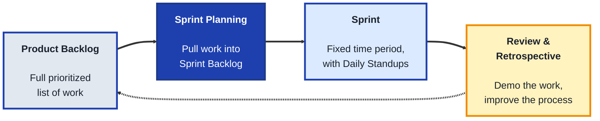
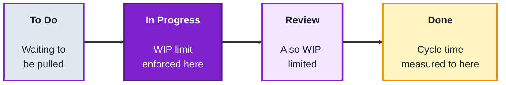
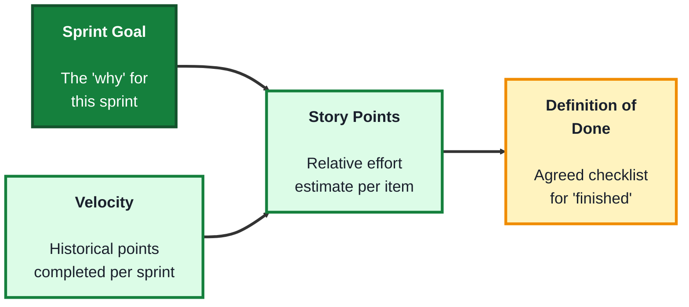

## Module: Agile (TechPO: Product & Project Management)

**Purpose:** Plan, build, and deliver technology products.

**Tools needed for this module:** A web browser and a free account with a board tool such as [Trello](https://trello.com) or [Jira](https://www.atlassian.com/software/jira) (Jira's free tier is closer to what real Scrum/Kanban teams use, but Trello works fine for the exercises in this module). No coding environment or installs are required.

### Topic 1: Scrum

#### Concept

**Scrum** is a structured Agile framework built around fixed-length iterations called **sprints**, with a defined set of roles, meetings (called **ceremonies**), and artifacts that give a team a predictable rhythm for planning, building, and reviewing work. It's designed to make progress visible in short, regular intervals rather than waiting until an entire project is finished to check in.

- A **sprint** is a fixed time period (commonly one or two weeks) during which a team commits to completing a specific set of work, sprints don't change length mid-stream, consistency is part of the point
- The three Scrum roles are the **Product Owner** (decides what gets built and in what order), the **Scrum Master** (protects the team's process and removes blockers), and the **Development Team** (builds the work)
- The core ceremonies are **Sprint Planning** (deciding what to work on), the **Daily Standup** (a short daily sync on progress and blockers), the **Sprint Review** (demoing completed work to stakeholders), and the **Sprint Retrospective** (reflecting on how the team can improve its process)
- The **Product Backlog** is the full, prioritized list of everything that could be built, the **Sprint Backlog** is the smaller subset pulled into the current sprint

#### Structure at a Glance

- Once a sprint starts, the Sprint Backlog is meant to be protected from new work being added mid-sprint, this stability is what lets a team actually finish what they committed to, constantly re-prioritizing mid-sprint undermines the whole framework
- The Scrum Master role is often misunderstood as a manager, its actual job is closer to a facilitator, removing obstacles and protecting the team's process, not assigning tasks or directing the work itself

#### Where you'd actually use this

Software teams building a product incrementally, where stakeholders want regular, predictable checkpoints to see progress and adjust priorities, especially when work can be broken into pieces small enough to complete within a one- or two-week window.

#### Lab

1. **Create a free account** on Trello or Jira and set up three lists/columns, "Product Backlog," "Sprint Backlog," and "Done."
2. **Write 8 to 10 small backlog items** for a hypothetical product (reuse the plant-care app idea from earlier modules, or pick your own), and place them all in the Product Backlog column.
3. **Run a mock Sprint Planning session**: pick 3 to 4 items you could realistically finish in one week, and move only those into the Sprint Backlog column.
4. **Simulate three Daily Standups** by writing one sentence each day (for three days) noting what you did, what you'll do next, and any blocker, even if the "work" is just planning.
5. **Hold a mock Sprint Review and Retrospective**: write two sentences summarizing what would be demoed to a stakeholder, and one thing you'd change about the process next sprint.

#### Checkpoint
You have a Product Backlog, a Sprint Backlog pulled from it during a mock planning session, three days of simulated standup notes, and a mock review and retrospective summary.

#### Quiz
1. What are the three roles in Scrum, and what does each one do?
2. What is the difference between the Product Backlog and the Sprint Backlog?
3. Name the four core Scrum ceremonies.
4. Why is the Sprint Backlog protected from new work once a sprint starts?
5. What is a common misconception about the Scrum Master role?

*Answers: 1) The Product Owner decides what gets built and in what order, the Scrum Master protects the team's process and removes blockers, the Development Team builds the work. 2) The Product Backlog is the full, prioritized list of everything that could be built, the Sprint Backlog is the smaller subset pulled into the current sprint. 3) Sprint Planning, the Daily Standup, the Sprint Review, and the Sprint Retrospective. 4) Because that stability is what lets a team actually finish what they committed to, constantly re-prioritizing mid-sprint undermines the whole framework. 5) That it's a management role, when it's actually closer to a facilitator role, focused on removing obstacles and protecting the process rather than assigning tasks or directing the work.*

---

### Topic 2: Kanban

#### Concept

**Kanban** is a more flexible Agile approach built around visualizing work as it flows through stages on a board, with an emphasis on limiting how much is in progress at once, rather than working in fixed-length sprints like Scrum. Where Scrum plans in batches, Kanban is a continuous flow, new work can be pulled in as soon as capacity frees up, not just at the start of a new sprint.

- A **Kanban board** visualizes work as cards moving through columns representing stages (commonly "To Do," "In Progress," "Done")
- **WIP limits** (Work In Progress limits) cap how many cards are allowed in a given column at once, forcing the team to finish existing work before starting new work, rather than starting everything at once and finishing nothing
- **Pull-based flow** means new work is pulled into a column only when there's room under its WIP limit, rather than being pushed in by a manager's schedule
- **Cycle time** measures how long a card takes to move from start to finish, a key Kanban metric for understanding whether flow is actually improving over time

#### Structure at a Glance

- WIP limits feel counterintuitive to beginners, it seems like starting more work should mean finishing more work, but without a limit, everything ends up half-finished, and nothing actually ships, this is Kanban's central insight
- Unlike Scrum, Kanban has no required roles or fixed ceremonies, which makes it more adaptable for ongoing support or maintenance work where the flow of incoming tasks is unpredictable, but also means it provides less built-in structure for teams that need one

#### Where you'd actually use this

Ongoing support or maintenance work, bug triage, or any team whose incoming work is unpredictable and doesn't fit neatly into fixed sprint-length batches, where visualizing flow and limiting work-in-progress matters more than planning in advance.

#### Lab

1. **Create a Kanban board** with four columns: "To Do," "In Progress," "Review," "Done."
2. **Set a WIP limit** of 2 on both "In Progress" and "Review" (most board tools let you set and display this limit directly on the column).
3. **Add 6 to 8 small tasks** to "To Do" (reuse tasks from Topic 1's backlog, or invent new ones), and pull only up to the WIP limit into "In Progress."
4. **Simulate moving cards through the board** over a few rounds, moving a card to "Review" only when a slot opens up, and to "Done" only after review, respecting the WIP limits the entire time even if it means leaving cards waiting in "To Do."
5. **Note the "start" and "finish" time** (even just a rough timestamp) for two or three cards as they move across the board, and calculate a rough cycle time for each.

#### Checkpoint
You have a Kanban board with enforced WIP limits, cards that moved through it while respecting those limits, and a rough cycle time calculated for at least two cards.

#### Quiz
1. What is a WIP limit, and what problem is it meant to solve?
2. What is the key structural difference between Kanban and Scrum in terms of timing?
3. What does "pull-based flow" mean?
4. What is "cycle time," and why is it a useful metric?
5. Why might Kanban suit ongoing support work better than Scrum?

*Answers: 1) A cap on how many cards are allowed in a column at once, it solves the problem of a team starting too much work at once and finishing very little of it. 2) Kanban is a continuous flow with no fixed-length iterations, Scrum plans and commits to work in fixed-length sprints. 3) New work is pulled into a column only when there's room under its WIP limit, rather than being pushed in on a fixed schedule. 4) How long a card takes to move from start to finish, it's useful because it shows whether a team's flow is actually improving or getting worse over time. 5) Because incoming support work is unpredictable and doesn't fit neatly into fixed sprint-length batches, Kanban's continuous flow adapts to that better than Scrum's batch planning.*

---

### Topic 3: Sprint Planning

#### Concept

**Sprint Planning** is the specific Scrum ceremony where a team decides exactly what work will be pulled into the upcoming sprint, turning a long, loosely prioritized backlog into a small, concrete, and realistic commitment. Done well, it balances ambition (getting real value delivered) against honesty about how much a team can actually finish.

- **Story points** are a relative unit of effort or complexity (not time) used to estimate backlog items, commonly using a scale like 1, 2, 3, 5, 8, 13, so a "5" is meant to be roughly five times harder than a "1," not five hours of work
- **Velocity** is how many story points a team has historically completed per sprint, used to estimate how much new work is realistic to commit to
- A **sprint goal** is a single, short sentence describing the overall purpose of the sprint, giving the team's individual tasks a shared "why" beyond just a checklist
- **Definition of Done** is the team's agreed checklist for when a piece of work is actually finished (tested, reviewed, deployed), not just "looks complete," this prevents ambiguity about whether something is truly ready

#### Structure at a Glance

- Story points being relative (not time-based) is a common point of confusion for beginners, the goal is comparing items to each other, not predicting exact hours, that's precisely why velocity (points completed historically) becomes a useful planning tool over time
- Skipping a clear Definition of Done is a common cause of disputes mid-sprint, disagreements about "is this actually finished" almost always trace back to that checklist never being agreed on up front

#### Where you'd actually use this

Any Scrum team preparing to start a new sprint, deciding what's realistic to commit to based on past velocity, and making sure everyone shares the same understanding of the sprint's purpose and what "done" actually means for the work being pulled in.

#### Lab

1. **Reuse the backlog** from Topic 1's Product Backlog.
2. **Assign story points** to each backlog item using a 1, 2, 3, 5, 8 scale, based on relative complexity compared to the other items, not estimated hours.
3. **Assume a velocity** of 10 points per sprint (a made-up but realistic number for a small team), and select only enough items from the backlog to add up to roughly that total.
4. **Write a one-sentence sprint goal** that ties the selected items together around a shared purpose (for example, "Get new users through onboarding without confusion").
5. **Write a short Definition of Done** (3 to 5 checklist items, like "tested," "reviewed by another team member," "deployed to staging") that would apply to every item in this sprint.

#### Checkpoint
You have a sprint's worth of backlog items estimated in story points, selected to roughly match an assumed velocity, tied together with a sprint goal, and paired with a written Definition of Done.

#### Quiz
1. What do story points measure, and what do they deliberately not measure?
2. What is "velocity," and how is it used in planning?
3. What is a sprint goal, and why does it matter beyond just a list of tasks?
4. What is a "Definition of Done," and what problem does it prevent?
5. Why might a team's assumed velocity change over time?

*Answers: 1) They measure relative effort or complexity, they deliberately don't measure estimated time or hours. 2) How many story points a team has historically completed per sprint, it's used to estimate how much new work is realistic to commit to in an upcoming sprint. 3) A single, short sentence describing the sprint's overall purpose, it matters because it gives the team's individual tasks a shared "why" beyond just a checklist of unrelated items. 4) The team's agreed checklist for when work is actually finished, it prevents disputes and ambiguity about whether something is truly ready versus just looking complete. 5) Because velocity is based on historical performance, it can shift as the team's size, skill, or the nature of the work itself changes over time.*

---

## Module Completion Checklist
- [ ] Built a Product and Sprint Backlog, simulated three days of standups, and written a mock review and retrospective summary
- [ ] Built a Kanban board with enforced WIP limits and calculated a rough cycle time for at least two cards
- [ ] Estimated a backlog in story points, selected work to match an assumed velocity, and written a sprint goal and Definition of Done
- [ ] Can explain the key structural difference between Scrum's fixed sprints and Kanban's continuous flow
- [ ] Can explain why WIP limits and a clear Definition of Done each prevent a specific, common team problem
