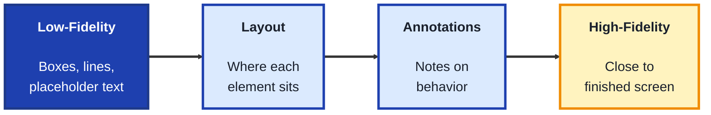
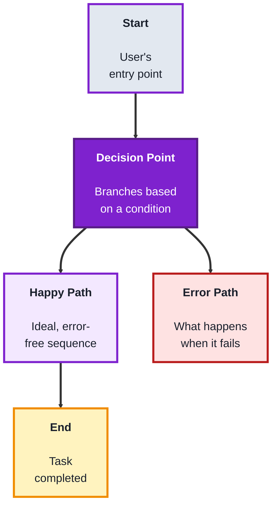
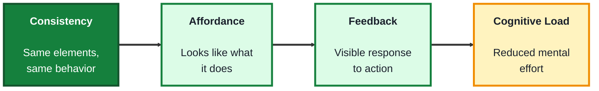

## Module: Product Design (TechPO: Product & Project Management)

**Purpose:** Plan, build, and deliver technology products.

**Tools needed for this module:** A web browser and a free account with a design tool such as [Figma](https://www.figma.com) (its free tier is enough for every exercise in this module). No coding environment or installs are required.

### Topic 1: Wireframes

#### Concept

A **wireframe** is a low-detail, structural sketch of a screen, showing what's on it and roughly where, without colors, fonts, or finished visuals. Its whole purpose is speed: wireframes let a team test layout and structure cheaply, before investing time in visual design that would be expensive to throw away.

- **Fidelity** describes how polished or detailed a design is, **low-fidelity** wireframes use boxes, lines, and placeholder text, **high-fidelity** wireframes (sometimes called mockups) look close to a finished screen
- A **layout** is the arrangement of elements on a screen, wireframes exist specifically to test layout decisions before any visual styling is applied on top of them
- **Placeholder content** (like "Lorem ipsum" text or gray boxes for images) stands in for real content that isn't ready yet, keeping focus on structure rather than specific wording or imagery
- **Annotations** are short notes added to a wireframe explaining behavior that isn't visually obvious (like "this button opens a modal"), bridging the gap between a static image and how the screen actually works

#### Structure at a Glance

- Beginners often jump straight to high-fidelity, colorful designs, but skipping low-fidelity wireframes means structural problems (like a confusing layout) get discovered only after time was already spent on visual polish that now has to be redone
- Feedback on a low-fidelity wireframe tends to focus on structure ("should this button be higher up?"), feedback on a high-fidelity mockup tends to focus on visuals ("I don't like this color"), even when structural feedback is what's actually needed, this is a reason to deliberately stay low-fidelity longer than feels natural

#### Where you'd actually use this

Testing whether a screen's layout makes sense before any visual design work begins, quickly exploring multiple layout options side by side, or getting early stakeholder feedback focused on structure rather than aesthetics.

#### Lab

1. **Create a free Figma account** and start a new file.
2. **Pick a single screen** from a product idea used in earlier modules (for example, the plant-care app's reminder screen).
3. **Sketch a low-fidelity wireframe** of that screen using only gray boxes, simple lines, and placeholder text, no colors, real images, or custom fonts.
4. **Add 3 to 4 annotations** to the wireframe explaining behavior that isn't visually obvious (for example, "tapping this box expands the plant's care instructions").
5. **Create a second version of the same wireframe** with a meaningfully different layout, and write two sentences comparing the tradeoffs of each version.

#### Checkpoint
You have a low-fidelity wireframe with annotations explaining its behavior, plus a second layout variation with a written comparison of the tradeoffs.

#### Quiz
1. What is the difference between low-fidelity and high-fidelity wireframes?
2. Why does wireframing exist as a separate, earlier step instead of designing in full color from the start?
3. What is "placeholder content," and why is it used?
4. What is an "annotation," and what problem does it solve?
5. Why might feedback differ between a low-fidelity and a high-fidelity version of the same screen?

*Answers: 1) Low-fidelity wireframes use boxes, lines, and placeholder text, high-fidelity wireframes (or mockups) look close to a finished screen with real visual styling. 2) Because wireframes let a team test layout and structure cheaply, before investing time in visual design that would be expensive to redo if the underlying structure turns out to be wrong. 3) Placeholder content (like gray boxes or Lorem ipsum text) stands in for real content that isn't ready yet, keeping focus on structure rather than specific wording or imagery. 4) A short note explaining behavior that isn't visually obvious, like what a button does when tapped, it solves the problem of a static image not being able to show interactivity on its own. 5) Because low-fidelity feedback tends to focus on structure, while high-fidelity feedback tends to focus on visuals like color, even when structural feedback is what's actually still needed.*

---

### Topic 2: User Flows

#### Concept

A **user flow** maps the sequence of steps a user takes to complete a specific task within a product, showing screens, decisions, and paths as a connected diagram rather than a single static screen. Where a wireframe answers "what's on this screen," a user flow answers "how does someone get from here to their goal, and what could go wrong along the way."

- A **start point** and **end point** define the boundaries of a flow, a flow should represent one specific, complete task from a clear beginning to a clear, successful end
- A **decision point** is a branch in the flow where the path differs based on a condition (like "is the user logged in?"), mapping these prevents a design from silently assuming everyone follows the same, "happy path"
- The **happy path** is the ideal, most common sequence a user takes with no errors or detours, an **edge case** or **error path** covers what happens when something goes wrong (a failed login, an empty search result)
- A **drop-off point** is a step in the flow where users commonly abandon the task, mapping the whole flow (not just the happy path) is what makes drop-off points visible and fixable

#### Structure at a Glance

- Mapping only the happy path is a common beginner mistake, real users hit errors, change their minds, and take unexpected paths constantly, a flow that ignores this ends up describing an idealized product that doesn't match reality
- A user flow deliberately leaves out visual detail (that's what wireframes and high-fidelity designs are for), mixing the two together makes a flow diagram harder to read and update as the design changes

#### Where you'd actually use this

Planning a multi-step process like account signup or checkout before designing individual screens, identifying where users are likely to get confused or give up, or aligning a team on exactly how a feature is supposed to work end to end.

#### Lab

1. **Pick a specific task** within your product idea that spans more than one screen (for example, "set a watering reminder for a new plant").
2. **Identify the clear start and end points** for that task, and list every screen or step involved along the happy path.
3. **Draw the happy path** as a simple flow diagram (boxes connected by arrows) using Figma or a simple diagramming tool.
4. **Add at least one decision point and one error path** to the flow, for example, "plant name already exists" branching to an error message instead of continuing forward.
5. **Identify one likely drop-off point** in the flow, and write one or two sentences suggesting a design change that might reduce it.

#### Checkpoint
You have a user flow diagram with a clear start and end, at least one decision point with a mapped error path, and a written note identifying a likely drop-off point and a possible fix.

#### Quiz
1. What is the difference between what a wireframe shows and what a user flow shows?
2. What is a "decision point," and why is mapping it important?
3. What is the difference between the happy path and an error path?
4. What is a "drop-off point," and why does mapping the full flow (not just the happy path) help find it?
5. Why is it a mistake to mix detailed visual design into a user flow diagram?

*Answers: 1) A wireframe shows what's on a single screen, a user flow shows the sequence of steps and screens a user takes to complete a specific task. 2) A branch in the flow where the path differs based on a condition, mapping it is important because it prevents a design from silently assuming everyone follows the same single path. 3) The happy path is the ideal, most common sequence with no errors, an error path covers what happens when something goes wrong, like a failed login or empty search result. 4) A step where users commonly abandon the task, mapping the full flow (including error paths and decision points) makes these visible, since a happy-path-only flow hides exactly where things actually go wrong. 5) Because a user flow is meant to focus on sequence and structure, mixing in visual detail makes the diagram harder to read and more work to update as the design itself changes.*

---

### Topic 3: UX Principles

#### Concept

**UX (User Experience) principles** are general, reusable guidelines that make a product easier and more pleasant to use, drawn from decades of observed patterns in how people actually perceive and interact with interfaces. They're not rigid rules to apply blindly, but defaults that require a deliberate reason to break.

- **Consistency** means similar elements look and behave the same way throughout a product, inconsistency forces users to relearn things that should already feel familiar
- **Feedback** means the product clearly responds to a user's action (a button visibly pressing, a loading spinner, a confirmation message), without it, users are left unsure whether anything happened at all
- **Affordance** is a visual cue suggesting how an element can be used, a button that looks raised suggests it can be pressed, a design that removes affordances entirely (flat, ambiguous elements) can leave users unsure what's even interactive
- **Cognitive load** is the mental effort required to use an interface, reducing unnecessary choices, steps, or information at any one moment is one of the most reliable ways to make a product feel easier to use

#### Structure at a Glance

- These principles work together more than separately, a button with strong affordance but no feedback when clicked can still leave a user confused about whether their click actually registered
- Breaking a principle isn't automatically wrong, but it should be a deliberate, considered choice made for a specific reason, not an accident from not knowing the principle existed in the first place

#### Where you'd actually use this

Reviewing a wireframe or user flow (from Topics 1 and 2) for usability issues before it's built, explaining to a stakeholder why a specific design choice (like an unclear icon or missing loading state) is likely to confuse users, or evaluating a competitor's product to learn from what works and what doesn't.

#### Lab

1. **Return to the wireframe** built in Topic 1 (or the flow from Topic 2).
2. **Review it against consistency**: check that similar elements (like buttons or navigation) look and behave the same way everywhere they appear, and note one inconsistency to fix if you find one.
3. **Review it against feedback**: identify one user action in the design (like tapping a button) and describe exactly what visible feedback the user would see confirming it worked.
4. **Review it against affordance**: pick one interactive element and evaluate whether its appearance makes clear that it's interactive, revising it if it doesn't.
5. **Review it against cognitive load**: count how many choices or pieces of information are presented on the busiest screen, and suggest one specific way to reduce that number without losing important functionality.

#### Checkpoint
You have reviewed your own wireframe or flow against all four principles, consistency, feedback, affordance, and cognitive load, with at least one specific, written improvement identified for each.

#### Quiz
1. What is "consistency" in UX, and why does inconsistency create extra work for users?
2. What is "feedback," and what happens to a user's experience without it?
3. What is an "affordance"? Give an example.
4. What is "cognitive load," and what's one reliable way to reduce it?
5. Are UX principles meant to be followed without exception? Explain briefly.

*Answers: 1) Similar elements looking and behaving the same way throughout a product, inconsistency creates extra work because it forces users to relearn things that should already feel familiar from elsewhere in the product. 2) A clear response to a user's action, like a visible button press or a confirmation message, without it users are left unsure whether their action actually registered. 3) A visual cue suggesting how an element can be used, for example a button that looks raised suggests it can be pressed. 4) The mental effort required to use an interface, one reliable way to reduce it is cutting unnecessary choices, steps, or information presented at any one moment. 5) No, they're defaults that require a deliberate reason to break, not rigid rules, breaking one should be a considered choice made for a specific reason rather than an accident.*

---

## Module Completion Checklist
- [ ] Built a low-fidelity wireframe with annotations and a second layout variation with tradeoffs compared
- [ ] Mapped a user flow with a clear start, end, a decision point, an error path, and an identified drop-off point
- [ ] Reviewed a wireframe or flow against all four UX principles with a specific improvement identified for each
- [ ] Can explain the difference between what a wireframe, a user flow, and a UX principle each address
- [ ] Can explain why mapping error paths and edge cases matters as much as mapping the happy path
