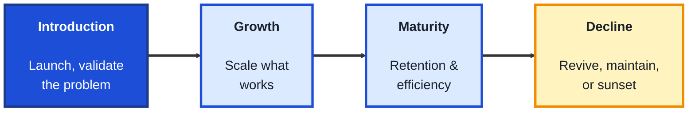
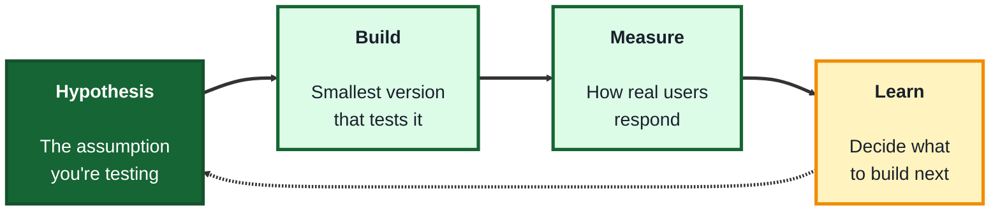
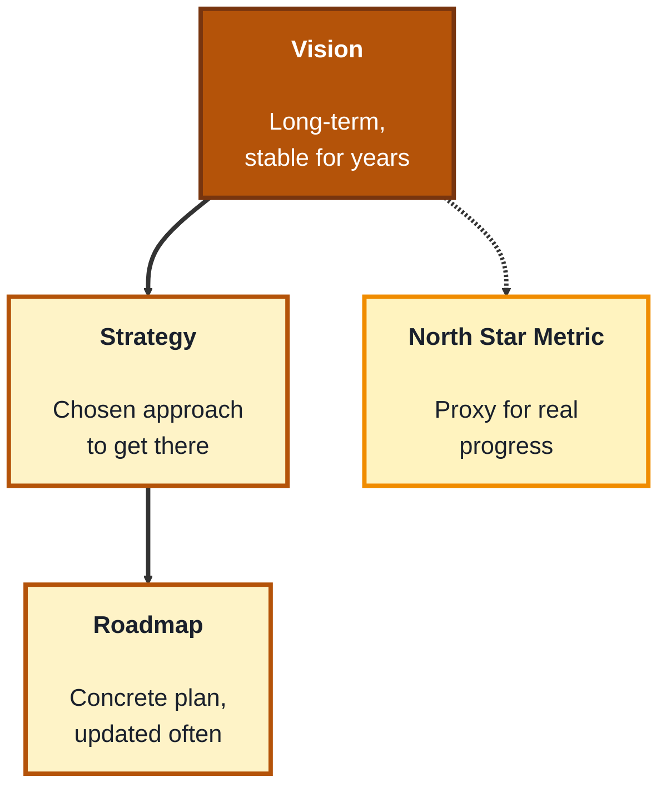

## Module: Product Fundamentals (TechPO: Product & Project Management)

**Purpose:** Plan, build, and deliver technology products.

**Tools needed for this module:** A web browser, a free account with a collaborative document tool such as [Google Docs](https://docs.google.com) or [Notion](https://www.notion.so), and a free account with a simple board tool like [Trello](https://trello.com) (used in the lab for Topic 2). No coding environment or installs are required.

### Topic 1: Product Lifecycle

#### Concept

The **product lifecycle** describes the stages a product moves through from an initial idea to eventual retirement, and understanding which stage a product is in shapes almost every decision a product manager makes, what to prioritize, what to measure, and even what "success" means at that moment. No single framework is universal, but most versions boil down to a similar shape.

- **Introduction** is when a product first launches, adoption is low, and the focus is on getting early users and validating that the product solves a real problem
- **Growth** is when adoption accelerates, the focus shifts to scaling what works, improving onboarding, and fixing issues that only appear at higher volume
- **Maturity** is when growth levels off, the focus shifts to retention, efficiency, and defending market position rather than rapid expansion
- **Decline** is when usage or relevance drops, the focus shifts to deciding whether to revive, maintain minimally, or **sunset** (retire) the product entirely

#### Structure at a Glance

- A product doesn't have to move through these stages in a straight line, a mature product can find new growth through a new market or feature, this is often called a **second growth curve**
- Metrics that matter change by stage, in introduction you're watching for problem-solution fit, in growth you're watching adoption and retention curves, in maturity you're watching efficiency and churn, using a growth-stage metric on a mature product (or vice versa) leads to the wrong conclusions

#### Where you'd actually use this

Deciding whether a declining feature is worth reviving or should be sunset, explaining to stakeholders why a mature product's roadmap should focus on retention rather than aggressive growth spending, or setting the right success metric for a brand-new product launch.

#### Lab

1. **Pick a real product you use regularly** (an app, a piece of software, a physical product with a digital companion app).
2. **In a shared doc**, write one paragraph placing that product in a lifecycle stage (Introduction, Growth, Maturity, or Decline) and explain your reasoning using observable evidence (how often it gets updated, how it's marketed, whether new features are still shipping).
3. **Identify one metric** that stage's team would likely be watching closely (for example, weekly active users during Growth, or churn rate during Maturity).
4. **Find a second example**, a product currently in Decline or that has been sunset, and note what signals told you that (an official announcement, stopped updates, migration prompts to a different product).
5. **Compare the two examples** in your doc, noting how the stage changes what "doing well" would even mean for each product.

#### Checkpoint
You have written a short lifecycle-stage analysis of two real products, including the evidence for your reasoning and the metric each stage's team would likely prioritize.

#### Quiz
1. Name the four stages of the product lifecycle described here.
2. What does a team typically focus on during the Introduction stage?
3. Why might a mature product experience a "second growth curve"?
4. Name a metric a Growth-stage team might watch, and one a Maturity-stage team might watch instead.
5. What are the three options a team generally has for a product in Decline?

*Answers: 1) Introduction, Growth, Maturity, and Decline. 2) Getting early users and validating that the product solves a real problem. 3) Because a product can find new growth through a new market or feature, even after its original growth has leveled off. 4) A Growth-stage team might watch weekly active users or adoption curves, a Maturity-stage team might watch churn rate or efficiency (any reasonable matching pair is valid). 5) Revive, maintain minimally, or sunset (retire) the product entirely.*

---

### Topic 2: MVP

#### Concept

An **MVP** (Minimum Viable Product) is the smallest version of a product that still lets you learn something real from actual users, it's not a low-quality product, it's a deliberately scoped one built to test a specific assumption before investing further. The goal of an MVP isn't to ship a small version of the final product, it's to answer a question as cheaply and quickly as possible.

- A **hypothesis** is the specific assumption an MVP is meant to test (for example, "people will pay for a faster way to book a haircut")
- **Scope** is what's deliberately left out of the MVP, most features, most polish, most edge cases, anything not needed to test the hypothesis
- A **build-measure-learn loop** is the cycle an MVP feeds into: build the smallest version, measure how real users respond, learn from that data, and decide what to build next
- A **fake door test** or **concierge MVP** are common MVP variations, a fake door tests demand with a button or page that doesn't yet do anything real, a concierge MVP delivers the product's value manually (by a human) before automating it

#### Structure at a Glance

- A common beginner mistake is building an MVP that's really just "the full product, but smaller," a true MVP is scoped around one specific hypothesis, not a miniature version of every planned feature
- The loop is meant to repeat, learnings from one MVP typically lead to a new (often different) hypothesis and a new, small test, not straight into full-scale building

#### Where you'd actually use this

Testing whether an idea for a new product or feature is worth real investment before committing significant engineering time, especially when the biggest risk isn't "can we build it" but "will anyone actually want it."

#### Lab

1. **Pick a product idea** (real or hypothetical), for example, "an app that reminds people to water their houseplants."
2. **Write a single, specific hypothesis** it should test, for example, "People will open a plant-care app at least twice a week if it sends reminders."
3. **Design a fake door test** for that hypothesis: sketch (in a doc, or with simple shapes) a single landing page with one button, like "Get notified when we launch," with no actual product behind it yet.
4. **Set up a simple Trello board** with three columns, "Build," "Measure," "Learn," and place a card describing your fake door test in the Build column.
5. **Write what you'd need to measure** to learn something from this test (like number of clicks or signups) and move the card to Measure, then write one sentence describing what a strong result versus a weak result would each teach you, moving the card to Learn.

#### Checkpoint
You have written a specific, testable hypothesis, designed a fake door test for it, and tracked it through a build-measure-learn board with a clear definition of what a strong or weak result would teach you.

#### Quiz
1. What is the actual goal of building an MVP?
2. What is a "hypothesis" in the context of an MVP?
3. What is the difference between a fake door test and a concierge MVP?
4. What's a common mistake beginners make when scoping an MVP?
5. What happens after the "Learn" step in the build-measure-learn loop?

*Answers: 1) To answer a specific question about whether an idea is worth further investment, as cheaply and quickly as possible, not to ship a small version of the final product. 2) The specific assumption the MVP is meant to test, for example that people would pay for a particular solution. 3) A fake door test checks demand with something that doesn't yet do anything real (like a button or landing page), a concierge MVP delivers the product's value manually, by a human, before it's automated. 4) Treating the MVP as a miniature version of the full product with many small features, instead of scoping it tightly around one specific hypothesis. 5) The loop typically repeats, learnings usually lead to a new hypothesis and a new, small test, rather than jumping straight into full-scale building.*

---

### Topic 3: Product Vision

#### Concept

A **product vision** is a clear, long-term statement of what a product is trying to achieve and why it matters, it's the anchor that keeps day-to-day decisions (what to build next, what to say no to) aligned with a bigger purpose. Unlike a roadmap, which changes often, a good vision is meant to stay stable for years, even as the specific features built to reach it evolve.

- A **vision statement** is a short, memorable description of the future the product is working toward, deliberately broad enough to survive changes in strategy or tactics
- A **strategy** sits between vision and execution, it's the approach chosen to move toward the vision (for example, "win small businesses first, then expand to enterprise")
- A **roadmap** is the concrete, more frequently updated plan of what will actually get built and when, in service of the strategy, which is in service of the vision
- **North star metric** is a single, chosen metric a team uses as the clearest proxy for whether they're making real progress toward the vision, distinct from smaller, feature-level metrics

#### Structure at a Glance

- Vision, strategy, and roadmap change at very different speeds, treating a roadmap item as if it were the vision itself (or changing the vision every time strategy shifts) is a common source of team misalignment
- A north star metric is meant to be resistant to gaming, a good one reflects genuine value delivered to users, not just an activity count that's easy to inflate without real progress

#### Where you'd actually use this

Explaining to a team why a specific feature request should be deprioritized because it doesn't serve the current strategy, writing a vision statement for a new product to rally a founding team, or choosing a north star metric that won't be misleading as the product grows.

#### Lab

1. **Pick the same product idea** from Topic 2's lab (the plant-care reminder app, or your own idea).
2. **Write a one-sentence vision statement** for it, broad enough that it wouldn't need to change even if the specific app features changed significantly over the next five years.
3. **Write one strategy statement** describing the chosen approach to get there (for example, "start with hobbyist plant owners before expanding to plant shops and nurseries").
4. **List three roadmap items** consistent with that strategy, and one plausible-sounding feature idea that you'd have to say no to because it doesn't serve the strategy, explaining why in one sentence.
5. **Choose a north star metric** for the product and explain in one or two sentences why it reflects genuine value delivered, rather than being easy to inflate artificially.

#### Checkpoint
You have written a vision statement, a supporting strategy, a small consistent roadmap, one deliberately rejected feature idea with reasoning, and a north star metric with justification for why it resists gaming.

#### Quiz
1. What is the key difference between a vision and a roadmap in terms of how often each changes?
2. What sits between vision and execution, and what is its role?
3. What is a "north star metric," and how is it different from a feature-level metric?
4. Why is a broad, stable vision statement useful even as specific features change?
5. Give an example of a mistake that happens when a team confuses roadmap items with the vision itself.

*Answers: 1) A vision is meant to stay stable for years, a roadmap is concrete and updated much more frequently. 2) Strategy, its role is to be the chosen approach for moving toward the vision, more specific than the vision but broader than a roadmap. 3) A single, chosen metric used as the clearest proxy for whether a team is making real progress toward the vision, as opposed to smaller, feature-level metrics that measure narrower activity. 4) Because it lets day-to-day decisions and roadmap changes stay aligned with a bigger purpose, without needing to be rewritten every time tactics shift. 5) Treating a specific roadmap item as if it were the unchangeable vision itself, which can cause a team to resist reasonable roadmap changes or lose sight of the bigger goal the roadmap is supposed to serve (any reasonable example of this confusion is valid).*

---

## Module Completion Checklist
- [ ] Placed two real products into lifecycle stages with supporting evidence and identified a relevant metric for each
- [ ] Written a specific, testable MVP hypothesis and designed a fake door test for it, tracked through a build-measure-learn board
- [ ] Written a vision statement, a supporting strategy, and a small consistent roadmap for a product idea
- [ ] Can explain the difference between vision, strategy, and roadmap, and how often each is expected to change
- [ ] Can explain why an MVP is scoped around a hypothesis rather than being a smaller version of the full product
