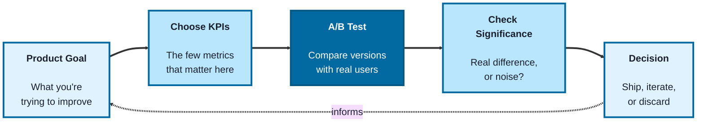
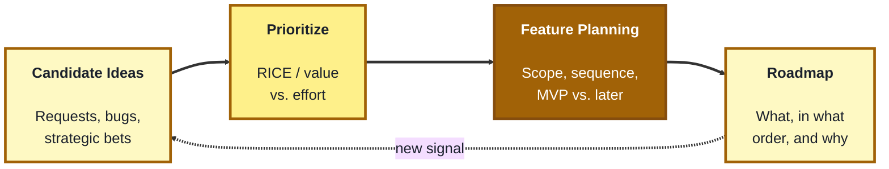
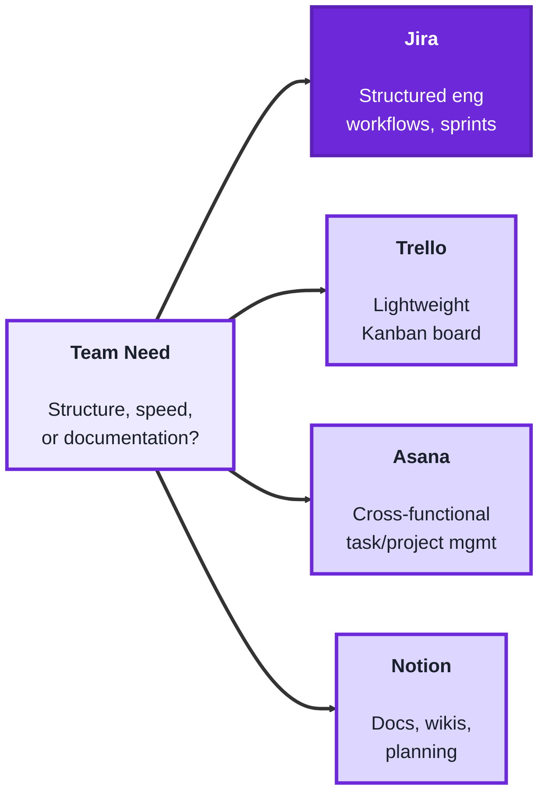

## Module 4: TechPO (Product & Project Management)

**Purpose of this module:** Plan, build, and deliver technology products. This module covers reading the numbers that tell you whether a product is working (Analytics), deciding what to build next and why (Roadmapping), and running the day-to-day work of a team using the tools product and project managers actually live in (Collaboration).

**Tools needed for this module:** A free account on at least one project/collaboration tool, Jira, Trello, Asana, or Notion, whichever your organization uses or you're most curious about. A spreadsheet tool (Excel, Google Sheets) is useful for the Analytics lab. No paid tools are required to complete this module.

### Topic 4.1: Analytics

#### Concept

You can't tell whether a product decision worked by opinion alone, you need numbers that reflect real user behavior, and you need to know which numbers actually matter for the question you're asking. Analytics for a product manager isn't about becoming a data scientist, it's about picking the right metric, reading it correctly, and knowing when a change is real versus noise.

- **KPIs (Key Performance Indicators)** are the small set of metrics that matter most for a specific goal, chosen deliberately so the team isn't drowning in every number that's technically measurable
- **Product metrics** cover the broader set of numbers that describe how a product is actually used, activation, retention, engagement, churn, each answering a different question about user behavior
- **A/B testing** is running two (or more) versions of something at the same time with different users, then comparing results, so a change can be attributed to the change itself rather than to unrelated factors like seasonality
- **Statistical significance** is a check on whether a result in an A/B test is a real difference or could plausibly be random noise, important because a small sample size can produce a result that looks meaningful but isn't

#### Structure at a Glance

- Picking too many KPIs is the same as picking none, if everything is a priority metric, nothing gets acted on when it moves
- A/B test results that aren't checked for significance are a common source of false confidence, a team can ship a "winning" variant that was actually a coin flip

#### Where you'd actually use this

Deciding which two or three metrics actually indicate whether a new onboarding flow is working, instead of tracking twenty vanity numbers, running an A/B test on a pricing page change and correctly holding off shipping until the result is statistically significant, or noticing that a metric like weekly active users looks great while retention is quietly declining underneath it.

#### Lab

1. **Pick a real or hypothetical product feature** (existing or planned) and choose 2-3 KPIs that would actually tell you if it's succeeding, and write one sentence justifying each choice.
2. **List which broader product metrics** (activation, retention, engagement, churn) are relevant to that same feature, and note which one you'd worry about most if it started declining.
3. **Design a simple A/B test** for a real or hypothetical change (a button color, an onboarding step, a pricing tier): describe the two versions, what you'd measure, and what result would count as a win.
4. **Write one sentence on why you'd want to check statistical significance** before declaring a winner in that test, and roughly how you'd know if your sample size was too small to trust the result.
5. **Find one real dashboard or report** (from work, or a public example) and identify one metric on it that could be misleading on its own without a second metric next to it for context.

#### Checkpoint
You have 2-3 justified KPIs for a real feature, a list of relevant product metrics with one flagged as the most concerning if it declined, a designed A/B test with a defined win condition, and one identified example of a metric that's misleading without context.

#### Quiz
1. Why is picking too many KPIs functionally the same as picking none?
2. What is the difference between a KPI and a product metric, as described here?
3. What is A/B testing, and why does it help attribute a result to a specific change?
4. What is statistical significance, and why does it matter in an A/B test?
5. Give an example of a metric that could look good while a related metric is quietly getting worse.

*Answers: 1) If every metric is treated as a priority, none of them get acted on distinctly when they move, since there's no clear signal about what actually matters. 2) A KPI is one of the small set of metrics deliberately chosen as most important for a specific goal; product metrics are the broader set of numbers describing overall usage, like activation, retention, engagement, and churn. 3) Running two or more versions with different real users at the same time and comparing results, so the outcome can be attributed to the change itself rather than unrelated factors like seasonality. 4) A check on whether a test result reflects a real difference or could plausibly be random noise; it matters because a small sample size can produce a result that looks meaningful but isn't. 5) Weekly active users can look strong while retention is quietly declining underneath it, since the first counts activity broadly while the second reflects whether the same users are actually staying.*

---

### Topic 4.2: Roadmapping

#### Concept

A roadmap is a plan for what gets built, in what order, and why, and the hardest part isn't listing ideas, it's saying no to good ideas because something else matters more right now. Roadmapping is the discipline of making that tradeoff deliberately and defensibly, instead of building whatever was requested most recently or loudest.

- **Prioritization** is deciding what to work on first based on a consistent method (value, effort, urgency, strategic fit), rather than gut feel or whoever asked last
- **Prioritization frameworks** like RICE (Reach, Impact, Confidence, Effort) or a simple value-vs-effort matrix give a repeatable way to compare very different kinds of work against each other
- **Feature planning** is breaking a prioritized idea down into something a team can actually build, scoping it, sequencing the pieces, and deciding what's in the first version versus a later one
- **MVP (Minimum Viable Product)** is the smallest version of a feature that still delivers real value and can be learned from, useful for testing an idea before committing to the full build

#### Structure at a Glance

- A roadmap without a stated prioritization method quietly becomes "whoever asked most recently or loudest," even when nobody intends that
- An MVP that's scoped too small to deliver any real value isn't actually minimum viable, it's just small, the "viable" part is what makes it worth shipping and learning from

#### Where you'd actually use this

Explaining to a stakeholder why their feature request is ranked below another one, using a consistent framework rather than "we just decided," scoping a big idea down into a first shippable version instead of trying to build the whole vision at once, or defending a roadmap decision months later by pointing back to the criteria that produced it.

#### Lab

1. **List 5-6 real or plausible candidate features/ideas** for a product you know (or a hypothetical one).
2. **Score each one using a simple framework** (RICE, or a value-vs-effort 2x2), and rank them. Write one sentence on which framework you chose and why.
3. **Pick your top-ranked idea and do feature planning on it**: scope out an MVP version, list what's explicitly out of scope for v1, and sequence 2-3 follow-on pieces for later.
4. **Write the one-sentence "why" you'd give a stakeholder** whose lower-ranked idea didn't make the cut, using the criteria from your framework, not just "we decided."
5. **Revisit your ranking after a hypothetical new signal** (a competitor launches something, a KPI from Topic 4.1 starts declining) and note whether and how the priority order would change.

#### Checkpoint
You have 5-6 scored and ranked ideas, an MVP scope with explicit out-of-scope items and a follow-on sequence, one stakeholder-facing justification tied to your framework, and one note on how a new signal would shift the ranking.

#### Quiz
1. What is the hardest part of roadmapping, according to this module?
2. What is prioritization, and why does it need a consistent method?
3. What does RICE stand for, and what is it used for?
4. What is feature planning, and what does it produce?
5. What is an MVP, and what makes a scoped-down feature actually "viable" rather than just small?

*Answers: 1) Saying no to good ideas because something else matters more right now, rather than simply listing ideas. 2) Deciding what to work on first based on value, effort, urgency, or strategic fit; it needs a consistent method so decisions aren't made by gut feel or by whoever asked last. 3) Reach, Impact, Confidence, Effort; it's a repeatable framework for comparing very different kinds of work against each other. 4) Breaking a prioritized idea down into something a team can actually build; it produces a defined scope, a sequence of pieces, and a decision about what's in the first version versus later. 5) The smallest version of a feature that still delivers real value and can be learned from; it's "viable" only if it still delivers that real value, otherwise it's just small without being useful.*

---

### Topic 4.3: Collaboration

#### Concept

Plans and priorities only matter if the team can actually see and act on them day to day, which is where collaboration tools come in. Jira, Trello, Asana, and Notion solve overlapping but slightly different problems, and knowing the differences helps you pick the right tool for a given team and use it well, rather than fighting the tool's natural shape.

- **Jira** is built for structured, engineering-heavy workflows, tickets, sprints, backlogs, and detailed workflow states, and is the most common choice on software teams that need that level of structure
- **Trello** is a lightweight, visual, card-based board (a direct Kanban implementation), well suited to simpler workflows or smaller teams that don't need Jira's depth of configuration
- **Asana** sits between the two, task- and project-oriented with more structure than Trello but less engineering-specific overhead than Jira, often used by cross-functional or less purely-technical teams
- **Notion** is a flexible workspace/wiki tool, better suited to documentation, planning docs, and knowledge management than to running a live sprint board, though it's often used alongside one of the other three rather than instead of it

#### Structure at a Glance

- These four aren't strict alternatives, a real team often runs Jira or Asana for active work tracking alongside Notion for the surrounding documentation and planning context
- Choosing a tool with more structure than a team actually needs (e.g. full Jira for a five-person team with a simple workflow) tends to create overhead that outweighs the benefit; matching tool to actual need matters more than picking the "best" tool in the abstract

#### Where you'd actually use this

Recommending Trello over Jira for a small, simple team that doesn't need custom workflow states, setting up an Asana project for a cross-functional launch involving both engineering and marketing, or maintaining a Notion space for product specs and decisions that lives alongside (not instead of) the team's Jira board for active sprint work.

#### Lab

1. **Pick one real or hypothetical team and workflow** (a small startup team, a large engineering org, a cross-functional launch team) and decide which of the four tools best fits it, with two sentences of reasoning based on the tool differences above.
2. **Sign up for (or open, if you already have access to) one of the four tools** and create one simple board or project for a real or sample piece of work: a few tasks, a couple of workflow stages (e.g. To Do / In Progress / Done).
3. **Add at least 3-4 real or sample tasks** to it, and move one through at least one status change to see how the workflow feels in practice.
4. **If you have access to a second tool**, do the same simple exercise there, and write 2-3 sentences comparing how each felt for the same basic task.
5. **Write one sentence on where Notion (or a similar wiki tool) would fit alongside** whichever tracking tool you chose, what documentation or planning content would live there instead of on the board itself.

#### Checkpoint
You have a tool recommendation with reasoning for a specific team, one working board/project with real tasks moved through at least one status change, and a note on where a documentation tool like Notion would fit alongside it.

#### Quiz
1. What kind of workflow is Jira built for, and what does that structure suit well?
2. How is Trello different from Jira?
3. Where does Asana typically sit relative to Trello and Jira?
4. What is Notion best suited for, and how does it usually relate to the other three tools rather than replace them?
5. Why can choosing a tool with more structure than a team needs create a problem?

*Answers: 1) Structured, engineering-heavy workflows with tickets, sprints, backlogs, and detailed workflow states; this suits software teams that need that level of structure. 2) Trello is a lightweight, visual, card-based Kanban board, well suited to simpler workflows or smaller teams that don't need Jira's depth of configuration. 3) Between the two, more structure than Trello but less engineering-specific overhead than Jira, often used by cross-functional or less purely-technical teams. 4) A flexible workspace/wiki tool best suited for documentation, planning docs, and knowledge management; it's usually used alongside a tracking tool like Jira, Trello, or Asana rather than instead of one. 5) It tends to create overhead, extra configuration and process, that outweighs the benefit, since the team didn't need that level of structure in the first place.*

---

## Module 4 Completion Checklist
- [ ] Chosen and justified 2-3 KPIs and relevant product metrics for a real feature
- [ ] Designed an A/B test with a defined win condition and considered statistical significance
- [ ] Scored and ranked 5-6 candidate ideas using a prioritization framework
- [ ] Scoped an MVP with explicit out-of-scope items and a follow-on sequence
- [ ] Chosen and justified a collaboration tool (Jira, Trello, Asana, or Notion) for a specific team
- [ ] Created a working board/project with real tasks moved through at least one status change
- [ ] Noted where a documentation tool like Notion would fit alongside the chosen tracking tool
