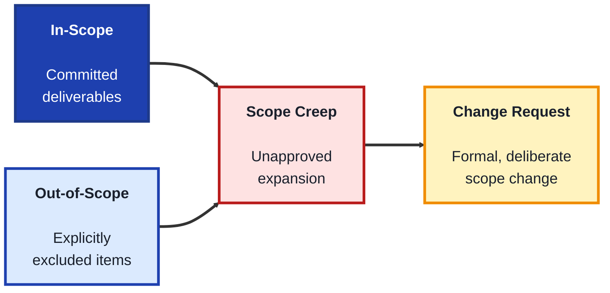
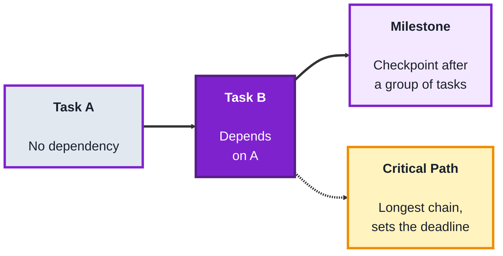
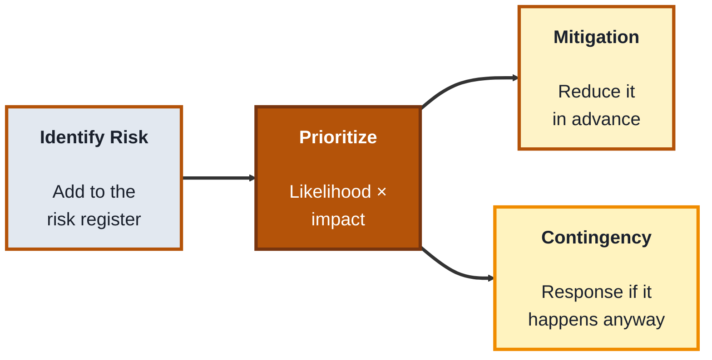
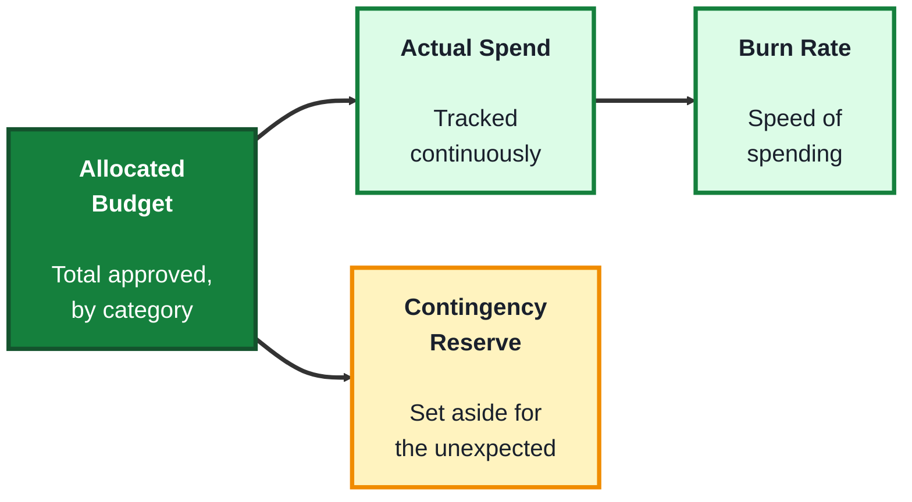

## Module: Project Management (TechPO: Product & Project Management)

**Purpose:** Plan, build, and deliver technology products.

**Tools needed for this module:** A web browser, a free account with a spreadsheet tool such as [Google Sheets](https://sheets.google.com), and a free account with a board or project tool like [Trello](https://trello.com) or [Asana](https://asana.com). No coding environment or installs are required.

### Topic 1: Scope

#### Concept

**Scope** defines exactly what a project will (and won't) deliver, it's the boundary that everything else, timeline, budget, and risk, gets measured against. A clearly written scope is what makes it possible to later say, with confidence, whether a project actually succeeded or whether it quietly grew into something different along the way.

- **In-scope** items are the specific deliverables a project has committed to producing, written concretely enough that "done" is unambiguous
- **Out-of-scope** items are things explicitly excluded, stating them directly prevents assumptions and later disputes about what was supposed to be included
- **Scope creep** is the gradual, often unapproved expansion of a project's scope after it's already been agreed on, usually through small individually reasonable-seeming additions that add up
- A **change request** is the formal process for adding, removing, or altering scope after a project has started, requiring a deliberate decision (and usually a timeline or budget adjustment) rather than an informal addition

#### Structure at a Glance

- Writing out-of-scope items explicitly feels unnecessary to beginners, but it's often what prevents the most painful disputes later, an unstated assumption is much harder to resolve than a documented exclusion
- Not all scope creep is bad, sometimes a genuinely valuable addition should be accepted, the real problem is when it happens informally, without anyone weighing its cost against the schedule and budget it will affect

#### Where you'd actually use this

Writing a project charter or statement of work before work begins, evaluating a mid-project request to "just quickly add" a feature, or explaining to a stakeholder why an addition requires a formal change request rather than being slipped in for free.

#### Lab

1. **Pick a small project idea** (reuse the plant-care app from earlier modules, or invent a new one, like "build a simple internal expense-tracking tool").
2. **Write a scope document** in a shared doc with two clearly labeled sections, "In Scope" (4 to 6 concrete deliverables) and "Out of Scope" (3 to 4 things explicitly excluded).
3. **Write one deliverable ambiguously** on purpose (for example, "improve the user interface"), then rewrite it concretely (for example, "redesign the login screen to include a password-reset link"), noting the difference in your doc.
4. **Simulate a scope creep scenario**: write a one-sentence stakeholder request that sounds small and reasonable but would actually expand the project (for example, "can we also just add social login while we're at it?").
5. **Write a short change request** responding to that scenario, describing the requested addition, its likely impact on timeline or budget, and a decision (approve, defer, or reject).

#### Checkpoint
You have a written scope document with clear in-scope and out-of-scope sections, one deliverable rewritten from ambiguous to concrete, and a mock change request responding to a scope creep scenario.

#### Quiz
1. What is the difference between in-scope and out-of-scope items?
2. What is "scope creep," and why is it usually a problem?
3. What is a change request, and why does it matter that it's formal?
4. Why should scope items be written concretely rather than vaguely?
5. Is all scope expansion necessarily bad? Explain briefly.

*Answers: 1) In-scope items are deliverables the project has committed to producing, out-of-scope items are explicitly excluded from that commitment. 2) The gradual, often unapproved expansion of scope after it's agreed on, it's usually a problem because it adds work without a corresponding adjustment to timeline or budget. 3) A deliberate process for adding, removing, or altering scope after a project starts, it matters that it's formal because it forces a real decision about cost and schedule impact rather than an informal, unexamined addition. 4) Because a vague deliverable makes it impossible to say with confidence whether the work is actually "done," a concrete one removes that ambiguity. 5) No, sometimes an addition is genuinely valuable and worth accepting, the real problem is when it happens informally without weighing its cost against the schedule and budget it affects.*

---

### Topic 2: Timeline

#### Concept

A **timeline** lays out when project work will happen, breaking a project into a sequence of tasks with estimated durations and dependencies, so a team can see whether a deadline is realistic before committing to it. A good timeline isn't just a list of dates, it's a reflection of how tasks actually depend on each other.

- A **milestone** is a significant checkpoint in a timeline (like "design approved" or "beta launch"), used to track progress at a higher level than individual tasks
- A **dependency** exists when one task can't start (or finish) until another one does, mapping dependencies is what reveals a project's true minimum length, not just the sum of individual task estimates
- The **critical path** is the longest chain of dependent tasks in a project, it determines the earliest possible finish date, delays on the critical path delay the whole project, delays on other tasks often don't
- A **buffer** is deliberately added extra time to absorb the unexpected, timelines with zero buffer tend to slip immediately at the first unforeseen issue

#### Structure at a Glance

- Beginners often estimate a timeline by adding up every task's duration in sequence, but tasks with no dependency on each other can run in parallel, only the critical path actually determines the deadline
- Adding a buffer isn't padding out of caution alone, it's a deliberate acknowledgment that estimates are never perfectly accurate, a timeline that assumes everything goes exactly as planned is really a best-case scenario, not a realistic one

#### Where you'd actually use this

Estimating whether a requested launch date is realistic, explaining to a stakeholder why one delayed task pushed back the whole project while another delayed task didn't, or deciding how much buffer to build into a plan before committing to a deadline.

#### Lab

1. **Reuse the scope document** from Topic 1, and break the in-scope deliverables into 6 to 8 smaller tasks.
2. **Estimate a duration** for each task (in days), and note any dependencies (which tasks must finish before another can start).
3. **Identify the critical path** by tracing the longest chain of dependent tasks, and calculate the total project length along that path.
4. **Identify at least one task that isn't on the critical path**, and explain in one sentence why delaying it wouldn't delay the whole project.
5. **Add a buffer** (for example, 15-20% of the critical path length) and write the final, realistic estimated completion date, along with one sentence explaining what the buffer is meant to absorb.

#### Checkpoint
You have a task list with durations and dependencies, an identified critical path with a calculated project length, and a final estimate that includes a justified buffer.

#### Quiz
1. What is a "dependency," and why does mapping dependencies matter for a timeline?
2. What is the "critical path," and why does a delay on it affect the whole project?
3. Why might a task's delay not affect the overall deadline?
4. What is a "milestone," and how is it different from a regular task?
5. Why should a timeline include a buffer rather than assuming every estimate is exact?

*Answers: 1) A dependency exists when one task can't start or finish until another does, mapping them matters because it reveals a project's true minimum length, not just the sum of individual task estimates run in sequence. 2) The longest chain of dependent tasks in the project, a delay on it pushes back the earliest possible finish date because every task on that chain must still happen in order. 3) Because a task not on the critical path may have slack, extra time before it would actually start pushing back the final deadline, since other, longer chains of work are still running in parallel. 4) A significant checkpoint used to track progress at a higher level, unlike a regular task, it usually marks the completion of a meaningful group of tasks rather than being a piece of work itself. 5) Because estimates are never perfectly accurate, a timeline with zero buffer is really a best-case scenario and tends to slip at the very first unforeseen issue.*

---

### Topic 3: Risk

#### Concept

**Risk** management is the practice of identifying what could go wrong on a project before it happens, and deciding in advance how to respond if it does, rather than reacting for the first time in the middle of a crisis. Not all risks are treated equally, the practice is about focusing effort on the risks that matter most.

- A **risk register** is a running list of identified risks, typically including a description, likelihood, impact, and a planned response for each
- **Likelihood** and **impact** are the two dimensions used to prioritize risks, a risk that's both likely and high-impact deserves far more attention than one that's rare and minor
- A **mitigation** is an action taken in advance to reduce a risk's likelihood or impact, a **contingency plan** is the response prepared in case the risk happens anyway
- A **risk owner** is the specific person responsible for watching a given risk and triggering its response, without an owner, a known risk can go unmonitored until it becomes a real problem

#### Structure at a Glance

- A risk register that's written once and never revisited quickly becomes useless, risks (and their likelihood or impact) change as a project progresses, reviewing it regularly is part of the practice, not an optional extra
- Assigning a risk owner is easy to skip, but a risk without an owner tends to be everyone's problem in theory and no one's problem in practice, until it actually happens

#### Where you'd actually use this

Planning a project with a hard external deadline, working with a new or unfamiliar vendor or technology, or any situation where a stakeholder asks "what could go wrong, and what's the plan if it does" before approving a project to move forward.

#### Lab

1. **Reuse the same project idea** from Topics 1 and 2, and brainstorm 5 to 6 realistic risks (for example, "key team member becomes unavailable," "third-party API changes unexpectedly," "underestimated task takes twice as long").
2. **Build a risk register** in a spreadsheet with columns for Risk, Likelihood (Low/Medium/High), Impact (Low/Medium/High), Mitigation, and Owner.
3. **Rate each risk's likelihood and impact**, and sort or highlight the two or three risks that combine the highest likelihood and impact.
4. **Write a mitigation** for each of your top two or three risks, a concrete action to reduce its likelihood or impact in advance.
5. **Write a contingency plan** for just your single highest-priority risk, describing exactly what the team would do if it happened anyway, and assign a named owner responsible for watching it.

#### Checkpoint
You have a risk register with 5 to 6 identified risks rated by likelihood and impact, mitigations for your top risks, and a full contingency plan with an assigned owner for your single highest-priority risk.

#### Quiz
1. What two dimensions are used to prioritize risks in a risk register?
2. What is the difference between a mitigation and a contingency plan?
3. What is a "risk owner," and what happens without one?
4. Why should a risk register be revisited regularly rather than written once?
5. Give an example of a risk that would be high likelihood but low impact, and explain why it might not need much attention.

*Answers: 1) Likelihood and impact. 2) A mitigation is an action taken in advance to reduce a risk's likelihood or impact, a contingency plan is the prepared response for if the risk happens anyway. 3) The specific person responsible for watching a given risk and triggering its response, without one, a known risk can go unmonitored until it becomes a real problem. 4) Because risks (and their likelihood or impact) change as a project progresses, a register written once and never updated quickly becomes outdated and less useful. 5) Any reasonable example works, for instance a minor typo appearing in an internal document, it happens often but causes little real harm, so it doesn't warrant the same attention as a rare but severe risk.*

---

### Topic 4: Budget

#### Concept

A **budget** translates a project's scope and timeline into a financial commitment, tracking what's been allocated, spent, and remaining, so a team can catch overspending early instead of discovering it only at the very end. Like scope and timeline, a budget is only useful if it's actively tracked, not just written once at the start and forgotten.

- **Allocated budget** is the total amount approved for the project, often broken down by category (labor, tools, vendors, contingency)
- **Actual spend** is what's really been spent so far, tracked continuously and compared against what was allocated
- **Burn rate** is how quickly a budget is being spent over time, a high burn rate relative to project progress is an early warning sign, even before the budget is technically exhausted
- A **contingency reserve** is a portion of the budget deliberately set aside (often 10-20%) to absorb the unexpected, similar in purpose to a timeline's buffer

#### Structure at a Glance

- Burn rate matters more than raw remaining budget, a project could still have plenty of budget left on paper while burning through it far faster than its remaining work justifies, a warning sign that's easy to miss if you only check the total
- A contingency reserve set aside from the start is very different from quietly running over budget and hoping it works out, one is a planned buffer, the other is an unmanaged risk

#### Where you'd actually use this

Tracking whether a project is on financial track partway through, explaining to a stakeholder why spending appears high relative to progress, or deciding how much contingency reserve to request before a project is approved.

#### Lab

1. **Reuse the tasks** from Topic 2's timeline, and assign a rough cost estimate to each (an hourly rate x estimated hours, or a flat cost, whichever is easier for your example).
2. **Build a simple budget tracker** in a spreadsheet with columns for Category, Allocated, Actual Spend, and Remaining.
3. **Set a contingency reserve** of 15% of the total allocated budget, listed as its own line item.
4. **Simulate two "checkpoints"** partway through the project, filling in a plausible actual spend at each point, and calculate the burn rate (spend so far divided by time elapsed).
5. **Compare that burn rate to project progress** (for example, "50% of budget spent, but only 30% of tasks done") and write one sentence flagging whether this is a warning sign, and what you'd do about it.

#### Checkpoint
You have a budget tracker with allocated, actual, and remaining columns, a contingency reserve line item, and a burn-rate comparison against progress with a written judgment call about whether it's a warning sign.

#### Quiz
1. What is the difference between allocated budget and actual spend?
2. What is "burn rate," and why does it matter more than the raw remaining budget alone?
3. What is a contingency reserve, and what timeline concept is it similar to?
4. Why is a budget that's tracked only once, at the very start, less useful than one tracked continuously?
5. Give an example of a scenario where burn rate would be a warning sign even though budget technically remains.

*Answers: 1) Allocated budget is the total amount approved for the project, actual spend is what's really been spent so far, tracked and compared against that allocation. 2) How quickly the budget is being spent over time, it matters more than the raw remaining amount because a project can still have money left on paper while spending it far faster than its remaining work justifies. 3) A portion of the budget deliberately set aside (often 10-20%) to absorb the unexpected, similar in purpose to a timeline's buffer. 4) Because spending and progress both change as a project moves forward, a budget checked only once at the start can't catch overspending early, only after it's already happened. 5) A project having spent 50% of its budget while only 30% of its tasks are complete is a valid example, spending is outpacing actual progress even though funds remain.*

---

## Module Completion Checklist
- [ ] Written a scope document with clear in-scope, out-of-scope items, and a mock change request
- [ ] Built a task list with durations, dependencies, an identified critical path, and a justified buffer
- [ ] Built a risk register with prioritized risks, mitigations, and a full contingency plan with an owner
- [ ] Built a budget tracker with a contingency reserve and a burn-rate comparison against progress
- [ ] Can explain how scope, timeline, risk, and budget all depend on and constrain each other
