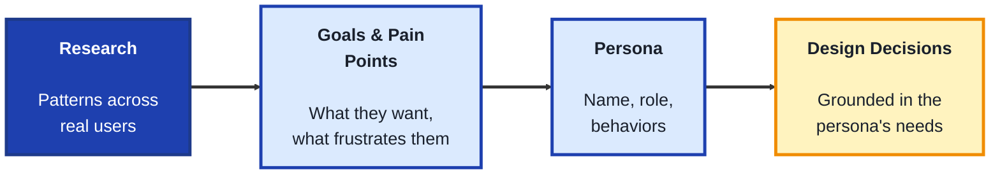
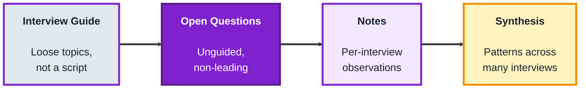
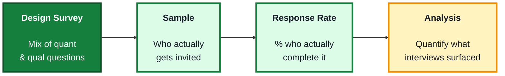

## Module: User Research (TechPO: Product & Project Management)

**Purpose:** Plan, build, and deliver technology products.

**Tools needed for this module:** A web browser, a free account with a document tool such as [Google Docs](https://docs.google.com) or [Notion](https://www.notion.so), and a free account with a survey tool like [Google Forms](https://forms.google.com) or [Typeform](https://www.typeform.com). No coding environment or installs are required.

### Topic 1: Personas

#### Concept

A **persona** is a fictional but research-based representation of a type of user, built to keep real user needs in mind during design and product decisions, rather than designing for an imagined "everyone" or, worse, for yourself. A good persona is grounded in patterns actually observed across real users, not a single person or a guess.

- A **persona** typically includes a name, role, goals, frustrations (pain points), and relevant behaviors, enough detail to make decisions concrete, without so much that it becomes a distraction
- A **primary persona** represents the most important user segment a product is designed for, a **secondary persona** represents a smaller but still relevant segment worth considering
- **Pain points** are the specific frustrations or obstacles a persona experiences related to the problem the product addresses, these often directly suggest what the product needs to solve
- A persona should be built from **research patterns**, not assumptions, a persona invented without any real user input is often called an "elastic user," reshaped to justify whatever the team already wanted to build

#### Structure at a Glance

- A persona is only as useful as the research behind it, a detailed-looking persona built purely from assumption can feel convincing while quietly leading a team astray
- Personas should be revisited as new research comes in, a persona based on early, limited research can go stale as a product's actual user base grows or shifts

#### Where you'd actually use this

Prioritizing which features matter most by checking them against a primary persona's actual goals, resolving a disagreement about who a product is really for, or onboarding a new team member quickly to who the product serves and why.

#### Lab

1. **Think of a product idea** (reuse the plant-care app or expense tracker from earlier modules, or invent your own).
2. **Write down 3 to 5 realistic assumptions** about who would use it (age range, context, motivation), labeling them clearly as assumptions, not confirmed research.
3. **Draft a primary persona** in a shared doc, including a name, role, one or two goals, and two or three pain points, based on those assumptions.
4. **Draft a secondary persona** representing a different, smaller user segment for the same product, and note in one sentence how their needs differ from the primary persona's.
5. **Write one sentence identifying what real research** (which you'll do in Topics 2 and 3) would be needed to confirm or correct each persona, rather than relying on assumption alone.

#### Checkpoint
You have a primary and secondary persona for a product idea, clearly built from labeled assumptions, along with a note on what real research would be needed to validate them.

#### Quiz
1. What is a persona, and what should it be based on?
2. What's the difference between a primary and secondary persona?
3. What are "pain points," and why are they useful in a persona?
4. What is an "elastic user," and why is it a problem?
5. Why should personas be revisited over time rather than treated as permanent?

*Answers: 1) A fictional but research-based representation of a type of user, it should be based on patterns actually observed across real users, not a single person or a guess. 2) A primary persona represents the most important user segment a product is designed for, a secondary persona represents a smaller but still relevant segment. 3) The specific frustrations or obstacles a persona experiences related to the problem, they're useful because they often directly suggest what the product needs to solve. 4) A persona invented without real user input, reshaped to justify whatever the team already wanted to build, it's a problem because it looks like user-centered evidence while actually just reflecting the team's own assumptions. 5) Because a persona based on early, limited research can go stale as a product's actual user base grows or shifts over time.*

---

### Topic 2: Interviews

#### Concept

A **user interview** is a one-on-one conversation designed to understand a person's real behaviors, needs, and frustrations, in their own words, rather than asking them to predict what they'd want in a hypothetical future. Good interviews rely heavily on how questions are asked, small wording choices can lead someone toward the answer you wanted to hear instead of the truth.

- An **open-ended question** invites a real, unguided answer ("Walk me through the last time you tried to do X"), a **closed-ended question** only allows a narrow response ("Do you like X?"), interviews should lean heavily on the former
- A **leading question** subtly suggests the "right" answer ("Don't you think this feature would be helpful?"), leading questions produce biased, unreliable data even when the interviewee answers honestly
- An **interview guide** is a loose list of planned questions and topics, used as a reference rather than a rigid script, so the conversation can follow genuinely interesting threads as they come up
- **Synthesis** is the process of reviewing notes across multiple interviews afterward to find recurring patterns, a single interview's anecdote is a data point, a pattern across several interviews is a finding

#### Structure at a Glance

- Asking someone to predict their own future behavior ("Would you use a feature like this?") is notoriously unreliable, people are often wrong about their own future actions, past behavior ("Tell me about the last time...") is a much stronger signal
- A single compelling interview quote can feel like strong evidence, but treating one person's anecdote as a confirmed finding, without checking for the same pattern elsewhere, is a common and costly research mistake

#### Where you'd actually use this

Understanding why users struggle with a specific part of a product, validating (or invalidating) an assumption baked into a persona, or gathering the raw material needed to write an accurate problem statement before starting to design a solution.

#### Lab

1. **Write an interview guide** of 6 to 8 open-ended questions about a real behavior related to your product idea (for example, for a plant-care app: "Tell me about the last time you forgot to water a plant, what happened?").
2. **Review your questions** and rewrite any that are accidentally closed-ended or leading, checking each one against the definitions above.
3. **Conduct a real practice interview** with a friend, family member, or classmate (5-10 minutes is enough), asking your revised questions and taking notes on their actual answers, not just their opinions.
4. **Write a short synthesis note** after the interview, summarizing what you learned in your own words, separate from your original assumptions in Topic 1's persona draft.
5. **Compare the interview's findings to your Topic 1 persona**, and note in one or two sentences whether the interview confirmed, contradicted, or added something new to your assumptions.

#### Checkpoint
You have a reviewed, non-leading interview guide, notes and a synthesis from one real practice interview, and a written comparison against your earlier persona assumptions.

#### Quiz
1. What is the difference between an open-ended and a closed-ended question?
2. What is a "leading question," and why is it a problem even if the person answers honestly?
3. Why is asking about past behavior generally more reliable than asking someone to predict future behavior?
4. What is an "interview guide," and why is it described as loose rather than a rigid script?
5. What is "synthesis," and why does a single interview's anecdote need it before becoming a finding?

*Answers: 1) An open-ended question invites a real, unguided answer, a closed-ended question only allows a narrow response, interviews should lean heavily on open-ended questions. 2) A question that subtly suggests the "right" answer, it's a problem because it produces biased, unreliable data even when the person is being completely honest in their response. 3) Because people are often wrong about predicting their own future actions, while describing something they've actually already done is a much stronger, more concrete signal. 4) A loose list of planned questions and topics used as a reference, it's kept loose rather than rigid so the conversation can follow genuinely interesting threads as they naturally come up. 5) Reviewing notes across multiple interviews to find recurring patterns, it's needed because one person's anecdote is just a single data point, a pattern seen across several interviews is what actually counts as a finding.*

---

### Topic 3: Surveys

#### Concept

A **survey** collects structured responses from a larger number of people than interviews realistically allow, trading the depth of a one-on-one conversation for breadth and, when well designed, the ability to measure how common a pattern actually is. Surveys are best used to quantify something interviews already surfaced qualitatively, not usually to discover something completely unexpected.

- **Quantitative data** is numeric or categorical (ratings, multiple choice, yes/no), easy to analyze at scale, **qualitative data** is open-text or descriptive, richer but harder to analyze in bulk, most surveys mix both
- A **sample** is the group of people who actually respond, a **biased sample** (like only surveying existing power users about a beginner feature) produces misleading results even with a large number of responses
- **Response bias** describes ways the survey itself skews answers, leading question wording, too few answer options, or even question order can all shift results without respondents noticing
- A **response rate** is the percentage of people invited who actually completed the survey, a low response rate is a warning sign about how representative the results really are

#### Structure at a Glance

- Beginners sometimes reach for a survey first, hoping to discover new insights, but surveys are generally better at confirming and measuring the size of a pattern that interviews already surfaced, since respondents can only answer the specific questions asked
- A large number of responses doesn't fix a biased sample, one thousand responses from the wrong group of people is still less useful than one hundred responses from the right group

#### Where you'd actually use this

Measuring how widespread a pain point uncovered in interviews actually is across the broader user base, prioritizing between several candidate features by asking a larger group to rank or rate them, or tracking a metric like satisfaction over time.

#### Lab

1. **Reuse the synthesis note** from Topic 2's interview, and pick one specific pattern or pain point it surfaced.
2. **Build a short survey** (5 to 7 questions) in Google Forms or Typeform designed to measure how common that pattern is, mixing quantitative questions (multiple choice, rating scale) with one open-ended question at the end.
3. **Review your own questions for response bias**, rewriting any that are leading, or that offer too few or unbalanced answer options.
4. **Define your intended sample** in one or two sentences, describing who you'd actually want to invite to respond, and one reason why inviting the wrong group would bias your results.
5. **Send the survey to 3 to 5 real people** (classmates, friends, colleagues) if possible, or simulate expected responses if that's not practical, and write one sentence noting your response rate and whether it's high enough to trust the results.

#### Checkpoint
You have a short survey built to measure a pattern surfaced by interviews, reviewed for response bias, with a defined intended sample and a noted response rate.

#### Quiz
1. What is the difference between quantitative and qualitative survey data?
2. What is a "biased sample," and why doesn't a larger number of responses fix it?
3. Name two things that can cause response bias in a survey.
4. What is a "response rate," and why does a low one matter?
5. Why are surveys generally better at confirming a pattern than discovering a new one?

*Answers: 1) Quantitative data is numeric or categorical (ratings, multiple choice), easy to analyze at scale, qualitative data is open-text or descriptive, richer but harder to analyze in bulk. 2) A sample that doesn't represent the group you actually care about, a larger number of responses doesn't fix it because all those extra responses are still coming from the wrong group of people. 3) Leading question wording, too few or unbalanced answer options, or question order (any two are valid). 4) The percentage of invited people who actually completed the survey, a low response rate matters because it raises doubt about how representative the results really are of the broader group. 5) Because respondents can only answer the specific questions asked, a survey can measure how common something already known is, but it can't surface something completely unexpected the way an open-ended interview conversation can.*

---

## Module Completion Checklist
- [ ] Drafted a primary and secondary persona from labeled assumptions, noting what research is needed to validate them
- [ ] Written and reviewed a non-leading interview guide, conducted a practice interview, and synthesized its findings against the personas
- [ ] Built and reviewed a short survey to measure a pattern from the interview, with a defined sample and noted response rate
- [ ] Can explain why past-behavior questions are more reliable than asking someone to predict future behavior
- [ ] Can explain why interviews and surveys serve different purposes (depth versus breadth) rather than being interchangeable
