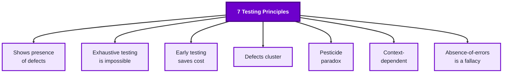

## Module 1: QA Fundamentals

### Topic 1.1: SDLC (Software Development Life Cycle)

#### Concept

The **Software Development Life Cycle (SDLC)** is the sequence of phases a piece of software moves through, from the idea for it to its retirement. QA doesn't sit outside this cycle, it's built into every phase of it. Understanding the SDLC first matters because it tells you *when* testing-related activities are supposed to happen, and what a tester's job looks like at each stage, long before "run the tests" is even possible.

- **Requirements** - deciding what the software should do
- **Design** - deciding how it will do it (architecture, UI, data flow)
- **Development** - writing the actual code
- **Testing** - verifying the code does what the requirements said
- **Deployment** - releasing the software to real users
- **Maintenance** - fixing issues and adding small improvements after release

#### Structure at a Glance

```mermaid
%%{init: {'theme':'base', 'themeVariables': {'fontSize':'22px', 'primaryTextColor':'#1a202c', 'primaryBorderColor':'#1e4e8c', 'lineColor':'#333333'}, 'flowchart': {'nodeSpacing': 70, 'rankSpacing': 90, 'padding': 20}}}%%
flowchart LR
    R["<b>Requirements</b><br/><br/>What should it do?"]
    D["<b>Design</b><br/><br/>How will it work?"]
    DEV["<b>Development</b><br/><br/>Build the code"]
    T["<b>Testing</b><br/><br/>Verify it matches<br/>requirements"]
    DEP["<b>Deployment</b><br/><br/>Release to users"]
    M["<b>Maintenance</b><br/><br/>Fix and improve"]

    R ==> D ==> DEV ==> T ==> DEP ==> M

    style R fill:#2b6cb0,color:#fff,stroke:#1e4e8c,stroke-width:4px
    style D fill:#e2e8f0,color:#1a202c,stroke:#2b6cb0,stroke-width:4px
    style DEV fill:#e2e8f0,color:#1a202c,stroke:#2b6cb0,stroke-width:4px
    style T fill:#fff3bf,color:#1a202c,stroke:#f08c00,stroke-width:4px
    style DEP fill:#e2e8f0,color:#1a202c,stroke:#2b6cb0,stroke-width:4px
    style M fill:#e2e8f0,color:#1a202c,stroke:#2b6cb0,stroke-width:4px
    linkStyle default stroke-width:4px,stroke:#333333
```

- Each phase produces something the next phase depends on (requirements produce a spec, design produces an architecture, and so on)
- A **model** (Waterfall, Agile, V-Model) is a specific way of arranging and repeating these phases, they all contain the same core phases, just structured differently
- QA activities exist in *every* phase, not just the "Testing" box, reviewing requirements for testability, reviewing designs for edge cases, is QA work too

#### Where you'd actually use this

Any time you join a project and need to figure out where things currently stand, are requirements still being written, is a build ready for test, has it already shipped, understanding the SDLC lets you correctly place yourself and know what's expected of you right now.

#### Lab

1. **Pick a small app you use daily** (a to-do list app, a food delivery app, anything).
2. **Write one plausible requirement** for a feature it has (for example, "Users can mark a task as complete").
3. **Walk that single requirement through all six SDLC phases** in your own words: what would design look like for it, what would development involve, what would you test, how might it be deployed, what maintenance might it need six months later.
4. **Identify one QA activity you could do *before* the Testing phase even starts** (for example, reviewing the requirement itself for ambiguity).

#### Checkpoint
You can name all six SDLC phases in order, explain what each phase hands off to the next, and describe one QA activity that happens outside the "Testing" phase itself.

#### Quiz
1. What are the six phases of the SDLC, in order?
2. What does the Design phase produce that Development depends on?
3. Is testing something that only happens during the "Testing" phase? Why or why not?
4. What is a "model" (like Waterfall or Agile) in the context of the SDLC?
5. Why does a QA professional need to understand the SDLC before doing any hands-on testing?

*Answers: 1) Requirements, Design, Development, Testing, Deployment, Maintenance. 2) An architecture or design specification, decisions about how the software will work, that developers then build against. 3) No, QA activities like reviewing requirements or designs happen throughout the cycle; the "Testing" phase is just where the most concentrated, formal testing activity occurs. 4) A specific way of arranging and repeating the core SDLC phases (in sequence, in short repeating cycles, in parallel with development, etc.), different models, same underlying phases. 5) It tells you when testing-related activities are supposed to happen and what's expected of you at each stage, so you know how to contribute correctly at any point in a project.*

---

### Topic 1.2: STLC (Software Testing Life Cycle)

#### Concept

The **Software Testing Life Cycle (STLC)** is the sequence of phases *within* the SDLC's Testing phase, zoomed in. Where the SDLC tells you software has reached "Testing," the STLC tells you what actually happens during that phase, step by step, from figuring out what needs testing to formally closing testing out.

- **Requirement Analysis** - understanding what needs to be tested, from a testing point of view
- **Test Planning** - deciding scope, approach, resources, and schedule for testing
- **Test Case Development** - writing the actual test cases and test data
- **Environment Setup** - preparing the systems, data, and configuration tests will run against
- **Test Execution** - actually running the tests and logging results
- **Test Closure** - evaluating results, reporting, and documenting lessons learned

#### Structure at a Glance

```mermaid
%%{init: {'theme':'base', 'themeVariables': {'fontSize':'22px', 'primaryTextColor':'#1a202c', 'primaryBorderColor':'#c93a00', 'lineColor':'#333333'}, 'flowchart': {'nodeSpacing': 70, 'rankSpacing': 90, 'padding': 20}}}%%
flowchart LR
    RA["<b>Requirement<br/>Analysis</b><br/><br/>What needs testing?"]
    TP["<b>Test Planning</b><br/><br/>Scope, approach,<br/>schedule"]
    TCD["<b>Test Case<br/>Development</b><br/><br/>Write test cases<br/>and test data"]
    ES["<b>Environment<br/>Setup</b><br/><br/>Prepare systems<br/>and data"]
    TE["<b>Test Execution</b><br/><br/>Run tests,<br/>log results"]
    TC["<b>Test Closure</b><br/><br/>Report and<br/>document"]

    RA ==> TP ==> TCD ==> ES ==> TE ==> TC

    style RA fill:#ff4a00,color:#fff,stroke:#c93a00,stroke-width:4px
    style TP fill:#e2e8f0,color:#1a202c,stroke:#ff4a00,stroke-width:4px
    style TCD fill:#e2e8f0,color:#1a202c,stroke:#ff4a00,stroke-width:4px
    style ES fill:#e2e8f0,color:#1a202c,stroke:#ff4a00,stroke-width:4px
    style TE fill:#fff3bf,color:#1a202c,stroke:#f08c00,stroke-width:4px
    style TC fill:#e2e8f0,color:#1a202c,stroke:#ff4a00,stroke-width:4px
    linkStyle default stroke-width:4px,stroke:#333333
```

- Each STLC phase has its own **entry criteria** (what must be true before it can start) and **exit criteria** (what must be true before it's considered done)
- A **test case** is a specific, repeatable set of steps, inputs, and expected results used to check one behavior
- **Test data** is the actual values fed into a test case (a valid email, an invalid password, an empty field) to make it concrete rather than theoretical
- Test Execution isn't just "run it once", it includes logging defects, re-running failed cases after fixes, and tracking status until the exit criteria are met

#### Where you'd actually use this

Any time a feature or build is handed to QA and you need a repeatable, defensible process for testing it, rather than testing on gut feeling. It's also what lets you answer, precisely, "did we test enough, and how do we know?"

#### Lab

1. **Take the requirement from the SDLC lab** ("Users can mark a task as complete").
2. **Write a one-paragraph Test Plan** for it: what will you test (marking complete, unmarking, marking an already-completed task again), what won't you test (things out of scope), and what order you'll test in.
3. **Write two full test cases** for it, each with: a title, preconditions, numbered steps, test data, and an expected result.
4. **Define exit criteria** for this mini test cycle (for example, "all written test cases executed at least once, no open critical defects").

#### Checkpoint
You have a short test plan, two properly structured test cases with real test data, and a written exit criterion, and you can explain how each maps to a specific STLC phase.

#### Quiz
1. What are the six phases of the STLC, in order?
2. What is the difference between "entry criteria" and "exit criteria" for a phase?
3. What four things should a well-written test case include?
4. What is "test data," and why does a test case need it to be concrete rather than theoretical?
5. Is running each test case exactly once enough to consider Test Execution complete? Why or why not?

*Answers: 1) Requirement Analysis, Test Planning, Test Case Development, Environment Setup, Test Execution, Test Closure. 2) Entry criteria are the conditions that must be true before a phase can begin; exit criteria are the conditions that must be true before it can be considered finished. 3) A title, preconditions, numbered steps, and an expected result (with test data feeding the steps). 4) Test data is the actual values used in a test case (a specific input); without it, a test case is just a description of an idea rather than something repeatable and checkable. 5) No, Test Execution also includes logging any defects found and re-running failed cases after fixes, until the exit criteria (like "no open critical defects") are actually met.*

---

### Topic 1.3: Testing Principles

#### Concept

**Testing principles** are the small set of hard-won truths about testing itself that hold true no matter what software you're testing or what tool you're using. They exist because testing has real limits, you can never test everything, a bug-free test run doesn't mean bug-free software, and knowing these limits up front keeps you from over-promising or testing the wrong things.

- **Testing shows the presence of defects, not their absence** - passing tests reduce risk, they don't prove a system is perfect
- **Exhaustive testing is impossible** - you can't test every input and every path; you have to choose, based on risk
- **Early testing saves time and cost** - the earlier a defect is found (ideally during Requirements or Design), the cheaper it is to fix
- **Defects cluster** - a small number of modules usually contain most of the defects; testing effort should focus there
- **Beware the pesticide paradox** - running the same tests repeatedly eventually stops finding new bugs; tests need to be reviewed and updated
- **Testing is context-dependent** - a banking app and a game are tested differently, because "quality" means different things for each
- **Absence-of-errors is a fallacy** - a system that's technically bug-free can still fail if it doesn't meet the user's actual needs

#### Structure at a Glance

- These aren't rules to memorize for their own sake, each one changes a real decision: how much to test, where to focus, when to update old tests, and how to phrase a test summary honestly

#### Where you'd actually use this

Any time you need to explain testing decisions to someone else, why you're not testing every possible input (exhaustive testing is impossible), why a "clean" test run doesn't mean "ship it with zero risk" (shows presence, not absence, of defects), or why last release's test suite needs updating (pesticide paradox).

#### Lab

1. **Take the "mark a task complete" feature again.**
2. **Apply the exhaustive testing principle:** list five realistic inputs/scenarios you'd test (not fifty), and briefly justify why you picked those five over others.
3. **Apply the defect clustering principle:** guess which part of this feature is most likely to have bugs (for example, the "already completed" edge case) and explain why you think testing effort should lean there.
4. **Write one honest, principle-aligned sentence** you could say to a product manager after a clean test run, one that reflects "shows presence, not absence, of defects" rather than overpromising.

#### Checkpoint
You can name and briefly explain all seven testing principles, and you've applied at least two of them to a concrete testing decision rather than just reciting them.

#### Quiz
1. What does "testing shows the presence of defects, not their absence" actually mean for how you report test results?
2. Why is exhaustive testing considered impossible in practice?
3. What is the "pesticide paradox," and what should you do about it?
4. What does "defects cluster" suggest about how you should allocate testing effort?
5. Give an example of the "absence-of-errors fallacy": a system with zero known bugs that could still be considered a failure.

*Answers: 1) A passing test run means the tests that were run found no defects, it doesn't prove the software has no defects at all, so results should be reported as "no defects found in this scope," not "the software is bug-free." 2) The number of possible inputs and paths through most software is effectively infinite, so testing every combination isn't feasible; testers must choose a representative, risk-based subset instead. 3) The pesticide paradox is the pattern where running the same tests repeatedly stops catching new bugs, because the software has effectively become "resistant" to those specific tests; the fix is to periodically review and update test cases. 4) It suggests focusing testing effort on the modules or areas historically most prone to defects, rather than spreading effort evenly across all areas regardless of risk. 5) An app that has zero crashes or logged bugs but is so confusing that users can't complete their intended task, it's technically defect-free but still fails to meet the user's actual need.*

---

## Module 1 Completion Checklist
- [ ] Named all six SDLC phases in order and identified a QA activity outside the Testing phase
- [ ] Written a short test plan and two structured test cases mapped to STLC phases
- [ ] Defined exit criteria for a test cycle
- [ ] Named and applied at least two of the seven testing principles to a concrete scenario
- [ ] Can explain, in plain language, how the SDLC, the STLC, and testing principles relate to each other (SDLC = the whole project's life, STLC = testing's life inside it, principles = the ground rules that shape decisions in both)
