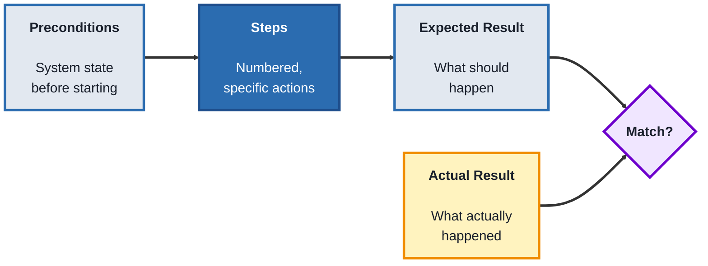
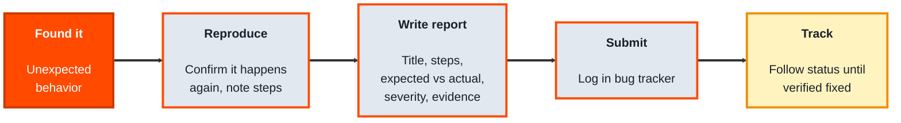
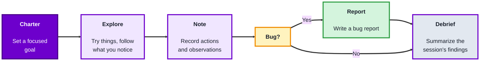

## Module 2: Manual Testing

### Topic 2.1: Test Cases

#### Concept

A **test case** is a specific, repeatable procedure, one set of preconditions, steps, inputs, and an expected result, that checks a single piece of behavior. Manual testing runs on test cases the way automation runs on scripts, they're the actual unit of testing work, and writing them well is what separates "I clicked around and it seemed fine" from a defensible, repeatable check.

- A **test case ID** and **title** identify the case and what it checks
- **Preconditions** describe the state the system must be in before the case starts (logged in, a specific record already exists, and so on)
- **Steps** are the exact, numbered actions to perform, written specifically enough that someone else could follow them without guessing
- **Expected result** is what should happen if the behavior is correct, stated precisely enough to compare against the **actual result** after running it
- A **test suite** is a group of related test cases, usually covering one feature or module

#### Structure at a Glance

- A test **passes** if the actual result matches the expected result, and **fails** if it doesn't
- Test cases should be written *before* execution, ideally during the STLC's Test Case Development phase, not improvised while testing
- Good test cases are specific enough that two different people running the same case would get the same actual result

#### Where you'd actually use this

Any feature that needs to be checked more than once, by more than one person, over time, a login form, a checkout flow, a settings page. Well-written test cases turn "did we test this" into something you can point to and hand off to someone else entirely.

#### Lab

1. **Pick a login form** (real or imagined: username/password fields, a "Log In" button, an error message for wrong credentials).
2. **Write three test cases** for it: one for a valid login, one for an invalid password, and one for an empty username field. Each should have an ID, title, preconditions, numbered steps, test data, and an expected result.
3. **"Run" each test case** by imagining executing it against the app as you understand it, and write the actual result for each.
4. **Mark each as Pass or Fail**, and for any fail, write one sentence describing the discrepancy between expected and actual.

#### Checkpoint
You have three properly structured test cases with real test data, "executed" with a recorded actual result, and a pass/fail verdict for each.

#### Quiz
1. What five things does a well-written test case typically include?
2. What is the difference between "expected result" and "actual result"?
3. Why should test cases usually be written before execution, rather than improvised during it?
4. What is a "test suite"?
5. What makes a test case "specific enough," in terms of two different people running it?

*Answers: 1) An ID/title, preconditions, numbered steps, test data, and an expected result. 2) Expected result is what should happen if the behavior is correct, decided in advance; actual result is what actually happened when the case was run. 3) Writing them in advance forces clarity about what's being checked and keeps testing repeatable and defensible, rather than ad hoc and dependent on memory. 4) A group of related test cases, usually covering one feature or module. 5) Two different people following the same steps with the same test data should arrive at the same actual result, no guessing or personal interpretation required.*

---

### Topic 2.2: Bug Reporting

#### Concept

**Bug reporting** is turning "something's wrong" into a written report clear enough that a developer can reproduce the problem, understand its impact, and fix it, without needing to ask the tester what they meant. A vague bug report ("the button doesn't work") wastes more time than it saves; a good one is often the difference between a same-day fix and a week of back-and-forth.

- **Title** - a short, specific summary of the problem
- **Steps to reproduce** - the exact numbered actions that trigger the bug
- **Expected vs. actual result** - what should have happened, versus what actually did
- **Severity** - how bad the impact is (crashes the app vs. a typo)
- **Priority** - how soon it needs fixing (urgent for the next release vs. can wait)
- **Environment** - browser, OS, device, app version, anything that could affect reproducibility
- **Evidence** - screenshots, screen recordings, or logs that back up the report

#### Structure at a Glance

- **Severity** and **priority** are independent, a severe bug (crashes the app) might affect only a rare edge case (lower priority), while a minor bug (a wrong label) on the homepage might need fixing sooner (higher priority) just because everyone sees it
- Always try to reproduce a bug at least twice before reporting it, a report that turns out to be non-reproducible damages trust in future reports

#### Where you'd actually use this

Any time testing (manual or exploratory) turns up unexpected behavior, an error message on a valid input, a broken layout on mobile, a crash on a specific action, and it needs to reach a developer as something actionable rather than a vague complaint.

#### Lab

1. **Imagine you find this bug:** on a shopping cart page, clicking "Remove Item" removes the item from the list but the total price doesn't update.
2. **Write a full bug report** for it: title, numbered steps to reproduce, expected result, actual result, a severity, a priority, and the environment (make one up: browser, OS, app version).
3. **Justify your severity and priority choices** in one sentence each, explaining why they might differ from each other.
4. **Rewrite the same bug as a vague, low-quality report** ("cart is broken") so you can see side by side what information the good version added.

#### Checkpoint
You have one complete, well-structured bug report with all required fields, a justified severity and priority, and a contrasting vague version that makes clear why the details matter.

#### Quiz
1. What seven pieces of information does a good bug report typically include?
2. What is the difference between severity and priority?
3. Why should you try to reproduce a bug more than once before submitting a report?
4. Give an example of a bug that could be high severity but low priority.
5. Why does "the button doesn't work" fail as a bug report title or description?

*Answers: 1) Title, steps to reproduce, expected result, actual result, severity, priority, and environment (plus evidence where possible). 2) Severity is how bad the impact of the bug is; priority is how soon it needs to be fixed, they don't always move together. 3) To confirm it's a real, consistent problem and not a one-off fluke, and to make sure the steps you write actually and reliably trigger it. 4) A crash that only happens on an obsolete browser version almost nobody uses, severe when it happens, but low priority because it affects very few users. 5) It gives no steps to reproduce, no expected versus actual result, and no context, a developer can't act on it without going back to ask what "doesn't work" even means.*

---

### Topic 2.3: Exploratory Testing

#### Concept

**Exploratory testing** is simultaneously learning the software and testing it, without a pre-written script, guided by what you discover as you go rather than by test cases written in advance. It's not "just clicking around", it's structured, intentional investigation aimed at areas a written test case might not have anticipated.

- A **test charter** is a short, written goal for an exploratory session (for example, "explore the checkout flow's handling of invalid coupon codes for 30 minutes")
- **Session-based testing** is running exploratory testing in timeboxed sessions, each with its own charter, so the work stays focused and its results stay reportable
- Notes taken *during* exploration (what you tried, what you noticed, anything odd) turn a loose investigation into something you can report on afterward
- Exploratory testing complements scripted testing, it's especially good at finding the unexpected bugs a test case, written before anyone had seen the actual behavior, wouldn't have thought to check

#### Structure at a Glance

- A charter keeps a session from turning into unfocused wandering, it's exploratory, not random
- The debrief at the end is what makes exploratory testing reportable work rather than an untracked black box, what was covered, what was found, what wasn't gotten to

#### Where you'd actually use this

New features with no existing test cases yet, areas that keep producing bugs even after scripted tests pass, or any time you suspect a written test case missed something because it was written before anyone had actually used the real feature.

#### Lab

1. **Write a test charter** for a feature you use regularly (for example, "explore a music app's playlist reordering for 20 minutes, focusing on drag-and-drop edge cases").
2. **"Run" a short exploratory session** against it, based on your real experience with the app, trying at least five different things you wouldn't find in a typical scripted test case (rapid actions, unusual orders, interrupting a step midway, and so on).
3. **Take notes as you go**, one line per thing you tried and what happened.
4. **Write a short debrief**: what you covered, anything odd you noticed (a real bug or something you'd flag for a written test case), and what you'd explore next if you had more time.

#### Checkpoint
You have a written charter, a session log of at least five explored actions with notes, and a debrief summarizing coverage and findings.

#### Quiz
1. What is a "test charter," and why does an exploratory session need one?
2. How is exploratory testing different from just clicking around without a plan?
3. What is "session-based testing"?
4. Why are notes taken during the session important, rather than just remembering afterward?
5. What kind of bugs is exploratory testing especially good at finding, compared to scripted test cases?

*Answers: 1) A short, written goal for the session; it needs one so the exploration stays focused on a specific area or question rather than turning into unfocused wandering. 2) It's guided by an intentional charter and produces recorded notes and a debrief, it's structured investigation with a reportable outcome, not aimless clicking. 3) Running exploratory testing in timeboxed sessions, each with its own charter, so the work stays focused and its results stay reportable. 4) Notes capture exactly what was tried and observed in the moment; relying on memory afterward risks losing details needed to reproduce anything unusual that was found. 5) Unexpected bugs in areas or interaction patterns that no one anticipated when writing test cases in advance, since exploratory testing reacts to what the software actually does rather than what it was expected to do.*

---

## Module 2 Completion Checklist
- [ ] Written three properly structured test cases with test data and recorded pass/fail verdicts
- [ ] Written a complete bug report with title, steps, expected/actual result, severity, priority, and environment
- [ ] Compared a good bug report against a vague one and can explain why the details matter
- [ ] Written a test charter and run a timeboxed exploratory session with notes and a debrief
- [ ] Can explain how exploratory testing and scripted test cases complement each other rather than compete
