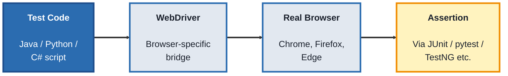
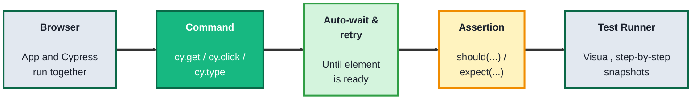
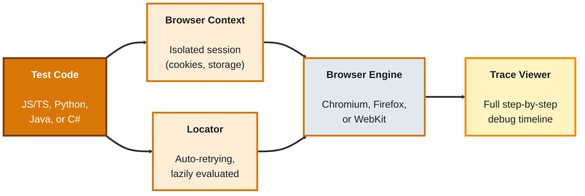

## Module 3: Automation Testing

**Tools needed for this module:** [Node.js](https://nodejs.org) (for Cypress and Playwright), a Java or Python setup plus a browser driver (for Selenium), and a code editor like VS Code. You won't need all three frameworks installed at once, each topic only needs its own setup.

### Topic 3.1: Selenium

#### Concept

**Selenium** is the oldest and most widely adopted browser automation framework. It works by sending commands to a real browser through a **WebDriver**, a separate program matched to each browser (Chrome, Firefox, Edge) that translates Selenium's commands into actual clicks, typing, and navigation. It supports many programming languages (Java, Python, C#, JavaScript), which is a big part of why it's still so common in large, established QA teams.

- A **WebDriver** is the bridge between your test code and the actual browser
- A **locator** finds an element on the page (by ID, CSS selector, XPath, or other strategies) so a command can act on it
- A **command** tells the browser what to do to a located element, click it, type into it, read its text
- An **assertion** checks that the resulting state matches what's expected, this is usually provided by a separate testing framework (like JUnit, TestNG, or pytest) that Selenium is paired with

#### Structure at a Glance


- Selenium itself has no built-in test runner or assertion library, it's paired with one (this flexibility is a strength for established teams, but means more setup for a beginner)
- Because it drives a real, separate browser process, Selenium can automate almost any web app, but is generally slower and more prone to timing-related flakiness than newer frameworks

#### Where you'd actually use this

Organizations with an existing large Selenium test suite, teams needing to test across many different browsers and languages, or projects where a specific niche browser needs coverage that newer tools don't support as well.

#### Lab

1. **Set up a project** with Python and Selenium:
```bash
pip install selenium
```
2. **Write a script** that opens a browser and navigates to a page:
```python
from selenium import webdriver
from selenium.webdriver.common.by import By

driver = webdriver.Chrome()
driver.get("https://example.com")
```
3. **Locate an element and read its text**, using a locator strategy:
```python
heading = driver.find_element(By.TAG_NAME, "h1")
print(heading.text)
```
4. **Add a simple assertion** checking the heading matches what you expect:
```python
assert heading.text == "Example Domain"
```
5. **Close the browser** when done:
```python
driver.quit()
```
6. **Run the script** and confirm the browser opens visibly, navigates, and the assertion passes without an error.

#### Checkpoint
You have a working Selenium script that opens a real browser, navigates to a page, locates an element, and asserts on its content, and you can explain what the WebDriver's job is in that chain.

#### Quiz
1. What is a WebDriver, and what job does it do in a Selenium test?
2. What is a "locator," and name two strategies used to build one?
3. Does Selenium include its own assertion library? What does it get paired with instead?
4. Why might a large, established QA team still choose Selenium over a newer framework?
5. Name one downside of Selenium driving a real, separate browser process.

*Answers: 1) A WebDriver is the browser-specific bridge that translates Selenium's commands into real actions in an actual browser; it's the job that sits between your test code and the browser itself. 2) A locator finds a specific element on the page; common strategies include ID, CSS selector, and XPath. 3) No, Selenium has no built-in assertion library or test runner, it's typically paired with a separate framework like JUnit, TestNG, or pytest. 4) It supports many languages, works across many browsers, and existing large test suites already depend on it, rewriting all of that for a newer tool is a significant cost. 5) It's generally slower and more prone to timing-related flakiness than newer frameworks, since it depends on communicating with a fully separate browser process.*

---

### Topic 3.2: Cypress

#### Concept

**Cypress** is a JavaScript-based testing framework built specifically for testing modern web apps, and it runs *inside* the browser alongside your application, rather than communicating with it externally like Selenium does. That architectural difference is why Cypress tests tend to be faster and less flaky, and why Cypress comes with built-in features (automatic waiting, time-travel debugging) that Selenium leaves to you to build yourself.

- A **command** (like `cy.get()` or `cy.click()`) queues an action or query, Cypress runs commands in order automatically
- **Automatic waiting** means Cypress retries certain commands and assertions for a few seconds before failing, instead of failing instantly if an element isn't there yet
- The **Test Runner** is Cypress's own visual interface, showing each command as it runs, with a snapshot of the app's state at that exact moment
- **Fixtures** are stored test data (usually JSON files) you can load into a test rather than hardcoding values inline

#### Structure at a Glance


- Because Cypress runs in the same run-loop as the browser, it can't natively drive more than one browser tab or origin at once, a deliberate tradeoff for speed and reliability, unlike Selenium's more unrestricted (but slower) external control
- Cypress supports JavaScript and TypeScript only, it does not support Java, Python, or C# the way Selenium does

#### Where you'd actually use this

Modern single-page web apps (React, Vue, Angular) where fast feedback during development matters, and where the team is already comfortable in JavaScript, front-end heavy teams especially favor Cypress for its Test Runner and debugging experience.

#### Lab

1. **Set up a project** and install Cypress:
```bash
npm init -y
npm install cypress --save-dev
```
2. **Open the Cypress Test Runner:**
```bash
npx cypress open
```
3. **Create a test file** (for example, `cypress/e2e/example.cy.js`) with a basic test:
```javascript
describe('Example Domain', () => {
  it('loads and shows the right heading', () => {
    cy.visit('https://example.com')
    cy.get('h1').should('have.text', 'Example Domain')
  })
})
```
4. **Run the test from the Test Runner** and watch it execute command by command, clicking through the snapshots it captured for each step.
5. **Deliberately break the assertion** (change the expected text to something wrong) and re-run it, to see how Cypress reports a failure, including the retry behavior before it finally fails.

#### Checkpoint
You have a working Cypress test that visits a real page and asserts on its content, and you've seen both a passing run and a failing run in the Test Runner's visual interface.

#### Quiz
1. What is the key architectural difference between how Cypress runs and how Selenium runs?
2. What does "automatic waiting" mean, and what problem does it solve?
3. What is the Cypress Test Runner, and what does it show you?
4. What are "fixtures" used for in Cypress?
5. Name one capability Selenium has that Cypress deliberately doesn't support in the same way, and why.

*Answers: 1) Cypress runs inside the browser alongside the application itself, while Selenium communicates with a separate browser process from the outside; this is why Cypress tends to be faster and less flaky. 2) It means Cypress automatically retries certain commands and assertions for a few seconds before failing, instead of failing instantly if an element hasn't appeared yet, solving a major source of flaky tests. 3) A visual interface that shows each command as it runs, with a snapshot of the app's exact state at that moment, useful for debugging test failures. 4) Storing test data, usually as JSON files, that can be loaded into a test rather than hardcoding values directly in the test code. 5) Native support for multiple browser tabs or origins in a single test, and support for languages beyond JavaScript/TypeScript (Java, Python, C#); Cypress trades these off deliberately in exchange for running in-browser and being faster and more reliable.*

---

### Topic 3.3: Playwright

#### Concept

**Playwright** is a newer automation framework (from Microsoft) that, like Selenium, drives real browsers externally, but is built from the ground up to avoid the flakiness and setup pain both older tools struggle with. It supports multiple browsers (Chromium, Firefox, WebKit) and multiple languages (JavaScript/TypeScript, Python, Java, C#), combining Selenium's cross-browser and cross-language range with much of Cypress's reliability and modern developer experience.

- **Auto-waiting** is built in, similar to Cypress, Playwright waits for elements to be actionable before interacting with them
- **Browser contexts** let a single test spin up multiple isolated, cookie-separated "browser sessions" quickly, useful for testing multiple logged-in users at once, something Cypress can't do natively
- **Locators** in Playwright are lazily evaluated and auto-retrying, they re-find the element each time they're used, reducing "stale element" errors common in Selenium
- The **Trace Viewer** records a full, step-by-step timeline of a test run (screenshots, network requests, console logs) for debugging after the fact

#### Structure at a Glance


- Playwright Test, its built-in test runner, comes with assertions, parallel execution, and retries out of the box, unlike Selenium, which needs a separate framework for all of that
- Because it controls real browser engines directly rather than through a separate WebDriver process per browser, Playwright setup is generally simpler than Selenium's

#### Where you'd actually use this

Teams that need genuine cross-browser coverage (including Safari/WebKit, which Cypress historically has weaker support for) with modern reliability and speed, or teams that want one framework covering multiple languages across different squads.

#### Lab

1. **Set up a project** using Playwright's own scaffolding tool:
```bash
npm init playwright@latest
```
This installs Playwright Test and the browser engines it needs.

2. **Open the generated example test file** and replace it with a basic test:
```javascript
const { test, expect } = require('@playwright/test');

test('homepage has the right heading', async ({ page }) => {
  await page.goto('https://example.com');
  await expect(page.locator('h1')).toHaveText('Example Domain');
});
```
3. **Run the test** from the command line:
```bash
npx playwright test
```
4. **Run it with the Trace Viewer enabled** on failure, then deliberately break the expected text and re-run, to see the recorded trace:
```bash
npx playwright test --trace on
npx playwright show-report
```
5. **Try running the same test across multiple browser engines** in one command, to see Playwright's cross-browser support directly:
```bash
npx playwright test --browser=all
```

#### Checkpoint
You have a working Playwright test that navigates to a page and asserts on its content, you've run it across multiple browser engines, and you've inspected at least one recorded trace.

#### Quiz
1. What three browser engines does Playwright support?
2. What is a "browser context," and what does it let a single test do that Cypress can't do natively?
3. What does "auto-waiting" mean in Playwright, and which other tool in this module shares that behavior?
4. What is the Trace Viewer, and when would you use it?
5. What comes built into Playwright Test that Selenium requires a separate framework for?

*Answers: 1) Chromium, Firefox, and WebKit. 2) A browser context is an isolated, cookie-separated session within a browser; it lets a single test spin up multiple such sessions quickly, useful for testing multiple logged-in users at once, which Cypress can't do natively. 3) It means Playwright automatically waits for elements to become actionable before interacting with them, rather than failing immediately; Cypress shares this same automatic waiting and retry behavior. 4) A tool that records a full, step-by-step timeline of a test run, including screenshots, network requests, and console logs; used for debugging a test failure after the fact. 5) Assertions, parallel execution, and retries, Selenium needs a separate framework (like JUnit, TestNG, or pytest) to get any of these, while Playwright Test includes them out of the box.*

---

## Module 3 Completion Checklist
- [ ] Written and run a working Selenium script with a locator, a command, and an assertion
- [ ] Written and run a working Cypress test, and seen both a passing and a failing run in the Test Runner
- [ ] Written and run a working Playwright test across multiple browser engines, and inspected a recorded trace
- [ ] Can explain the core architectural difference between Selenium/Playwright (external, WebDriver or browser-engine based) and Cypress (in-browser)
- [ ] Can name one clear reason a team might choose each of the three frameworks over the other two
