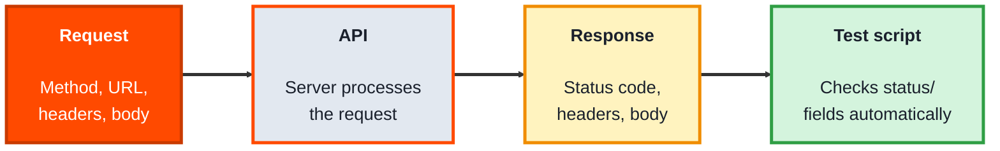
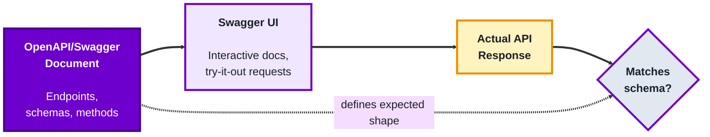

## Module 4: API Testing

**Tools needed for this module:** A free [Postman](https://www.postman.com) account or desktop app, and access to any public test API (the labs use a free one, no account needed for that part).

### Topic 4.1: Postman

#### Concept

**Postman** is a tool for sending requests directly to an API and inspecting exactly what comes back, without needing a UI or front-end code in between. Where UI testing checks what a user sees, API testing checks the actual contract between systems, the request, the response, the status code, the data shape, directly and much faster.

- A **request** specifies a method (GET, POST, PUT, DELETE), a URL, headers, and sometimes a body (the data being sent)
- A **response** comes back with a **status code** (200, 404, 500...), headers, and a body, usually JSON
- A **collection** is a saved, organized group of requests, so a whole set of API calls can be re-run together rather than rebuilt from scratch
- **Environment variables** let you swap values (like a base URL or an API key) across many requests at once, instead of editing each request individually when something changes
- **Tests** in Postman are small scripts (in JavaScript) that run after a response comes back, checking things like status code or specific field values automatically

#### Structure at a Glance


- A saved collection with test scripts on each request can be run automatically as a whole, turning manual API exploration into a repeatable regression check
- Because there's no UI in the loop, API tests in Postman run and report results far faster than an equivalent browser-based test

#### Where you'd actually use this

Verifying a backend endpoint works correctly before the front-end that will call it even exists, checking that an API still behaves correctly after a change (regression), or diagnosing whether a bug lives in the API itself or in how the UI is using it.

#### Lab

1. **Open Postman and create a new request.** Set the method to GET and the URL to a free test API: `https://jsonplaceholder.typicode.com/users/1`
2. **Send the request** and inspect the response: note the status code and look at the JSON body's fields (name, email, address, and so on).
3. **Add a test script** on the request (in Postman's "Tests" or "Post-response" tab):
```javascript
pm.test("Status code is 200", function () {
    pm.response.to.have.status(200);
});

pm.test("Response has an email field", function () {
    const body = pm.response.json();
    pm.expect(body).to.have.property("email");
});
```
4. **Send the request again** and check the "Test Results" tab to confirm both tests pass.
5. **Save the request into a new collection**, then try changing the URL to an ID that doesn't exist (`/users/999`) to see how the status code and test results change.

#### Checkpoint
You have a saved Postman request with two passing automated tests checking both the status code and a specific response field, and you've seen how the results change against an invalid ID.

#### Quiz
1. What four parts can make up an API request in Postman?
2. What three things does an API response typically include?
3. What is a "collection," and why is it useful beyond a single request?
4. What do environment variables let you do across many requests at once?
5. What language are Postman's test scripts written in, and what do they check?

*Answers: 1) A method (GET, POST, PUT, DELETE), a URL, headers, and sometimes a body. 2) A status code, headers, and a body (usually JSON). 3) A saved, organized group of related requests; it's useful because the whole set can be re-run together as a repeatable check, rather than rebuilding each request from scratch every time. 4) Swap values, like a base URL or an API key, across many requests at once, instead of editing each request individually when something changes. 5) JavaScript; they check things like the status code or specific field values in the response, automatically, after it comes back.*

---

### Topic 4.2: Swagger

#### Concept

**Swagger** (now largely known as the **OpenAPI Specification**, with Swagger referring to the tools built around it) is a standard way of describing an API, its endpoints, methods, parameters, and expected responses, in a structured document (usually YAML or JSON) that both humans and tools can read. For testers, it matters because it's often the single source of truth for what an API is *supposed* to do, before you ever send a real request to check what it *actually* does.

- An **OpenAPI/Swagger document** describes every endpoint: its path, HTTP method, parameters, request body shape, and possible responses
- **Swagger UI** renders that document as an interactive web page, letting you read the API's documentation and send real test requests directly from the browser
- A **schema** within the document defines the exact shape of expected data (which fields exist, their types, which are required), this is what you compare an actual response against
- Because the document is structured data, not just prose, tools (including Postman) can import it directly and auto-generate a full set of requests to test against

#### Structure at a Glance


- Testing against a Swagger/OpenAPI document isn't just reading docs, it's actively comparing what the API promises against what it actually returns, a mismatch is itself a bug (either the API or the documentation is wrong)
- Because the spec is machine-readable, contract-testing tools can validate every real response against the schema automatically, rather than a person checking field-by-field

#### Where you'd actually use this

Any API-first project (common with microservices) where front-end and back-end teams work from the same specification before either side is fully built, or any time you need to confirm an API's actual behavior hasn't drifted from what its documentation promises.

#### Lab

1. **Find a public Swagger UI to explore.** Petstore, the standard OpenAPI example, is publicly hosted; navigate to its Swagger UI page and look at the listed endpoints (for example, `GET /pet/{petId}`).
2. **Read one endpoint's documented schema** for its response: which fields are listed, which are marked required, and what type each one is (string, integer, and so on).
3. **Use Swagger UI's "Try it out" feature** on that endpoint: enter a sample ID, execute it, and view the real response it sends back.
4. **Compare the real response against the documented schema** field by field: does every documented field appear, do the types match, is anything undocumented showing up.
5. **Write down one mismatch or confirmation** from that comparison, either "the real response matched the schema exactly" or a specific discrepancy you noticed.

#### Checkpoint
You've read a real endpoint's documented schema, executed a live "Try it out" request against it, and compared the actual response to the schema field by field with a written conclusion.

#### Quiz
1. What is an OpenAPI/Swagger document, and what does it describe?
2. What does Swagger UI let you do beyond just reading documentation?
3. What is a "schema," in the context of an API response?
4. Why is a mismatch between an API's actual response and its documented schema itself considered a bug?
5. Why does it matter that an OpenAPI document is structured data rather than plain prose documentation?

*Answers: 1) A structured document (YAML or JSON) describing an API's endpoints, methods, parameters, and expected responses; it acts as a readable specification for both humans and tools. 2) Send real, live requests directly to the API from an interactive web page ("Try it out"), not just read static descriptions of what it should do. 3) The exact expected shape of a piece of data, which fields exist, their types, and which are required, used as the standard to compare an actual response against. 4) Because either the API is behaving incorrectly or the documentation is wrong, either way something is out of sync with what was promised, and that's exactly the kind of discrepancy testing exists to catch. 5) Because it's structured data, tools can read it programmatically to auto-generate requests or automatically validate real responses against its schemas, something plain prose documentation can't be used for directly.*

---

## Module 4 Completion Checklist
- [ ] Sent a real API request in Postman and inspected its status code and response body
- [ ] Written and passed two automated Postman test scripts on a single request
- [ ] Saved a request into a collection and observed how results change against an invalid input
- [ ] Read a real endpoint's documented schema and executed a live "Try it out" request against it in Swagger UI
- [ ] Compared an actual API response against its documented schema and written down the result
