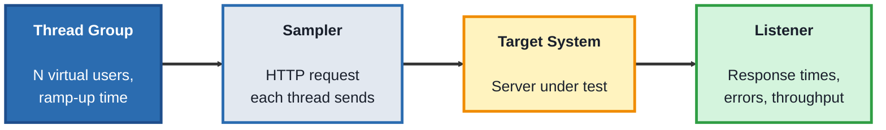
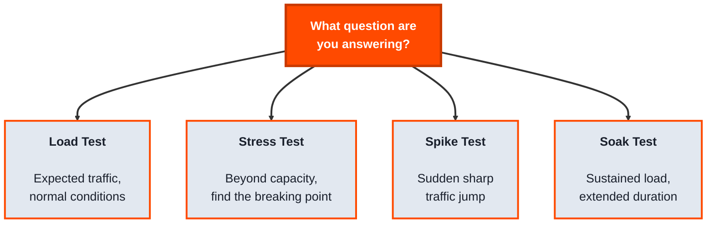

## Module 5: Performance Testing

**Tools needed for this module:** [Apache JMeter](https://jmeter.apache.org) (requires Java), and access to any test target you're authorized to load-test (the lab uses a public demo endpoint designed for this purpose).

### Topic 5.1: JMeter

#### Concept

**Apache JMeter** is an open source tool for sending many requests, simulating many users, at a system to measure how it behaves under load. Where functional testing asks "does this work correctly," JMeter asks "does this still work correctly, and fast enough, when a hundred or a thousand people hit it at once."

- A **Thread Group** represents a group of simulated users, each **thread** acts as one virtual user running through the same set of requests
- A **Sampler** is a single request JMeter sends (an HTTP request, for example), the actual unit of load being generated
- A **Listener** collects and displays the results, response times, error rates, throughput, as the test runs or after it finishes
- **Ramp-up period** controls how gradually those simulated users start, all at once versus spread out over time, which changes what kind of load pattern you're actually simulating

#### Structure at a Glance

- JMeter can simulate load without a browser at all, it sends the underlying HTTP requests directly, which is what lets one machine simulate far more concurrent users than would be possible driving real browsers one by one
- Results are only meaningful relative to a clear question, "how many users" and "doing what" need to be defined before a number like "average response time: 400ms" means anything

#### Where you'd actually use this

Confirming a system can handle expected traffic before a big product launch or marketing push, finding the point at which response times start degrading as load increases, or verifying a fix for a performance issue actually improved things under realistic load, not just in isolation.

#### Lab

1. **Install JMeter** (requires Java) and open it, either the GUI (`jmeter.bat` / `jmeter.sh`) or note that real load runs are typically done in non-GUI mode for accuracy.
2. **Create a new Test Plan**, then add a **Thread Group**: set it to 10 users, with a ramp-up period of 5 seconds.
3. **Add an HTTP Request sampler** inside the Thread Group, pointing at a test endpoint (a public demo/practice API endpoint, or a test environment you're authorized to use).
4. **Add a Listener**, such as "View Results in Table" or "Summary Report," to see results as the test runs.
5. **Run the test** and observe the results: average response time, error count if any, and throughput (requests per second).
6. **Increase the Thread Group to 50 users** and re-run, comparing the new results to the first run, does response time increase, do any errors appear that didn't before.

#### Checkpoint
You have a working JMeter test plan with a Thread Group, an HTTP sampler, and a Listener, and you've compared results between two different load levels (10 vs. 50 users) against the same target.

#### Quiz
1. What does a Thread Group represent, and what does each individual thread simulate?
2. What is a Sampler, in JMeter terms?
3. What is a Listener used for?
4. What does the "ramp-up period" control, and why does it matter for what kind of load you're actually simulating?
5. Why can JMeter simulate far more concurrent users from one machine than an approach that drives real browsers?

*Answers: 1) A Thread Group represents a group of simulated users; each individual thread simulates one virtual user running through the same set of requests. 2) A single request JMeter sends, such as an HTTP request, the actual unit of load being generated against the target. 3) Collecting and displaying results, response times, error rates, and throughput, either as the test runs or after it finishes. 4) It controls how gradually the simulated users start, all at once versus spread out over time; a sudden ramp-up simulates a traffic spike, while a slow ramp-up simulates gradually increasing load, and these represent different real-world scenarios. 5) Because it sends the underlying HTTP requests directly rather than driving a real browser for each simulated user, avoiding the overhead of rendering, JavaScript execution, and a full browser process per user.*

---

### Topic 5.2: Load Testing

#### Concept

**Load testing** is the broader discipline JMeter is a tool for, deliberately generating realistic (or gradually increasing) traffic against a system to answer specific questions about its capacity and behavior under stress. It's a category with several related but distinct types, and knowing which one you're actually running matters, because they answer different questions and require different setups.

- **Load testing** (in the narrow sense) checks behavior under an expected, realistic level of traffic
- **Stress testing** pushes load beyond expected capacity, deliberately, to find the breaking point and see how the system fails (gracefully, or catastrophically)
- **Spike testing** simulates a sudden, sharp jump in traffic (a flash sale, a viral post) rather than a gradual increase
- **Soak testing** (endurance testing) runs a sustained, moderate load for an extended period, to catch problems that only appear over time (memory leaks, slow resource exhaustion)
- Key metrics across all of these: **response time**, **throughput** (requests handled per second), and **error rate**, plus system-level metrics like CPU and memory usage on the server side

#### Structure at a Glance

- Running the wrong type for the question you're actually asking gives you a real number that answers nothing useful, "it handled 50 users fine for 2 minutes" doesn't tell you whether it survives a launch-day spike, or whether it stays stable after running for 12 hours straight
- Performance results should always be reported with context: what load pattern, for how long, against what environment, a bare number without that context is close to meaningless

#### Where you'd actually use this

Deciding which type to run starts with the actual business risk: an expected-traffic increase (load test), a flash-sale style launch (spike test), an always-on service that needs to run reliably for days or weeks (soak test), or simply wanting to know where the system breaks and how (stress test).

#### Lab

1. **Take the JMeter test plan from the previous lab.**
2. **Reconfigure it as a stress test:** increase the Thread Group well beyond your earlier 50-user run (for example, 200+ users) with a short ramp-up, and run it, watching for the point where errors start appearing or response times spike sharply.
3. **Reconfigure it as a spike test:** set a very short ramp-up period (for example, all users starting within 1-2 seconds) at a moderate-to-high user count, and compare the results to the same user count with a longer ramp-up.
4. **Write a one-paragraph summary** distinguishing what each of your three runs (load, stress, spike) was actually testing for, and what each result would (and wouldn't) tell a team making a launch decision.

#### Checkpoint
You've run at least two different load pattern types (stress and spike) against the same target using the same base test plan, and written a summary explaining what each type does and doesn't tell you.

#### Quiz
1. What question does a stress test answer that a standard load test doesn't?
2. What is a spike test simulating, and how does its setup differ from a gradual load test?
3. What is a soak test designed to catch that a short test wouldn't?
4. Name the three key metrics tracked across all these test types.
5. Why is a performance result like "average response time: 400ms" meaningless without additional context?

*Answers: 1) Where the system's actual breaking point is, and how it behaves when pushed past expected capacity, gracefully or catastrophically, rather than just confirming it handles expected traffic. 2) A sudden, sharp jump in traffic, like a flash sale or viral post; its setup uses a very short ramp-up period so many simulated users start almost simultaneously, rather than gradually over time. 3) Problems that only appear over an extended period under sustained load, like memory leaks or slow resource exhaustion, which a short test wouldn't run long enough to reveal. 4) Response time, throughput (requests per second), and error rate. 5) Because the number only means something in context, what load pattern produced it, how many users, for how long, against what environment, without that, there's no way to know if 400ms is good, bad, or comparable to any other result.*

---

## Module 5 Completion Checklist
- [ ] Built a working JMeter test plan with a Thread Group, HTTP sampler, and Listener
- [ ] Compared results between two different load levels (10 vs. 50 users) against the same target
- [ ] Run the same base test plan reconfigured as both a stress test and a spike test
- [ ] Can name all four load pattern types (load, stress, spike, soak) and the specific question each one answers
- [ ] Can explain why a performance number needs context (load pattern, duration, environment) to be meaningful
