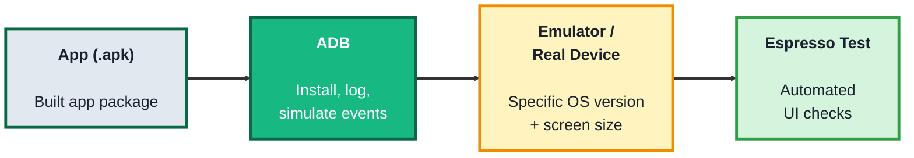
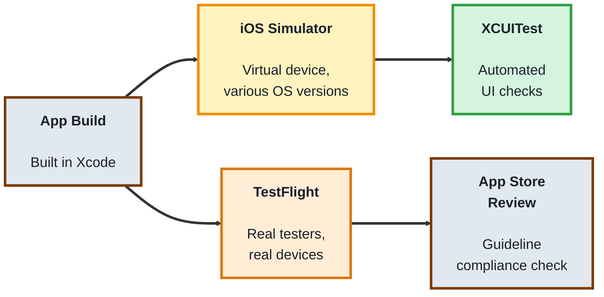

## Module 6: Mobile Testing

**Tools needed for this module:** [Android Studio](https://developer.android.com/studio) (includes emulators and Android debugging tools) for the Android topic, and a Mac with [Xcode](https://developer.apple.com/xcode/) (includes the iOS Simulator) for the iOS topic. Real devices are ideal but not required to start.

### Topic 6.1: Android

#### Concept

Testing Android apps means testing against real fragmentation, many device manufacturers, many screen sizes, and multiple OS versions all still in active use at once, which is very different from testing a website that renders roughly the same everywhere. Android testing tools exist specifically to manage that variety, letting you test broadly without owning every physical device yourself.

- The **Android Emulator** (in Android Studio) runs a virtual Android device on your computer, letting you test different OS versions and screen sizes without owning the physical hardware
- **ADB (Android Debug Bridge)** is a command-line tool for communicating directly with a device or emulator, installing an app, pulling logs, simulating events
- **Espresso** is Google's own UI testing framework for Android, used to write automated tests that run directly on a device or emulator
- **Device fragmentation** refers to the wide spread of manufacturers, screen sizes, and OS versions in real use, a core reason mobile testing needs broader device/OS coverage than most web testing

#### Structure at a Glance


- A real testing effort usually runs the same checks across a small deliberate matrix of emulators/devices (an old OS version on a small screen, a new OS version on a large screen), rather than testing on just one
- Mobile-specific behaviors, like what happens when a phone call interrupts the app, or the app is backgrounded and resumed, don't have a clean equivalent in web testing and need to be checked directly on-device

#### Where you'd actually use this

Verifying an app behaves correctly across the real spread of Android versions and screen sizes your actual users have, not just the one device sitting on your desk, and catching mobile-specific issues like interruption handling that a web-focused test plan would never think to check.

#### Lab

1. **Open Android Studio and launch the Android Virtual Device (AVD) Manager.** Create an emulator for a mid-range phone profile on a recent Android version.
2. **Install a simple test app on the emulator** (Android Studio's default "Empty Activity" template project works fine, build and run it directly onto the emulator).
3. **Use ADB from the command line** to confirm the device is connected and check basic info:
```bash
adb devices
adb shell getprop ro.build.version.release
```
4. **Simulate an interruption:** while the app is running, use the emulator's controls to simulate an incoming call or press the home button to background the app, then bring it back to the foreground, and note whether its state was preserved correctly.
5. **Create a second emulator with a different screen size or OS version**, install the same app, and compare its layout and behavior side by side with the first.

#### Checkpoint
You have two emulators running with different configurations, you've confirmed ADB can talk to a device, and you've documented what happened to the app's state after an interruption and after switching device profiles.

#### Quiz
1. What is the Android Emulator, and what does it let you test without owning physical hardware?
2. What is ADB used for?
3. What is Espresso, and what is it used for?
4. What is "device fragmentation," and why does it matter more for Android testing than for most web testing?
5. Give an example of a mobile-specific behavior that doesn't have a clean equivalent in web testing.

*Answers: 1) A virtual Android device running on your computer; it lets you test different OS versions and screen sizes without needing to own each physical device. 2) Communicating directly with a device or emulator from the command line, installing an app, pulling logs, and simulating events. 3) Google's own UI testing framework for Android; it's used to write automated tests that run directly on a device or emulator. 4) The wide spread of manufacturers, screen sizes, and OS versions actually in use among real users; it matters more for Android because, unlike most websites, an app's behavior and layout can genuinely differ across that spread. 5) Handling an interruption like an incoming phone call, or being backgrounded and resumed, checking whether the app's state is preserved correctly, something a website simply doesn't experience in the same way.*

---

### Topic 6.2: iOS

#### Concept

Testing iOS apps happens in a much more controlled hardware and OS environment than Android, fewer device models, tighter OS version adoption, but comes with its own strict platform rules (Apple's App Store review guidelines) and its own tooling built around Xcode. Knowing the iOS-specific tools matters because they don't map one-to-one onto Android's, even though the underlying goal, verifying the app works correctly, is the same.

- The **iOS Simulator** (built into Xcode) runs a virtual iOS device on a Mac, similar in purpose to the Android Emulator, but it simulates iOS software behavior rather than emulating real device hardware
- **XCUITest** is Apple's own UI testing framework, built into Xcode, used to write automated tests that interact with the app's real interface
- **TestFlight** is Apple's platform for distributing pre-release builds to real testers on real devices, before a public App Store release
- **App Store Review Guidelines** are Apple's rules every app must pass before release; testing for compliance (privacy prompts, required disclosures, prohibited behaviors) is its own category of iOS-specific testing that has no Android equivalent

#### Structure at a Glance


- The iOS Simulator is fast and convenient but doesn't perfectly replicate real hardware performance, sensors, or camera behavior, some checks genuinely need a real device
- TestFlight testing catches real-device issues (and real-world usage patterns) that the Simulator alone can't, before an app ever reaches formal App Store review

#### Where you'd actually use this

Verifying an app works correctly across supported iOS versions on a Mac-based workflow, catching App Store guideline violations before a rejected submission costs a release cycle, or getting real, real-device feedback from testers through TestFlight before a public launch.

#### Lab

1. **Open Xcode and create a new iOS app project** using a basic template (or use an existing sample project).
2. **Run the app on the iOS Simulator**, choosing a specific simulated device and iOS version from Xcode's device selector.
3. **Write a basic XCUITest** (Xcode can generate a UI test target automatically): record or write a test that launches the app and taps a button or checks a label's text exists.
```swift
import XCTest

final class BasicUITests: XCTestCase {
    func testAppLaunches() throws {
        let app = XCUIApplication()
        app.launch()
        XCTAssertTrue(app.staticTexts.firstMatch.exists)
    }
}
```
4. **Run the test** against the Simulator and confirm it passes.
5. **Switch the Simulator's device and OS version** in Xcode's device selector, re-run the same test, and note whether it still passes and whether the layout looks correct on the new device profile.
6. **Look up one App Store Review Guideline** relevant to a real app category (for example, a rule about requesting camera or location permission) and write one sentence on how you'd test for compliance with it.

#### Checkpoint
You have a passing XCUITest run against at least two different Simulator device/OS combinations, and you've identified one App Store guideline along with a concrete way to test compliance with it.

#### Quiz
1. What is the iOS Simulator, and how is it different from emulating real device hardware?
2. What is XCUITest?
3. What is TestFlight used for, and why does it matter beyond just Simulator testing?
4. What are App Store Review Guidelines, and why is testing for compliance with them its own category with no direct Android equivalent?
5. Name one thing the iOS Simulator can't fully replicate compared to a real device.

*Answers: 1) A virtual iOS device running on a Mac; it's different from hardware emulation because it simulates the iOS software's behavior rather than emulating the actual physical hardware components. 2) Apple's own UI testing framework, built into Xcode, used to write automated tests that interact with the app's real interface. 3) A platform for distributing pre-release builds to real testers on real devices before a public release; it matters because it catches real-device issues and real usage patterns that Simulator-only testing can miss. 4) Apple's rules that every app must pass before release, covering things like required privacy disclosures and prohibited behaviors; it's its own testing category because Android's app store review process has different rules, so this specific compliance checking doesn't transfer over. 5) Real hardware performance, sensors, or camera behavior, some checks genuinely require testing on a real device rather than the Simulator.*

---

## Module 6 Completion Checklist
- [ ] Run an app on two Android emulators with different device/OS configurations and confirmed ADB connectivity
- [ ] Documented what happened to app state after simulating an interruption on Android
- [ ] Written and passed a basic XCUITest against the iOS Simulator
- [ ] Re-run the same iOS test against a second Simulator device/OS combination
- [ ] Identified one App Store Review Guideline and a concrete way to test compliance with it
