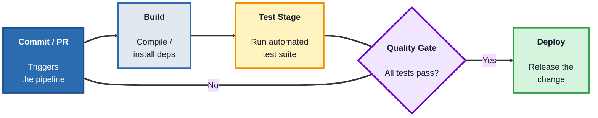
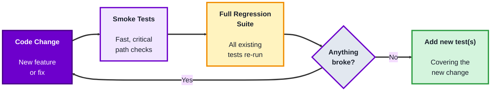

## Module 8: CI/CD Testing

**Tools needed for this module:** A free [GitHub](https://github.com) account (for GitHub Actions), and a small existing test suite to run (the labs reuse simple tests, any language is fine).

### Topic 8.1: Automated Pipelines

#### Concept

A **CI/CD pipeline** automatically builds, tests, and (optionally) deploys code every time it changes, rather than someone manually remembering to run tests before each release. **CI (Continuous Integration)** is the "build and test automatically on every change" part; **CD (Continuous Delivery/Deployment)** extends that to automatically preparing or actually releasing the change. For QA, this matters because it's what turns your test suite from something run occasionally by a person into something run automatically, every time, without being forgotten.

- A **pipeline** is a defined sequence of automated stages (build, test, deploy) that runs in response to a trigger
- A **trigger** starts the pipeline, most commonly a new commit or a pull request being opened
- A **stage** (or job) is one step in the pipeline, "run unit tests" and "run integration tests" are often separate stages, so a failure in one is easy to pinpoint
- A **quality gate** is a rule that blocks the pipeline from progressing (for example, merging or deploying) if a required stage fails, tests must pass, coverage must meet a threshold

#### Structure at a Glance


- Because the pipeline runs the same way every time, a failure is reproducible and traceable to a specific commit, rather than a mystery discovered days later
- A slow pipeline gets skipped or ignored in practice, keeping test stages fast (or running slower stages in parallel) is part of what makes a pipeline actually useful day to day

#### Where you'd actually use this

Any team merging code frequently, catching a broken build or a failing test within minutes of the change that caused it, rather than during a separate, occasional manual test pass days or weeks later, when the cause is much harder to pin down.

#### Lab

1. **Create a small project on GitHub** (or use an existing one) with a simple automated test already in it, any language is fine (a basic Python `pytest` test, a JavaScript test, anything that runs from the command line with a clear pass/fail exit code).
2. **Add a GitHub Actions workflow file** at `.github/workflows/test.yml`:
```yaml
name: Run Tests
on: [push, pull_request]
jobs:
  test:
    runs-on: ubuntu-latest
    steps:
      - uses: actions/checkout@v4
      - name: Set up Python
        uses: actions/setup-python@v5
        with:
          python-version: '3.11'
      - name: Install dependencies
        run: pip install pytest
      - name: Run tests
        run: pytest
```
3. **Commit and push** this file, and watch the pipeline run automatically under your repository's "Actions" tab.
4. **Deliberately break a test** (change an assertion so it fails), commit and push again, and confirm the pipeline reports a failure, and pinpoint exactly which commit and which stage caused it.
5. **Fix the test, push again**, and confirm the pipeline goes back to passing.

#### Checkpoint
You have a working GitHub Actions pipeline that runs automatically on push, and you've seen it both fail on a broken test and pass again after a fix, with the failure clearly traceable to the specific commit that caused it.

#### Quiz
1. What is the difference between what CI and CD each automate?
2. What is a "trigger," in the context of a pipeline?
3. Why are build, test, and deploy usually separate stages rather than one combined step?
4. What is a "quality gate," and what does it block?
5. Why does keeping pipeline stages fast matter for whether a team actually keeps using it?

*Answers: 1) CI (Continuous Integration) automatically builds and tests code on every change; CD (Continuous Delivery/Deployment) extends that to automatically preparing or actually releasing the change. 2) The event that starts the pipeline running, most commonly a new commit being pushed or a pull request being opened. 3) So a failure can be pinpointed to a specific stage (build vs. test vs. deploy) rather than only knowing "something in the whole process failed" without knowing where. 4) A rule that blocks the pipeline from progressing, such as merging or deploying, unless required conditions are met, like all tests passing or coverage meeting a threshold. 5) A slow pipeline tends to get skipped, ignored, or worked around in practice, undermining the whole point of testing automatically on every change; keeping it fast (including running independent stages in parallel) keeps it actually useful day to day.*

---

### Topic 8.2: Regression Testing

#### Concept

**Regression testing** is re-running existing tests after a change to confirm that the change didn't break anything that used to work. It exists because fixing one thing or adding a new feature can quietly break something unrelated, and without deliberately re-checking, that kind of breakage often isn't discovered until a user finds it. Inside a CI/CD pipeline, regression testing is what the automated "Test Stage" is actually doing on every single run.

- A **regression test suite** is the set of existing tests re-run after a change, specifically to catch this kind of unintended breakage, as distinct from new tests written for the new change itself
- **Test suite maintenance** is the ongoing work of updating, removing, or rewriting tests as the application itself changes, an outdated regression suite either misses real regressions or fails on things that aren't actually broken
- **Smoke tests** are a small, fast subset of the regression suite covering only the most critical functionality, often run first (or on every commit) before the full, slower suite runs
- **Test flakiness** (a test that sometimes passes and sometimes fails with no code change) undermines trust in a regression suite over time, flaky tests need to be fixed or removed, not silently ignored

#### Structure at a Glance


- Regression testing and new-feature testing are complementary but distinct, passing regression tests means "nothing old broke," it says nothing about whether the new feature itself works correctly, that still needs its own new test cases
- As a regression suite grows, running literally everything on every single commit can get slow, this is exactly why smoke tests exist, fast coverage first, full coverage before anything more consequential (like a merge or deploy)

#### Where you'd actually use this

Every single pipeline run in Module 8.1 is regression testing in practice, but it's also directly relevant any time a fix is made to one part of an app and you need a defensible answer to "are you sure this didn't break anything else," rather than just a gut feeling.

#### Lab

1. **Take the small project and test suite from the Automated Pipelines lab.**
2. **Add one new test** covering a new, small piece of functionality you add to the project (anything simple, a new function that formats a string a certain way, for example).
3. **Deliberately introduce a small, unrelated bug elsewhere in the code**, something that would break a different, existing test that has nothing to do with your new feature.
4. **Run the full test suite** and confirm the existing test (unrelated to your new feature) fails, this is regression testing doing its job, catching unintended breakage.
5. **Designate two or three of your fastest, most critical tests as a "smoke test" subset** (in GitHub Actions, this could be a separate, earlier step that runs just those before the full suite runs), and update your workflow file to run them first.
6. **Fix the unrelated bug, push again**, and confirm the full suite passes, including both your new test and the previously-broken one.

#### Checkpoint
You have a project where a deliberately introduced, unrelated bug was caught by an existing regression test, a designated smoke test subset running before the full suite, and a final passing run after the fix.

#### Quiz
1. What is a "regression test suite" checking for, specifically?
2. Why is test suite maintenance an ongoing task rather than a one-time setup?
3. What are "smoke tests," and why are they often run before the full regression suite?
4. Does a passing regression suite tell you whether a brand-new feature works correctly? Why or why not?
5. What is "test flakiness," and why is it a problem even if the flaky test eventually shows a pass?

*Answers: 1) Whether a change broke something that used to work, re-running existing tests specifically to catch unintended breakage caused by an unrelated change. 2) Because the application itself keeps changing, tests need to be updated, removed, or rewritten to stay accurate, an outdated suite either misses real regressions or fails on things that were intentionally changed and aren't actually broken. 3) A small, fast subset of the regression suite covering only the most critical functionality; they're run first because they give a quick signal before spending the time to run the full, slower suite. 4) No, a passing regression suite only confirms nothing old broke; the new feature itself still needs its own new test cases to confirm it actually works correctly. 5) Test flakiness is when a test sometimes passes and sometimes fails with no underlying code change; it's a problem even with an eventual pass because it undermines trust in the whole suite, a real failure can start being dismissed as "probably just flaky" instead of being investigated.*

---

## Module 8 Completion Checklist
- [ ] Built a working GitHub Actions pipeline triggered automatically on push
- [ ] Seen the pipeline both fail on a broken test and pass again after a fix, traced to a specific commit
- [ ] Added a new test for a new feature and confirmed an unrelated, deliberately introduced bug was caught by an existing regression test
- [ ] Designated and configured a smoke test subset that runs before the full regression suite
- [ ] Can explain why passing regression tests doesn't confirm a new feature works, and why test flakiness needs to be fixed rather than ignored
